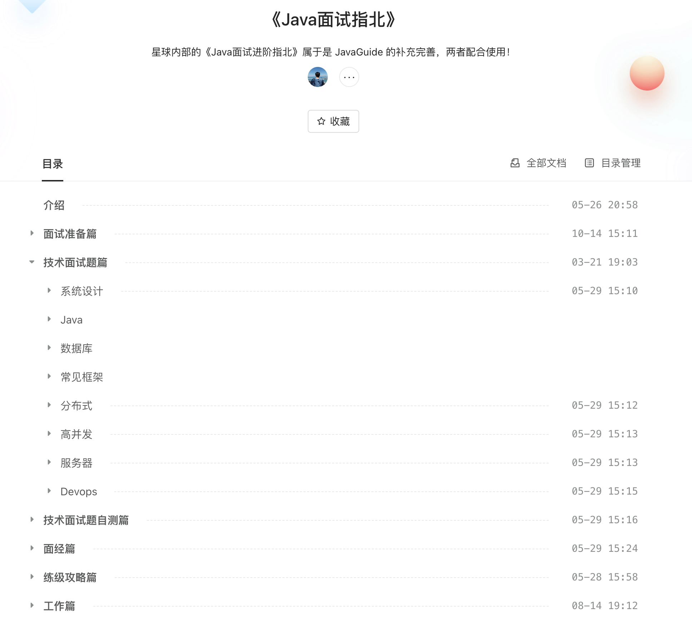
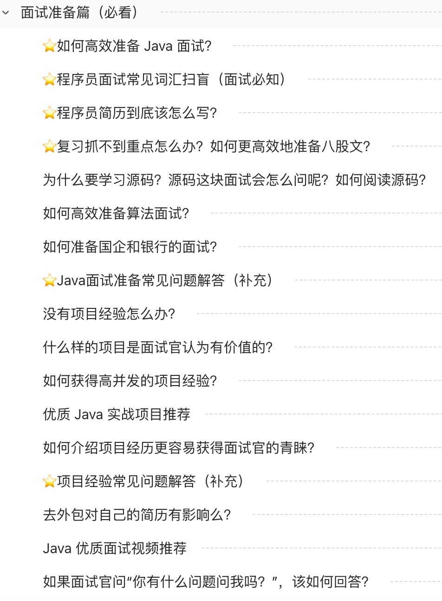
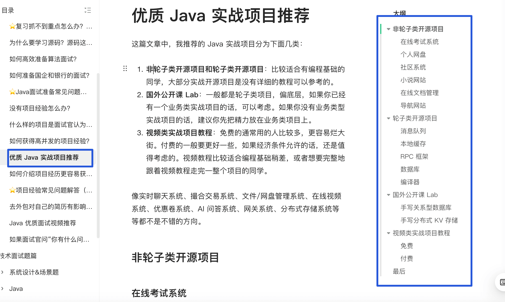
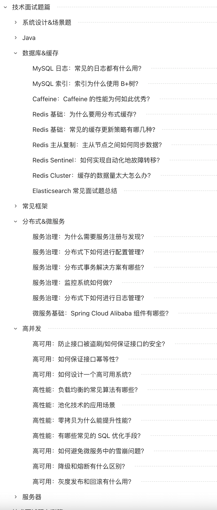
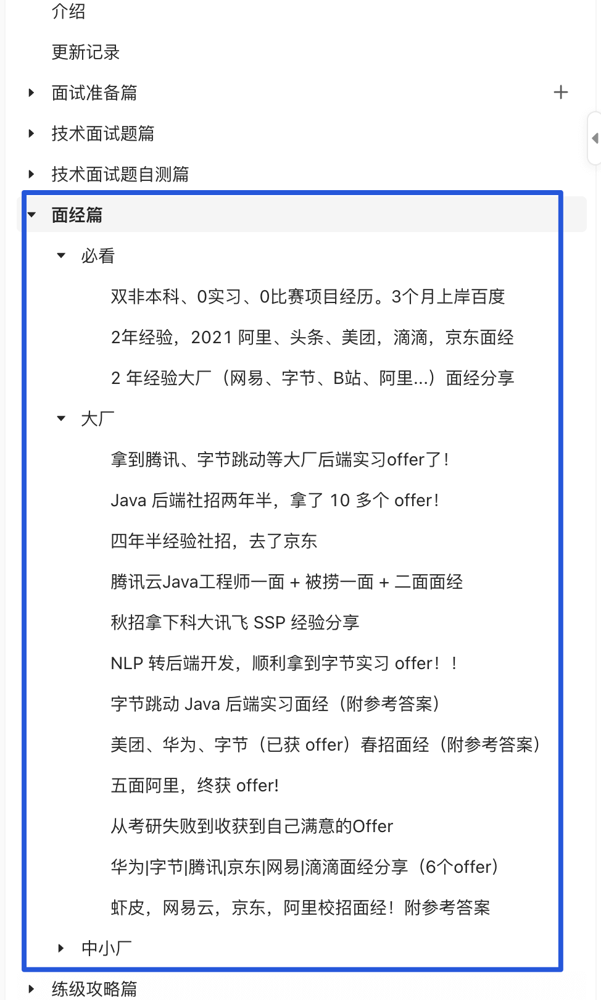
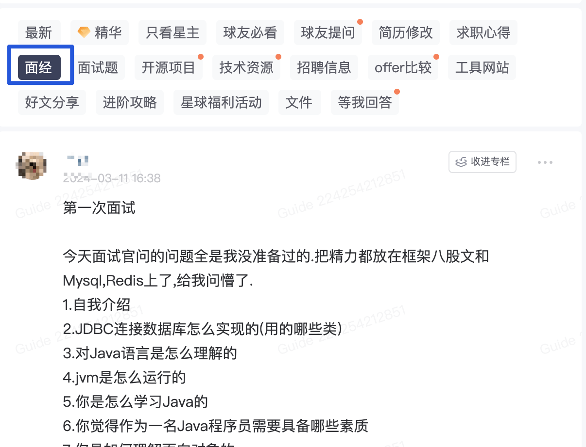
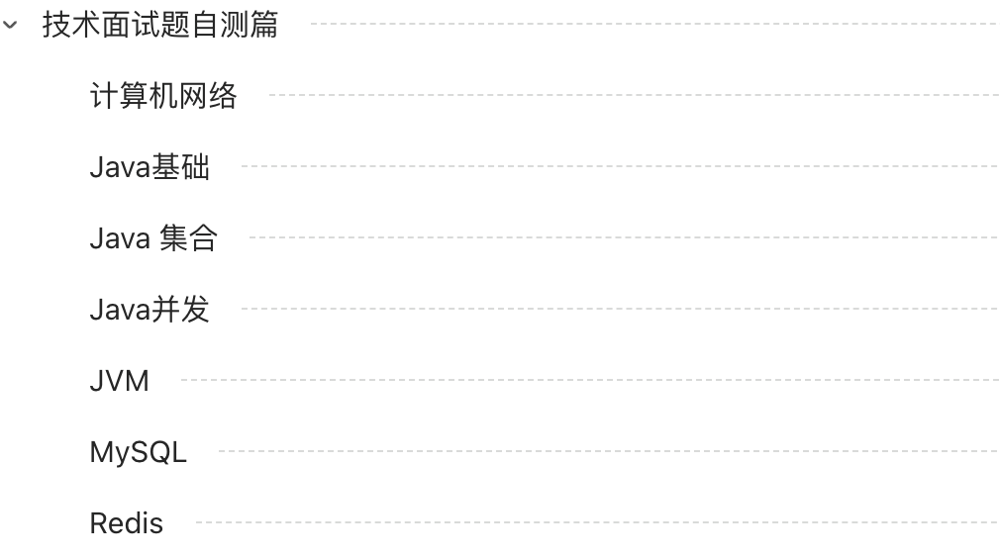
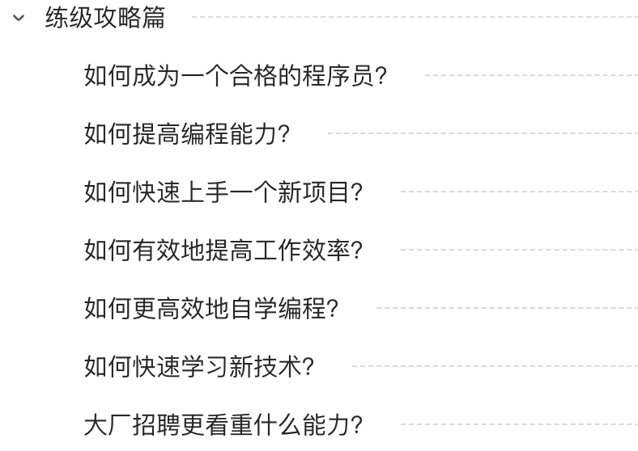
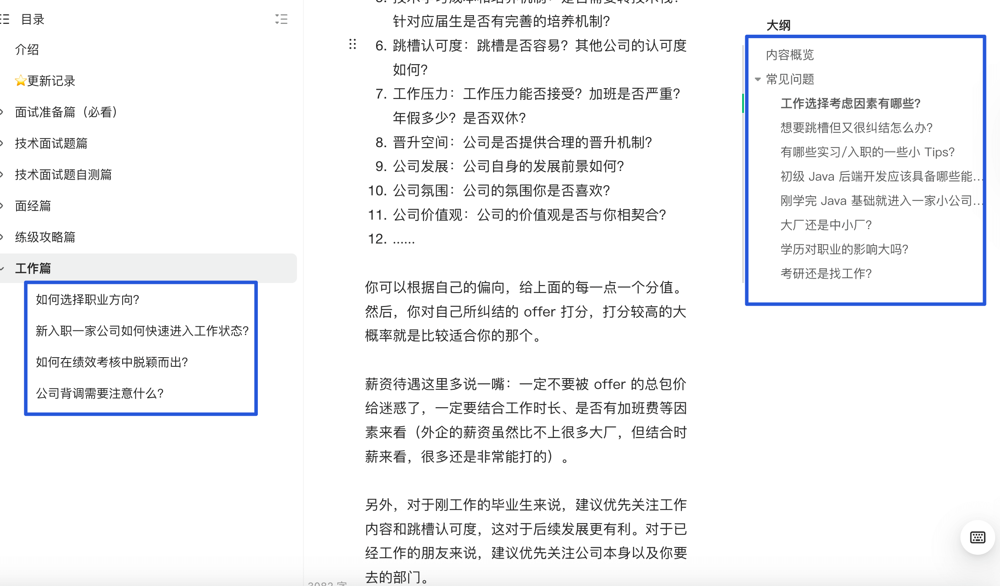

# 介绍

**《Java 面试指北》** 是我的[知识星球](https://javaguide.cn/about-the-author/zhishixingqiu-two-years.html)的一个内部小册，和 [JavaGuide 开源版](https://javaguide.cn/)的内容互补。相比于开源版本来说，《Java 面试指北》添加了下面这些内容（不仅仅是这些内容）：

+ 17+ 篇文章手把手教你如何准备面试，50+ 准备面试过程中的常见问题详细解读，让你更高效地准备 Java 面试。
+ 更全面的八股文面试题（系统设计、场景题、常见框架、分布式&微服务、高并发 ……）。
+ 优质面经精选（相比于牛客网或者其他网站的面经，《Java 面试指北》中整理的面经质量更高，并且，我会提供优质的参考资料）。
+ 技术面试题自测（高效准备技术八股文的技巧之一在于多多自测，查漏补缺）。
+ 练级攻略（有助于个人成长的经验分享）。

《Java 面试指北》 会根据每一年的面试情况对内容进行更新完善，保证内容质量的时效性。并且，只需要加入[知识星球](https://javaguide.cn/about-the-author/zhishixingqiu-two-years.html)一次，即可永久获取《Java 面试指北》的访问权限，持续同步更新完善。

## 内容概览

### 面试准备篇

在 **「面试准备篇」** ，我写了 17+ 篇文章手把手教你如何准备面试，50+ 准备面试过程中的常见问题详细解读。准备面试过程中常见的疑问这里都有解答，内容涵盖项目经验、简历编写、源码学习、算法准备、面试资源等等。

另外，考虑到很多小伙伴缺少项目经历，我还推荐了很多小众但优质的实战项目，有视频也有开源项目，有业务系统，也有各种含金量比较高的轮子类项目。

### 技术面试题篇

**「技术面试题篇」** 的内容和 JavaGuide 开源版本互补，不仅仅包括最基本的 Java、常见框架等八股文，还包括系统设计、分布式、高并发等进阶内容。

### 面经篇

古人云:“**他山之石，可以攻玉**” 。善于学习借鉴别人的面试的成功经验或者失败的教训，可以让自己少走许多弯路。

**「面经篇」** 主要会分享一些高质量的 Java 后端面经，有校招的，也有社招的，有大厂的，也有中小厂的。

如果你是非科班的同学，也能在这些文章中找到对应的非科班的同学写的面经。

相比于牛客网或者其他网站的面经，《Java 面试指北》中整理的面经质量更高，并且，我会提供优质的参考资料。

另外，[知识星球](https://javaguide.cn/about-the-author/zhishixingqiu-two-years.html)还有专门分享面经和面试题的专题，里面会分享很多优质的面经和面试题。

### 技术面试题自测篇

为了让小伙伴们自测以检查自己的掌握情况，我还推出了 **「技术面试题自测」** 系列。不过，目前只更新了 Java 和数据库的自测，正在持续更新中。

高效准备技术八股文的技巧之一在于多多自测，查漏补缺。

### 练级攻略篇

**「练级攻略篇」** 这个系列主要内容一些有助于个人成长的经验分享。

每一篇内容都非常干货，不少球友看了之后表示收获满满。不过，最重要的还是知行合一。

### 工作篇

**「工作篇」** 这个系列主要内容是分享有助于个人以及职场发展的内容以及在工作中经常会遇到的问题。

> 更新: 2024-07-15 16:46:18  
> 原文: <https://www.yuque.com/snailclimb/mf2z3k/rq5rzo>