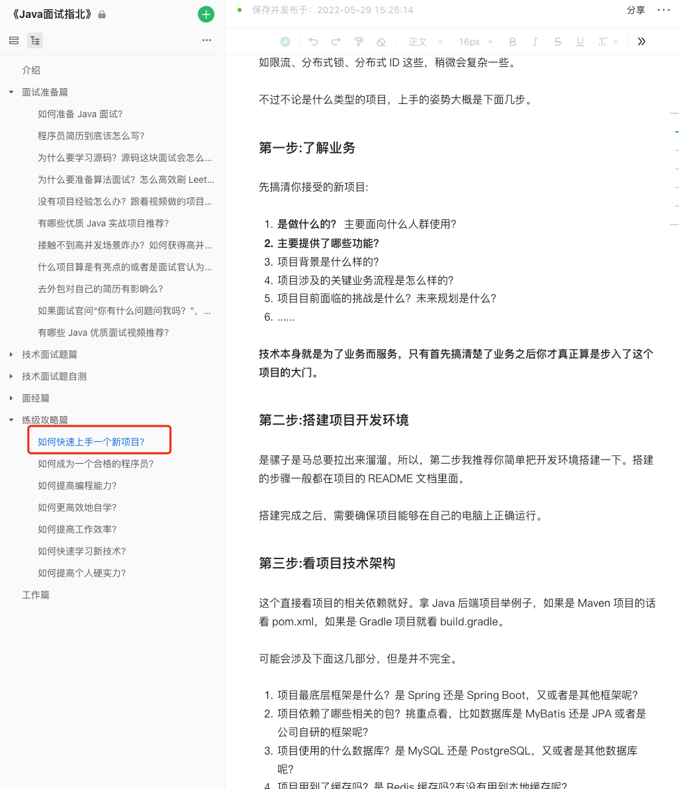

# 工作篇

欢迎阅读**「工作篇」**相关的文章，这个系列主要内容是分享一些有助于个人以及职场发展的内容。

## 内容概览

- [x] [如何选择职业方向？](https://www.yuque.com/snailclimb/mf2z3k/iysz1w)
- [x] [新入职一家公司如何快速进入工作状态？](https://www.yuque.com/snailclimb/mf2z3k/uzw6x1)
- [x] [如何在绩效考核中脱颖而出？](https://www.yuque.com/snailclimb/mf2z3k/mezqiv)
- [x] [公司背调需要注意什么？](https://www.yuque.com/snailclimb/mf2z3k/ndtdz4skyxntgex8)

## 常见问题

### Offer 选择考虑因素有哪些？

通常情况下，不论是校招还是社招下面这些都是你在做工作选择时应该考虑的因素：

1. 地理位置：当地的生活成本，居住舒适度，离家的距离，有对象的话需要考虑对象的地理位置。
2. 薪资待遇：薪资待遇是否可以接受？
3. 稳定性：公司的发展是否存在严重问题？部门的重要性如何？
4. 工作内容：工作内容是否让你满意？是否能够提供你发展和成长的机会？
5. 技术学习成本和培养机制：是否需要转技术栈？针对应届生是否有完善的培养机制？
6. 跳槽认可度：跳槽是否容易？其他公司的认可度如何？
7. 工作压力：工作压力能否接受？加班是否严重？是否有加班补偿？年假多少？是否双休？
8. 工作氛围：工作氛围你是否喜欢？技术氛围如何？
9. 晋升空间：公司是否提供合理的晋升机制？晋升速度如何？
10. 公司发展：公司自身的发展前景如何？产品是否具有护城河？
11. 公司价值观：公司的价值观是否与你相契合？
12. 户口：这里主要针对的是北京户口，毕竟是最难拿的户口。对于想要拿户口的同学来说，还需打听下公司是否有帮你拿到户口的机会？户口的分配比例和分配方式是怎样的？通常情况下，国企、银行、研究所这类拿到户口的概率最大。
13. ……

你可以根据自己的偏向，给上面的每一点一个分值。然后，你对自己所纠结的 offer 打分，打分较高的大概率就是比较适合你的那个。

薪资待遇这里多说一嘴：一定不要被 offer 的总包价给迷惑了，一定要结合工作时长、是否有加班费等因素来看（外企的薪资虽然比不上很多大厂，但结合时薪来看，很多还是非常能打的）。

工作压力这里多提一嘴：千万不要一腔热血觉得自己能承受长时间的加班以及工作压力，尤其是刚毕业的同学，等你真正经历过了，你才会体会到工作压力太大对自己的身心和身体健康影响有多大！！！

对于刚工作的毕业生来说，建议优先关注工作内容和跳槽认可度（知名大厂一定要首要考虑），这对于后续发展更有利。不过，也不要死脑筋，太纠结工作内容，比如有一个大厂测开的 offer 和一个小厂 Java 后端的 offer，那我个人还是建议你选择大厂。

对于已经工作的朋友来说，建议优先关注公司本身（大公司对应的平台也更大，机会更多）以及你要去的部门（公司的核心部门最好）。

最后，如果各方因素都综合对照之后还是纠结的话，那我建议你还是优先选择钱多的那个，毕竟这才是实打实的直接到自己手里的东西，其他的都是虚的。

### 想要跳槽但又很纠结怎么办？

如果你想要跳槽但是又非常纠结的话，你可以通过下面几个问题来自测一下：

1. 在这个公司你开心吗？达到自己的预期了吗？
2. 公司未来的发展你看好吗？
3. 你对自己的薪资待遇满意吗？
4. 公司现有的项目或者资源还可以为你带来提升吗？带来的提升你满意吗？
5. 现在跳槽出去找工作，你有信心吗？
6. 裸辞还是先找好工作再辞职？
7. ……

### 空窗期怎么应对？

对于空窗期，有三种常见的应对方法，你可以参考一下：

1. **诚实写明**：简历上诚实地写明空窗期，并给出合理的解释，避免后续的误会。只要理由合理，空窗期时间不是特别长，不会有什么问题。
2. **调整工作时间线将空窗期覆盖**：将上一份工作的结束时间延后至空窗期结束，或者将下一份工作的开始时间提前至空窗期开始之前。 这种方法属于是作假了，需要考虑背调，一般是不太建议这样做的。如果这样做的话，尽量找不做背调的公司面试入职（异地社保公司好像查不到？）。
3. **转化空窗期的经历**：在简历中将空窗期描述为“自由职业”、“创业经历”或者“个人项目经历”，就像是描述工作经历一样，简单突出介绍自己在这段时间主要做了什么（尽量将自己的工作内容介绍的具体一些，包括但仅不限于做的项目）。

### 有哪些实习/入职的一些小 Tips?

1. 认真完成分配给你的任务，不管是 CRUD 这类基础的开发任务还是其他，都要保证质量和效率，遵守代码规范和开发流程，及时沟通和反馈，积极解决问题和改进不足。
2. 面对别人提出的问题和 bug，不应该轻易回复。面对问题应该重视，需要做更多的思考和研究。
3. 保持思考，向别人描述问题时尽量告诉自己再多思考一下，看能否找出更深层次的原因。
4. 如果对于自己能力比较自信的话，要勇于认领比较有挑战的任务，解决有难度的问题。一定不要一碰到不会的就退缩了，碰到没有接触过的技术就怂了。
5. 不仅要完成基本的需求，还要思考如何优化和改进，不仅要按部就班地工作，还要寻找机会和空间去做一些有意义的事情比如你们公司崇尚技术分享的话，那你可以主动讲个 Session（即使你讲的东西比较简单，讲好就行了）。
6. 养成深入思考业务的习惯，敢于提出自己的想法和建议，而不是业务负责人说什么就是什么。
7. 如果团队氛围还可以的话，主动去组织一些组内活动比如聚餐、打羽毛球、一起出去玩等等（人情还是很重要的）。
8. 多向你的同事请教学习，但一定要控制度，避免影响他人正常工作。另外，你可以向你的同事和领导要一些关于你的反馈比如你目前存在哪些地方需要改进。
9. 不要害怕被批评，刚开始不熟练犯一些错误，做事方式存在一些问题，都是正常的，重要的是能改正，要让别人看到你的进步。
10. ……

### 初级 Java 后端开发应该具备哪些能力？

如果是 Java 后端开发的话，下面几点是最基本的，你可以参考一下：

1. 具备独立开发基本的增删改查代码的能力（不看视频自己写，浏览器搜索直接复制粘贴都行，只要你能把功能做完）。
2. 具备能够排查项目遇到的简单 Bug 的能力。
3. 具备使用 Git 进行版本管理和团队协作的能力。
4. 熟练使用常用的关系型数据库（不同的公司，不同的项目，使用的关系型数据库也不同，一般是 MySQL）。
5. 可以运用多线程、设计模式等手段来优化代码。
6. 具备和前端开发联调的能力。
7. 了解 Linux 常用命令,以及在其上面安装，部署应用。
8. 具备良好的沟通能力和学习能力，能够快速学习运用自己之前没有了解过的框架。
9. 熟练使用浏览器查找资料以及使用常见 AI 工具例如 ChatGPT 辅助自己工作。

### 刚入职完成不了开发任务 ，怎么破？

很多同学刚工作的时候，可能就会遇到很多问题，比如流程不规范，代码也不规范，以后端岗位入职却要搞全栈，不注重新人培养刚来就被安排开发任务。这就导致很多刚工作的小伙伴刚工作的时候根本没办法按时完成任务，甚至是努力了也没办法完成任务，于是很焦虑，开始怀疑自己的能力。

其实这种情况很正常的，真心不需要怀疑你自己是否技术能力有很大问题，大家基本都是从那个时候过来的。

下面是一些建议，对于刚工作或者已经工作的朋友应该都有帮助：

1. 你首先要搞清楚公司的技术栈到底是什么，这样才能针对性地学习。假设你们用的是 Spring Boot +MyBatis +Spring Security ，那你就应该抽时间去重点学习一下 Spring Boot 如何整合 MyBatis 实现最基本的增删改查、分页、连表查询等等。Spring Security 这个入门难度比较大，不建议你现在学，一般也不会让你这种新人做。
2. 工作中要多总结！公司用的框架体系，业务逻辑都是需要自己来总结的。如果对于某个框架或者工具不熟悉，直接去搜索 xxx 入门，或者去 Github，Gitee 上搜 xxx demo。遇到具体的知识点就去浏览器检索，20 个 tab 理论（遇到不会的就关键词新打开一个 tab）。
3. 心态要放好，不要害怕领导会骂你，一步一个脚印踏踏实实地走下去。
4. 世故一点。遇到经过自己思考还是搞不定的问题，去向前辈或高手们请教。买个饮料，吃顿饭多拉拉关系。
5. 对于缺少实际开发经验的同学，可以私下找一份还不错的项目经历视频教程抽时间跟着做（尽量和你公司项目的技术栈比较类似），然后自己再慢慢独立上手开发某个模块的功能。一定要有独立实践这一步，否则效果同样较差。
6. 随着 AI 技术的爆炸式发展，当代程序员一定要学会使用 AI 工具辅助自己进行开发，提高效率。你不光可以让 AI 帮助自己理解已有的代码，还可以把自己的需求告诉 AI ，让其帮助你写出一个基本原型。常用的 AI 辅助编码工具有：ChatGPT、New Bing、GitHub Copilot、CodeGeeX、Bifrost、Cosine、CodeWhisperer 等等。

另外，《Java 面试指北》的「练级攻略篇」中专门有一篇文章是讲“如何快速上手一个新项目”，你可以看看。

[如何快速上手一个新项目？](https://www.yuque.com/snailclimb/mf2z3k/dbhn2f)

### 新入职一家公司，如何快速上手项目?

下面的内容和「练级攻略篇」的[如何快速上手一个新项目](https://www.yuque.com/snailclimb/mf2z3k/dbhn2f)这篇文章有部分重合的地方，只是对公司项目进行了针对性的补充和优化：

1. **检查是否有相关文档**：入职初期，首先查看是否有项目相关的文档，如项目介绍、使用手册等，这是非常重要的参考资料，将极大地提高效率。
2. **尽量找个同事带你简单熟悉一下项目**：如果能有同事带你简单熟悉一下项目的话，那是最好的，可以让你少踩很多坑。据我了解，很多公司都会有带新人熟悉项目的好传统。如果你入职的项目组没有人带你的话，你可以主动询问一下。
3. **深入理解业务**：记住，技术始终是为业务服务的。一旦脱离了业务，那么技术的存在将毫无意义。优先了解业务将帮助你更好地理解技术实现。
4. **搭建本地开发环境**：尝试在本地搭建开发环境，试着把项目运行起来。稍微正规点的项目都有项目环境搭建相关的文档介绍，跟着文档来就好。如果没有文档的话，需要自己去分析项目依赖环境，必要的情况下询问一下同事。
5. **项目依赖梳理**：通过项目依赖配置文件（`pom.xml`/`build.gradle` ）看看项目用到了哪些框架和中间件，底层数据库是什么。
6. **了解业务架构和系统交互**：熟悉系统的业务架构，理解各个系统和模块的功能职责及它们之间的交互方式。
7. **从简单功能开始实践**：可以先从基本的 CRUD 功能开发入手，慢慢再接手更复杂的功能开发任务。
8. **掌握开发流程**：全面理解项目的开发流程，从需求分析、设计、编码到测试和发布，每一个环节都是保证项目成功的关键。
9. **融入团队文化**：积极参与团队的日常会议和活动，如站立会议、团队例会等，这不仅有助于了解团队的工作流程和文化，还能加强与同事的沟通和协作。
10. **高效提问**：遇到问题时，先自己尝试解决，实在解决不了再进行提问。把自己的问题想好，表达要清晰一些，态度要礼貌一些。不要害怕提问，也不要随便提问！

另外，推荐看看海贼兄写的这篇文章：[入职新公司，快速掌握业务与技术的12条经验](https://juejin.cn/post/7367253337418088487) 。

### 工作对个人能力提升太小，怎么破？

1. 如有跳槽想法，建议尽早开始备战面试跳槽。在完成工作任务的前提下，尽可能地多挤出时间来准备面试。工作期间挤不出来时间就下班之后再开始，少刷一些抖音，少打一些游戏。一定要做好规划，每天时间充足就拉短周期，每天时间少就拉长周期。尽量“骑驴找马”，提前做面试准备，还要实际感受一下面试难度和市场行情。
2. 认真对待自己手里的工作，即使是 CRUD 这类基础的开发任务。实际上，能把最基本的 CRUD 写好也是不易，尤其是对于刚工作不久的同学来说。一定要准守代码规范，提高代码质量，养成良好的编码习惯。
3. 平时要抽时间多看一些优秀的[技术书籍](https://javaguide.cn/books/)和[技术博客](https://t.zsxq.com/15oYV49WF)，还也可以去购买一些优质课程学习，像极客时间、儒猿技术窝等平台的技术课程质量还是比较高的。学习优秀的技术实践，并将重要的内容整理记录下来，定期回顾。如果有合适的机会，可以将学习到的优秀实践应用到实际的项目中去。
4. 多逛开源社区，遇到感兴趣的开源项目，可以抽时间去深入研究学习。快速上手或者吃透一个项目的方法参考这篇帖子：[https://t.zsxq.com/15OCE3YrA](https://t.zsxq.com/15OCE3YrA) 。
5. 深入且系统地学习你所从事的方向的需要掌握的技能，Java 后端方向可以参考我分享的学习路线：[https://t.zsxq.com/15y1s9mA5](https://t.zsxq.com/15y1s9mA5) 。
6. 提高系统设计能力和解决问题的能力，这是社招的重点考察能力，也是区分一个程序员工作经验是否丰富的标准。具体方法可以参考这篇帖子：[https://t.zsxq.com/15wkMOx7c](https://t.zsxq.com/15wkMOx7c) 。
7. 技术为本，但也不要把自己局限在技术上！技术之外，你还需要提高自己的产品设计能力、演讲能力、理财能力……。
8. 一定不要把自己的精力都花在各种工具库、框架和中间件的使用以及配置上，要[学会做编程知识的投资](https://t.zsxq.com/15cagnzao)。另外，[尽量避免摄入过多碎片化知识](https://t.zsxq.com/15dfq7iR4)。
9. 你们公司崇尚技术分享的话，那你可以主动讲个 Session（即使你讲的东西比较简单，讲好就行了）。这样既能提升自己在公司的影响力，又能倒逼提高自己的能力。
10. 随着 AI 技术的爆炸式发展，当代程序员一定要学会使用 AI 工具辅助自己进行开发，提高效率。你不光可以让 AI 帮助自己理解已有的代码，还可以把自己的需求告诉 AI ，让其帮助你写出一个基本原型。常用的 AI 辅助编码工具有：GitHub Copilot、Cursor、CodeGeeX、Tabnine、通义灵码、Codeium、Bifrost、Cosine、CodeWhisperer 等等。

### 下班之后如何提高自己？

1. 多阅读，包括但不限于优秀的文章（ [https://t.zsxq.com/15oYV49WF](https://t.zsxq.com/15oYV49WF) ）和书籍（ [https://javaguide.cn/books/](https://javaguide.cn/books/) ）；
2. 多学习优秀的开源项目，包括但不限于框架、实战项目和中间件。
3. 多尝试实践，包括但不限于写技术文章、参与开源项目和独立写个人项目。

### 大厂还是中小厂？

大公司还是中小公司都有自己的优势：

+ 大厂的学习资源会更丰富，比如有完善的培训体系、丰富的内部知识库、潜在的技术大佬同事、更具有技术挑战的项目；大厂的工作内容也会更规范和专业，比如有明确的需求分析、代码规范、项目管理；大厂的薪资待遇往往也更好一些；跳槽有名企光环的话会更容易一些；
+ 中小厂发展变化快，有更多的可能性，可能会带来超额收益。不过，碰到能给你带来超额收益的中小公司的概率非常非常低，几乎可以忽略不计。

对于毕业生来说，如果薪资待遇差别不大，忽略掉其他客观因素，大厂肯定是首选。

如果你想要进入大厂，但是暂时没办法进入大厂的话，不用灰心！通过自身努力，你依然有很多进入大厂的机会，下面是我的两点建议:

+ 在中小厂沉淀自己的技术，完善自己的简历；
+ 时刻准备面试，工作一年之后就开始留意大厂的工作机会，开始投递参加大厂的面试。

****

**那如何区分大中小厂呢？**

常见的有几种方法可以作为参考，但没有绝对，需要综合考虑：

1. 大厂：绝大部分人都知道的，中厂：你认识的，小厂：你搜索后才知道的。
2. 大厂：员工大于1万人的，中厂：员工小于1万但是大于1000的，小厂：员工小于1000的。
3. 大厂：市值较高（例如高于百度），中厂：市值中等，小厂：市值较低。
4. 大厂：面试难度较高，中厂：面试难度中等，小厂：面试难度较低。

不过，员工数多不代表就是大厂，富士康、邮政的员工都很多，但算不上是大厂，需要综合看知名度、员工数和市值。当然了，你也可以把给钱多的高的看作是大厂，给钱少的统统看作是小厂，这标准也挺好区分。

### 学历对职业的影响大吗？

有影响，但对于程序员行业来说还好。职场晋升主要看你为项目为团队为公司做了哪些贡献。而且，现在越来越多的公司不以学历论薪资，一个本科生在面试中表现更好，他的薪资可能比同一届面试的研究生更高。本校读研的话，我觉得最大的好处是你能够多出几年时间来学习来准备。研究生学历这个我觉得还是次要的哈！到了职场之后，你就会怀念起那会能够有这么多时间自己学习的日子。

### 考研还是找工作？

如果能考上一个比较好的学校的研究生，当然是非常不错的！不过，这个难度还是比较大的，风险很高！你身边这么多人卷考研，到后面能上岸 1/4 估计就不错了。

说是这样说，如果你现在的能力难以支撑你找到工作的话，你也是可以尝试一下考研的。大不了考研失败再去找工作嘛！如果你最后的目标是先找一个小厂的话，那即使你大部分精力都用在考研上，也应该没什么问题。

当然了，如果你不想承担考研失败的风险，那就从现在考试准备秋招就好！

做好手头的事，尽量不要两者同时进行，一心一意准备考研或者找工作。

### 如何写一份还不错的年终总结？

对于个人来说，写年总总结是一个不错的习惯，有助于你回顾过去一年的工作和成果，并为下一年做出计划。

如果想要写一篇简介明了、突出重点的年总结的话，可以参考以下步骤：

1. 回顾总结过去一年的工作：你在工作上主要做了哪些事情？负责了哪些项目？取得了哪些成绩？
2. 总结自己过去一年的收获和需要改进的地方：技术方面有哪些提升？非技术方面（比如沟通能力）有哪些提升？自己有哪些需要改进的地方？（自我反思，可以向其他人要反馈）
3. 规划下一年的工作：工作上要达成什么目标？要学习哪些技术？

对于目标的描述，建议遵循“SMART”原则，这是目标管理中最常用的一种方法：

+ S（Specific）- 明确具体的目标。
+ M（Measurable）- 可以衡量的目标。
+ A（Attainable）- 可以实现的目标。
+ R（Relevant）- 与您的工作和职业目标相关的目标。
+ T（Time-bound）- 有时间限制的目标。

“SMART”原则可以帮助你列出具体明确、可衡量、可实现、有时间限制的工作目标，并为实现这些目标制定计划。例如，你可以写下“在未来一年中，我希望学习 PostgreSQL 性能优化相关的知识，在本地进行充分实践之后再慢慢尝试应用在项目上”。

一些注意事项：

1. 避免夸大自己的成绩，回避自己存在的一些问题。
2. 避免花里胡哨，自我感动，内容空洞。
3. 避免啰里啰嗦，没有重点。

## 老程序员的几点建议

这是一位前辈在我刚毕业那会给的建议，起初不以为意，越干越觉得他说的确实有点道理。

1. **学会给自己留缓冲的余地**：在你觉得能够完成需求的天数基础上适当多报个一两天。
2. **学会偷懒**：持续保持高强度的工作是不可能的，也是不可取的。适当偷偷懒，让自己的身体，尤其是脑子休息一下，恢复精力才能持久工作。这个偷懒不是说让大家在工作上偷奸耍滑，不要误解了。
3. **不要过于主动**：尽量不要过于主动，越主动，负担就越重，压力就越大。当然，如果你的抗压能力比较强，也比较有上进心的话，那就当我没说。
4. **有跳槽想法就要尽快行动起来**：如有跳槽想法，建议尽早开始备战面试跳槽。在完成工作任务的前提下，尽可能地多挤出时间来准备面试。工作期间挤不出来时间就下班之后再开始，少刷一些抖音，少打一些游戏。一定要做好规划，每天时间充足就拉短周期，每天时间少就拉长周期。尽量“骑驴找马”，提前做面试准备，还要实际感受一下面试难度和市场行情。
5. **不要逞强**：难度过高的任务，一定要主动说完成不了，让上层再细分细分，千万不要想的过少就口出狂言，最后累死的是自己。

> 更新: 2024-12-30 20:08:22  
> 原文: <https://www.yuque.com/snailclimb/mf2z3k/ezymfh>