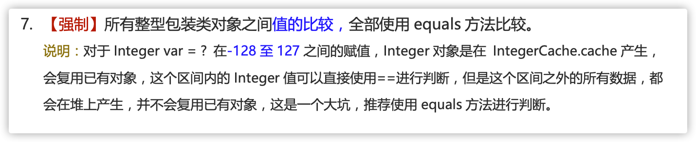
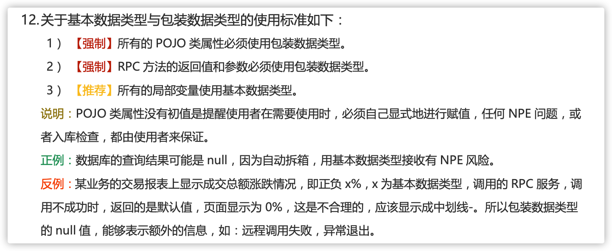
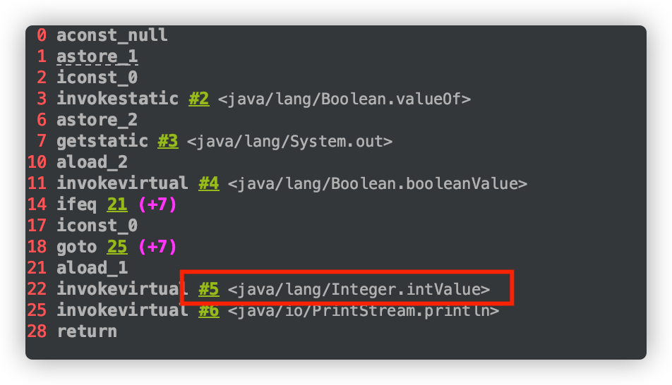
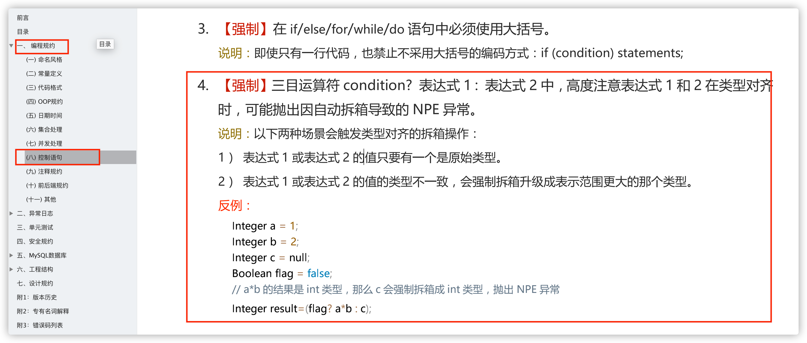

# Java 数据类型常见面试题总结

这篇文章绝对干货！**文章涉及到的概念经常会被面试官拿来考察求职者的 Java 基础。**


本篇采用大家比较喜欢的面试官问答的形式来展开。


## 基本数据类型


👨‍💻**面试官** ： Java 中有哪 8 种基本数据类型？


🙋 **我** ：Java 中有 8 种基本数据类型，分别为：


1. 6 种数字类型 ：`byte`、`short`、`int`、`long`、`float`、`double`
2. 1 种字符类型：`char`
3. 1 种布尔型：`boolean`。


👨‍💻**面试官** ： 它们的默认值和占用的空间大小知道不？


🙋 **我** ：这 8 种基本数据类型的默认值以及所占空间的大小如下：

| 基本类型 | 位数 | 字节 | 默认值 |
| --- | --- | --- | --- |
| `int` | 32 | 4 | 0 |
| `short` | 16 | 2 | 0 |
| `long` | 64 | 8 | 0L |
| `byte` | 8 | 1 | 0 |
| `char` | 16 | 2 | 'u0000' |
| `float` | 32 | 4 | 0f |
| `double` | 64 | 8 | 0d |
| `boolean` | 1 | | false |


另外，对于 `boolean`，官方文档未明确定义，它依赖于 JVM 厂商的具体实现。逻辑上理解是占用 1 位，但是实际中会考虑计算机高效存储因素。


**注意：**


1. Java 里使用 `long` 类型的数据一定要在数值后面加上 **L**，否则将作为整型解析：
2. `char a = 'h'`char :单引号，`String a = "hello"` :双引号


## 包装类型


👨‍💻**面试官** ： 说说这 8 种基本数据类型对应的包装类型。


🙋 **我** ：这八种基本类型都有对应的包装类分别为：`Byte`、`Short`、`Integer`、`Long`、`Float`、`Double`、`Character`、`Boolean`


👨‍💻**面试官** ：那基本类型和包装类型有啥区别不？


🙋 **我** ：


+ **用途**：除了定义一些常量和局部变量之外，我们在其他地方比如方法参数、对象属性中很少会使用基本类型来定义变量。并且，包装类型可用于泛型，而基本类型不可以。
+ **存储方式**：基本数据类型的局部变量存放在 Java 虚拟机栈中的局部变量表中，基本数据类型的成员变量（未被 `static` 修饰 ）存放在 Java 虚拟机的堆中。包装类型属于对象类型，我们知道几乎所有对象实例都存在于堆中。
+ **占用空间**：相比于包装类型（对象类型）， 基本数据类型占用的空间往往非常小。
+ **默认值**：成员变量包装类型不赋值就是 `null` ，而基本类型有默认值且不是 `null`。
+ **比较方式**：对于基本数据类型来说，`==` 比较的是值。对于包装数据类型来说，`==` 比较的是对象的内存地址。所有整型包装类对象之间值的比较，全部使用 `equals()` 方法。


**为什么说是几乎所有对象实例都存在于堆中呢？** 这是因为 HotSpot 虚拟机引入了 JIT 优化之后，会对对象进行逃逸分析，如果发现某一个对象并没有逃逸到方法外部，那么就可能通过标量替换来实现栈上分配，而避免堆上分配内存


⚠️ 注意：**基本数据类型存放在栈中是一个常见的误区！** 基本数据类型的成员变量如果没有被 `static` 修饰的话（不建议这么使用，应该要使用基本数据类型对应的包装类型），就存放在堆中。


```java
class BasicTypeVar{
  private int x;
}
```

### 包装类型的常量池技术


👨‍💻**面试官** ： 包装类型的常量池技术了解么？


🙋 **我** ： Java 基本类型的包装类的大部分都实现了常量池技术。


`Byte`,`Short`,`Integer`,`Long` 这 4 种包装类默认创建了数值 **[-128，127]** 的相应类型的缓存数据，`Character` 创建了数值在[0,127]范围的缓存数据，`Boolean` 直接返回 `True` Or `False`。


**Integer 缓存源码：**


```java
/**
* 利用 IntegerCache 类实现了对指定范围内整数对象的缓存。
* 默认情况下，这个缓存范围是 -128 到 127（包含边界值）。
*/
public static Integer valueOf(int i) {
    if (i >= IntegerCache.low && i <= IntegerCache.high)
      return IntegerCache.cache[i + (-IntegerCache.low)];
    return new Integer(i);
}
private static class IntegerCache {
    static final int low = -128;
    static final int high;
    static final Integer cache[];
}
```


`**Character**`** 缓存源码:**


```java
public static Character valueOf(char c) {
    if (c <= 127) { // must cache
      return CharacterCache.cache[(int)c];
    }
    return new Character(c);
}

private static class CharacterCache {
    private CharacterCache(){}

    static final Character cache[] = new Character[127 + 1];
    static {
        for (int i = 0; i < cache.length; i++)
            cache[i] = new Character((char)i);
    }
}
```


`**Boolean**`** 缓存源码：**


```java
public static Boolean valueOf(boolean b) {
    return (b ? TRUE : FALSE);
}
```


如果超出对应范围仍然会去创建新的对象，缓存的范围区间的大小只是在性能和资源之间的权衡。


两种浮点数类型的包装类 `Float`,`Double` 并没有实现常量池技术。


```java
Integer i1 = 33;
Integer i2 = 33;
System.out.println(i1 == i2);// 输出 true
Float i11 = 333f;
Float i22 = 333f;
System.out.println(i11 == i22);// 输出 false
Double i3 = 1.2;
Double i4 = 1.2;
System.out.println(i3 == i4);// 输出 false
```


下面我们来看一下问题。下面的代码的输出结果是 `true` 还是 `flase` 呢？


```java
Integer i1 = 40;
Integer i2 = new Integer(40);
System.out.println(i1==i2);
```


`Integer i1=40` 这一行代码会发生装箱，也就是说这行代码等价于 `Integer i1=Integer.valueOf(40)` 。因此，`i1` 直接使用的是常量池中的对象。而`Integer i2 = new Integer(40)` 会直接创建新的对象。


因此，答案是 `false` 。你答对了吗？


记住：**所有整型包装类对象之间值的比较，全部使用 equals 方法比较**。





### 为什么要有包装类型？


👨‍💻**面试官** ： 为什么要有包装类型？


🙋 **我** ：


Java 本身就是一门 OOP（面向对象编程）语言，对象可以说是 Java 的灵魂。


除了定义一些常量和局部变量之外，我们在其他地方比如方法参数、对象属性中很少会使用基本类型来定义变量。


**为什么呢？**


我举个例子，假如你有一个对象中的属性使用了 基本类型，那这个属性就必然存在默认值了。这个逻辑不正确的！因为很多业务场景下，对象的某些属性没有赋值，我就希望它的值为 null。你给我默认赋个值，不是帮倒忙么？


另外，像泛型参数不能是基本类型。因为基本类型不是 `Object` 子类，应该用基本类型对应的包装类型代替。我们直接拿 JDK 中线程的代码举例。


Java 中的集合在定义类型的时候不能使用基本类型的。比如：


```java
public class HashMap<K,V> extends AbstractMap<K,V>
    implements Map<K,V>, Cloneable, Serializable {
}

Map<Integer, Set<String>> map = new HashMap<>();
```


## 自动拆装箱


### 什么是自动拆装箱？原理？


👨‍💻**面试官** ： 什么是自动拆装箱？原理了解么？


🙋 **我** ：


基本类型和包装类型之间的互转。举例：


```java
Integer i = 10;  //装箱
int n = i;   //拆箱
```


上面这两行代码对应的字节码为：


```java
   L1
    LINENUMBER 8 L1
    ALOAD 0
    BIPUSH 10
    INVOKESTATIC java/lang/Integer.valueOf (I)Ljava/lang/Integer;
    PUTFIELD AutoBoxTest.i : Ljava/lang/Integer;
   L2
    LINENUMBER 9 L2
    ALOAD 0
    ALOAD 0
    GETFIELD AutoBoxTest.i : Ljava/lang/Integer;
    INVOKEVIRTUAL java/lang/Integer.intValue ()I
    PUTFIELD AutoBoxTest.n : I
    RETURN
```


从字节码中，我们发现装箱其实就是调用了 包装类的`valueOf()`方法，拆箱其实就是调用了 `xxxValue()`方法。


因此，


+ `Integer i = 10` 等价于 `Integer i = Integer.valueOf(10)`
+ `int n = i` 等价于 `int n = i.intValue()`;


### 自动拆箱引发的 NPE 问题


👨‍💻**面试官** ： 自动拆箱可能会引发 NPE 问题，遇到过类似的场景么？


🙋 **我** ：


#### 案例 1


在《阿里巴巴开发手册》上就有这样一条规定。





我们从上图可以看到，有一条是这样说的：“**数据库的查询结果可能是 null，因为自动拆箱，用基本数据类型接收有 NPE 风险**”。


我们来模拟一个实际的案例：


```java
public class AutoBoxTest {
    @Test
    void  should_Throw_NullPointerException(){
        long id = getNum();
    }
    public Long getNum(){
        return null;
    }
}
```


运行代码之后，果然出现了 **NPE** 的问题。


**为什么会这样呢?** 我们对 `AutoBoxTest.class` 进行反编译查看其字节码（我更推荐使用 IDEA 插件 jclasslib 来查看类的字节码）。


```bash
javap -c AutoBoxTest.class
```


反编译后得到的 `should_Throw_NullPointerException()` 方法的字节码如下：


```java
0 aload_0
1 invokevirtual #2 <AutoBoxTest.getNum>
4 invokevirtual #3 <java/lang/Long.longValue>
7 lstore_1
8 return
```


我们可以发现自动拆箱 `Long` -> `long` 的过程，不过是调用了 `longValue()` 方法罢了！


```java
public long longValue() {
   return value;
}
```


也就是说下面两行的代码实际是等价的:


```java
long id = getNum();
long id = getNum().longValue();
```


因为，`getNum()`返回的值为 `null` ，一个 `null` 值调用方法，当然会有 **NPE** 的问题了。


#### 案例 2


通过上面的分析之后，我来考了一个不论是平时开发还是面试中都经常会碰到的一个问题：“**三目运算符使用不当会导致诡异的 NPE 异常**”。


请你回答下面的代码会有 **NPE** 问题出现吗？如果有 NPE 问题出现的话，原因是什么呢？你会怎么分析呢？


```java
public class Main {
    public static void main(String[] args) {
        Integer i = null;
        Boolean flag = false;
        System.out.println(flag ? 0 : i);
    }
}
```


答案是会有 NPE 问题出现的。


我们还是通过查看其字节码来搞懂背后的原理（这里借助了 IDEA 插件 jclasslib 来查看类字节码）。





从字节码中可以看出，22 行的位置发生了 **拆箱操作** 。


详细解释下就是：`flag ? 0 : i` 这行代码中，0 是基本数据类型 int，返回数据的时候 i 会被强制拆箱成 int 类型，由于 i 的值是 null，因此就抛出了 NPE 异常。


```java
Integer i = null;
Boolean flag = false;
System.out.println(flag ? 0 : i);
```


如果，我们把代码中 `flag` 变量的值修改为 true 的话，就不会存在 NPE 问题了，因为会直接返回 0，不会进行拆箱操作。


我们在实际项目中应该避免这样的写法，正确 ✅ 修改之后的代码如下：


```java
Integer i = null;
Boolean flag = false;
System.out.println(flag ? new Integer(0) : i);// 两者类型一致就不会有拆箱导致的 NPE 问题了
```


这个问题也在 《阿里巴巴开发手册》中 被提到过。





> 更新: 2023-10-09 20:17:53  
> 原文: <https://www.yuque.com/snailclimb/mf2z3k/ng3x4o>