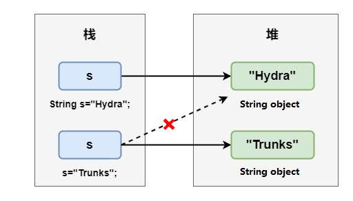
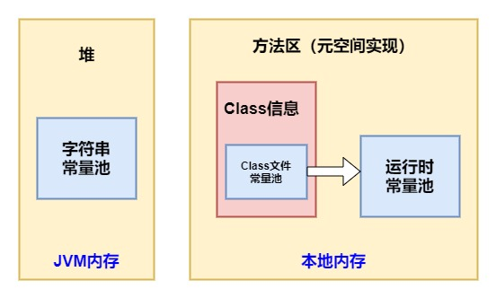
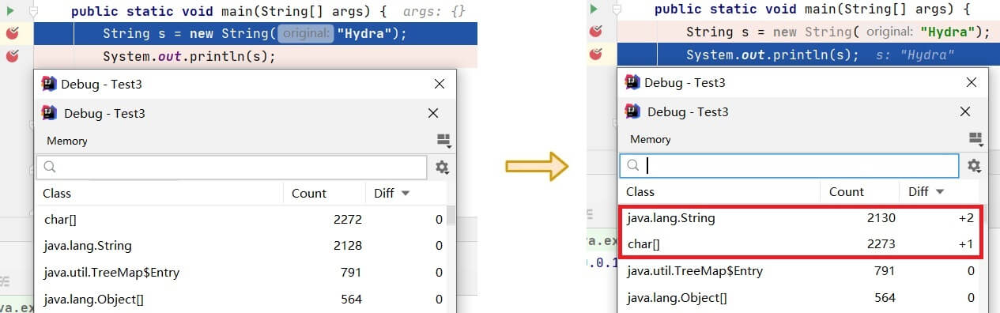
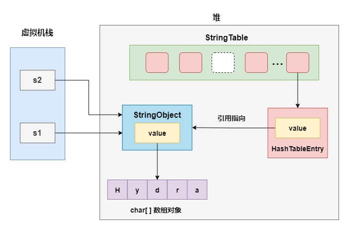

# String 类常见面试题总结

> 这篇文章是我的一位好朋友 Hydra（公众号码农参上号主）写的原创干货，经他同意，我将其整理到了 《Java 面试指北》的 Java 部分。
>
> 说明：这里主要使用的是 JDK 8 版本进行测试。
>


String 字符串是我们日常工作中常用的一个类，在面试中也是高频考点，这里精心总结了一波常见但也有点烧脑的 String 面试题，一共 5 道题，难度从简到难，来一起来看看你能做对几道吧。


**说明** ：本文基于**jdk8**版本中的 String 进行讨论，文章例子中的代码运行结果基于`Java 1.8.0_261-b12`


## 第 1 题，奇怪的 nullnull


下面这段代码最终会打印什么？


```java
public class Test1 {
    private static String s1;
    private static String s2;

    public static void main(String[] args) {
        String s= s1+s2;
        System.out.println(s);
    }
}
```


运行之后，你会发现打印了`nullnull`：


在分析这个结果之前，先扯点别的，说一下为空`null`的字符串的打印原理。查看一下`PrintStream`类的源码，`print`方法在打印`null`前进行了处理：


```java
public void print(String s) {
    if (s == null) {
        s = "null";
    }
    write(s);
}
```


因此，一个为`null`的字符串就可以被打印在我们的控制台上了。


再回头看上面这道题，`s1`和`s2`没有经过初始化所以都是空对象`null`，需要注意这里不是字符串的`"null"`，打印结果的产生我们可以看一下字节码文件：


编译器会对`String`字符串相加的操作进行优化，会把这一过程转化为`StringBuilder`的`append`方法。那么，让我们再看看`append`方法的源码：


```java
public AbstractStringBuilder append(String str) {
    if (str == null)
        return appendNull();
    	//...
}
```


如果`append`方法的参数字符串为`null`，那么这里会调用其父类`AbstractStringBuilder`的`appendNull`方法：


```java
private AbstractStringBuilder appendNull() {
    int c = count;
    ensureCapacityInternal(c + 4);
    final char[] value = this.value;
    value[c++] = 'n';
    value[c++] = 'u';
    value[c++] = 'l';
    value[c++] = 'l';
    count = c;
    return this;
}
```


这里的`value`就是底层用来存储字符的`char`类型数组，到这里我们就可以明白了，其实`StringBuilder`也对`null`的字符串进行了特殊处理，在`append`的过程中如果碰到是`null`的字符串，那么就会以`"null"`的形式被添加进字符数组，这也就导致了两个为空`null`的字符串相加后会打印为`"nullnull"`。


## 第 2 题，改变 String 的值


如何改变一个 String 字符串的值，这道题可能看上去有点太简单了，像下面这样直接_赋值_不就可以了吗？


```java
String s="Hydra";
s="Trunks";
```


恭喜你，成功掉进了坑里！在回答这道题之前，我们需要知道 String 是**不可变**的，打开 String 的源码在开头就可以看到：


```java
private final char value[];
```


可以看到，String 的本质其实是一个`char`类型的数组，然后我们再看两个关键字。先看`final`，我们知道`final`在修饰引用数据类型时，就像这里的数组时，能够保证指向该数组地址的引用不能修改，但是数组本身内的值可以被修改。


是不是有点晕，没关系，我们看一个例子：


```java
final char[] one={'a','b','c'};
char[] two={'d','e','f'};
one=two;
```


如果你这样写，那么编译器是会报错提示`Cannot assign a value to final variable 'one'`，说明被`final`修饰的数组的引用地址是不可改变的。但是下面这段代码却能够正常的运行：


```java
final char[] one={'a','b','c'};
one[1]='z';
```


也就是说，即使被`final`修饰，但是我直接操作数组里的元素还是可以的，所以这里还加了另一个关键字`private`，防止从外部进行修改。此外，String 类本身也被添加了`final`关键字修饰，防止被继承后对属性进行修改。


到这里，我们就可以理解为什么 String 是不可变的了，那么在上面的代码进行_二次赋值_的过程中，发生了什么呢？答案很简单，前面的变量`s`只是一个 String 对象的引用，这里的重新赋值时将变量`s`指向了新的对象。





上面白话了一大顿，其实是我们可以通过比较`hashCode`的方式来看一下引用指向的对象是否发生了改变，修改一下上面的代码，打印字符串的`hashCode`：


```java
public static void main(String[] args) {
    String s="Hydra";
    System.out.println(s+":  "+s.hashCode());
    s="Trunks";
    System.out.println(s+": "+s.hashCode());
}
```


查看结果，发生了改变，证明指向的对象发生了改变：


那么，回到上面的问题，如果我想要改变一个 String 的值，而又不想把它重新指向其他对象的话，应该怎么办呢？答案是利用反射修改`char`数组的值：


```java
public static void main(String[] args) throws NoSuchFieldException, IllegalAccessException {
    String s="Hydra";
    System.out.println(s+":  "+s.hashCode());

    Field field = String.class.getDeclaredField("value");
    field.setAccessible(true);
    field.set(s,new char[]{'T','r','u','n','k','s'});
    System.out.println(s+": "+s.hashCode());
}
```


再对比一下`hashCode`，修改后和之前一样，对象没有发生任何变化：


最后，再啰嗦说一点题外话，这里看的是`jdk8`中 String 的源码，到这为止还是使用的`char`类型数组来存储字符，但是在`jdk9`中这个`char`数组已经被替换成了`byte`数组，能够使 String 对象占用的内存减少。


## 第 3 题，创建了几个对象？


相信不少小伙伴在面试中都遇到过这道经典面试题，下面这段代码中到底**创建**了几个对象？


```java
String s = new String("Hydra");
```


其实真正想要回答好这个问题，要铺垫的知识点还真是不少。首先，我们需要了解 3 个关于**常量池**的概念，下面还是基于`jdk8`版本进行说明：


+ class 文件常量池：在 class 文件中保存了一份常量池（`Constant Pool`），主要存储编译时确定的数据，包括代码中的**字面量**(`literal`)和**符号引用**
+ 运行时常量池：位于方法区中，全局共享，class 文件常量池中的内容会在类加载后存放到方法区的运行时常量池中。除此之外，在运行期间可以将新的变量放入运行时常量池中，相对 class 文件常量池而言运行时常量池更具备动态性
+ 字符串常量池：位于堆中，全局共享，这里可以先粗略的认为它存储的是 String 对象的**直接引用**，而不是直接存放的对象，具体的实例对象是在堆中存放


可以用一张图来描述它们各自所处的位置：





接下来，我们来细说一下**字符串常量池**的结构，其实在 Hotspot JVM 中，字符串常量池`StringTable`的本质是一张`HashTable`，那么当我们说将一个字符串放入字符串常量池的时候，实际上放进去的是什么呢？


以字面量的方式创建 String 对象为例，字符串常量池以及堆栈的结构如下图所示（忽略了 jvm 中的各种`OopDesc`实例）：


实际上字符串常量池`HashTable`采用的是**数组**加**链表**的结构，链表中的节点是一个个的`HashTableEntry`，而`HashTableEntry`中的`value`则存储了堆上 String 对象的**引用**。


那么，下一个问题来了，这个字符串对象的引用是**什么时候**被放到字符串常量池中的？具体可为两种情况：


+ 使用字面量声明 String 对象时，也就是被双引号包围的字符串，在堆上创建对象，并**驻留**到字符串常量池中（注意这个用词）
+ 调用`intern()`方法，当字符串常量池没有相等的字符串时，会保存该字符串的引用


**注意！**我们在上面用到了一个词**驻留**，这里对它进行一下规范。当我们说驻留一个字符串到字符串常量池时，指的是创建`HashTableEntry`，再使它的`value`指向堆上的 String 实例，并把`HashTableEntry`放入字符串常量池，而不是直接把 String 对象放入字符串常量池中。简单来说，可以理解为将 String 对象的引用保存在字符串常量池中。


我们把`intern()`方法放在后面细说，先主要看第一种情况，这里直接整理引用 R 大的结论：


> 在类加载阶段，JVM 会在堆中创建对应这些 class 文件常量池中的字符串对象实例，并在字符串常量池中驻留其引用。
>
>  
>
> 这一过程具体是在 resolve 阶段(个人理解就是 resolution 解析阶段)执行，但是并不是立即就创建对象并驻留了引用，因为在 JVM 规范里指明了 resolve 阶段可以是 lazy 的。CONSTANT_String 会在第一次引用该项的 ldc 指令被第一次执行到的时候才会 resolve。
>
>  
>
> 就 HotSpot VM 的实现来说，加载类时字符串字面量会进入到运行时常量池，不会进入全局的字符串常量池，即在 StringTable 中并没有相应的引用，在堆中也没有对应的对象产生。
>


这里大家可以暂时先记住这个结论，在后面还会用到。


在弄清楚上面几个概念后，我们再回过头来，先看看用**字面量**声明 String 的方式，代码如下：


```java
public static void main(String[] args) {
    String s = "Hydra";
}
```


反编译生成的字节码文件：


```shell
public static void main(java.lang.String[]);
  descriptor: ([Ljava/lang/String;)V
  flags: ACC_PUBLIC, ACC_STATIC
  Code:
    stack=1, locals=2, args_size=1
       0: ldc           #2                  // String Hydra
       2: astore_1
       3: return
```


解释一下上面的字节码指令：


+ `0: ldc`，查找后面索引为`#2`对应的项，`#2`表示常量在常量池中的位置。在这个过程中，会触发前面提到的**lazy resolve**，在 resolve 过程如果发现`StringTable`已经有了内容匹配的 String 引用，则直接返回这个引用，反之如果`StringTable`里没有内容匹配的 String 对象的引用，则会在堆里创建一个对应内容的 String 对象，然后在`StringTable`驻留这个对象引用，并返回这个引用，之后再压入操作数栈中
+ `2: astore_1`，弹出栈顶元素，并将栈顶引用类型值保存到局部变量 1 中，也就是保存到变量`s`中
+ `3: return`，执行`void`函数返回


可以看到，在这种模式下，只有堆中创建了一个`"Hydra"`对象，在字符串常量池中驻留了它的引用。并且，如果再给字符串`s2`、`s3`也用字面量的形式赋值为`"Hydra"`，它们用的都是堆中的唯一这一个对象。


好了，再看一下以构造方法的形式创建字符串的方式：


```java
public static void main(String[] args) {
    String s = new String("Hydra");
}
```


同样反编译这段代码的字节码文件：


```shell
public static void main(java.lang.String[]);
  descriptor: ([Ljava/lang/String;)V
  flags: ACC_PUBLIC, ACC_STATIC
  Code:
    stack=3, locals=2, args_size=1
       0: new           #2                  // class java/lang/String
       3: dup
       4: ldc           #3                  // String Hydra
       6: invokespecial #4                  // Method java/lang/String."<init>":(Ljava/lang/String;)V
       9: astore_1
      10: return
```


看一下和之前不同的字节码指令部分：


+ `0: new`，在堆上创建一个 String 对象，并将它的引用压入操作数栈，注意这时的对象还只是一个空壳，并没有调用类的构造方法进行初始化
+ `3: dup`，复制栈顶元素，也就是复制了上面的对象引用，并将复制后的对象引用压入栈顶。这里之所以要进行复制，是因为之后要执行的构造方法会从操作数栈弹出需要的参数和这个对象引用本身（这个引用起到的作用就是构造方法中的`this`指针），如果不进行复制，在弹出后会无法得到初始化后的对象引用
+ `4: ldc`，在堆上创建字符串对象，驻留到字符串常量池，并将字符串的引用压入操作数栈
+ `6: invokespecial`，执行 String 的构造方法，这一步执行完成后得到一个完整对象


到这里，我们可以看到一共创建了**两个**String 对象，并且两个都是在堆上创建的，且字面量方式创建的 String 对象的引用被驻留到了字符串常量池中。而栈里的`s`只是一个变量，并不是实际意义上的对象，我们不把它包括在内。


其实想要验证这个结论也很简单，可以使用 idea 中强大的 debug 功能来直观的对比一下对象数量的变化，先看字面量创建 String 方式：


这个对象数量的计数器是在 debug 时，点击下方右侧`Memory`的`Load classes`弹出的。对比语句执行前后可以看到，只创建了一个 String 对象，以及一个 char 数组对象，也就是 String 对象中的`value`。


再看看构造方法创建 String 的方式：





可以看到，创建了两个 String 对象，一个 char 数组对象，也说明了两个 String 中的`value`指向了同一个 char 数组对象，符合我们上面从字节码指令角度解释的结果。


最后再看一下下面的这种情况，当字符串常量池已经驻留过某个字符串引用，再使用构造方法创建 String 时，创建了几个对象？


```java
public static void main(String[] args) {
	String s = "Hydra";
	String s2 = new String("Hydra");
}
```


答案是**只创建一个对象**，对于这种重复字面量的字符串，看一下反编译后的字节码指令：


```shell
Code:
  stack=3, locals=3, args_size=1
     0: ldc           #2                  // String Hydra
     2: astore_1
     3: new           #3                  // class java/lang/String
     6: dup
     7: ldc           #2                  // String Hydra
     9: invokespecial #4                  // Method java/lang/String."<init>":(Ljava/lang/String;)V
    12: astore_2
    13: return
```


可以看到两次执行`ldc`指令时后面索引相同，而`ldc`判断是否需要创建新的 String 实例的依据是根据在第一次执行这条指令时，`StringTable`是否已经保存了一个对应内容的 String 实例的引用。所以在第一次执行`ldc`时会创建 String 实例，而在第二次`ldc`就会直接返回而不需要再创建实例了。


## 第 4 题，烧脑的 intern


上面我们在研究字符串对象的引用如何驻留到字符串常量池中时，还留下了调用`intern`方法的方式，下面我们来具体分析。


从字面上理解`intern`这个单词，作为动词时它有**禁闭**、**关押**的意思，通过前面的介绍，与其说是将字符串关押到字符串常量池`StringTable`中，可能将它理解为**缓存它的引用**会更加贴切。


String 的`intern()`是一个本地方法，可以强制将 String 驻留进入字符串常量池，可以分为两种情况：


+ 如果字符串常量池中已经驻留了一个等于此 String 对象内容的字符串引用，则返回此字符串在常量池中的引用
+ 否则，在常量池中创建一个引用指向这个 String 对象，然后返回常量池中的这个引用


好了，我们下面看一下这段代码，它的运行结果应该是什么？


```java
public static void main(String[] args) {
    String s1 = new String("Hydra");
    String s2 = s1.intern();
    System.out.println(s1 == s2);
    System.out.println(s1 == "Hydra");
    System.out.println(s2 == "Hydra");
}
```


输出打印：


```properties
false
false
true
```


用一张图来描述它们的关系，就很容易明白了：


其实有了第三题的基础，了解这个结构已经很简单了：


+ 在创建`s1`的时候，其实堆里已经创建了两个字符串对象`StringObject1`和`StringObject2`，并且在字符串常量池中驻留了`StringObject2`
+ 当执行`s1.intern()`方法时，字符串常量池中已经存在内容等于`"Hydra"`的字符串`StringObject2`，直接返回这个引用并赋值给`s2`
+ `s1`和`s2`指向的是两个不同的 String 对象，因此返回 false
+ `s2`指向的就是驻留在字符串常量池的`StringObject2`，因此`s2=="Hydra"`为 true，而`s1`指向的不是常量池中的对象引用所以返回 false


上面是常量池中已存在内容相等的字符串驻留的情况，下面再看看常量池中不存在的情况，看下面的例子：


```java
public static void main(String[] args) {
    String s1 = new String("Hy") + new String("dra");
    s1.intern();
    String s2 = "Hydra";
    System.out.println(s1 == s2);
}
```


执行结果：


```java
true
```


简单分析一下这个过程，第一步会在堆上创建`"Hy"`和`"dra"`的字符串对象，并驻留到字符串常量池中。


接下来，完成字符串的拼接操作，前面我们说过，实际上 jvm 会把拼接优化成`StringBuilder`的`append`方法，并最终调用`toString`方法返回一个 String 对象。在完成字符串的拼接后，字符串常量池中并没有驻留一个内容等于`"Hydra"`的字符串。


所以，执行`s1.intern()`时，会在字符串常量池创建一个引用，指向前面`StringBuilder`创建的那个字符串，也就是变量`s1`所指向的字符串对象。在《深入理解 Java 虚拟机》这本书中，作者对这进行了解释，因为从 jdk7 开始，字符串常量池就已经移到了堆中，那么这里就只需要在字符串常量池中记录一下首次出现的实例引用即可。


最后，当执行`String s2 = "Hydra"`时，发现字符串常量池中已经驻留这个字符串，直接返回对象的引用，因此`s1`和`s2`指向的是相同的对象。





## 第 5 题，还是创建了几个对象？


解决了前面数 String 对象个数的问题，那么我们接着加点难度，看看下面这段代码，创建了几个对象？


```java
String s="a"+"b"+"c";
```


先揭晓答案，**只创建了一个对象！** 可以直观的对比一下源代码和反编译后的字节码文件：


如果使用前面提到过的 debug 小技巧，也可以直观的看到语句执行完后，只增加了一个 String 对象，以及一个 char 数组对象。并且这个字符串就是驻留在字符串常量池中的那一个，如果后面再使用字面量`"abc"`的方式声明一个字符串，指向的仍是这一个，堆中 String 对象的数量不会发生变化。


至于为什么源代码中字符串拼接的操作，在编译完成后会消失，直接呈现为一个拼接后的完整字符串，是因为在编译期间，应用了编译器优化中一种被称为**常量折叠**(Constant Folding)的技术。


> 常量折叠会将**编译期常量**的加减乘除的运算过程在编译过程中折叠。编译器通过语法分析，会将常量表达式计算求值，并用求出的值来替换表达式，而不必等到运行期间再进行运算处理，从而在运行期间节省处理器资源。
>


而上边提到的编译期常量的特点就是它的值在编译期就可以确定，并且需要完整满足下面的要求，才可能是一个编译期常量：


+ 被声明为`final`
+ 基本类型或者字符串类型
+ 声明时就已经初始化
+ 使用**常量表达式**进行初始化


下面我们通过几段代码加深对它的理解：


```java
public static void main(String[] args) {
    final String h1 = "hello";
    String h2 = "hello";
    String s1 = h1 + "Hydra";
    String s2 = h2 + "Hydra";
    System.out.println((s1 == "helloHydra"));
    System.out.println((s2 == "helloHydra"));
}
```


执行结果：


```properties
true
false
```


代码中字符串`h1`和`h2`都使用常量赋值，区别在于是否使用了`final`进行修饰，对比编译后的代码，`s1`进行了折叠而`s2`没有，可以印证上面的理论，`final`修饰的字符串变量才有可能是编译期常量。


再看一段代码，执行下面的程序，结果会返回什么呢？


```java
public static void main(String[] args) {
    String h ="hello";
    final String h2 = h;
    String s = h2 + "Hydra";
    System.out.println(s=="helloHydra");
}
```


答案是`false`，因为虽然这里字符串`h2`被`final`修饰，但是初始化时没有使用常量表达式，因此它也不是编译期常量。那么，有的小伙伴就要问了，到底什么才是常量表达式呢？


在`Oracle`官网的文档中，列举了很多种情况，下面对常见的情况进行列举（除了下面这些之外官方文档上还列举了不少情况，如果有兴趣的话，可以自己查看）：


+ 基本类型和 String 类型的字面量
+ 基本类型和 String 类型的强制类型转换
+ 使用`+`或`-`或`!`等一元运算符（不包括`++`和`--`）进行计算
+ 使用加减运算符`+`、`-`，乘除运算符`*`、 `/` 、`%` 进行计算
+ 使用移位运算符 `>>`、 `<<`、 `>>>`进行位移操作
+ ……


至于我们从文章一开始就提到的字面量（literals），是用于表达源代码中一个固定值的表示法，在 Java 中创建一个对象时需要使用`new`关键字，但是给一个基本类型变量赋值时不需要使用`new`关键字，这种方式就可以被称为字面量。Java 中字面量主要包括了以下类型的字面量：


```java
//整数型字面量：
long l=1L;
int i=1;

//浮点类型字面量：
float f=11.1f;
double d=11.1;

//字符和字符串类型字面量：
char c='h';
String s="Hydra";

//布尔类型字面量：
boolean b=true;
```


再说点题外话，和编译期常量相对的，另一种类型的常量是运行时常量，看一下下面这段代码：


```java
final String s1="hello "+"Hydra";
final String s2=UUID.randomUUID().toString()+"Hydra";
```


编译器能够在编译期就得到`s1`的值是`hello Hydra`，不需要等到程序的运行期间，因此`s1`属于编译期常量。而对`s2`来说，虽然也被声明为`final`类型，并且在声明时就已经初始化，但使用的不是常量表达式，因此不属于编译期常量，这一类型的常量被称为**运行时常量**。


再看一下编译后的字节码文件中的常量池区域：


可以看到常量池中只有一个 String 类型的常量`hello Hydra`，而`s2`对应的字符串常量则不在此区域。对编译器来说，运行时常量在编译期间无法进行折叠，编译器只会对尝试修改它的操作进行报错处理。


## 总结


最后再强调一下，本文是基于`jdk8`进行测试，不同版本的`jdk`可能会有很大差异。例如`jdk6`之前，字符串常量池存储的是 String 对象实例，而在`jdk7`以后字符串常量池就改为存储引用，做了非常大的改变。


至于最后一题，其实 Hydra 在以前单独拎出来写过一篇文章，这次总结面试题把它归纳在了里面，省略了一些不重要的部分，大家如果觉得不够详细可以移步看看这篇：

[String s=“a”+“b”+“c”，到底创建了几个对象？](http://mp.weixin.qq.com/s?__biz=MzIwMTgzOTQ0Ng==&mid=2247486096&idx=1&sn=03ffef3159889a2ca2e9f7287f2c5bad&chksm=96e68ca9a19105bf3f3941732d913eaf6764f5d152a1f5eac649104d685c98cabd68a743e8b4&scene=21#wechat_redirect)


## 参考资料


+ 《深入理解 Java 虚拟机（第三版）》
+ [https://www.zhihu.com/question/55994121](https://www.zhihu.com/question/55994121)
+ [https://www.iteye.com/blog/rednaxelafx-774673#](https://www.iteye.com/blog/rednaxelafx-774673#)


> 更新: 2024-04-13 11:52:44  
> 原文: <https://www.yuque.com/snailclimb/mf2z3k/daifks>