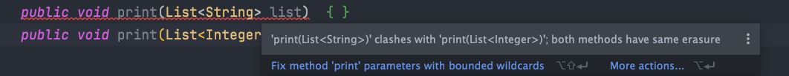

# 泛型&通配符常见面试题总结

## 泛型


### 什么是泛型？有什么作用？


**Java 泛型（Generics）** 是 JDK 5 中引入的一个新特性。使用泛型参数，可以增强代码的可读性以及稳定性。


编译器可以对泛型参数进行检测，并且通过泛型参数可以指定传入的对象类型。比如 `ArrayList<Persion> persons = new ArrayList<Persion>()` 这行代码就指明了该 `ArrayList` 对象只能传入 `Persion` 对象，如果传入其他类型的对象就会报错。


```java
ArrayList<E> extends AbstractList<E>
```


并且，原生 `List` 返回类型是 `Object` ，需要手动转换类型才能使用，使用泛型后编译器自动转换。


### 泛型的使用方式有哪几种？


泛型一般有三种使用方式:**泛型类**、**泛型接口**、**泛型方法**。


**1.泛型类**：


```java
//此处T可以随便写为任意标识，常见的如T、E、K、V等形式的参数常用于表示泛型
//在实例化泛型类时，必须指定T的具体类型
public class Generic<T>{

    private T key;

    public Generic(T key) {
        this.key = key;
    }

    public T getKey(){
        return key;
    }
}
```


如何实例化泛型类：


```java
Generic<Integer> genericInteger = new Generic<Integer>(123456);
```


**2.泛型接口** ：


```java
public interface Generator<T> {
    public T method();
}
```


实现泛型接口，不指定类型：


```java
class GeneratorImpl<T> implements Generator<T>{
    @Override
    public T method() {
        return null;
    }
}
```


实现泛型接口，指定类型：


```java
class GeneratorImpl<T> implements Generator<String>{
    @Override
    public String method() {
        return "hello";
    }
}
```


**3.泛型方法** ：


```java
   public static < E > void printArray( E[] inputArray )
   {
         for ( E element : inputArray ){
            System.out.printf( "%s ", element );
         }
         System.out.println();
    }
```


使用：


```java
// 创建不同类型数组： Integer, Double 和 Character
Integer[] intArray = { 1, 2, 3 };
String[] stringArray = { "Hello", "World" };
printArray( intArray  );
printArray( stringArray  );
```


### 项目中哪里用到了泛型？


+ 自定义接口通用返回结果 `CommonResult<T>` 通过参数 `T` 可根据具体的返回类型动态指定结果的数据类型
+ 定义 `Excel` 处理类 `ExcelUtil<T>` 用于动态指定 `Excel` 导出的数据类型
+ 构建集合工具类（参考 `Collections` 中的 `sort`, `binarySearch` 方法）。
+ ......


### 什么是泛型擦除机制？为什么要擦除?


**Java 的泛型是伪泛型，这是因为 Java 在编译期间，所有的泛型信息都会被擦掉，这也就是通常所说类型擦除 。**


编译器会在编译期间会动态地将泛型 `T` 擦除为 `Object` 或将 `T extends xxx` 擦除为其限定类型 `xxx` 。


因此，泛型本质上其实还是编译器的行为，为了保证引入泛型机制但不创建新的类型，减少虚拟机的运行开销，编译器通过擦除将泛型类转化为一般类。


这里说的可能有点抽象，我举个例子：


```java
List<Integer> list = new ArrayList<>();

list.add(12);
//1.编译期间直接添加会报错
list.add("a");
Class<? extends List> clazz = list.getClass();
Method add = clazz.getDeclaredMethod("add", Object.class);
//2.运行期间通过反射添加，是可以的
add.invoke(list, "kl");

System.out.println(list)
```


再来举一个例子 : 由于泛型擦除的问题，下面的方法重载会报错。


```java
public void print(List<String> list)  { }
public void print(List<Integer> list) { }
```





原因也很简单，泛型擦除之后，`List<String>` 与 `List<Integer>` 在编译以后都变成了 `List` 。


**既然编译器要把泛型擦除，那为什么还要用泛型呢？用 Object 代替不行吗？**


这个问题其实在变相考察泛型的作用：


+  使用泛型可在编译期间进行类型检测。 
+  使用 `Object` 类型需要手动添加强制类型转换，降低代码可读性，提高出错概率。 
+  泛型可以使用自限定类型如 `T extends Comparable` 。 


### 什么是桥方法？


桥方法(`Bridge Method`) 用于继承泛型类时保证多态。


```java
class Node<T> {
    public T data;
    public Node(T data) { this.data = data; }
    public void setData(T data) {
        System.out.println("Node.setData");
        this.data = data;
    }
}

class MyNode extends Node<Integer> {
    public MyNode(Integer data) { super(data); }

  	// Node<T> 泛型擦除后为 setData(Object data)，而子类 MyNode 中并没有重写该方法，所以编译器会加入该桥方法保证多态
   	public void setData(Object data) {
        setData((Integer) data);
    }

    public void setData(Integer data) {
        System.out.println("MyNode.setData");
        super.setData(data);
    }
}
```


⚠️**注意** ：桥方法为编译器自动生成，非手写。


### 泛型有哪些限制？为什么？


泛型的限制一般是由泛型擦除机制导致的。擦除为 `Object` 后无法进行类型判断


+ 只能声明不能实例化 `T` 类型变量。
+ 泛型参数不能是基本类型。因为基本类型不是 `Object` 子类，应该用基本类型对应的引用类型代替。
+ 不能实例化泛型参数的数组。擦除后为 `Object` 后无法进行类型判断。
+ 不能实例化泛型数组。
+ 泛型无法使用 `Instance of` 和 `getClass()` 进行类型判断。
+ 不能实现两个不同泛型参数的同一接口，擦除后多个父类的桥方法将冲突
+ 不能使用 `static` 修饰泛型变量
+ ......


### 以下代码是否能编译，为什么？


```java
public final class Algorithm {
    public static <T> T max(T x, T y) {
        return x > y ? x : y;
    }
}
```


无法编译，因为 x 和 y 都会被擦除为 `Object` 类型， `Object` 无法使用 `>` 进行比较


```java
public class Singleton<T> {

    public static T getInstance() {
        if (instance == null)
            instance = new Singleton<T>();

        return instance;
    }

    private static T instance = null;
}
```


无法编译，因为不能使用 `static` 修饰泛型 `T` 。


## 通配符


### 什么是通配符？有什么作用？


泛型类型是固定的，某些场景下使用起来不太灵活，于是，通配符就来了！通配符可以允许类型参数变化，用来解决泛型无法协变的问题。


举个例子：


```java
// 限制类型为 Person 的子类
<? extends Person>
// 限制类型为 Manager 的父类
<? super Manager>
```


### 通配符 ？和常用的泛型 T 之间有什么区别？


+ `T` 可以用于声明变量或常量而 `?` 不行。
+ `T` 一般用于声明泛型类或方法，通配符 `?` 一般用于泛型方法的调用代码和形参。
+ `T` 在编译期会被擦除为限定类型或 `Object`，通配符用于捕获具体类型。


### 什么是无界通配符？


无界通配符可以接收任何泛型类型数据，用于实现不依赖于具体类型参数的简单方法，可以捕获参数类型并交由泛型方法进行处理。


```java
void testMethod(Person<?> p) {
  // 泛型方法自行处理
}
```


`**List<?>**`** 和 **`**List**`** 有区别吗？** 当然有！


+ `List<?> list` 表示 `list` 是持有某种特定类型的 List，但是不知道具体是哪种类型。因此，我们添加元素进去的时候会报错。
+ `List list` 表示 `list` 是持有的元素的类型是 `Object`，因此可以添加任何类型的对象，只不过编译器会有警告信息。


```java
List<?> list = new ArrayList<>();
list.add("sss");//报错
List list2 = new ArrayList<>();
list2.add("sss");//警告信息
```


### 什么是上边界通配符？什么是下边界通配符？


在使用泛型的时候，我们还可以为传入的泛型类型实参进行上下边界的限制，如：**类型实参只准传入某种类型的父类或某种类型的子类**。


**上边界通配符 **`**extends**` 可以实现泛型的向上转型即传入的类型实参必须是指定类型的子类型。


举个例子：


```java
// 限制必须是 Person 类的子类
<? extends Person>
```


类型边界可以设置多个，还可以对 `T` 类型进行限制。


```java
<T extends T1 & T2>
<T extends XXX>
```


**下边界通配符 **`**super**` 与上边界通配符 `extends`刚好相反，它可以实现泛型的向下转型即传入的类型实参必须是指定类型的父类型。


举个例子：


```java
//  限制必须是 Employee 类的父类
List<? super Employee>
```


`**? extends xxx**`** 和 **`**? super xxx**`** 有什么区别?**


两者接收参数的范围不同。并且，使用 `? extends xxx` 声明的泛型参数只能调用 `get()` 方法返回 `xxx` 类型，调用 `set()` 报错。使用 `? super xxx` 声明的泛型参数只能调用 `set()` 方法接收 xxx 类型，调用 `get()` 报错。


`**T extends xxx**`** 和 **`**? extends xxx**`** 又有什么区别？**


`T extends xxx` 用于定义泛型类和方法，擦除后为 xxx 类型， `? extends xxx` 用于声明方法形参，接收 xxx 和其子类型。


`**Class<?>**`** 和 **`**Class**`** 的区别？**


直接使用 Class 的话会有一个类型警告，使用 `Class<?>` 则没有，因为 Class 是一个泛型类，接收原生类型会产生警告


### 以下代码是否能编译，为什么？


```java
class Shape { /* ... */ }
class Circle extends Shape { /* ... */ }
class Rectangle extends Shape { /* ... */ }

class Node<T> { /* ... */ }

Node<Circle> nc = new Node<>();
Node<Shape>  ns = nc;
```


不能，因为`Node<Circle>` 不是 `Node<Shape>` 的子类


```java
class Shape { /* ... */ }
class Circle extends Shape { /* ... */ }
class Rectangle extends Shape { /* ... */ }

class Node<T> { /* ... */ }
class ChildNode<T> extends Node<T>{

}
ChildNode<Circle> nc = new ChildNode<>();
Node<Circle>  ns = nc;
```


可以编译，`ChildNode<Circle>` 是 `Node<Circle>` 的子类


```java
public static void print(List<? extends Number> list) {
    for (Number n : list)
        System.out.print(n + " ");
    System.out.println();
}
```


可以编译，`List<? extends Number>` 可以往外取元素，但是无法调用 `add()` 添加元素。


## 参考


+ Java 官方文档 ： [https://docs.oracle.com/javase/tutorial/java/generics/index.html](https://docs.oracle.com/javase/tutorial/java/generics/index.html)
+ Java 基础 一文搞懂泛型：[https://www.cnblogs.com/XiiX/p/14719568.html](https://www.cnblogs.com/XiiX/p/14719568.html)


> 更新: 2022-05-29 15:11:51  
> 原文: <https://www.yuque.com/snailclimb/mf2z3k/ipqccd>