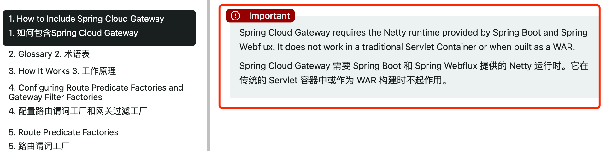
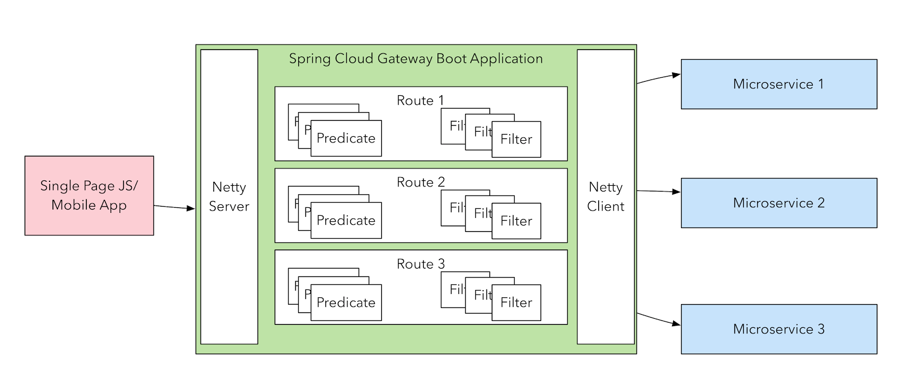
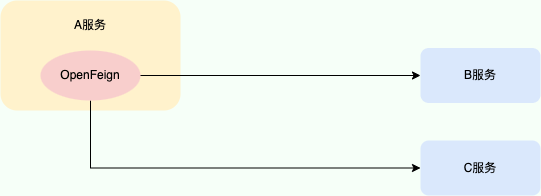
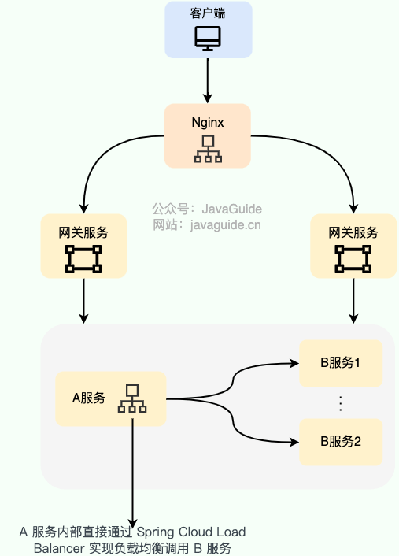
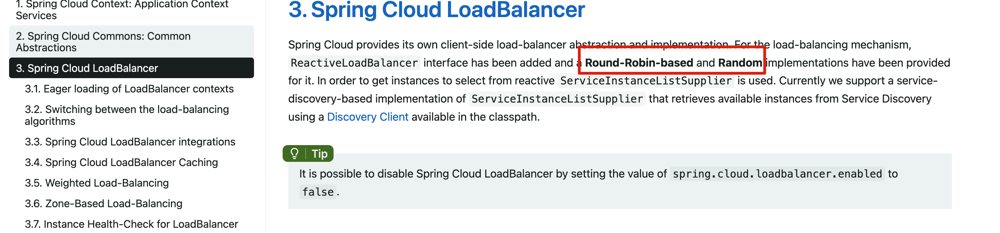
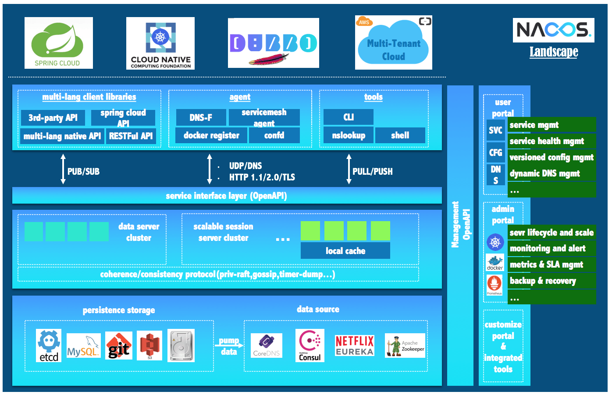

# 微服务基础：Spring Cloud Alibaba 组件有哪些？

一直有球友询问 Spring Cloud 相关的面试题总结。于是，我以 Spring Cloud Alibaba 为切入口，系统地总结了常用的组件并推荐了对应的原理以及面试常见问题总结的文章。篇幅有限，你可以参考这些优质文章进一步学习或者或者准备面试。

对于校招生来说，这些微服务组件如果你的项目用到了你就准备，没有用到并且技能介绍也没提到的话，面试就不会问的，不需要准备。社招的朋友，尽量还是要整一个微服务相关的项目。另外，如果时间比较赶的话，就重点学习这些组件常见的概念和用法即可，比如 Spring Cloud Gateway 动态路由、 Sentinel 规则持久化、Nacos 配置持久化、Nacos 共享配置等等。如果时间充足的话，尽量还是要深入到原理层面，对自己能力提升也有帮助。

下面是开始正文。

[Spring Cloud Alibaba](https://spring.io/projects/spring-cloud-alibaba) 是阿里开源的一套微服务开发组件，致力于提供微服务开发的一站式解决方案，核心组件有下面这些：：

+ Sentinel：以流量为切入点，从流量控制、熔断降级、系统负载保护等多个维度保护服务的稳定性。
+ Nacos：一个更易于构建云原生应用的动态服务发现、配置管理和服务管理平台。
+ RocketMQ：一款开源的分布式消息系统，基于高可用分布式集群技术，提供低延时的、高可靠的消息发布与订阅服务。
+ Seata：分布式事务解决方案。

除了上面这些之外，使用 Spring Cloud Alibaba 的时候一般会搭配下面这些 Spring Cloud 组件一起使用：

+ OpenFeign：轻量级 RESTful 的 HTTP 服务客户端，用于替代已经进入停更维护状态的 Feign（Netflix Feign）
+ Gateway：用于网关服务，实现请求的转发和路由。
+ Ribbon：用于客户端负载均衡，将请求分发给不同的微服务实例。

## Spring Cloud Gateway（网关）

**Spring Cloud Gateway** 是 Spring Cloud 生态系统中的网关组件，诞生的目标是为了替代传统的网关 **Zuul**，尤其是 Zuul 1.x。Zuul 2.x 旨在解决 Zuul 1.x 在高并发场景下的性能问题，但在开发过程中遇到了不少挑战，加之 Netflix 内部策略的调整，Zuul 2.x 最终被弃用。鉴于此，Spring Cloud 官方选择不再集成 Zuul 2.x，而是主推 Spring Cloud Gateway，作为现代化的网关解决方案。

Spring Cloud Gateway 构建于 **Spring WebFlux** 之上，使用 **Project Reactor** 库实现响应式编程模型。它专门设计为在 Netty 环境中运行，充分利用 Netty 的高性能非阻塞 I/O 特性。这种设计使得 Spring Cloud Gateway 能够在处理大量并发请求时保持较低的延迟和高吞吐量，但也意味着它不能在传统的 Servlet 容器中运行或作为 WAR 包部署。

实际项目中，经常有开发者在使用 Spring Cloud Gateway 时添加了其他的 Web 容器依赖（例如 Undertow），这会导致运行错误，需要格外注意！

虽然这种设计提高了系统的吞吐量和伸缩性，但并不会直接缩短单个请求的响应时间。

Spring Cloud Gateway 不仅提供统一的路由方式，并且基于 Filter 链的方式提供了网关基本的功能，例如：

+ **安全**：可以通过各种安全过滤器实现认证和授权机制，确保只有经过认证的请求才能访问后端服务。
+ **监控/指标**：通过过滤器可以收集请求的各种指标（如延迟、流量等），并将其用于监控和分析，帮助识别系统的瓶颈和性能问题。
+ **限流**：使用限流过滤器可以控制请求的频率，防止系统过载，确保服务的稳定性和可用性。
+ ......

这种基于过滤器链的设计与 Zuul 2.x 有一定的相似性，都是通过过滤器来处理请求和响应。每一个请求都会经过一系列的过滤器处理，执行完所有的过滤器后，再将请求转发到后端微服务。

Spring 官方更加推荐使用 Spring Cloud Gateway，主要原因有两点：

1. **生态集成**: Spring Cloud Gateway 作为 Spring Cloud 生态的一份子，与其他组件配合更紧密，用起来更方便。
2. **功能与配置**: Spring Cloud Gateway 提供了更丰富的功能和更灵活的配置，使用起来更强大，更能满足各种需求。

Spring Cloud Gateway 原理以及面试常见问题:

+ [Spring Cloud Gateway 常见问题总结 - JavaGuide](https://javaguide.cn/distributed-system/spring-cloud-gateway-questions.html)
+ [SpringCloud 网关组件 Gateway 原理深度解析 - 白菜说技术](https://juejin.cn/post/7185431048774221861)

## OpenFeign（服务调用）

Feign 是 Netflix 开发的，是 SpringCloud 组件中的一个轻量级 RESTful 的 HTTP 服务客户端，主要用于远程服务调用。Spring Cloud OpenFeign 是 Spring Cloud 官方基于 Feign 开发的，用于替代已经进入停更维护状态的 Feign（Netflix Feign）。`2020.0.X版本`之前，OpenFeign 底层基于 Ribbon ，很多功能的实现都依赖 Ribbon。`2020.0.X版本`开始的 OpenFeign 底层不再使用 Ribbon 了。

OpenFeign 原理以及面试常见问题:

+ [10000 字 | 深入理解 OpenFeign 的架构原理 - 悟空聊架构](https://mp.weixin.qq.com/s/7EJTSw5WGE5bYbo00nZ4jA)
+ [花一个周末，掌握 SpringCloud OpenFeign 核心原理 - 马丁玩编程](https://zhuanlan.zhihu.com/p/346273428)
+ [OpenFeign 核心知识小结](https://www.sharkchili.com/pages/dca702/)（一位球友的总结）
+ [OpenFeign 夺命连环 9 问 - 不才陈某](https://mp.weixin.qq.com/s/YJu2oN-qxtpShrmHlyrByw)

## Ribbon/LoadBalancer（负载均衡）

Ribbon 是一个客户端负载均衡框架，主要用于将请求动态地分发给不同的服务实例，以实现负载均衡和故障转移的功能。

下图是我画的一个简单的基于 Spring Cloud LoadBalancer（Ribbon 也类似） 的客户端负载均衡示意图：

关于负载均衡的详细介绍，可以阅读我写的这篇文章：[负载均衡常见问题总结](https://javaguide.cn/high-performance/load-balancing.html) 。

Ribbon 是 Spring Cloud Netflix 中的一员，目前已经停止维护。LoadBalancer 是 Spring Cloud 官方提供的负载均衡组件，可用于替代 Ribbon。LoadBalancer 的使用方式与 Ribbon 基本兼容，可以从 Ribbon 进行平滑过渡。

与 Ribbon 相比，LoadBalancer 支持响应式编程负载均衡，即结合 Spring Web Flux 使用，更适合处理高并发、高吞吐量的场景。不过，LoadBalancer 提供的负载均衡算法目前比 Ribbon 提供的要少一些，LoadBalancer 仅提供了轮询（Round-Robin-based，默认）和随机（Random）的负载策略。如下图所示，[官网](https://docs.spring.io/spring-cloud-commons/docs/current/reference/html/#spring-cloud-loadbalancer)有描述。不过，LoadBalancer 支持自定义负载均衡策略。

Ribbon 和 LoadBalancer 原理（你的项目用的那个就去看那个即可，不需要两个都掌握）：

+ [6000 字 | 深入理解 Ribbon 的架构原理](https://mp.weixin.qq.com/s/4-rh20rAlTwMmROWa-IHsw)
+ [Spring Cloud LoadBalancer 详解和基本实现](https://juejin.cn/post/7247467756245876794)

## Sentinel（限流熔断）

Sentinel 以流量为切入点，从流量控制、熔断降级、系统负载保护等多个维度保护服务的稳定性。Sentinel 可以简单的分为 Sentinel 核心库和 Dashboard。核心库不依赖 Dashboard，但是结合 Dashboard 可以取得最好的效果。

+ 核心库（Java 客户端）：不依赖任何框架/库，能够运行于 Java 8 及以上的版本的运行时环境，同时对 Dubbo / Spring Cloud 等框架也有较好的支持（见 [主流框架适配](https://sentinelguard.io/zh-cn/docs/open-source-framework-integrations.html)）。
+ 控制台（Dashboard）：Dashboard 主要负责管理推送规则、监控、管理机器信息等。

Sentinel 原理以及面试常见问题:

+ [阿里限流神器 Sentinel 夺命连环 17 问？ - 不才陈某 ](https://mp.weixin.qq.com/s/Q7Xv8cypQFrrOQhbd9BOXw)
+ [Sentinel 为什么这么强，我扒了扒背后的实现原理 - 三友的 java 日志](https://mp.weixin.qq.com/s/FewOTrevjiCfooVIVwo4Xg)

## Nacos（服务发现和配置管理）

Nacos /nɑ:kəʊs/ 是 Dynamic Naming and Configuration Service 的首字母简称，一个更易于构建云原生应用的动态服务发现、配置管理和服务管理平台。

Nacos 的命名是由 3 部分组成：

| 组成部分 | 全称 | 描述 |
| --- | --- | --- |
| Na | Naming（命名） | 表示 Nacos 是一个服务发现和注册中心 |
| co | Configuration（配置） | 表示 Nacos 具备配置管理的功能 |
| s | Service（服务） | 服务（Service）是 Nacos 世界的一等公民。Nacos 支持几乎所有主流类型的“服务”的发现、配置和管理。 |

一图看懂 Nacos：

Nacos 生态图如下，可以看出 Nacos 无缝支持一些主流的开源生态如 Spring Cloud、Dubbo、K8S 等等。

Nacos 原理以及面试常见问题:

+ [Nacos 架构&原理 - 阿里藏经阁](https://developer.aliyun.com/ebook/36)（推荐，像 Nacos 内核设计、底层原理、最佳实践）
+ [55 张图吃透 Nacos - 不才陈某](https://mp.weixin.qq.com/s/UHzew6pIl5sRtRfCgBtLMQ)（总结了 Nacos 的一些常见问题，准备面试必备）

## RocketMQ（消息队列）

RocketMQ 是阿里开源的一款云原生“消息、事件、流”实时数据处理平台，借鉴了 Kafka，已经成为 Apache 顶级项目。

RocketMQ 的核心特性（摘自 RocketMQ 官网）：

+ 云原生：生与云，长与云，无限弹性扩缩，K8s 友好
+ 高吞吐：万亿级吞吐保证，同时满足微服务与大数据场景。
+ 流处理：提供轻量、高扩展、高性能和丰富功能的流计算引擎。
+ 金融级：金融级的稳定性，广泛用于交易核心链路。
+ 架构极简：零外部依赖，Shared-nothing 架构。
+ 生态友好：无缝对接微服务、实时计算、数据湖等周边生态。

根据官网介绍：

> Apache RocketMQ 自诞生以来，因其架构简单、业务功能丰富、具备极强可扩展性等特点被众多企业开发者以及云厂商广泛采用。历经十余年的大规模场景打磨，RocketMQ 已经成为业内共识的金融级可靠业务消息首选方案，被广泛应用于互联网、大数据、移动互联网、物联网等领域的业务场景。
>

RocketMQ 原理以及面试常见问题:

+ [一文总结 MetaQ/RocketMQ 原理 - 阿里开发者](https://mp.weixin.qq.com/s/EEkjBrVYQFwBiGQObrM_TQ)
+ [RocketMQ 常见问题总结 - JavaGuide](https://javaguide.cn/high-performance/message-queue/rocketmq-questions.html)
+ [面渣逆袭：RocketMQ 二十三问 - 三分恶](https://mp.weixin.qq.com/s/IvBt3tB_IWZgPjKv5WGS4A)

## Seata（分布式事务）

Seata 是一款开源的分布式事务解决方案，致力于提供高性能和简单易用的分布式事务服务。Seata 为用户提供了 AT、TCC、SAGA 和 XA 事务模式，致力于打造一站式的分布式解决方案。如果你对分布式事务不太了解的话，推荐你看看《Java面试指北》的 [服务治理：分布式事务解决方案有哪些？](https://www.yuque.com/snailclimb/mf2z3k/ng9vmg) 这篇文章。

Seata 分 TC、TM 和 RM 三个角色，TC（Server 端）为单独服务端部署，TM 和 RM（Client 端）由业务系统集成。

推荐一些 Seata 的文章（对于面试，只需要搞懂自己用的那种事务模式即可）：

+ [Seata 系列文章 - 后端进阶](https://mp.weixin.qq.com/mp/appmsgalbum?__biz=MzU3MjQ1ODcwNQ==&action=getalbum&album_id=1337925915665399808&scene=173&from_msgid=2247490856&from_itemidx=1&count=3&nolastread=1#wechat_redirect)
+ [Seata AT 模式和 Seata 模式详解](https://mp.weixin.qq.com/mp/appmsgalbum?__biz=MzIxNzc1OTU4OA==&action=getalbum&album_id=2866218900620591109&scene=173&from_msgid=2247487108&from_itemidx=1&count=3&nolastread=1#wechat_redirect)
+ [搞懂 Seata 分布式事务 AT、TCC、SAGA、XA 模式选型 - 知识浅谈](https://cloud.tencent.com/developer/article/2160777)
+ [Seata 高可用部署实践 - Seata 官网博客](https://seata.io/zh-cn/blog/seata-ha-practice.html)

## 总结

这篇文章我以 Spring Cloud Alibaba 为切入口，系统地总结了常用的组件并推荐了对应的原理以及面试常见问题总结的文章。

除了上面推荐的文章之外，再给大家推荐一下朋友写的[SpringCloud 系列文章](https://mp.weixin.qq.com/mp/homepage?__biz=Mzg5MDczNDI0Nw==&hid=1&sn=478a1a2493093b5727ab3af7ad259beb&scene=1&devicetype=android-33&version=28002d34&lang=zh_CN&nettype=WIFI&ascene=59&session_us=gh_6c58fd613ba0)（硬核源码解析，深入原理解读）。

> 更新: 2024-08-22 11:10:42  
> 原文: <https://www.yuque.com/snailclimb/mf2z3k/pxtnw1na4h6wbkge>