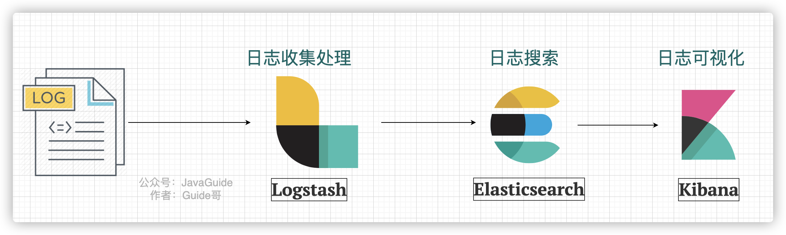
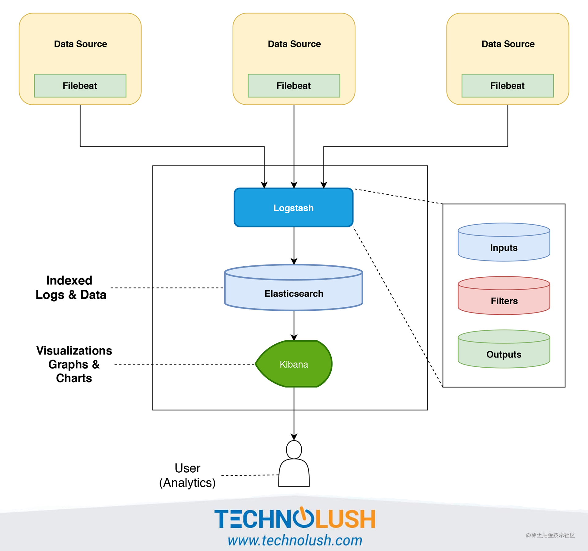
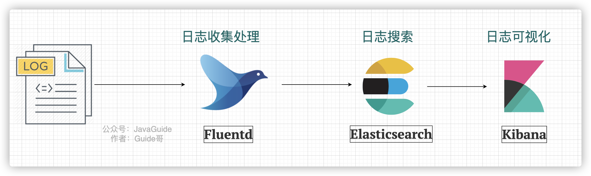
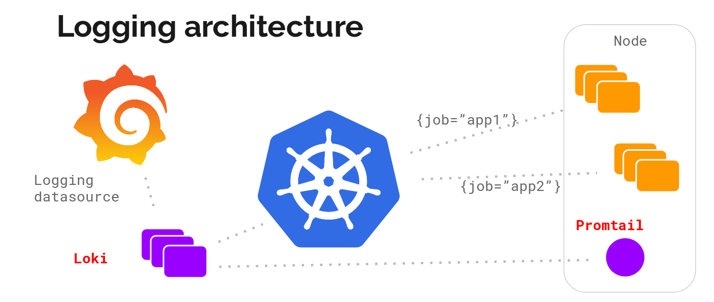

# 服务治理：分布式下如何进行日志管理？

因为日志系统在询问项目经历的时候经常会被问到，所以，我就写了这篇文章。

这是一篇日志系统常见概念的扫盲篇~不会涉及到具体架构的日志系统的搭建过程。旨在帮助对于日志系统不太了解的小伙伴，普及一些日志系统常见的概念。

关于日志系统的基础知识介绍，例如日志记录的方案、Java 日志框架，可以阅读下面这篇文章：

[日志记录方案有哪些？](https://www.yuque.com/snailclimb/mf2z3k/srwasy4ubg4htbzg)

## 为什么需要日志系统？

没有日志系统之前，我们的日志可能分布在多台服务器上。每次需要查看日志，我们都需要登录每台机器。然后，使用 `grep`、`wc` 等 Linux 命令来对日志进行搜索。这个过程是非常麻烦并且耗时的！并且，日志量不大的时候，这个速度还能忍受。当日志量比较多的时候，整个过程就是非常慢。

从上面我的描述中，你已经发现，没有对日志实现集中管理，主要给我们带来了下面这几点问题：

1. 开发人员登录线上服务器查看日志比较麻烦并且存在安全隐患
2. 日志数据比较分散，难以维护，不方便检索。
3. 日志数量比较大的时候，查询速度比较慢。
4. 无法对日志数据进行可视化展示。

**日志系统就是为了对日志实现集中管理。它也是一个系统，不过主要是负责处理日志罢了。**

## 一个最基本的日志系统要做哪些事情？

1. **采集日志** ：支持多种日志格式以及数据源的采集。
2. **日志数据清洗/处理** ：采集到的原始日志数据需要首先清洗/处理一波。
3. **存储日志** ：为了方便对清洗后的日志进行处理，我们可以对接多种存储方式比如 ElasticSearch（日志检索） 、Hadoop(离线数据分析)。
4. **展示日志** ：支持可视化地展示日志，
5. **查询和分析日志**：提供用户友好的查询接口，支持多种查询条件和统计分析，以帮助用户快速定位问题。
6. **告警** ：内置告警功能或者支持对接常见的监控系统。

我专门画了一张图，展示一下日志系统处理日志的一个基本流程。

另外，一些比较高大上的日志系统甚至还支持 **实时分析**、**离线分析** 等功能。

## ELK 了解么？

ELK 是目前使用的比较多的一个开源的日志系统解决方案，背靠是 [Elastic](https://www.elastic.co/cn/) 这家专注搜索的公司。

### ELK 老三件套

最原始的时候，ELK 是由 3 个开源项目的首字母构成，分别是 **E**lasticsearch 、**L**ogstash、**K**ibana。

下图是一个最简单的 **ELK 日志系统架构** ：

我们分别来介绍一下这些开源项目以及它们在这个日志系统中起到的作用：

+ **Logstash** ：Logstash 主要用于日志的搜集、分析和过滤，支持对多种日志类型进行处理。在 ELK 日志系统中，Logstash 负责日志的收集和清洗。
+ **Elasticsearch** ：ElasticSearch 一款使用 **Java** 语言开发的搜索引擎，基于 **Lucence **。可以解决使用数据库进行模糊搜索时存在的性能问题，提供海量数据近实时的检索体验。在 ELK 日志系统中，Elasticsearch 负责日志的搜素。
+ **Kibana** ：Kibana 是专门设计用来与 Elasticsearch 协作的，可以自定义多种表格、柱状图、饼状图、折线图对存储在 Elasticsearch 中的数据进行深入挖掘分析与可视化。 ELK 日志系统中，Logstash 主要负责对从 Elasticsearch 中搜索出来的日志进行可视化展示。

### 新一代 ELK 架构

ELK 属于比较老牌的一款日志系统解决方案，这个方案存在一个问题就是：**Logstash 对资源消耗过高**。

于是， Elastic 推出了 Beats 。Beats 基于名为[libbeat](https://github.com/elastic/beats/tree/master/libbeat)的 Go 框架，一共包含 8 位成员。

这个时候，ELK 已经不仅仅代表 **E**lasticsearch 、**L**ogstash、**K**ibana 这 3 个开源项目了。

Elastic 官方将 ELK 重命名为 **Elastic Stack**（Elasticsearch、Kibana、Beats 和 Logstash）。但是，大家目前仍然习惯将其成为 ELK 。

Elastic 的官方文档是这样描述的（由 Chrome 插件 Mate Translate 提供翻译功能）：

现在的 ELK 架构变成了这样：

Beats 采集的数据可以直接发送到 Elasticsearch 或者在 Logstash 进一步处理之后再发送到 Elasticsearch。

Beats 的诞生，也大大地扩展了老三件套版本的 ELK 的功能。Beats 组件除了能够通过 Filebeat 采集日志之外，还能通过 Metricbeat 采集服务器的各种指标，通过 Packetbeat 采集网络数据。

我们不需要将 Beats 都用上，一般对于一个基本的日志系统，只需要 **Filebeat** 就够了。

根据[Filebeat 官方介绍](https://www.elastic.co/cn/beats/filebeat)：

> Filebeat 是一个轻量型日志采集器。无论您是从安全设备、云、容器、主机还是 OT 进行数据收集，Filebeat 都将为您提供一种轻量型方法，用于转发和汇总日志与文件，让简单的事情不再繁杂。
>

Filebeat 是 Elastic Stack 的一部分，能够与 Logstash、Elasticsearch 和 Kibana 无缝协作。

Filebeat 能够轻松地将数据传送到 Logstash（对日志进行处理）、Elasticsearch（日志检索）、甚至是 Kibana （日志展示）中。

Filebeat 只是对日志进行采集，无法对日志进行处理。日志具体的处理往往还是要交给 Logstash 来做。

更多关于 Filebeat 的内容，你可以看看 [Filebeat 官方文档教程](https://www.elastic.co/guide/en/beats/filebeat/current/index.html)。

### Filebeat+Logstash+Elasticsearch+Kibana 架构概览

下图一个最基本的 Filebeat+Logstash+Elasticsearch+Kibana 架构图，图片来源于：[《The ELK Stack ( Elasticsearch, Logstash, and Kibana ) Using Filebeat》](https://www.technolush.com/blog/the-elk-stack-using-filebeat)。

Filebeat 替代 Logstash 采集日志，具体的日志处理还是由 Logstash 来做。

针对上图的日志系统架构图，有下面几个可优化点：

1. 在 Kibana 和用户之间，使用 Nginx 来做反向代理，免用户直接访问 Kibana 服务器，提高安全性。
2. Filebeat 和 Logstash 之间增加一层消息队列比如 Kafka、RabbitMQ。Filebeat 负责将收集到的数据写入消息队列，Logstash 取出数据做进一步处理。

### EFK

EFK 中的 F 代表的是 [Fluentd](https://github.com/fluent/fluentd)。下图是一个最简单的 **EFK 日志系统架构** ：

Fluentd 是一款开源的日志收集器，使用 Ruby 编写，其提供的功能和 Logstash 差不多。但是，要更加轻量，性能也更优越，内存占用也更低。具体使用教程，可以参考[《性能优越的轻量级日志收集工具，微软、亚马逊都在用！》](https://mp.weixin.qq.com/s/sXYDIJpIhPsVGNkSCIaNfQ)。

## 轻量级日志系统 Loki

上面介绍到的 ELK 日志系统方案功能丰富，稳定可靠。不过，对资源的消耗也更大，成本也更高。而且，用过 ELK 日志系统的小伙伴肯定会发现其实很多功能压根都用不上。

因此，就有了 Loki，这是一个 Grafana Labs 团队开源的小巧易用的日志系统，原生支持 Grafana。

并且，Loki 专门为 Prometheus 和 Kubernetes 用户做了相关优化比如 Loki 特别适合存储Kubernetes Pod 日志。

> 项目地址：[https://github.com/grafana/loki/](https://github.com/grafana/loki/)
>

官方的介绍也比较有意思哈！ `Like Prometheus,But For Logs.` （类似于 Prometheus 的日志系统，不过主要是为日志服务的）。

根据官网 ，Loki 的架构如下图所示

Loki 的整个架构非常简单，主要有 3 个组件组成：

+ Loki 是主服务器，负责存储日志和处理查询。
+ Promtail 是代理，负责收集日志并将其发送给 Loki 。
+ Grafana 用于 UI 展示。

Loki 提供了详细的使用文档，上手相对来说比较容易。并且，目前其流行度还是可以的。你可以很方便在网络上搜索到有关 Loki 的博文。

+ [Loki 日志系统从入门到实战](https://wsgzao.github.io/post/loki/#)
+ [Getting Started with Grafana Loki](https://geekflare.com/grafana-loki-intro/)

## ClickHouse + ClickVisual

越来越多的互联网公司开始尝试 ClickHouse 存储日志（也就是用 ClickHouse 替代 ES，类似 ClickHouse 适合用来做日志存储的 OLAP 数据库还有国产的 Apache Doris），比如哔哩哔哩、映客、快手、携程、唯品会、石墨文档。相比 ES，ClickHouse 更加节省资源， 可以无压力全量写入，虽然查询的性能相比 Elasticsearch 可能较慢，但是也能满足需求。

不过，ClickHouse 存储日志缺少对应的可视化方案，业界也有公司开源了对应的解决方案，例如石墨文档开源的 [ClickVisual](https://github.com/clickvisual/clickvisual)（一个基于 ClickHouse 构建的轻量级日志分析和数据可视化平台）。

+ [滴滴基于 Clickhouse 构建新一代日志存储系统 - 滴滴技术 - 2024](https://mp.weixin.qq.com/s/7zUYmQ2jjPNTjTKqnPcRcg)
+ [日志中心的演进：基于 Clickhouse 的建设实践 - 百递云技术团队 - 2023](https://mp.weixin.qq.com/s/AyWISy3FkQvfB8eOpA6amw)（提到了 ELK 架构的一些痛点）
+ [ClickHouse + ClickVisual 构建日志平台 - SRETalk - 2023](https://mp.weixin.qq.com/s/xst2Qyr4zATFr3OlmIKQ6g)（详细介绍了整个日志平台的搭建过程）
+ [酷家乐基于 Clickhouse 实现的调用链全保留方案实践 - 酷家乐监控技术团队 - 2023](https://juejin.cn/post/7319027307578589199)

另外，推荐看看这篇文章：[B 站基于 Clickhouse 的下一代日志体系建设实践 - 哔哩哔哩技术 - 2022](https://mp.weixin.qq.com/s/dUs7WUKUDOf9lLG6tzdk0g)（B 站初期架构也是 ELK ，后来新架构使用 ClickHouse 作为存储，自研日志可视化查询分析平台，这篇文章的后续：[持续降本：B 站日志平台 3.0 演进之路 - 哔哩哔哩技术 - 2023](https://mp.weixin.qq.com/s/tnP6hI2KwPde7PGg6QyUCw)。

ClickVisual 存在的问题：

1. **全文检索效率低**： 缺乏对原始日志的跳数索引，导致无法高效进行近似全文检索。
2. **强依赖 Kafka**：对于某些中小用户而言方案不够灵活，不友好。而且，完全依赖 Kafka 表引擎摄入日志，导致无法直接对已有日志表进行高效的列式查询，且 Kafka 读写速度不可控，容易造成 ClickHouse 内存爆满。

APO 通过以下改进解决了 ClickVisual 的不足：

+ **使用 Vector 替代 Kafka 引擎：** 提高了日志摄入的灵活性和稳定性，降低了运维成本，并支持流量控制，避免 ClickHouse 内存爆满。不过，也保留了对 Kafka 的支持，可以使用 Vector 先将原始日志写入 Kafka，然后使用 Vector 从 Kafka 读取出来，继续实现后续的日志处理。
+ **引入 Null 表引擎：** 实现原始日志(从Vector写入的) 转换成按照日志解析格式解析之后的真实日志表。
+ **支持高效全文检索：** 在真实日志表中存储原始日志并构建跳数索引，实现了高效的近似全文检索。

## 总结

这篇文章我主要介绍了日志系统相关的知识，包括日志和日志系统基础知识、Java 日志框架扫盲以及日志系统解决方案。

## 参考

1. ELK 架构和 Filebeat 工作原理详解：[https://developer.ibm.com/zh/articles/os-cn-elk-filebeat/](https://developer.ibm.com/zh/articles/os-cn-elk-filebeat/)
2. ELK Introduction-elastic 官方 ：[https://elastic-stack.readthedocs.io/en/latest/introduction.html](https://elastic-stack.readthedocs.io/en/latest/introduction.html)
3. ELK Stack Tutorial: Learn Elasticsearch, Logstash, and Kibana ：[https://www.guru99.com/elk-stack-tutorial.html](https://www.guru99.com/elk-stack-tutorial.html)

> 更新: 2024-10-16 15:04:40  
> 原文: <https://www.yuque.com/snailclimb/mf2z3k/ma1byh>