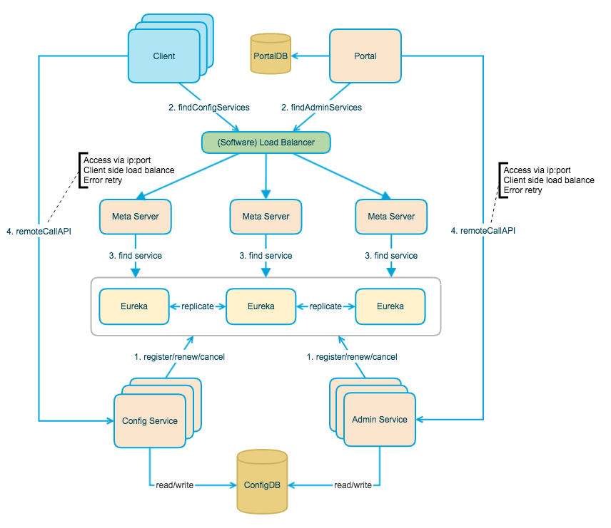

# 服务治理：分布式下如何进行配置管理？

## 为什么要用配置中心？


微服务下，业务的发展一般会导致服务数量的增加，进而导致程序配置（服务地址、数据库参数等等）增多。传统的配置文件的方式已经无法满足当前需求，主要有下面几点原因：


+ 安全性得不到保障：配置放在代码库中容易泄露。
+ 时效性不行：修改配置需要重启服务才能生效。
+ 不支持权限控制 ：没有对配置的修改、发布等操作进行严格的权限控制。
+ 不支持配置集中管理 ： 配置文件过于分散，不方便管理。
+ ......


另外，配置中心通常会自带版本跟踪，会记录配置的修改记录，记录的内容包括修改人、修改时间、修改内容等等。


虽然通过 Git 版本管理我们也能追溯配置的修改记录，但是配置中心提供的配置版本管理功能更全面。并且，配置中心通常会在配置版本管理的基础上支持配置一键回滚。


一些功能更全面的配置中心比如`Apollo`甚至还支持灰度发布。


## 常见的配置中心有哪些？


[Spring Cloud Config](https://cloud.spring.io/spring-cloud-config/reference/html/)、[Nacos](https://github.com/alibaba/nacos) 、[Apollo](https://github.com/apolloconfig/apollo)、K8s ConfigMap 、[Disconf](https://github.com/knightliao/disconf) 、[Qconf](https://github.com/Qihoo360/QConf) 都可以用来做配置中心。


Disconf 和 Qconf 已经没有维护，生态也并不活跃，并不建议使用，在做配置中心技术选型的时候可以跳过。


如果你的技术选型是 Kubernetes 的话，可以考虑使用 K8s ConfigMap 来作为配置中心。


Apollo 和 Nacos 我个人更喜欢，两者都是国内公司开源的知名项目，项目社区都比较活跃且都还在维护中。Nacos 是阿里开源的，Apollo 是携程开源的。Nacos 使用起来比较简单，并且还可以直接用来做服务发现及管理。Apollo 只能用来做配置管理，使用相对复杂一些。


如果你的项目仅仅需要配置中心的话，建议使用 Apollo 。如果你的项目需要配置中心的同时还需要服务发现及管理的话，那就更建议使用 Nacos。


Spring Cloud Config 属于 Spring Cloud 生态组件，可以和 Spring Cloud 体系无缝整合。由于基于 Git 存储配置，因此 Spring Cloud Config 的整体设计很简单。


## Apollo vs Nacos vs Spring Cloud Config
| 功能点 | Apollo | Nacos | Spring Cloud Config |
| :--- | :--- | :--- | --- |
| 配置界面 | 支持 | 支持 | 无（需要通过 Git 操作） |
| 配置实时生效 | 支持(HTTP 长轮询 1s 内) | 支持(HTTP 长轮询 1s 内) | 重启生效，或手动 refresh 生效 |
| 版本管理 | 支持 | 支持 | 支持（依赖 Git） |
| 权限管理 | 支持 | 支持 | 支持（依赖 Git） |
| 灰度发布 | 支持 | 支持（Nacos 1.1.0 版本开始支持灰度配置） | 不支持 |
| 配置回滚 | 支持 | 支持 | 支持（依赖 Git） |
| 告警通知 | 支持 | 支持 | 不支持 |
| 多语言 | 主流语言，Open API | 主流语言，Open API | 只支持 Spring 应用 |
| 多环境 | 支持 | 支持 | 不支持 |
| 监听查询 | 支持 | 支持 | 支持 |


Apollo 和 Nacos 提供了更多开箱即用的功能，更适合用来作为配置中心。


Nacos 使用起来比较简单，并且还可以直接用来做服务发现及管理。Apollo 只能用来做配置管理，使用相对复杂一些。


Apollo 在配置管理方面做的更加全面，就比如说虽然 Nacos 在 1.1.0 版本开始支持灰度配置，但 Nacos 的灰度配置功能实现的比较简单，Apollo 实现的灰度配置功能就相对更完善一些。不过，Nacos 提供的配置中心功能已经可以满足绝大部分项目的需求了。


## 一个完备配置中心需要具备哪些功能？


如果我们需要自己设计一个配置中心的话，需要考虑哪些东西呢？


简单说说我的看法：


+ **权限控制** ：配置的修改、发布等操作需要严格的权限控制。
+ **日志记录** ： 配置的修改、发布等操需要记录完整的日志，便于后期排查问题。
+ **配置推送** ： 推送模式通常由两种： 
    - 推 ：实时性变更，配置更新后推送给应用。需要应用和配置中心保持长连接，复杂度高。
    - 拉 ：实时性较差，应用隔一段时间手动拉取配置。
    - 推拉结合
+ **灰度发布** ：支持配置只推给部分应用。
+ **易操作** ： 提供 Web 界面方便配置修改和发布。
+ **版本跟踪** ：所有的配置发布都有版本概念，从而可以方便的支持配置的回滚。
+ **支持配置回滚** ： 我们一键回滚配置到指定的位置，这个需要和版本跟踪结合使用。
+ ......


## 以 Apollo 为例介绍配置中心的设计


### Apollo 介绍


根据 Apollo 官方介绍：


> [Apollo](https://github.com/ctripcorp/apollo)（阿波罗）是携程框架部门研发的分布式配置中心，能够集中化管理应用不同环境、不同集群的配置，配置修改后能够实时推送到应用端，并且具备规范的权限、流程治理等特性，适用于微服务配置管理场景。
>
>  
>
> 服务端基于 Spring Boot 和 Spring Cloud 开发，打包后可以直接运行，不需要额外安装 Tomcat 等应用容器。
>
>  
>
> Java 客户端不依赖任何框架，能够运行于所有 Java 运行时环境，同时对 Spring/Spring Boot 环境也有较好的支持。
>


Apollo 特性：


+ **配置修改实时生效（热发布）** （1s 即可接收到最新配置）
+ **灰度发布** （配置只推给部分应用）
+ **部署简单** （只依赖 MySQL）
+ **跨语言** （提供了 HTTP 接口，不限制编程语言）
+ ......


关于如何使用 Apollo 可以查看 [Apollo 官方使用指南](https://www.apolloconfig.com/#/zh/)。


相关阅读：


+ [Apollo 在有赞的实践](https://mp.weixin.qq.com/s/Ge14UeY9Gm2Hrk--E47eJQ)
+ [分布式配置中心选型，为什么选择 Apollo？—微观技术-2021-04-23](https://mp.weixin.qq.com/s?__biz=Mzg2NzYyNjQzNg==&mid=2247484920&idx=1&sn=76d91ce217bf508aa2ee7156e1ba0994&source=41#wechat_redirect)


### Apollo 架构解析


官方给出的 Apollo 基础模型非常简单：


1. 用户通过 Apollo 配置中心修改/发布配置，
2. Apollo 配置中心通知应用配置已经更改
3. 应用访问 Apollo 配置中心获取最新的配置


官方给出的架构图如下：





+ **Client 端（客户端，用于应用获取配置）流程** ：Client 通过域名走 slb（软件负载均衡）访问 Meta Server，Meta Server 访问 Eureka 服务注册中心获取 Config Service 服务列表（IP+Port）。有了 IP+Port，我们就能访问 Config Service 暴露的服务比如通过 GET 请求获取配置的接口（`/configs/{appId}/{clusterName}/{namespace:.+}`）即可获取配置。
+ **Portal 端（UI 界面，用于可视化配置管理）流程** ：Portal 端通过域名走 slb（软件负载均衡）访问 Meta Server，Meta Server 访问 Eureka 服务注册中心获取 Admin Service 服务列表（IP+Port）。有了 IP+Port，我们就能访问 Admin Service 暴露的服务比如通过 POST 请求访问发布配置的接口（`/apps/{appId}/envs/{env}/clusters/{clusterName}/namespaces/{namespaceName}/releases`）即可发布配置。


另外，杨波老师的[微服务架构~携程 Apollo 配置中心架构剖析](https://mp.weixin.qq.com/s/-hUaQPzfsl9Lm3IqQW3VDQ)这篇文章对 Apollo 的架构做了简化，值得一看。


我会从上到下依次介绍架构图中涉及到的所有角色的作用。


#### Client


Apollo 官方提供的客户端，目前有 Java 和.Net 版本。非 Java 和.Net 应用可以通过调用 HTTP 接口来使用 Apollo。


Client 的作用主要就是提供一些开箱即用的方法方便应用获取以及实时更新配置。


比如你通过下面的几行代码就能获取到 `someKey` 对应的实时最新的配置值：


```java
Config config = ConfigService.getAppConfig();
String someKey = "someKeyFromDefaultNamespace";
String someDefaultValue = "someDefaultValueForTheKey";
String value = config.getProperty(someKey, someDefaultValue);
```


再比如你通过下面的代码就能监听配置变化：


```java
Config config = ConfigService.getAppConfig();
config.addChangeListener(new ConfigChangeListener() {
    @Override
    public void onChange(ConfigChangeEvent changeEvent) {
       //......
    }
});
```


#### Portal


Portal 实际就是一个帮助我们修改和发布配置的 UI 界面。


#### （Software） Load Balancer


为了实现 MetaServer 的高可用，MetaServer 通常以集群的形式部署。


Client/Portal 直接访问 （Software） Load Balancer ，然后，再由其进行负载均衡和流量转发。


#### Meta Server


为了实现跨语言使用，通常的做法就是暴露 HTTP 接口。为此，Apollo 引入了 MetaServer。


Meta Server 其实就是 Eureka 的 Proxy，作用就是将 Eureka 的服务发现接口以 HTTP 接口的形式暴露出来。 这样的话，我们通过 HTTP 请求就可以访问到 Config Service 和 AdminService。


通常情况下，我们都是建议基于 Meta Server 机制来实现 Config Service 的服务发现，这样可以实现 Config Service 的高可用。不过， 你也可以选择跳过 MetaServer，直接指定 Config Service 地址（apollo-client 0.11.0 及以上版本）。


#### Config Service


主要用于 Client 对配置的获取以及实时更新。


#### Admin Service


主要用于 Portal 对配置的更新。


## 参考


+ Nacos 1.2.0 权限控制介绍和使用：[https://nacos.io/zh-cn/blog/nacos 1.2.0 guide.html](https://nacos.io/zh-cn/blog/nacos%201.2.0%20guide.html)
+ Nacos 1.1.0 发布，支持灰度配置和地址服务器模式：[https://nacos.io/zh-cn/blog/nacos 1.1.0.html](https://nacos.io/zh-cn/blog/nacos%201.1.0.html)
+ Apollo 常见问题解答：[https://www.apolloconfig.com/#/zh/faq/faq](https://www.apolloconfig.com/#/zh/faq/faq)
+ 微服务配置中心选型比较：[https://www.itshangxp.com/spring-cloud/spring-cloud-config-center/](https://www.itshangxp.com/spring-cloud/spring-cloud-config-center/)


> 更新: 2024-05-24 17:58:44  
> 原文: <https://www.yuque.com/snailclimb/mf2z3k/kptwkp>