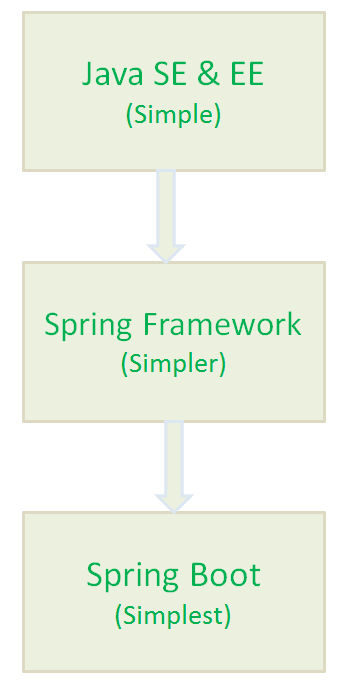

# SpringBoot 常见面试题总结

市面上关于 Spring Boot 的面试题抄来抄去，毫无价值可言。


这篇文章，我会简单就自己这几年使用 Spring Boot 的一些经验，总结一些常见的面试题供小伙伴们自测和学习。少部分关于 Spring/Spring Boot 的介绍参考了官网，其他皆为原创。


### 1. 简单介绍一下 Spring?有啥缺点?


Spring 是重量级企业开发框架 **Enterprise JavaBean（EJB）** 的替代品，Spring 为企业级 Java 开发提供了一种相对简单的方法，通过 **依赖注入** 和 **面向切面编程** ，用简单的 **Java 对象（Plain Old Java Object，POJO）** 实现了 EJB 的功能


**虽然 Spring 的组件代码是轻量级的，但它的配置却是重量级的（需要大量 XML 配置）** 。


为此，Spring 2.5 引入了基于注解的组件扫描，这消除了大量针对应用程序自身组件的显式 XML 配置。Spring 3.0 引入了基于 Java 的配置，这是一种类型安全的可重构配置方式，可以代替 XML。


尽管如此，我们依旧没能逃脱配置的魔爪。开启某些 Spring 特性时，比如事务管理和 Spring MVC，还是需要用 XML 或 Java 进行显式配置。启用第三方库时也需要显式配置，比如基于 Thymeleaf 的 Web 视图。配置 Servlet 和过滤器（比如 Spring 的`DispatcherServlet`）同样需要在 web.xml 或 Servlet 初始化代码里进行显式配置。组件扫描减少了配置量，Java 配置让它看上去简洁不少，但 Spring 还是需要不少配置。


光配置这些 XML 文件都够我们头疼的了，占用了我们大部分时间和精力。除此之外，相关库的依赖非常让人头疼，不同库之间的版本冲突也非常常见。


### 2. 为什么要有 SpringBoot?


Spring Boot 的诞生是为了简化 Spring 应用的开发和部署过程，让开发者更专注于业务逻辑的实现。





### 3. 说出使用 Spring Boot 的主要优点


1. **提高生产力**：Spring Boot 的自动配置和开箱即用的功能，显著减少了手动配置和样板代码的编写时间，使得开发者能够更快速地构建和交付应用程序。
2. **与 Spring 生态系统的无缝集成**：Spring Boot 可以轻松集成 Spring 的各个模块（如 Spring JDBC、Spring ORM、Spring Data、Spring Security 等），简化了与这些工具的整合过程，增强了开发者的工作效率。
3. **减少手动配置**：Spring Boot 提供了合理的默认配置，开发者可以在大多数情况下直接使用这些默认配置来启动项目。当然，这些默认配置也可以根据项目需求进行修改。
4. **嵌入式服务器**：Spring Boot 自带内嵌的 HTTP 服务器（如 Tomcat、Jetty），开发者可以像运行普通 Java 程序一样运行 Spring Boot 应用程序，极大地简化了开发和测试过程。
5. **适合微服务架构**：Spring Boot 使得每个微服务都可以独立运行和部署，简化了微服务的开发、测试和运维工作，成为构建微服务架构的理想选择。
6. **多种插件支持**：Spring Boot 提供了多种插件，可以使用内置工具(如 Maven 和 Gradle)开发和测试 Spring Boot 应用程序。


### 4. 什么是 Spring Boot Starters?


这是 Spring Boot 官方对 Spring Boot Starters 的介绍：


> Spring Boot Starters are a set of convenient dependency descriptors that you can include in your application. You get a one-stop-shop for all the Spring and related technology that you need without having to hunt through sample code and copy paste loads of dependency descriptors. 
>
> 
>
> Spring Boot Starters 是一组便捷的依赖描述符（dependency descriptors），你可以将它们直接包含到你的应用程序中。通过使用这些 Starters，你可以一次性获取所有与 Spring 及相关技术搭配使用的所需依赖，而无需费力地在示例代码中寻找或复制粘贴大量的依赖描述符。
>


Spring Boot Starters 是一组便捷的依赖描述符，它们预先打包了常用的库和配置。当我们开发 Spring 应用时，只需添加一个 Starter 依赖项，即可自动引入所有必要的库和配置，而无需手动逐一添加和配置相关依赖。


这种机制显著简化了开发过程，特别是在处理复杂项目时尤为高效。通过添加一个简单的 Starter 依赖，开发者可以快速集成所需的功能，避免了手动管理多个依赖的繁琐和潜在错误。这不仅节省了时间，还减少了配置错误的风险，从而提升了开发效率。


**举个例子：** 在没有 Spring Boot Starters 之前，开发一个 RESTful 服务或 Web 应用程序通常需要手动添加多个依赖，比如 Spring MVC、Tomcat、Jackson 等。这不仅繁琐，还容易导致版本不兼容的问题。而有了 Spring Boot Starters，我们只需添加一个依赖，如 `spring-boot-starter-web`，即可包含所有开发 REST 服务所需的库和依赖。


```xml
<dependency>
    <groupId>org.springframework.boot</groupId>

    <artifactId>spring-boot-starter-web</artifactId>

</dependency>

```


这个 `spring-boot-starter-web` 依赖包含了 Spring MVC（用于处理 Web 请求）、Tomcat（默认嵌入式服务器）、Jackson（用于 JSON 处理）等依赖项。这种方式极大地简化了开发过程，让我们可以更加专注于业务逻辑的实现。


以下是一些常见的 Spring Boot Starter 及其用途：


1. `spring-boot-starter`：基础的 Starter，包含了启动 Spring 应用所需的核心依赖，如 Spring 框架本身和日志系统（默认使用 SLF4J 和 Logback）。
2. `spring-boot-starter-web`：用于构建 Web 应用程序，包括 RESTful 服务。它包含了 Spring MVC、Tomcat（默认嵌入式服务器）、Jackson 等依赖。
3. `spring-boot-starter-data-jpa`：用于构建 JPA 应用程序，包含 Spring Data JPA 和 Hibernate。它简化了数据库访问层的开发，提供了对关系型数据库的便捷操作。
4. `spring-boot-starter-security`：用于集成 Spring Security，提供身份验证和授权功能，帮助开发者快速实现安全机制。
5. `spring-boot-starter-test`：提供测试所需的依赖，包含了 JUnit、Mockito、Spring Test 等库，帮助开发者编写单元测试、集成测试和 Mock 测试。
6. `spring-boot-starter-actuator`：可以监控应用程序的运行状态，还可以收集应用程序的各种指标信息。
7. `spring-boot-starter-aop`：提供对面向切面编程（AOP）的支持，包含 Spring AOP 和 AspectJ。
8. `spring-boot-starter-validation`：集成了 Hibernate Validator，用于实现 Java Bean 的校验机制，通常与 Spring MVC 或 Spring Data 一起使用。
9. ......


### 5. Spring Boot 支持哪些内嵌 Servlet 容器？如何选择？


Spring Boot 提供了三种 Web 容器，分别为 **Tomcat**、**Jetty** 和 **Undertow** 。在 Spring Boot 项目中，我们可以灵活地选择不同的嵌入式 Servlet 容器来提供 HTTP 服务。默认情况下，Spring Boot 使用 Tomcat 作为嵌入式服务器，但我们也可以根据项目需求选择其他容器，如 Undertow 和 Jetty。


1. **Tomcat**：适用于大多数常规 Web 应用程序和 RESTful 服务，易于使用和配置，但在高并发场景下确实可能不如 Undertow 表现出色。
2. **Undertow**：Undertow 具有极低的启动时间和资源占用，支持非阻塞 IO（NIO），在高并发场景下表现出色，性能优于 Tomcat。
3. **Jetty**：如果应用程序涉及即时通信、聊天系统或其他需要保持长连接的场景，Jetty 是一个更好的选择。它在处理长连接和 WebSocket 时表现优越。另外。Jetty 在性能和内存使用方面通常优于 Tomcat，虽然在极端高并发场景中可能略逊于 Undertow。


### 6. 如何在 Spring Boot 应用程序中使用 Jetty 而不是 Tomcat?


Spring Boot （`spring-boot-starter-web`）使用 Tomcat 作为默认的嵌入式 servlet 容器, 如果你想使用 Jetty 的话只需要修改`pom.xml`(Maven)或者`build.gradle`(Gradle)就可以了。


**Maven:**


```xml
<!--从Web启动器依赖中排除Tomcat-->
<dependency>
	<groupId>org.springframework.boot</groupId>
	<artifactId>spring-boot-starter-web</artifactId>
	<exclusions>
		<exclusion>
			<groupId>org.springframework.boot</groupId>
			<artifactId>spring-boot-starter-tomcat</artifactId>
		</exclusion>
	</exclusions>
</dependency>
<!--添加Jetty依赖-->
<dependency>
	<groupId>org.springframework.boot</groupId>
	<artifactId>spring-boot-starter-jetty</artifactId>
</dependency>
```


**Gradle:**


```groovy
compile("org.springframework.boot:spring-boot-starter-web") {
     exclude group: 'org.springframework.boot', module: 'spring-boot-starter-tomcat'
}
compile("org.springframework.boot:spring-boot-starter-jetty")
```


说个题外话，从上面可以看出使用 Gradle 更加简洁明了，但是国内目前还是 Maven 使用的多一点，我个人觉得 Gradle 在很多方面都要好很多。


### 7. 介绍一下@SpringBootApplication 注解


```java
package org.springframework.boot.autoconfigure;
@Target(ElementType.TYPE)
@Retention(RetentionPolicy.RUNTIME)
@Documented
@Inherited
@SpringBootConfiguration
@EnableAutoConfiguration
@ComponentScan(excludeFilters = {
		@Filter(type = FilterType.CUSTOM, classes = TypeExcludeFilter.class),
		@Filter(type = FilterType.CUSTOM, classes = AutoConfigurationExcludeFilter.class) })
public @interface SpringBootApplication {
   ......
}
```


```java
package org.springframework.boot;
@Target(ElementType.TYPE)
@Retention(RetentionPolicy.RUNTIME)
@Documented
@Configuration
public @interface SpringBootConfiguration {

}
```


可以看出大概可以把 `@SpringBootApplication`看作是 `@Configuration`、`@EnableAutoConfiguration`、`@ComponentScan` 注解的集合。根据 SpringBoot 官网，这三个注解的作用分别是：


+ `@EnableAutoConfiguration`：启用 SpringBoot 的自动配置机制
+ `@ComponentScan`： 扫描被`@Component` (`@Service`,`@Controller`)注解的 bean，注解默认会扫描该类所在的包下所有的类。
+ `@Configuration`：允许在上下文中注册额外的 bean 或导入其他配置类


### 8. Spring Boot 的自动配置是如何实现的?


Spring Boot 的自动配置机制是通过 `@SpringBootApplication` 注解启动的，这个注解本质上是几个关键注解的组合。我们可以将 `@SpringBootApplication` 看作是 `@Configuration`、`@EnableAutoConfiguration` 和 `@ComponentScan` 注解的集合。


+ `@EnableAutoConfiguration`: 启用 Spring Boot 的自动配置机制。它是自动配置的核心，允许 Spring Boot 根据项目的依赖和配置自动配置 Spring 应用的各个部分。
+ `@ComponentScan`: 启用组件扫描，扫描被 `@Component`（以及 `@Service`、`@Controller` 等）注解的类，并将这些类注册为 Spring 容器中的 Bean。默认情况下，它会扫描该类所在包及其子包下的所有类。
+ `@Configuration`: 允许在上下文中注册额外的 Bean 或导入其他配置类。它相当于一个具有 `@Bean` 方法的 Spring 配置类。


`@EnableAutoConfiguration`是启动自动配置的关键，源码如下(建议自己打断点调试，走一遍基本的流程)：


```java
import java.lang.annotation.Documented;
import java.lang.annotation.ElementType;
import java.lang.annotation.Inherited;
import java.lang.annotation.Retention;
import java.lang.annotation.RetentionPolicy;
import java.lang.annotation.Target;
import org.springframework.context.annotation.Import;

@Target({ElementType.TYPE})
@Retention(RetentionPolicy.RUNTIME)
@Documented
@Inherited
@AutoConfigurationPackage
@Import({AutoConfigurationImportSelector.class})
public @interface EnableAutoConfiguration {
    String ENABLED_OVERRIDE_PROPERTY = "spring.boot.enableautoconfiguration";

    Class<?>[] exclude() default {};

    String[] excludeName() default {};
}
```


这个注解通过 `@Import` 导入了 `AutoConfigurationImportSelector` 类，而 `AutoConfigurationImportSelector` 是自动配置的核心类之一。`@Import` 注解的作用是将指定的配置类或 Bean 导入到当前的配置类中。


`AutoConfigurationImportSelector` 类的 `getCandidateConfigurations` 方法会加载所有可用的自动配置类，并将这些类的信息以 `List` 的形式返回。这些配置类会被 Spring 容器管理为 Bean，从而实现自动配置。


```java
    protected List<String> getCandidateConfigurations(AnnotationMetadata metadata, AnnotationAttributes attributes) {
        List<String> configurations = SpringFactoriesLoader.loadFactoryNames(getSpringFactoriesLoaderFactoryClass(),
                getBeanClassLoader());
        Assert.notEmpty(configurations, "No auto configuration classes found in META-INF/spring.factories. If you "
                + "are using a custom packaging, make sure that file is correct.");
        return configurations;
    }
```


这里使用了 `SpringFactoriesLoader` 来加载位于 `META-INF/spring.factories` 文件中的自动配置类。这些配置类会根据应用的具体条件（例如类路径中的依赖）自动配置相应的组件。

**自动配置信息有了，那么自动配置还差什么呢？**

****

`@Conditional` 注解！在自动配置类中，Spring Boot 使用了一系列条件注解（如 `@Conditional`、`@ConditionalOnClass`、`@ConditionalOnBean` 等）来判断某些配置是否应该生效。这些注解是 `@Conditional` 注解的扩展，用于在特定条件满足时才启用相应的配置。


例如，在 Spring Security 的自动配置中，有一个名为 `SecurityAutoConfiguration` 的自动配置类，它导入了 `WebSecurityEnablerConfiguration` 类。

`WebSecurityEnablerConfiguration` 类的源码如下：


```java
@Configuration
@ConditionalOnBean(WebSecurityConfigurerAdapter.class)
@ConditionalOnMissingBean(name = BeanIds.SPRING_SECURITY_FILTER_CHAIN)
@ConditionalOnWebApplication(type = ConditionalOnWebApplication.Type.SERVLET)
@EnableWebSecurity
public class WebSecurityEnablerConfiguration {

}
```


`WebSecurityEnablerConfiguration`类中使用`@ConditionalOnBean`指定了容器中必须还有`WebSecurityConfigurerAdapter` 类或其实现类。所以，一般情况下 Spring Security 配置类都会去实现 `WebSecurityConfigurerAdapter`，这样自动将配置就完成了。


最后，简单总结一下：Spring Boot 的自动配置机制通过 `@EnableAutoConfiguration` 启动。该注解利用 `@Import` 注解导入了 `AutoConfigurationImportSelector` 类，而 `AutoConfigurationImportSelector` 类则负责加载并管理所有的自动配置类。这些自动配置类通常在`META-INF/spring.factories` 文件中声明，并根据项目的依赖和配置条件，通过条件注解（如 `@ConditionalOnClass`、`@ConditionalOnBean` 等）判断是否应该生效。


⭐自动配置是详细的源码解读可以参考 [JavaGuide](https://javaguide.cn/) 上这篇文章：[SpringBoot 自动装配原理详解](https://javaguide.cn/system-design/framework/spring/spring-boot-auto-assembly-principles.html)。


### 9. 开发 RESTful Web 服务常用的注解有哪些？


**Spring Bean 相关：**


+ `@Autowired` : 自动导入对象到类中，被注入进的类同样要被 Spring 容器管理。
+ `@RestController` : `@RestController`注解是`@Controller和`@`ResponseBody`的合集,表示这是个控制器 bean,并且是将函数的返回值直 接填入 HTTP 响应体中,是 REST 风格的控制器。
+ `@Component` ：通用的注解，可标注任意类为 `Spring` 组件。如果一个 Bean 不知道属于哪个层，可以使用`@Component` 注解标注。
+ `@Repository` : 对应持久层即 Dao 层，主要用于数据库相关操作。
+ `@Service` : 对应服务层，主要涉及一些复杂的逻辑，需要用到 Dao 层。
+ `@Controller` : 对应 Spring MVC 控制层，主要用于接受用户请求并调用 Service 层返回数据给前端页面。


**处理常见的 HTTP 请求类型：**


+ `@GetMapping` : GET 请求、
+ `@PostMapping` : POST 请求。
+ `@PutMapping` : PUT 请求。
+ `@DeleteMapping` : DELETE 请求。


**前后端传值：**


+ `@RequestParam`以及`@Pathvariable`：`@PathVariable`用于获取路径参数，`@RequestParam`用于获取查询参数。
+ `@RequestBody` ：用于读取 Request 请求（可能是 POST,PUT,DELETE,GET 请求）的 body 部分并且 Content-Type 为 `application/json` 格式的数据，接收到数据之后会自动将数据绑定到 Java 对象上去。系统会使用`HttpMessageConverter`或者自定义的`HttpMessageConverter`将请求的 body 中的 json 字符串转换为 Java 对象。


详细介绍可以查看这篇文章：[《Spring/Spring Boot 常用注解总结》](https://javaguide.cn/system-design/framework/spring/spring-common-annotations.html) 。


### 10. Spirng Boot 常用的两种配置文件


我们可以通过 `application.properties`或者 `application.yml` 对 Spring Boot 程序进行简单的配置。如果，你不进行配置的话，就是使用的默认配置。


### 11. 什么是 YAML？YAML 配置的优势在哪里 ?


YAML 是一种人类可读的数据序列化语言。它通常用于配置文件。与属性文件相比，如果我们想要在配置文件中添加复杂的属性，YAML 文件就更加结构化，而且更少混淆。可以看出 YAML 具有分层配置数据。


相比于 Properties 配置的方式，YAML 配置的方式更加直观清晰，简介明了，有层次感。


但是，YAML 配置的方式有一个缺点，那就是不支持 `@PropertySource` 注解导入自定义的 YAML 配置。


### 12. Spring Boot 常用的读取配置文件的方法有哪些？


我们要读取的配置文件`application.yml` 内容如下：


```yaml
wuhan2020: 2020年初武汉爆发了新型冠状病毒，疫情严重，但是，我相信一切都会过去！武汉加油！中国加油！

my-profile:
  name: Guide哥
  email: koushuangbwcx@163.com

library:
  location: 湖北武汉加油中国加油
  books:
    - name: 天才基本法
      description: 二十二岁的林朝夕在父亲确诊阿尔茨海默病这天，得知自己暗恋多年的校园男神裴之即将出国深造的消息——对方考取的学校，恰是父亲当年为她放弃的那所。
    - name: 时间的秩序
      description: 为什么我们记得过去，而非未来？时间“流逝”意味着什么？是我们存在于时间之内，还是时间存在于我们之中？卡洛·罗韦利用诗意的文字，邀请我们思考这一亘古难题——时间的本质。
    - name: 了不起的我
      description: 如何养成一个新习惯？如何让心智变得更成熟？如何拥有高质量的关系？ 如何走出人生的艰难时刻？
```


#### 12.1. 通过 `@value` 读取比较简单的配置信息


使用 `@Value("${property}")` 读取比较简单的配置信息：


```java
@Value("${wuhan2020}")
String wuhan2020;
```


> **需要注意的是 **`**@value**`**这种方式是不被推荐的，Spring 比较建议的是下面几种读取配置信息的方式。**
>


#### 12.2. 通过`@ConfigurationProperties`读取并与 bean 绑定


> `**LibraryProperties**`** 类上加了 **`**@Component**`** 注解，我们可以像使用普通 bean 一样将其注入到类中使用。**
>


```java

import lombok.Getter;
import lombok.Setter;
import lombok.ToString;
import org.springframework.boot.context.properties.ConfigurationProperties;
import org.springframework.context.annotation.Configuration;
import org.springframework.stereotype.Component;

import java.util.List;

@Component
@ConfigurationProperties(prefix = "library")
@Setter
@Getter
@ToString
class LibraryProperties {
    private String location;
    private List<Book> books;

    @Setter
    @Getter
    @ToString
    static class Book {
        String name;
        String description;
    }
}
```


这个时候你就可以像使用普通 bean 一样，将其注入到类中使用：


```java
package cn.javaguide.readconfigproperties;

import org.springframework.beans.factory.InitializingBean;
import org.springframework.boot.SpringApplication;
import org.springframework.boot.autoconfigure.SpringBootApplication;

/**
 * @author shuang.kou
 */
@SpringBootApplication
public class ReadConfigPropertiesApplication implements InitializingBean {

    private final LibraryProperties library;

    public ReadConfigPropertiesApplication(LibraryProperties library) {
        this.library = library;
    }

    public static void main(String[] args) {
        SpringApplication.run(ReadConfigPropertiesApplication.class, args);
    }

    @Override
    public void afterPropertiesSet() {
        System.out.println(library.getLocation());
        System.out.println(library.getBooks());    }
}
```


控制台输出：


```plain
湖北武汉加油中国加油
[LibraryProperties.Book(name=天才基本法, description........]
```


#### 12.3. 通过`@ConfigurationProperties`读取并校验


我们先将`application.yml`修改为如下内容，明显看出这不是一个正确的 email 格式：


```yaml
my-profile:
  name: Guide哥
  email: koushuangbwcx@
```


> `**ProfileProperties**`** 类没有加 **`**@Component**`** 注解。我们在我们要使用**`**ProfileProperties**`** 的地方使用**`**@EnableConfigurationProperties**`**注册我们的配置 bean：**
>


```java
import lombok.Getter;
import lombok.Setter;
import lombok.ToString;
import org.springframework.boot.context.properties.ConfigurationProperties;
import org.springframework.stereotype.Component;
import org.springframework.validation.annotation.Validated;

import javax.validation.constraints.Email;
import javax.validation.constraints.NotEmpty;

/**
* @author shuang.kou
*/
@Getter
@Setter
@ToString
@ConfigurationProperties("my-profile")
@Validated
public class ProfileProperties {
   @NotEmpty
   private String name;

   @Email
   @NotEmpty
   private String email;

   //配置文件中没有读取到的话就用默认值
   private Boolean handsome = Boolean.TRUE;

}
```


具体使用：


```java
package cn.javaguide.readconfigproperties;

import org.springframework.beans.factory.InitializingBean;
import org.springframework.beans.factory.annotation.Value;
import org.springframework.boot.SpringApplication;
import org.springframework.boot.autoconfigure.SpringBootApplication;
import org.springframework.boot.context.properties.EnableConfigurationProperties;

/**
 * @author shuang.kou
 */
@SpringBootApplication
@EnableConfigurationProperties(ProfileProperties.class)
public class ReadConfigPropertiesApplication implements InitializingBean {
    private final ProfileProperties profileProperties;

    public ReadConfigPropertiesApplication(ProfileProperties profileProperties) {
        this.profileProperties = profileProperties;
    }

    public static void main(String[] args) {
        SpringApplication.run(ReadConfigPropertiesApplication.class, args);
    }

    @Override
    public void afterPropertiesSet() {
        System.out.println(profileProperties.toString());
    }
}
```


因为我们的邮箱格式不正确，所以程序运行的时候就报错，根本运行不起来，保证了数据类型的安全性：


```plain
Binding to target org.springframework.boot.context.properties.bind.BindException: Failed to bind properties under 'my-profile' to cn.javaguide.readconfigproperties.ProfileProperties failed:

    Property: my-profile.email
    Value: koushuangbwcx@
    Origin: class path resource [application.yml]:5:10
    Reason: must be a well-formed email address
```


我们把邮箱测试改为正确的之后再运行，控制台就能成功打印出读取到的信息：


```plain
ProfileProperties(name=Guide哥, email=koushuangbwcx@163.com, handsome=true)
```


#### 12.4. `@PropertySource`读取指定的 properties 文件


```java
import lombok.Getter;
import lombok.Setter;
import org.springframework.beans.factory.annotation.Value;
import org.springframework.context.annotation.PropertySource;
import org.springframework.stereotype.Component;

@Component
@PropertySource("classpath:website.properties")
@Getter
@Setter
class WebSite {
    @Value("${url}")
    private String url;
}
```


使用：


```java
@Autowired
private WebSite webSite;

System.out.println(webSite.getUrl());//https://javaguide.cn/
```


### 13. Spring Boot 加载配置文件的优先级了解么？


Spring 读取配置文件也是有优先级的，直接上图：


更对内容请查看官方文档：[https://docs.spring.io/spring-boot/docs/current/reference/html/spring-boot-features.html#boot-features-external-config](https://docs.spring.io/spring-boot/docs/current/reference/html/spring-boot-features.html#boot-features-external-config)


### 14. 常用的 Bean 映射工具有哪些？


我们经常在代码中会对一个数据结构封装成DO、SDO、DTO、VO等，而这些Bean中的大部分属性都是一样的，所以使用属性拷贝类工具可以帮助我们节省大量的 set 和 get 操作。


常用的 Bean 映射工具有：Spring BeanUtils、Apache BeanUtils、MapStruct、ModelMapper、Dozer、Orika、JMapper 。


由于 Apache BeanUtils 、Dozer 、ModelMapper 性能太差，所以不建议使用。MapStruct 性能更好而且使用起来比较灵活，是一个比较不错的选择。


### 15. Spring Boot 如何监控系统实际运行状况？


我们可以使用 Spring Boot Actuator 来对 Spring Boot 项目进行简单的监控。


```xml
<dependency>
    <groupId>org.springframework.boot</groupId>
    <artifactId>spring-boot-starter-actuator</artifactId>
</dependency>
```


集成了这个模块之后，你的 Spring Boot 应用程序就自带了一些开箱即用的获取程序运行时的内部状态信息的 API。


比如通过 GET 方法访问 `/health` 接口，你就可以获取应用程序的健康指标。


不过，实际工作中，我们一般会使用更成熟的监控系统例如 Prometheus ，很少会直接用 Spring Boot Actuator。


关于监控系统的详细介绍可以查看这篇文章：


[服务治理：监控系统如何做？](https://www.yuque.com/snailclimb/mf2z3k/nsl2gh)


### 16. Spring Boot 如何做请求参数校验？


数据的校验的重要性就不用说了，即使在前端对数据进行校验的情况下，我们还是要对传入后端的数据再进行一遍校验，避免用户绕过浏览器直接通过一些 HTTP 工具直接向后端请求一些违法数据。


Spring Boot 程序做请求参数校验的话只需要`spring-boot-starter-web` 依赖就够了，它的子依赖包含了我们所需要的东西。


#### 16.1. 校验注解


**JSR 提供的校验注解**:


+ `@Null` 被注释的元素必须为 null
+ `@NotNull` 被注释的元素必须不为 null
+ `@AssertTrue` 被注释的元素必须为 true
+ `@AssertFalse` 被注释的元素必须为 false
+ `@Min(value)` 被注释的元素必须是一个数字，其值必须大于等于指定的最小值
+ `@Max(value)` 被注释的元素必须是一个数字，其值必须小于等于指定的最大值
+ `@DecimalMin(value)` 被注释的元素必须是一个数字，其值必须大于等于指定的最小值
+ `@DecimalMax(value)` 被注释的元素必须是一个数字，其值必须小于等于指定的最大值
+ `@Size(max=, min=)` 被注释的元素的大小必须在指定的范围内
+ `@Digits (integer, fraction)` 被注释的元素必须是一个数字，其值必须在可接受的范围内
+ `@Past` 被注释的元素必须是一个过去的日期
+ `@Future` 被注释的元素必须是一个将来的日期
+ `@Pattern(regex=,flag=)` 被注释的元素必须符合指定的正则表达式


**Hibernate Validator 提供的校验注解**：


+ `@NotBlank(message =)` 验证字符串非 null，且长度必须大于 0
+ `@Email` 被注释的元素必须是电子邮箱地址
+ `@Length(min=,max=)` 被注释的字符串的大小必须在指定的范围内
+ `@NotEmpty` 被注释的字符串的必须非空
+ `@Range(min=,max=,message=)` 被注释的元素必须在合适的范围内


**使用示例：**


```java
@Data
@AllArgsConstructor
@NoArgsConstructor
public class Person {

    @NotNull(message = "classId 不能为空")
    private String classId;

    @Size(max = 33)
    @NotNull(message = "name 不能为空")
    private String name;

    @Pattern(regexp = "((^Man$|^Woman$|^UGM$))", message = "sex 值不在可选范围")
    @NotNull(message = "sex 不能为空")
    private String sex;

    @Email(message = "email 格式不正确")
    @NotNull(message = "email 不能为空")
    private String email;

}
```


#### 16.2. 验证请求体(RequestBody)


我们在需要验证的参数上加上了`@Valid` 注解，如果验证失败，它将抛出`MethodArgumentNotValidException`。默认情况下，Spring 会将此异常转换为 HTTP Status 400（错误请求）。


```java
@RestController
@RequestMapping("/api")
public class PersonController {

    @PostMapping("/person")
    public ResponseEntity<Person> getPerson(@RequestBody @Valid Person person) {
        return ResponseEntity.ok().body(person);
    }
}
```


#### 16.3. 验证请求参数(Path Variables 和 Request Parameters)


一定一定不要忘记在类上加上 Validated 注解了，这个参数可以告诉 Spring 去校验方法参数。


```java
@RestController
@RequestMapping("/api")
@Validated
public class PersonController {

    @GetMapping("/person/{id}")
    public ResponseEntity<Integer> getPersonByID(@Valid @PathVariable("id") @Max(value = 5,message = "超过 id 的范围了") Integer id) {
        return ResponseEntity.ok().body(id);
    }

    @PutMapping("/person")
    public ResponseEntity<String> getPersonByName(@Valid @RequestParam("name") @Size(max = 6,message = "超过 name 的范围了") String name) {
        return ResponseEntity.ok().body(name);
    }
}
```


更多内容请参考我的原创： [**如何在 Spring/Spring Boot 中做参数校验？你需要了解的都在这里！**](https://javaguide.cn/system-design/framework/spring/spring-common-annotations.html)


### 17. 如何使用 Spring Boot 实现全局异常处理？


Spring Boot 应用程序可以借助 `@RestControllerAdvice` 和 `@ExceptionHandler` 实现全局统一异常处理。


```java
@RestControllerAdvice
public class GlobalExceptionHandler {
    @ExceptionHandler(BusinessException.class)
    public Result businessExceptionHandler(HttpServletRequest request, BusinessException e){
        ...
        return Result.faild(e.getCode(), e.getMessage());
    }
    ...
}
```


`@RestControllerAdvice` 是 Spring 4.3 中引入的，是`@ControllerAdvice` 和 `@ResponseBody` 的结合体，你也可以将  `@RestControllerAdvice` 替换为`@ControllerAdvice`和  `@ResponseBody`。这样的话，如果响应内容不是数据的话，就不需要在方法上添加 `@ResponseBody`，更加灵活。


```java
@ControllerAdvice
public class GlobalExceptionHandler {
    @ExceptionHandler(BusinessException.class)
    @ResponseBody  
    public Result businessExceptionHandler(HttpServletRequest request, BusinessException e){
        ...
        return Result.fail(e.getCode(), e.getMessage());
    }
    ...
}
```


更多关于 Spring Boot 异常处理的内容，请看我的这两篇文章：


1. [SpringBoot 处理异常的几种常见姿势](https://mp.weixin.qq.com/s?__biz=Mzg2OTA0Njk0OA==&mid=2247485568&idx=2&sn=c5ba880fd0c5d82e39531fa42cb036ac&chksm=cea2474bf9d5ce5dcbc6a5f6580198fdce4bc92ef577579183a729cb5d1430e4994720d59b34&token=2133161636&lang=zh_CN#rd)
2. [使用枚举简单封装一个优雅的 Spring Boot 全局异常处理！](https://mp.weixin.qq.com/s?__biz=Mzg2OTA0Njk0OA==&mid=2247486379&idx=2&sn=48c29ae65b3ed874749f0803f0e4d90e&chksm=cea24460f9d5cd769ed53ad7e17c97a7963a89f5350e370be633db0ae8d783c3a3dbd58c70f8&token=1054498516&lang=zh_CN#rd)


### 18. Spring Boot 中如何实现定时任务 ?


我们使用 `@Scheduled` 注解就能很方便地创建一个定时任务。


```java
@Component
public class ScheduledTasks {
    private static final Logger log = LoggerFactory.getLogger(ScheduledTasks.class);
    private static final SimpleDateFormat dateFormat = new SimpleDateFormat("HH:mm:ss");

    /**
     * fixedRate：固定速率执行。每5秒执行一次。
     */
    @Scheduled(fixedRate = 5000)
    public void reportCurrentTimeWithFixedRate() {
        log.info("Current Thread : {}", Thread.currentThread().getName());
        log.info("Fixed Rate Task : The time is now {}", dateFormat.format(new Date()));
    }
}
```


单纯依靠 `@Scheduled` 注解 还不行，我们还需要在 SpringBoot 中我们只需要在启动类上加上`@EnableScheduling` 注解，这样才可以启动定时任务。`@EnableScheduling` 注解的作用是发现注解 `@Scheduled` 的任务并在后台执行该任务。


> 更新: 2024-08-20 15:30:05  
> 原文: <https://www.yuque.com/snailclimb/mf2z3k/vqe4gz>