# Caffeine：Caffeine 的性能为何如此优秀？

Caffeine 是一个超强大的高性能本地缓存框架，在过去的几年里，我曾经多次推荐过这个项目，最近的一篇是[不要重复造轮子？提高生产效率！5 个超好用的开源工具库分享](https://mp.weixin.qq.com/s/69OlwiU2L-HWlQq-iQVmvQ)。


从 Spring5 (SpringBoot 2.x) 开始，Guava Cache 被彻底启用，取而代之的就是本地缓存之王 Caffeine，详见[SPR-13797](https://jira.spring.io/browse/SPR-13797)。


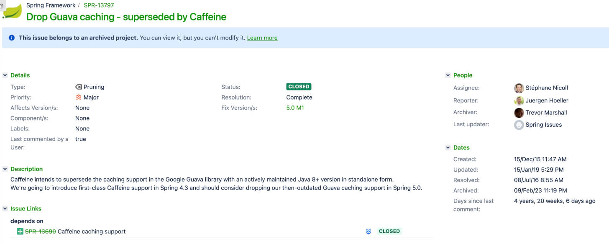


Caffeine 的性能有多牛呢？官方文档的基准测试中已经给出了详细的答案，地址：[**https://github.com/ben-manes/caffeine/wiki/Benchmarks**](https://github.com/ben-manes/caffeine/wiki/Benchmarks) 。


下图是 **8 线程** 对一个配置了最大容量的缓存进行并发读和写，常见的本地缓存实现方案的性能对比。


并发读：


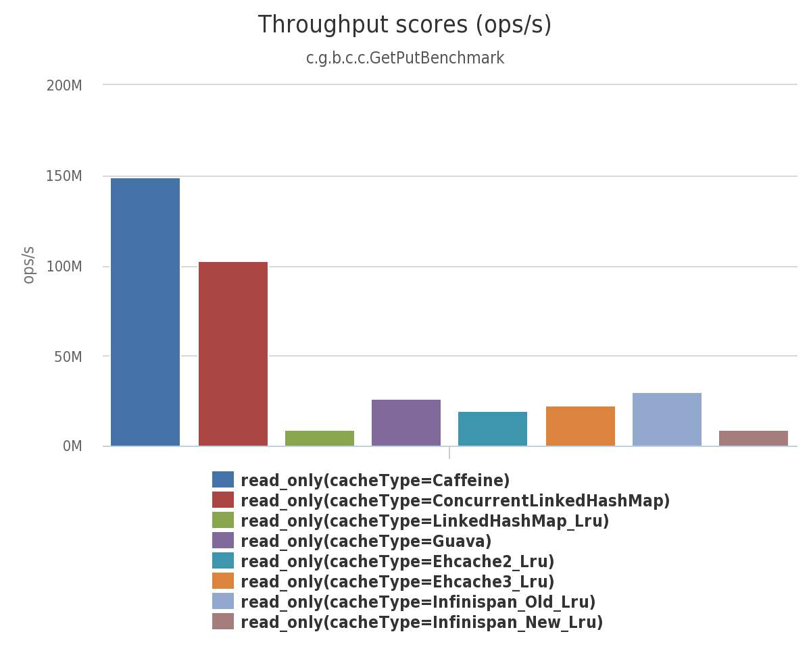


并发写：


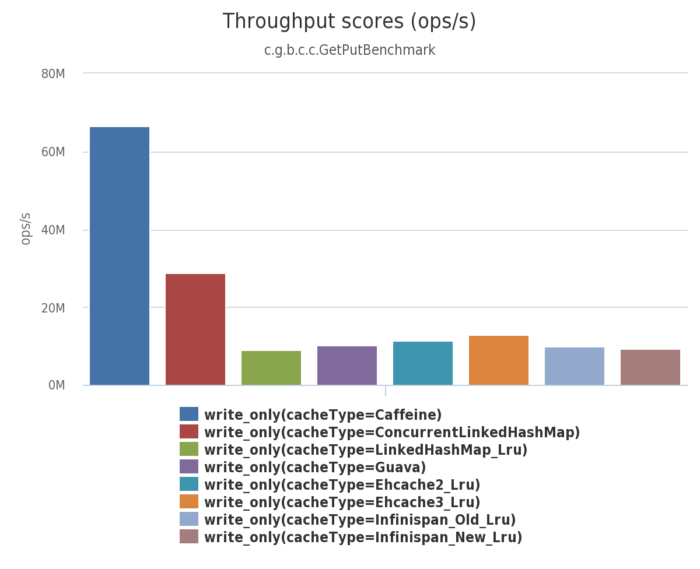


除了基本的缓存功能之外，Caffeine 还提供了过期、异步加载、事件通知等功能。


Caffeine 算的上是本地缓存的最佳选择，像 Redisson、Cassandra、Hbase、Neo4j、Druid 等知名开源项目都用到了 Caffeine。


这篇文章我们不介绍 Caffeine 的具体使用，这个官网文档已经写的很清楚了，网上也有很多详细的使用教程。本文主要聊聊 Caffeine 性能如此优秀的原因，这是我们需要多花时间研究的重点。在面试中，如果你的项目用到了 Caffeine 的话，面试官很可能会问你这方面的问题。


## 缓存淘汰算法


内存空间是有限且昂贵，不可能无限地往内存里面放数据。因此，一个完备的缓存组件都需要实现淘汰算法以淘汰掉某些旧数据来为给新加入的数据腾出内存空间。


一个好的缓存淘汰算法应该满足下面这些要求：


1. 保证缓存命中率高。
2. 维护成本不高，也就是不需要耗费太多资源。
3. 能够应对稀疏流量（Sparse Burst）的场景。


> 稀疏流量指的是在一个时间段内，流量突然出现了大幅增加，但是并不持续，短时间内又恢复正常水平，比如网站某个热门活动开启前后时会突然涌入大量的用户访问。
>


Caffeine 实现的缓存淘汰算法就厉害了，完美满足上面这些要求。


在开始介绍该算法之前，我们先来回顾一下常见的缓存淘汰算法：


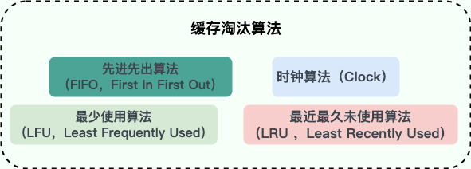


1. **先进先出算法（FIFO，First In First Out）**：按照缓存中数据进入的先后顺序进行淘汰，也就是优先淘汰掉最先缓存的数据，不管这个数据是否被经常访问，是否最近被访问过。这是最简单的一种淘汰算法，但缓存命中率非常低，一般不会采用，也不建议使用。
2. **最近最久未使用算法（LRU，Least Recently Used）**：保留最近被使用过的缓存项，淘汰最久未被访问的缓存项。即如果一个缓存项长时间没有被访问，那么它很可能在之后也不会被访问，因此可以将其淘汰，这是局部性原理的应用。这种算法相比于 FIFO 有了不少优化，缓存命中率还可以，实现起来也比较简单，因此使用率非常高。面试中，经常会有面试官提问：“如何实现一个 LRU 本地缓存？”。不过，由于 LRU 不能反映访问频率， 导致其无法应对突发流量。当系统出现短时间的高并发访问或者突发流量时，很多新的缓存项会被加入，由于缓存空间有限，LRU 可能会将一些访问频率较高的热点缓存项从缓存中淘汰掉，从而影响系统的性能。
3. **最少使用算法（LFU，Least Frequently Used）**：保留使用频率最高的缓存项，淘汰使用频率最低的缓存项。即如果一个缓存项多次被访问，则认为它比其他缓存项更有用，因此应该保留。LFU 算法可以反映访问频率，但其又需要较高的内存占用，并且无法处理稀疏流量（Sparse Burst）的场景（这两个缺点后文会详细介绍到）。
4. **时钟算法（Clock）** ：将缓存项看做一个环形链表，每个缓存项有一个引用位，初值都为 0。当某个缓存项被访问时，把它的引用位设置为 1。当需要淘汰缓存项时，从当前位置开始扫描所有缓存项，找到第一个引用位为 0 的缓存项，将其淘汰。如果所有缓存项的引用位都为 1，则重新扫描一次并清空所有引用位，然后再执行淘汰操作。Clock 算法无法反应访问频率且对访问模式敏感（如果访问模式具有周期性、局部性等特征，该算法可能导致缓存中某些重要的数据被过早地淘汰），一般不会采用。
5. ......


使用频率非常高的 LRU 算法实现简单，内存占用也低，但其并不能反映访问频率。LFU 算法可以反映访问频率，但其又需要较高的内存占用，并且无法处理稀疏流量的场景。


Caffeine 并没有采用上面任何一种缓存淘汰算法，准确点来说其采用的是优化过后的 LFU 算法和 LRU 算法的结合 — **W-TinyLFU** 算法。W-TinyLFU 算法综合了 LRU 算法和 LFU 算法的优点，同时具备高命中率、低内存占用等优点。


W-TinyLFU 算法解决了传统 LFU 算法的两个常见缺陷：


1. 维护频率信息统计的开销较大：传统 LFU 算法需要为每一个缓存项维护最近一段时间（例如过去 10 分钟或 1 个小时）相应的频率统计信息，每一次访问都需要更新相应的统计信息，这会带来一定的存储和性能开销。
2. 无法处理稀疏流量（sparse burst）的场景：传统的 LFU 算法使用访问频率作为度量标准，但是在一些场景下，热点数据的访问频率变化非常快。这种情况下，早先频繁访问的记录可能会占据缓存，而后期访问较多的记录则无法被命中。


对于第一个问题，W-**TinyLFU** 算法是通过一种叫做 Count-Min Sketch（CMS） 的算法解决的，基于这个算法实现了 LFU 的低内存占用版本 **TinyLFU** ，具体可以看[《TinyLFU: A Highly Efficient Cache Admission Policy》](https://arxiv.org/pdf/1512.00727.pdf)这篇论文（为了写这篇文章专门看了一遍，很酸爽）。


**Count-Min Sketch（CMS）** 是一种经典的概率型计数算法，经常被用于频率统计，由 Cormode 和 Muthukrishnan 等人于 2005 年提出。它可以快速、高效地估计大规模数据中各项的出现次数，内存占用较小，但存在少许误差。


Count–Min Sketch 算法类似[布隆过滤器 (Bloom Filter)](https://javaguide.cn/cs-basics/data-structure/bloom-filter.html)。其实，本质上来说，它就是基于 Bloom Filter 演进得来的，借鉴了 Bloom Filter 的核心思想。因此，这两者存在很多共同点比如占用的内存空间都非常小，都依赖 Hash 算法，统计结果都存在一定的误差。不过，这点误差影响并不大，很多场景比如频率统计我们本身并不需要得到一个精确值。不同的是，Bloom Filter 和 Count–Min Sketch 的应用场景不同，前者主要用于确定指定的元素是否存在，后者主要用于频率统计。


Bloom Filter 会使用一个较大的 bit 数组来保存所有的数据，数组中的每个元素都只占用 1 bit ，并且每个元素只能是 0 或者 1（代表 false 或者 true），这也是 Bloom Filter 节省内存的核心所在。


针对同一个元素，BloomFilter 会使用多个 hash 函数得到多个 hash 值，并将数组对应下标的值都置为 1。要确定某个元素是否在 Bloom Filter 中时，同样会对这个元素通过多次 hash 计算得到的多个 hash 值。当且仅当所有 hash 值对应下标的数组元素为 1 时，该元素才被判定存在于 Bloom Filter 中。关于 Bloom Filter 的详细介绍，可以看我写的这篇文章：[十分钟搞懂布隆过滤器](https://javaguide.cn/cs-basics/data-structure/bloom-filter.html)。


Bloom Filter 的简单原理图如下：


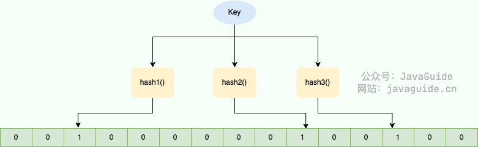


Count–Min Sketch 算法也采用了多个 hash 函数。每个 hash 函数都对应一个单独的数组，这样可以解决 hash 函数相互影响的问题。数组中的一个元素对应一个计数器，每个 hash 函数同时对缓存项 key 计算 hash 值，然后将 hash 值对应的计数器加 1。并且，通过取多个 hash 值中的最小值，来获取某个元素的计数值，这也是 Count–Min Sketch 这个算法名字的来源。


Count–Min Sketch 的简单原理图如下：


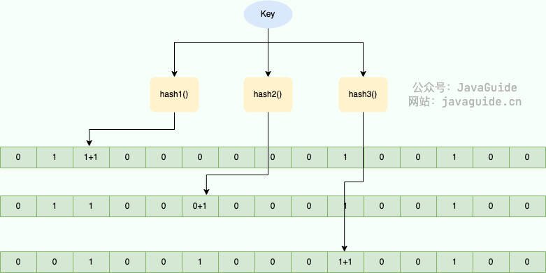


假设一个数组的长度为 w，hash 函数的个数为 d。把 d 个数组合并起来，就会变成一个 _d x w_ 的二维数组：


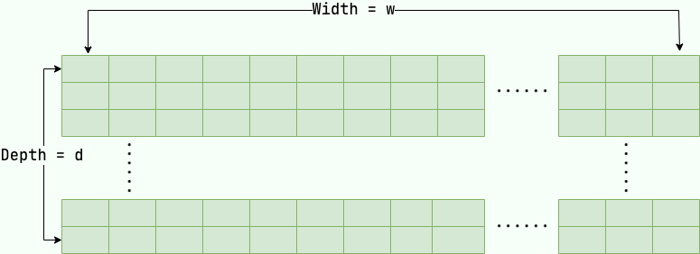


上面介绍的是常规 Count–Min Sketch 算法的实现。Caffeine 实现了该算法，但对其进行了优化:


1. **二维数组变一维数组**：用一维数组`long[] table`代替了原来的二维数组，数组的大小为缓存空间容量（缓存项最大数量）向上取整为 2 的 n 次方。
2. **缩小了存储数值的大小**：Caffeine 认为只需要一个取值范围在 0 到 15 之间的数字就足够表示访问频率，一般认为达到 15 次的频率算是很高的了。这样的话，只需要 4 个 bit 就足够表示一个访问频率。这样一个 long 类型（64bit）就可以存储 16 个计数器，这 16 个计数器进一步分为 4 个 group，那么每个 group 就包含 4 个计数器，存储效率非常高。
3. **采用了衰退减半的机制**：当所有计数器值的和超过设定的阈值（默认是缓存项最大数量的 10 倍）时，Caffeine 将所有计数器值除以 2，从而使得频率进行衰减减半。这样可以削弱过往频率很高但之后不经常的缓存，保持缓存频率统计的时效性（保新）。


Caffeine 实现的 Count-Min Sketch 算法原理图如下（图片来源于[Caffeine 缓存核心原理介绍](https://www.jianshu.com/p/3c6161e5337b)）：


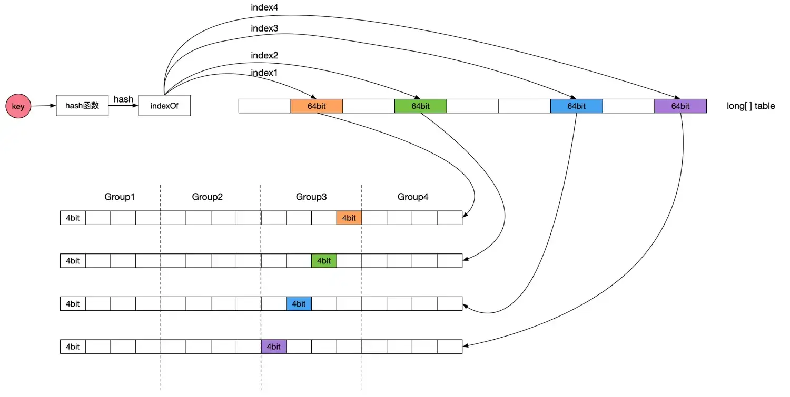


缓存项计数统计过程简单分为下面几步：


1. 根据 hash 函数计算缓存项 key 对应的 hash 值。
2. 根据 hash 值得到计数器的起始位置。
3. 根据 hash 值和 4 个不同种子，通过`indexOf`方法得到 table 的四个下标 index。
4. 对指定位置的计数器进行递增操作。


`FrequencySketch` 类的 `increment` 方法是追加记录的频率的实现，源码如下（Caffeine 版本：3.0.0）：


```java
public void increment(E e) {
  if (isNotInitialized()) {
    return;
  }
  // 根据key的hashCode得到一个hash值
  // 两次hash是为了得到更加均匀分布的hash值
  int hash = spread(e.hashCode());

  // 一个long类型（64bit）不是对应16个计数器嘛，start代表的就是对应的那个计数器的起始位置
  int start = (hash & 3) << 2;

  // 根据hash值和4个不同种子(0,1,2,3)得到table的四个下标index
  int index0 = indexOf(hash, 0);
  int index1 = indexOf(hash, 1);
  int index2 = indexOf(hash, 2);
  int index3 = indexOf(hash, 3);

  // 调用 incrementAt 方法对指定位置的计数器进行递增操作，并将执行结果合并到 added 变量中（如果有任何一个位置的计数器被递增，则认为整个操作成功）
  boolean added = incrementAt(index0, start);
  added |= incrementAt(index1, start + 1);
  added |= incrementAt(index2, start + 2);
  added |= incrementAt(index3, start + 3);

  if (added && (++size == sampleSize)) {
    // 保新
    reset();
  }
}

// 如果指定的计数器尚未达到最大值（15），则将其递增1。
boolean incrementAt(int i, int j) {
  // 一个long类型（64bit）不是对应16个计数器嘛，一个计数器又对应4bit，这个offset就是相当于在64bit中的偏移量
  //  j << 2 表示将 j 的值左移两位，也就是用二进制表示时在低位补零，相当于将 j 乘以 4
  int offset = j << 2;
  long mask = (0xfL << offset);
  // 检查该计数器是否已经达到最大值，如果没有则递增其值并返回 true，否则返回 false。
  if ((table[i] & mask) != mask) {
    table[i] += (1L << offset);
    return true;
  }
  return false;
}

// 返回 table 的下标
int indexOf(int item, int i) {
  long hash = (item + SEED[i]) * SEED[i];
  hash += (hash >>> 32);
  return ((int) hash) & tableMask;
}
```


由于基于 Count-Min Sketch 实现的 LFU 算法进行频率统计的内存占用非常小，因此，其被称其为 **TinyLFU** 算法。


TinyLFU 的设计如下图所示（图片来自论文：[TinyLFU: A Highly Efficient Cache Admission Policy](https://arxiv.org/pdf/1512.00727.pdf)）：


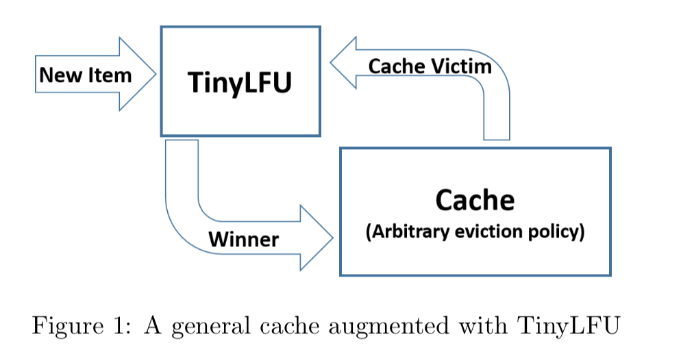


TinyLFU 解决了 LFU 的第一个维护频率信息统计的开销较大的问题，但并没有解决第二个无法处理稀疏流量（Sparse Burst）场景的问题。对于第二个问题，**W**-TinyLFU 引入一个基于 LRU 的 Window Cache 来解决，这在其名字中也已经有体现。


W-TinyLFU 将整个缓存存储空间划分为了下面两个区域：


+ Window Cache：新的缓存项写入缓存时，会先写入 Window Cache。
+ Main Cache：Main Cache 被分为 Probation 区和 Protected 区。Window Cache 满了就会写入到 Probation 区，访问频率高的缓存项会进入 Protected 区。


也就是说，Caffeine 将不同特性的缓存项存入不同的缓存区域。最近刚产生的缓存项进入 Window Cache，访问频率高的缓存项进入 Main Cache 的 Protected 区，介于这两者之间的缓存项存在 Main Cache 的 Probation 区。


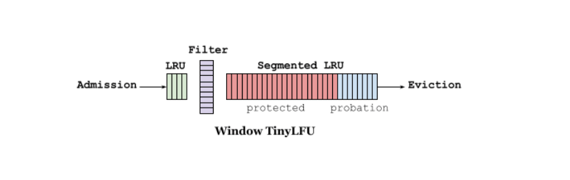


当有新的缓存项写入 Window Cache 且 Window Cache 满时，最旧的缓存项（队头）会被移出 Window Cache。如果此时 Probation 区未满，从 Window Cache 移出的缓存项会直接写入 Probation 区；如果 Probation 区满的话，会执行相应的淘汰机制（后面会介绍到）。


Probation 区的访问频率较高的缓存项会被提升到 Protected 区，如果此时 Protected 区未满，从 Probation 移出的缓存项会直接写入 Protected 区；如果 Protected 区满的话，会执行相应的淘汰机制（后面会介绍到）。


当对应区域的缓存空间满了时，会对 Probation 区的缓存项进行淘汰判断。具体的淘汰机制如下：


+ Probation 区最旧的缓存项（队头）被称为 Victim(受害者)。从 Window Cache 或 Protected Cache 移出准备写入 Probation 区的缓存项称为 Candidate（候选者）。
+ 比较两者频率大小，如果 Candidate 缓存项的访问频率大于 Victim 缓存项的访问频率，则淘汰掉 Victim。如果 Candidate 小于或等于 Victim 的频率且 Candidate 的频率小于等于 5，就淘汰掉 Candidate；否则，在 Candidate 和 Victim 两者之中随机地淘汰一个。


`BoundedLocalCache` 类的 `admit` 方法是 Victim 和 Candidate 淘汰逻辑的源码（Caffeine 版本：3.0.0）：


```java
@GuardedBy("evictionLock")
boolean admit(K candidateKey, K victimKey) {
  // /分别获取Victim和Candidate的统计频率
  int victimFreq = frequencySketch().frequency(victimKey);
  int candidateFreq = frequencySketch().frequency(candidateKey);
  //如果Candidate缓存项的访问频率大于Victim缓存项的访问频率，则淘汰掉Victim
  if (candidateFreq > victimFreq) {
    return true;
    // 如果Candidate小于或等于Victim的频率且Candidate的频率小于5，则淘汰掉Candidate
  } else if (candidateFreq <= 5) {
    // The maximum frequency is 15 and halved to 7 after a reset to age the history. An attack
    // exploits that a hot candidate is rejected in favor of a hot victim. The threshold of a warm
    // candidate reduces the number of random acceptances to minimize the impact on the hit rate.
    return false;
  }
  // 随机淘汰一个
  int random = ThreadLocalRandom.current().nextInt();
  return ((random & 127) == 0);
}
```


W-TinyLFU 的设计如下图所示（图片来自论文：[TinyLFU: A Highly Efficient Cache Admission Policy](https://arxiv.org/pdf/1512.00727.pdf)）：


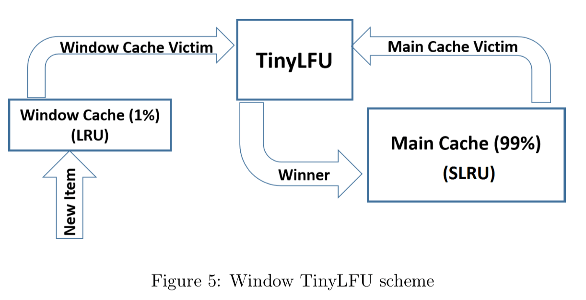


默认情况下，Window Cache 会占据总内存容量的 1%，Main Cache 会占据总内存容量的 99%。其中，Protected 区默认为 Main Cache 大小的 80%，Probation 区默认为 Main Cache 大小的 20%。这个数值在 Caffeine 官方经过多次实验得到的一个最佳比例配置。不过，为了适应不同的缓存场景需求，这些 Cache 区域的大小会动态调整。


## 读缓冲和写缓冲


缓存中数据的读写伴随着缓存状态的变更，比如需要判断数据是否要被淘汰、统计数据访问频率。一般的做法是，缓存会在读写操作时一并完成这些操作，即这些操作和读写操作放在一起，在一个同步加锁的操作中完成，同步处理。


Guava Cache 就是这样做的，虽然 Guava Cache 通过分段加锁等优化手段来尽量减少竞争，但对于一些热点数据，这种做法还是避免不了频繁的锁竞争，性能较差。


Caffeine 为了减少锁竞争，提升性能，专门弄了一个缓冲区（Read Buffer 和 Write Buffer）用来记录由于数据读取而产生的状态变动日志，类似于异步日志提交，以此来减少锁竞争。可以看出，这借鉴了数据库日志记录的 WAL（Write-Ahead Logging）思想，即确保数据在写入磁盘之前被先写入到事务日志中。这种思想同样适合缓存的，执行读写操作时，先把操作记录在缓冲区，然后在合适的时机异步、批量地执行缓冲区中的内容。


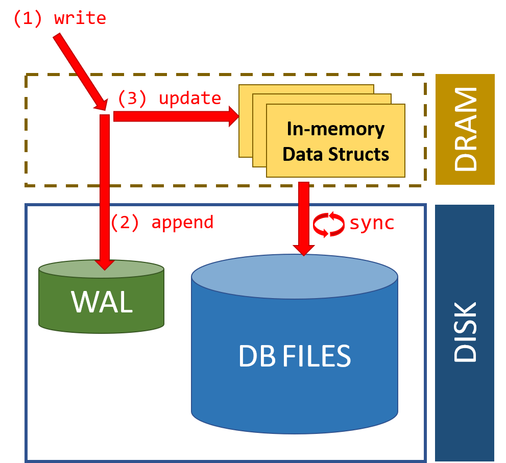


从 Caffeine 读取数据时，数据本身会在其内部的 ConcurrentHashMap 中直接返回，数据读取而产生的状态变动信息存入环形缓冲区（Ring Buffer）中，由后台线程异步处理。为了进一步减少锁竞争，每个线程都有对应的 RingBuffer（对线程取 Hash，哈希值相同的使用同一个 RingBuffer）。


> 环形缓冲区（Ring Buffer）是一种用于表示一个固定尺寸、头尾相连的缓冲区的数据结构，也叫圆形缓冲区（Circular Buffer），循环缓冲区（Cyclic Buffer）。
>


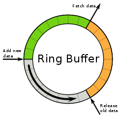


RingBuffer 的容量有限，当异步处理的速度赶不上往 RingBuffer 中放入数据的速度是，可能会导致 RingBuffer 满了，后来的状态变动信息就会被忽略掉。不过，这对于读取操作来说是可以忍受的，对于写操作就不行了。


写入数据到 Caffeine 时，不再将状态变更信息放入 RingBuffer ，而是使用`MpscGrowableArrayQueue` 阻塞队列（仿照 JCTools 的`MpscGrowableArrayQueue`写的）存放。这是因为写缓冲并不允许数据的丢失，因此其必须实现为一个安全的队列。


## 异步数据清理


上面介绍了读缓冲和写缓冲，我们这里简单单独再介绍一下其中涉及到的异步数据清理。


为了提高读写操作的并发效率，Caffeine 缓存库采用了异步方式来处理数据淘汰和清理操作。不过，这也带来了一个问题：在异步处理时，可能会有微小的延迟，这样就会导致超过缓存的最大容量限制。


具体来说，当缓存近乎满时，多个线程向缓存中添加新缓存项，此时缓存的大小可能已经接近或超出最大容量。此时，Caffeine 会启动异步清理任务，尝试删除一些不必要的缓存项。但由于异步处理的延时，这些线程可能会在异步清理之前先执行完毕，这样就会继续添加新缓存项到缓存中，导致缓存的实际大小超出了缓存最大容量的限制。


不过，从高性能方面考虑来说，这点误差是完全可以接受的，影响不大。


这里我们简单写一个代码演示一下：


```java
LoadingCache<String, String> cache = Caffeine.newBuilder()
        .maximumSize(10)  // 设置缓存的最大容量为10
        .expireAfterAccess(10, TimeUnit.MINUTES)  // 设置缓存项在10分钟内没有被访问，则过期并被清理
        .build(key -> "default");  // 当缓存中不存在某个key时，使用默认值"default"来创建缓存项

// 在多个线程中向缓存中添加12数据
IntStream.range(1, 12).parallel().forEach(i -> cache.put("key-" + i, "value-" + i));

// 在多个线程中从缓存中读取数据
IntStream.range(1, 12).parallel().forEach(i -> {
    String value = cache.getIfPresent("key-" + i);
    System.err.println(value);
});
```


输出结果：


```plain
value-5
value-8
value-6
value-1
value-2
value-9
value-7
value-3
value-10
value-4
value-11
```


从上面的代码可以看出，虽然我们定义的缓存最大容量为 10，但向其中添加了 12 条数据还是有 11 条成功插入了。不过，多插入的一条数据还是会被淘汰，这只是一个非常短暂的延迟。


## 时间轮


Caffeine 的过期策略是基于时间轮来做的。时间轮比较适合任务数量比较多的定时任务场景，它的任务写入和执行的时间复杂度都是 0（1）。


时间轮简单来说就是一个环形的队列（底层一般基于数组实现），队列中的每一个元素（时间格）都可以存放一个定时任务列表。


时间轮中的每个时间格代表了时间轮的基本时间跨度或者说时间精度，假如时间一秒走一个时间格的话，那么这个时间轮的最高精度就是 1 秒（也就是说 3 s 和 3.9s 会在同一个时间格中）。


下图是一个有 12 个时间格的时间轮，转完一圈需要 12 s。当我们需要新建一个 3s 后执行的定时任务，只需要将定时任务放在下标为 3 的时间格中即可。当我们需要新建一个 9s 后执行的定时任务，只需要将定时任务放在下标为 9 的时间格中即可。


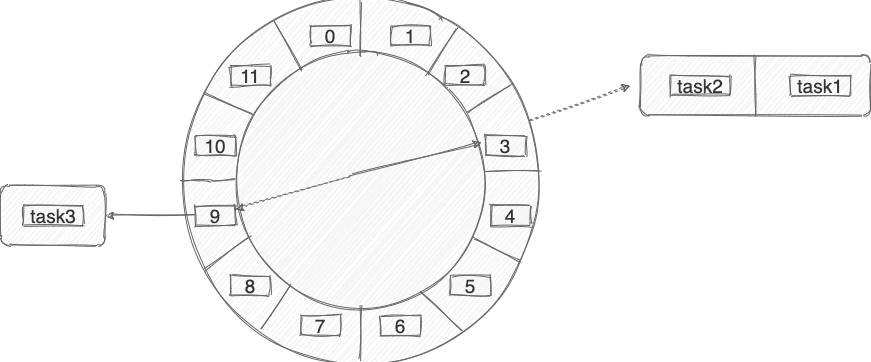


那当我们需要创建一个 13s 后执行的定时任务怎么办呢？这个时候可以引入一叫做 **圈数/轮数** 的概念，也就是说这个任务还是放在下标为 3 的时间格中， 不过它的圈数为 2 。


除了增加圈数这种方法之外，还有一种 **多层次时间轮** （类似手表），Caffeine 采用的就是这种方案。


针对下图的时间轮，我来举一个例子便于大家理解。


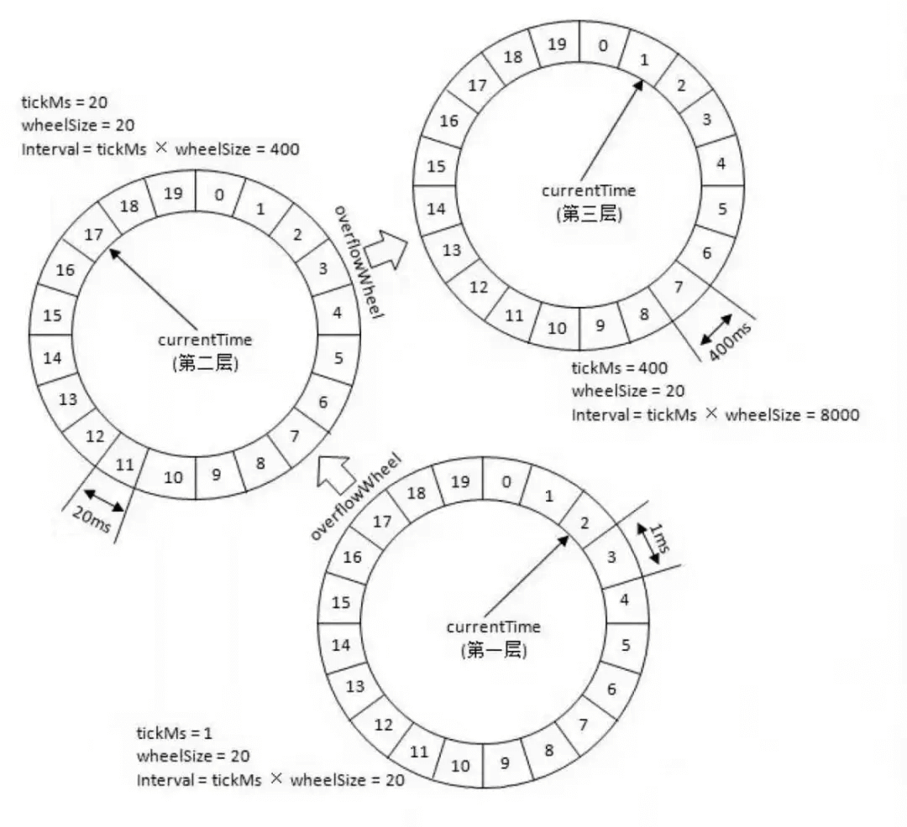


上图的时间轮，第 1 层的时间精度为 1 ，第 2 层的时间精度为 20 ，第 3 层的时间精度为 400。假如我们需要添加一个 350s 后执行的任务 A 的话（当前时间是 0s），这个任务会被放在第 2 层（因为第二层的时间跨度为 20*20=400>350）的第 350/20=17 个时间格子。


当第一层转了 17 圈之后，时间过去了 340s ，第 2 层的指针此时来到第 17 个时间格子。此时，第 2 层第 17 个格子的任务会被移动到第 1 层。


任务 A 当前是 10s 之后执行，因此它会被移动到第 1 层的第 10 个时间格子。


这里在层与层之间的移动也叫做时间轮的升降级。参考手表来理解就好！


## 总结


Caffeien 高性能的原因是一系列极致优化的结果，除了这篇文章介绍的 W-TinyLFU 缓存淘汰算法、读缓冲和写缓冲、时间轮之外，Caffeine 底层还是用了很多其他优化手段比如消除伪共享。


## 参考


+ Count-Min Sketch：[https://florian.github.io/count-min-sketch/](https://florian.github.io/count-min-sketch/)
+ Caffeine 缓存核心原理介绍：[https://www.jianshu.com/p/3c6161e5337b](https://www.jianshu.com/p/3c6161e5337b)
+ Caffeine 高性能设计剖析：[https://albenw.github.io/posts/a4ae1aa2/](https://albenw.github.io/posts/a4ae1aa2/)
+ 《凤凰架构》 - 服务端缓存：[http://icyfenix.cn/architect-perspective/general-architecture/diversion-system/cache-middleware.html](http://icyfenix.cn/architect-perspective/general-architecture/diversion-system/cache-middleware.html)


> 更新: 2023-07-31 20:13:05  
> 原文: <https://www.yuque.com/snailclimb/mf2z3k/oson7u6g1fxzxkt4>