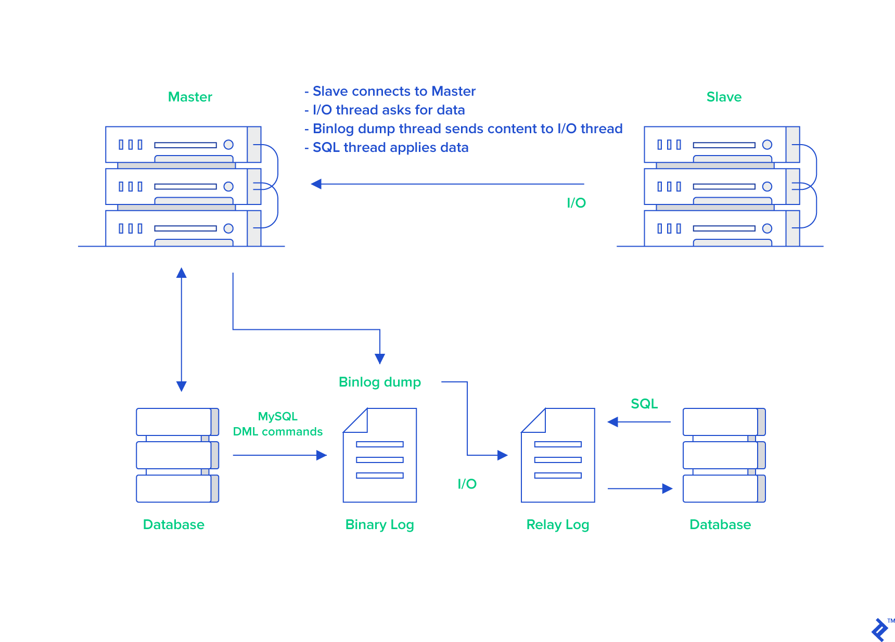
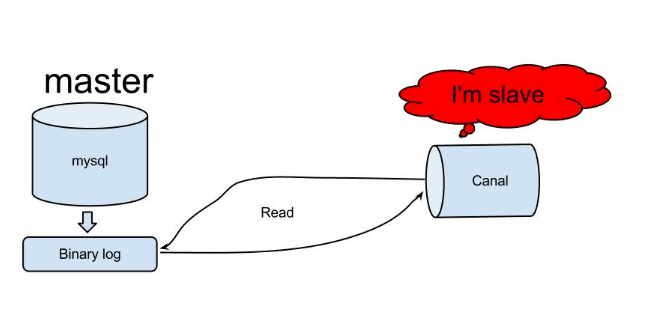
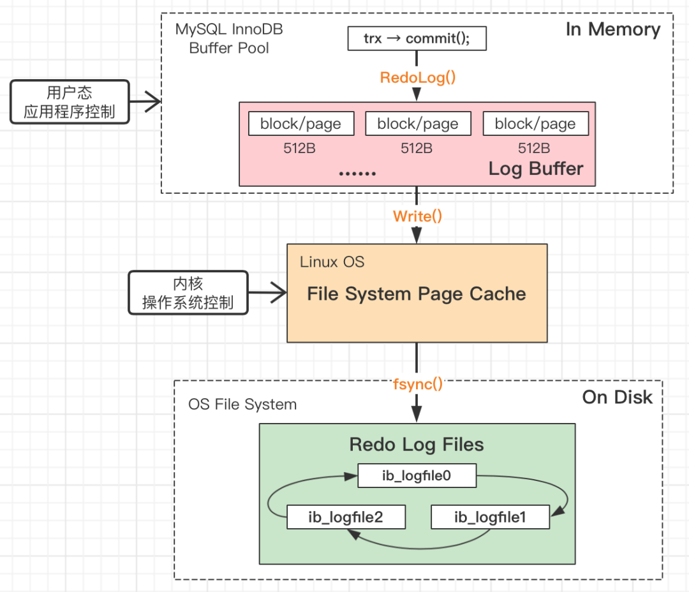
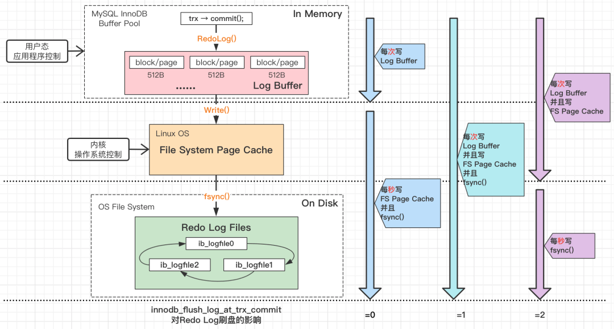
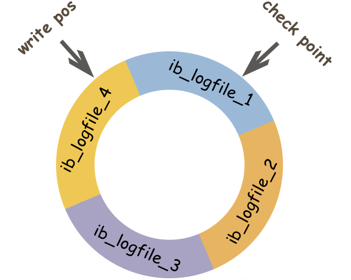

# MySQL 日志：常见的日志都有什么用？

MySQL 日志的内容非常重要，面试中经常会被问到。同时，掌握日志相关的知识也有利于我们理解 MySQL 底层原理，必要时帮助我们排查解决问题。


MySQL 中常见的日志类型主要有下面几类（针对的是 InnoDB 存储引擎）：


+ **错误日志（error log）** ：对 MySQL 的启动、运行、关闭过程进行了记录。
+ **二进制日志（binary log，binlog）** ：主要记录的是更改数据库数据的 SQL 语句。
+ **一般查询日志（general query log）** ：已建立连接的客户端发送给 MySQL 服务器的所有 SQL 记录，因为 SQL 的量比较大，默认是不开启的，也不建议开启。
+ **慢查询日志（slow query log）** ：执行时间超过 `long_query_time`秒钟的查询，解决 SQL 慢查询问题的时候会用到。
+ **事务日志(redo log 和 undo log)** ：redo log 是重做日志，undo log 是回滚日志。
+ **中继日志(relay log)** ：relay log 是复制过程中产生的日志，很多方面都跟 binary log 差不多。不过，relay log 针对的是主从复制中的从库。
+ **DDL 日志(metadata log)** ：DDL 语句执行的元数据操作。


二进制日志（binlog）和事务日志(redo log 和 undo log)比较重要，需要我们重点关注。


## slow query log（慢查询日志）


### 慢查询日志有什么用？


慢查询日志记录了执行时间超过 `long_query_time`（默认是 10s，通常设置为1s）的所有查询语句，在解决 SQL 慢查询（SQL 执行时间过长）问题的时候经常会用到。


找到慢 SQL 是优化 SQL 语句性能的第一步，然后再用`EXPLAIN` 命令可以对慢 SQL 进行分析，获取[执行计划](https://javaguide.cn/database/mysql/mysql-query-execution-plan.html)的相关信息。


你可以通过 `show variables like "slow_query_log";`命令来查看慢查询日志是否开启，默认是关闭的。


```bash
mysql> show variables like 'slow_query_log';
+----------------+-------+
| Variable_name  | Value |
+----------------+-------+
| slow_query_log | OFF   |
+----------------+-------+
```


你可以通过 `SET GLOBAL slow_query_log=ON` 命令将其开启。


`long_query_time` 参数定义了一个查询消耗多长时间才可以被定义为慢查询，默认是 10s，通过 `SHOW VARIABLES LIKE '%long_query_time%'`命令即可查看：


```bash
mysql> show variables like '%long_query_time%';
+-----------------+-----------+
| Variable_name   | Value     |
+-----------------+-----------+
| long_query_time | 10.000000 |
+-----------------+-----------+
1 row in set (0.00 sec)
```


并且，我们还可以对 `long_query_time` 参数进行修改：


```bash
SET GLOBAL long_query_time=1
```


在实际项目中，慢查询日志可能会比较大，直接分析的话不太方便，我们可以借助 MySQL 官方的慢查询分析调优工具 [mysqldumpslow](https://dev.mysql.com/doc/refman/5.7/en/mysqldumpslow.html)。


### 如何查询当前慢查询语句的个数？


在MySQL中有一个变量专门记录当前慢查询语句的个数，可以通过 `show global status like '%Slow_queries%';` 命令查看。


```bash
mysql> show global status like '%Slow_queries%';
+---------------+-------+
| Variable_name | Value |
+---------------+-------+
| Slow_queries  | 10    |
+---------------+-------+
```


### 如何优化慢 SQL？


MySQL 为我们提供了 `EXPLAIN` 命令，来获取执行计划的相关信息。


**执行计划** 是指一条 SQL 语句在经过 **MySQL 查询优化器** 的优化会后，具体的执行方式。执行计划通常用于 SQL 性能分析、优化等场景。通过 `EXPLAIN` 的结果，可以了解到如数据表的查询顺序、数据查询操作的操作类型、哪些索引可以被命中、哪些索引实际会命中、每个数据表有多少行记录被查询等信息。


另外，为了更精准定位一条 SQL 语句的性能问题，需要清楚地知道这条 SQL 语句运行时消耗了多少系统资源。 `[SHOW PROFILE](https://dev.mysql.com/doc/refman/5.7/en/show-profile.html)` 和 `[SHOW PROFILES](https://dev.mysql.com/doc/refman/5.7/en/show-profiles.html)` 展示 SQL 语句的资源使用情况，展示的消息包括 CPU 的使用，CPU 上下文切换，IO 等待，内存使用等。


详细介绍可以查看这篇文章：

[高性能：有哪些常见的 SQL 优化手段？](https://www.yuque.com/snailclimb/mf2z3k/abc2sv)

## binlog（二进制日志）


### binlog 是什么？


**binlog(binary log 即二进制日志文件)** 主要记录了对 MySQL 数据库执行了更改的所有操作(数据库执行的所有 DDL 和 DML 语句)，包括表结构变更（CREATE、ALTER、DROP TABLE…）、表数据修改（INSERT、UPDATE、DELETE...），但不包括 SELECT、SHOW 这类不会对数据库造成更改的操作。


不过，并不是不对数据库造成修改就不会被记录进 binlog。即使表结构变更和表数据修改操作并未对数据库造成更改，依然会被记录进 binlog。


你可以使用`show binary logs;` 命令查看所有二进制日志列表：


```bash
mysql> show binary logs;
+---------------+-----------+-----------+
| Log_name      | File_size | Encrypted |
+---------------+-----------+-----------+
| binlog.000007 |    619853 | No        |
| binlog.000008 |     49104 | No        |
+---------------+-----------+-----------+
```


可以看到，binlog 日志文件名为 `文件名.00000*` 形式。


你可以通过 `show binlog events in 'binlog.000008' limit 10;` 命令查看日志的具体内容。这里一定要指定 `limit`，不然查询出来的日志文件内容太多。另外， MySQL 内置了 binlog 查看工具 **mysqlbinlog**，可以解析二进制文件。


binlog 通过追加的方式进行写入，大小没有限制。并且，我们可以通过`max_binlog_size`参数设置每个 binlog 文件的最大容量，当文件大小达到给定值之后，会生成新的 binlog 文件来保存日志，不会出现前面写的日志被覆盖的情况。


### binlog 的格式有哪几种？


一共有 3 种类型二进制记录方式：


+ **Statement 模式** ：每一条会修改数据的sql都会被记录在binlog中，如inserts, updates, deletes。
+ **Row 模式** （推荐）: 每一行的具体变更事件都会被记录在binlog中。
+ **Mixed 模式** ：Statement 模式和 Row 模式的混合。默认使用 Statement 模式，少数特殊具体场景自动切换到 Row 模式。


MySQL 5.1.5 之前 binlog 的格式只有 STATEMENT，5.1.5 开始支持 ROW 格式的 binlog，从 5.1.8 版本开始，MySQL 开始支持 MIXED 格式的 binlog。MySQL 5.7.7 之前，默认使用 Statement 模式。MySQL 5.7.7 开始默认使用 Row 模式。


相比较于 Row 模式来说，Statement 模式下的日志文件更小，磁盘 IO 压力也较小，性能更好有些。不过，其准确性相比于 Row 模式要差。


你可以使用 `show variables like '%binlog_format%';` 查看 binlog 使用的格式：


```bash
Server version: 8.0.27 MySQL Community Server - GPL
mysql> show variables like '%binlog_format%';
+---------------+-------+
| Variable_name | Value |
+---------------+-------+
| binlog_format | ROW   |
+---------------+-------+
1 row in set (0.05 sec)
```


### binlog 主要用来做什么？


binlog 最主要的应用场景是 **主从复制** ，主备、主主、主从都离不开binlog，需要依靠 binlog 来同步数据，保证数据一致性。


主从复制的原理如下图所示：





1. 主库将数据库中数据的变化写入到 binlog
2. 从库连接主库
3. 从库会创建一个 I/O 线程向主库请求更新的 binlog
4. 主库会创建一个 binlog dump 线程来发送 binlog ，从库中的 I/O 线程负责接收
5. 从库的 I/O 线程将接收的 binlog 写入到 relay log 中。
6. 从库的 SQL 线程读取 relay log 同步数据本地（也就是再执行一遍 SQL ）。


关于主从复制的相关内容，推荐看看我写的[数据库读写分离和分库分表详解](https://javaguide.cn/high-performance/read-and-write-separation-and-library-subtable.html)这篇文章。


另外，常见的一些同步 MySQL 数据到其他数据源的工具（比如 Canal）的底层一般也是依赖 binlog 。


Canal 数据同步的原理如下图所示：





1. Canal 模拟 MySQL Slave 节点与 MySQL Master 节点的交互协议，把自己伪装成一个 MySQL Slave 节点，向 MySQL Master 节点请求 binlog；
2. MySQL Master 节点接收到请求之后，根据偏移量将新的 binlog 发送给 MySQL Slave 节点；
3. Canal 接收到 binlog 之后，就可以对这部分日志进行解析，获取主库的结构及数据变更。


除了主从复制之外，binlog 还能帮助我们实现 **数据恢复** 。当我们误删数据甚至是整个数据库的情况下，就可以使用 binlog 来帮助我们恢复数据。当然了，大前提是已经启用了 binlog 日志。


你可以使用`show variables like 'log_bin';`查看数据库是否启用 binlog 日志，默认是开启的。


```bash
mysql> show variables like 'log_bin';
+---------------+-------+
| Variable_name | Value |
+---------------+-------+
| log_bin       | ON    |
+---------------+-------+
```


### binlog 的刷盘时机如何选择？


对于InnoDB存储引擎而言，事务在执行过程中，会先把日志写入到`binlog cache`中，只有在事务提交的时候，才会把`binlog cache`中的日志持久化到磁盘上的`binlog`文件中。写入内存的速度更快，这样做也是为了效率考虑。


因为一个事务的`binlog`不能被拆开，无论这个事务多大，也要确保一次性写入，所以系统会给每个线程分配一个块内存作为`binlog cache`。我们可以通过`binlog_cache_size`参数控制单个线程 binlog cache 大小，如果存储内容超过了这个参数，就要暂存到磁盘（`Swap`）。


**那么 binlog 是什么时候刷到磁盘中的呢？** 可以通过  `sync_binlog` 参数控制 biglog 的刷盘时机，取值范围是 0-N，默认为 0 ：


+ 0：不去强制要求，由系统自行判断何时写入磁盘；
+ 1：每次提交事务的时候都要将binlog写入磁盘；
+ N：每 N 个事务，才会将binlog写入磁盘。


MySQL5.7 之前， `sync_binlog` 默认值为 0。在 MySQL5.7 之后， `sync_binlog`默认值为 1。


```bash
Server version: 8.0.27 MySQL Community Server - GPL
mysql> show variables like 'sync_binlog';
+---------------+-------+
| Variable_name | Value |
+---------------+-------+
| sync_binlog   | 1     |
+---------------+-------+
1 row in set (0.01 sec)
```


通常情况下，不建议将  `sync_binlog` 的值设置为 0 。如果对性能要求比较高或者出现磁盘 IO 瓶颈的话，可以适当将`sync_binlog` 的值调大，不过，这样会增加数据丢失的风险。


### 什么情况下会重新生成 binlog？


当遇到以下 3 种情况时，MySQL会重新生成一个新的日志文件，文件序号递增：


+ MySQL服务器停止或重启；
+ 使用 `flush logs` 命令后；
+ binlog 文件大小超过 `max_binlog_size`变量的阈值后。


## redo log（重做日志）


### redo log 如何保证事务的持久性？


我们知道 InnoDB 存储引擎是以页为单位来管理存储空间的，我们往 MySQL 插入的数据最终都是存在于页中的，准确点来说是数据页这种类型。为了减少磁盘 IO 开销，还有一个叫做 Buffer Pool(缓冲池) 的区域，存在于内存中。当我们的数据对应的页不存在于 Buffer Pool 中的话， MySQL 会先将磁盘上的页缓存到 Buffer Pool 中，这样后面我们直接操作的就是 Buffer Pool 中的页，这样大大提高了读写性能。


一个事务提交之后，我们对 Buffer Pool 中对应的页的修改可能还未持久化到磁盘。这个时候，如果 MySQL 突然宕机的话，这个事务的更改是不是直接就消失了呢？


很显然是不会的，如果是这样的话就明显违反了事务的持久性。


MySQL InnoDB 引擎使用 redo log 来保证事务的持久性。redo log 主要做的事情就是记录页的修改，比如某个页面某个偏移量处修改了几个字节的值以及具体被修改的内容是什么。redo log 中的每一条记录包含了表空间号、数据页号、偏移量、具体修改的数据，甚至还可能会记录修改数据的长度（取决于 redo log 类型）。


在事务提交时，我们会将 redo log 按照刷盘策略刷到磁盘上去，这样即使 MySQL 宕机了，重启之后也能恢复未能写入磁盘的数据，从而保证事务的持久性。也就是说，redo log 让 MySQL 具备了崩溃恢复能力。





InnoDB 将 redo log 刷到磁盘上有几种情况：


1. 事务提交：当事务提交时，log buffer 里的 redo log 会被刷新到磁盘（可以通过`innodb_flush_log_at_trx_commit`参数控制，后文会提到）。
2. log buffer 空间不足时：log buffer 中缓存的 redo log 已经占满了 log buffer 总容量的大约一半左右，就需要把这些日志刷新到磁盘上。
3. 事务日志缓冲区满：InnoDB 使用一个事务日志缓冲区（transaction log buffer）来暂时存储事务的重做日志条目。当缓冲区满时，会触发日志的刷新，将日志写入磁盘。
4. Checkpoint（检查点）：InnoDB 定期会执行检查点操作，将内存中的脏数据（已修改但尚未写入磁盘的数据）刷新到磁盘，并且会将相应的重做日志一同刷新，以确保数据的一致性。
5. 后台刷新线程：InnoDB 启动了一个后台线程，负责周期性（每隔 1 秒）地将脏页（已修改但尚未写入磁盘的数据页）刷新到磁盘，并将相关的重做日志一同刷新。也就是说，一个没有提交事务的 `redo log` 记录，也可能会被刷盘。
6. 正常关闭服务器：MySQL 关闭的时候，redo log 都会刷入到磁盘里去。


总之，InnoDB 在多种情况下会刷新 redo log 到磁盘，以保证数据的持久性和一致性。


我们要注意设置正确的刷盘策略`innodb_flush_log_at_trx_commit` 。根据 MySQL 配置的刷盘策略的不同，MySQL 宕机之后可能会存在轻微的数据丢失问题。


`innodb_flush_log_at_trx_commit` 的值有 3 种，也就是共有 3 种刷盘策略：


+ **0**：设置为 0 的时候，表示每次事务提交时不进行刷盘操作。这种方式性能最高，但是也最不安全，因为如果 MySQL 挂了或宕机了，可能会丢失最近 1 秒内的事务。
+ **1**：设置为 1 的时候，表示每次事务提交时都将进行刷盘操作。这种方式性能最低，但是也最安全，因为只要事务提交成功，redo log 记录就一定在磁盘里，不会有任何数据丢失。
+ **2**：设置为 2 的时候，表示每次事务提交时都只把 log buffer 里的 redo log 内容写入 page cache（文件系统缓存）。page cache 是专门用来缓存文件的，这里被缓存的文件就是 redo log 文件。这种方式的性能和安全性都介于前两者中间。


性能：0 > 2 > 1 ，安全性：1 >  2 > 0 。





刷盘策略`innodb_flush_log_at_trx_commit` 的默认值为 1，设置为 1 的时候才不会丢失任何数据。为了保证事务的持久性，我们必须将其设置为 1。当然了，如果你的项目能容忍轻微的数据丢失的话，那将`innodb_flush_log_at_trx_commit`的值设置为 2 或许是更好的选择。


下图是 MySQL 5.7 官方文档对于 `innodb_flush_log_at_trx_commit` 参数的详细介绍，我这里就不做过多阐述了。


redo log 采用循环写的方式进行写入，如下图所示。





`write pos` 表示 redo log 当前记录写到的位置， `check point` 表示当前要擦除的位置。当`write pos`追上`check point`时，表示 redo log 文件被写满了。这个时候，MySQL 没办法执行更新操作，也就是说数据库更新操作会被阻塞，因为无法再写入 redo log 日志。为了保证 MySQL 更新操作的正常执行，需要执行 CheckPoint 刷盘机制。CheckPoint 会按照一定的条件将内存中的脏页刷到磁盘上。成功刷盘之后，checkpoint 会向后移动（顺时针方向）。这样的话，才能继续写入 redo log 日志，阻塞的更新操作才能继续执行。


### 什么情况下会出现数据丢失？


如果你理解了 redo log 原理的话，应该可以很容易想到下面这两种情况：


1. redo log 写入 log buffer 但还未写入 page cache ，此时数据库崩溃，就会出现数据丢失（刷盘策略`innodb_flush_log_at_trx_commit` 的值为 0 时可能会出现这种数据丢失）；
2. redo log 已经写入 page cache 但还未写入磁盘，操作系统奔溃，也可能出现数据丢失（刷盘策略`innodb_flush_log_at_trx_commit` 的值为 2 时可能会出现这种数据丢失）。


### 页修改之后为什么不直接刷盘呢？


很多人可能要问了：为什么每次修改 Buffer Pool 中的页之后不直接刷盘呢？这样不就不需要 redo log 了嘛！


这种方式必然是不行的，性能非常差。最大的问题就是 InnoDB 页的大小一般为 16KB，而页又是磁盘和内存交互的基本单位。这就导致即使我们只修改了页中的几个字节数据，一次刷盘操作也需要将 16KB 大小的页整个都刷新到磁盘中。而且，这些修改的页可能并不相邻，也就是说这还是随机 IO。


采用 redo log 的方式就可以避免这种性能问题，因为 redo log 的刷盘性能很好。首先，redo log 的写入属于顺序 IO。 其次，一行 redo log 记录只占几十个字节。


另外，Buffer Pool 中的页（脏页）在某些情况下（比如 redo log 快写满了）也会进行刷盘操作。不过，这里的刷盘操作会合并写入，更高效地顺序写入到磁盘。


### binlog 和 redolog 有什么区别？


+ binlog 主要用于数据库还原，属于数据级别的数据恢复，主从复制是 binlog 最常见的一个应用场景。redolog 主要用于保证事务的持久性，属于事务级别的数据恢复。
+ redolog 属于 InnoDB 引擎特有的，binlog 属于所有存储引擎共有的，因为 binlog 是 MySQL 的 Server 层实现的。
+ redolog 属于物理日志，主要记录的是某个页的修改。binlog 属于逻辑日志，主要记录的是数据库执行的所有 DDL 和 DML 语句。
+ binlog 通过追加的方式进行写入，大小没有限制。redo log 采用循环写的方式进行写入，大小固定，当写到结尾时，会回到开头循环写日志。
+ ......


## undo log（撤销日志）


### undo log 如何保证事务的原子性？


每一个事务对数据的修改都会被记录到 undo log ，当执行事务过程中出现错误或者需要执行回滚操作的话，MySQL 可以利用 undo log 将数据恢复到事务开始之前的状态。


undo log 属于逻辑日志，记录的是 SQL 语句，比如说事务执行一条 DELETE 语句，那 undo log 就会记录一条相对应的 INSERT 语句。同时，undo log 的信息也会被记录到 redo log 中，因为 undo log 也要实现持久性保护。并且，undo-log 本身是会被删除清理的，例如 INSERT 操作，在事务提交之后就可以清除掉了；UPDATE/DELETE 操作在事务提交不会立即删除，会加入 history list，由后台线程 purge 进行清理。


undo log 是采用 segment（段）的方式来记录的，每个 undo 操作在记录的时候占用一个 **undo log segment**（undo 日志段），undo log segment 包含在 **rollback segment**（回滚段）中。事务开始时，需要为其分配一个 rollback segment。每个 rollback segment 有 1024 个 undo log segment，这有助于管理多个并发事务的回滚需求。


通常情况下， **rollback segment header**（通常在回滚段的第一个页）负责管理 rollback segment。rollback segment header 是 rollback segment 的一部分，通常在回滚段的第一个页。**history list** 是 rollback segment header 的一部分，它的主要作用是记录所有已经提交但还没有被清理（purge）的事务的 undo log。这个列表使得 purge 线程能够找到并清理那些不再需要的 undo log 记录。


### 除了保证事务的原子性，undo log 还有什么用？


MVCC 的实现依赖于：**隐藏字段、Read View、undo log**。在内部实现中，InnoDB 通过数据行的 `DB_TRX_ID` 和 `Read View` 来判断数据的可见性，如不可见，则通过数据行的 `DB_ROLL_PTR` 找到 undo log 中的历史版本。每个事务读到的数据版本可能是不一样的，在同一个事务中，用户只能看到该事务创建 `Read View` 之前已经提交的修改和该事务本身做的修改。


> 更新: 2024-04-02 17:05:09  
> 原文: <https://www.yuque.com/snailclimb/mf2z3k/zr4kfk>