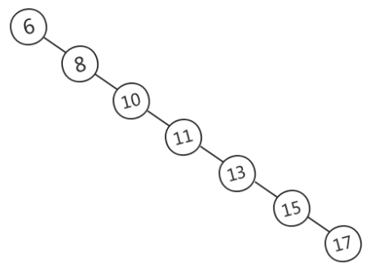

# MySQL 索引：索引为什么使用 B+树？

> **相关面试题** ：
>
>  
>
> + MySQL 的索引结构为什么使用 B+树？
> + 红黑树适合什么场景？
>
>  
>
> 转自：https://www.cnblogs.com/kismetv/p/11582214.html
>

在 MySQL 中，无论是 Innodb 还是 MyIsam，都使用了 B+树作索引结构(这里不考虑 hash 等其他索引)。本文将从最普通的二叉查找树开始，逐步说明各种树解决的问题以及面临的新问题，从而说明 MySQL 为什么选择 B+树作为索引结构。

## 二叉查找树(BST)：不平衡

二叉查找树(BST，Binary Search Tree)，也叫二叉排序树，在二叉树的基础上需要满足：任意节点的左子树上所有节点值不大于根节点的值，任意节点的右子树上所有节点值不小于根节点的值。如下是一颗 BST([图片来源](https://blog.csdn.net/qq_25940921/article/details/82183093))。

当需要快速查找时，将数据存储在 BST 是一种常见的选择，因为此时查询时间取决于树高，平均时间复杂度是 O(lgn)。然而，**BST 可能长歪而变得不平衡**，如下图所示([图片来源](https://blog.csdn.net/qq_25940921/article/details/82183093))，此时 BST 退化为链表，时间复杂度退化为 O(n)。

为了解决这个问题，引入了平衡二叉树。

## 平衡二叉树(AVL)：旋转耗时

AVL 树是严格的平衡二叉树，所有节点的左右子树高度差不能超过 1；AVL 树查找、插入和删除在平均和最坏情况下都是 O(lgn)。

AVL 实现平衡的关键在于旋转操作：插入和删除可能破坏二叉树的平衡，此时需要通过一次或多次树旋转来重新平衡这个树。当插入数据时，最多只需要 1 次旋转(单旋转或双旋转)；但是当删除数据时，会导致树失衡，AVL 需要维护从被删除节点到根节点这条路径上所有节点的平衡，旋转的量级为 O(lgn)。

**由于旋转的耗时，AVL 树在删除数据时效率很低** ；在删除操作较多时，维护平衡所需的代价可能高于其带来的好处，因此 AVL 实际使用并不广泛。

## 红黑树：树太高

与 AVL 树相比，红黑树并不追求严格的平衡，而是大致的平衡：只是确保从根到叶子的最长的可能路径不多于最短的可能路径的两倍长。从实现来看，红黑树最大的特点是每个节点都属于两种颜色(红色或黑色)之一，且节点颜色的划分需要满足特定的规则(具体规则略)。红黑树示例如下（[图片来源](https://www.jianshu.com/p/1dbbee88c9d9)）：

与 AVL 树相比，红黑树的查询效率会有所下降，这是因为树的平衡性变差，高度更高。但红黑树的删除效率大大提高了，因为红黑树同时引入了颜色，当插入或删除数据时，只需要进行 O(1)次数的旋转以及变色就能保证基本的平衡，不需要像 AVL 树进行 O(lgn)次数的旋转。总的来说， **红黑树的统计性能高于 AVL。**

因此，在实际应用中，AVL 树的使用相对较少，而红黑树的使用非常广泛。例如，Java 中的 `TreeMap` 使用红黑树存储排序键值对；Java8 中的 `HashMap` 使用链表+红黑树解决哈希冲突问题(当冲突节点较少时，使用链表，当冲突节点较多时，使用红黑树)。

对于数据在内存中的情况（如上述的 TreeMap 和 HashMap），红黑树的表现是非常优异的。但是对于数据在磁盘等辅助存储设备中的情况（如 MySQL 等数据库），红黑树并不擅长，因为红黑树长得还是太高了。当数据在磁盘中时，磁盘 IO 会成为最大的性能瓶颈，设计的目标应该是尽量减少 IO 次数；而树的高度越高，增删改查所需要的 IO 次数也越多，会严重影响性能。

## B 树：为磁盘而生

**B 树也称 B-树(其中-不是减号)，是为磁盘等辅存设备设计的多路平衡查找树，与二叉树相比，B 树的每个非叶节点可以有多个子树。 ** 因此，当总节点数量相同时，B 树的高度远远小于 AVL 树和红黑树(B 树是一颗“矮胖子”)，磁盘 IO 次数大大减少。

定义 B 树最重要的概念是阶数(Order)，对于一颗 m 阶 B 树，需要满足以下条件：

+ 每个节点最多包含 m 个子节点。
+ 如果根节点包含子节点，则至少包含 2 个子节点；除根节点外，每个非叶节点至少包含 m/2 个子节点。
+ 拥有 k 个子节点的非叶节点将包含 k - 1 条记录。
+ 所有叶节点都在同一层中。

可以看出，B 树的定义，主要是对非叶结点的子节点数量和记录数量的限制。

下图是一个 3 阶 B 树的例子（[图片来源](https://www.2cto.com/net/201808/773535.html)）：

B 树的优势除了树高小，还有对访问局部性原理的利用。所谓局部性原理，是指当一个数据被使用时，其附近的数据有较大概率在短时间内被使用。B 树将键相近的数据存储在同一个节点，当访问其中某个数据时，数据库会将该整个节点读到缓存中；当它临近的数据紧接着被访问时，可以直接在缓存中读取，无需进行磁盘 IO；换句话说，B 树的缓存命中率更高。

B 树在数据库中有一些应用，如 mongodb 的索引使用了 B 树结构。但是在很多数据库应用中，使用了是 B 树的变种 B+树。

## B+树

B+树也是多路平衡查找树，其与 B 树的区别主要在于：

+ B 树中每个节点（包括叶节点和非叶节点）都存储真实的数据，B+树中只有叶子节点存储真实的数据，非叶节点只存储键。在 MySQL 中，这里所说的真实数据，可能是行的全部数据（如 Innodb 的聚簇索引），也可能只是行的主键（如 Innodb 的辅助索引），或者是行所在的地址（如 MyIsam 的非聚簇索引）。
+ B 树中一条记录只会出现一次，不会重复出现，而 B+树的键则可能重复重现——一定会在叶节点出现，也可能在非叶节点重复出现。
+ B+树的叶节点之间通过双向链表链接。
+ B 树中的非叶节点，记录数比子节点个数少 1；而 B+树中记录数与子节点个数相同。

由此，B+树与 B 树相比，有以下优势：

+ **更少的 IO 次数：**B+树的非叶节点只包含键，而不包含真实数据，因此每个节点存储的记录个数比 B 数多很多（即阶 m 更大），因此 B+树的高度更低，访问时所需要的 IO 次数更少。此外，由于每个节点存储的记录数更多，所以对访问局部性原理的利用更好，缓存命中率更高。
+ **更适于范围查询：**在 B 树中进行范围查询时，首先找到要查找的下限，然后对 B 树进行中序遍历，直到找到查找的上限；而 B+树的范围查询，只需要对链表进行遍历即可。
+ **更稳定的查询效率：**B 树的查询时间复杂度在 1 到树高之间(分别对应记录在根节点和叶节点)，而 B+树的查询复杂度则稳定为树高，因为所有数据都在叶节点。

B+树也存在劣势：由于键会重复出现，因此会占用更多的空间。但是与带来的性能优势相比，空间劣势往往可以接受，因此 B+树的在数据库中的使用比 B 树更加广泛。

## 感受 B+树的威力

前面说到，B 树/B+树与红黑树等二叉树相比，最大的优势在于树高更小。实际上，对于 Innodb 的 B+索引来说，树的高度一般在 2-4 层。下面来进行一些具体的估算。

树的高度是由阶数决定的，阶数越大树越矮；而阶数的大小又取决于每个节点可以存储多少条记录。Innodb 中每个节点使用一个页(page)，页的大小为 16KB，其中元数据只占大约 128 字节左右(包括文件管理头信息、页面头信息等等)，大多数空间都用来存储数据。

+ 对于非叶节点，记录只包含索引的键和指向下一层节点的指针。假设每个非叶节点页面存储 1000 条记录，则每条记录大约占用 16 字节；当索引是整型或较短的字符串时，这个假设是合理的。延伸一下，我们经常听到建议说索引列长度不应过大，原因就在这里：索引列太长，每个节点包含的记录数太少，会导致树太高，索引的效果会大打折扣，而且索引还会浪费更多的空间。
+ 对于叶节点，记录包含了索引的键和值(值可能是行的主键、一行完整数据等，具体见前文)，数据量更大。这里假设每个叶节点页面存储 100 条记录(实际上，当索引为聚簇索引时，这个数字可能不足 100；当索引为辅助索引时，这个数字可能远大于 100；可以根据实际情况进行估算)。

对于一颗 3 层 B+树，第一层(根节点)有 1 个页面，可以存储 1000 条记录；第二层有 1000 个页面，可以存储 `1000*1000`条记录；第三层(叶节点)有`1000*1000`个页面，每个页面可以存储 100 条记录，因此可以存储 `1000*1000*100` 条记录，即 1 亿条。而对于二叉树，存储 1 亿条记录则需要 26 层左右。

## 总结

最后，总结一下各种树解决的问题以及面临的新问题：

+ **二叉查找树(BST)** ：解决了排序的基本问题，但是由于无法保证平衡，可能退化为链表；
+ **平衡二叉树(AVL)** ：通过旋转解决了平衡的问题，但是旋转操作效率太低；
+ **红黑树** ：通过舍弃严格的平衡和引入红黑节点，解决了 AVL 旋转效率过低的问题，但是在磁盘等场景下，树仍然太高，IO 次数太多；
+ **B 树** ：通过将二叉树改为多路平衡查找树，解决了树过高的问题；
+ **B+树** ：在 B 树的基础上，将非叶节点改造为不存储数据的纯索引节点，进一步降低了树的高度；此外将叶节点使用指针连接成链表，范围查询更加高效。

## 参考文献

+ 《MySQL 技术内幕：InnoDB 存储引擎》
+ 《MySQL 运维内参》
+ [https://zhuanlan.zhihu.com/p/54102723](https://zhuanlan.zhihu.com/p/54102723)
+ [https://cloud.tencent.com/developer/article/1425604](https://cloud.tencent.com/developer/article/1425604)
+ [https://blog.csdn.net/whoamiyang/article/details/51926985](https://blog.csdn.net/whoamiyang/article/details/51926985)
+ [https://www.jianshu.com/p/37436ed14cc6](https://www.jianshu.com/p/37436ed14cc6)
+ [https://blog.csdn.net/CrankZ/article/details/83301702](https://blog.csdn.net/CrankZ/article/details/83301702)
+ [https://www.cnblogs.com/gaochundong/p/btree_and_bplustree.html](https://www.cnblogs.com/gaochundong/p/btree_and_bplustree.html)

> 更新: 2023-02-24 20:00:54  
> 原文: <https://www.yuque.com/snailclimb/mf2z3k/wghadf>