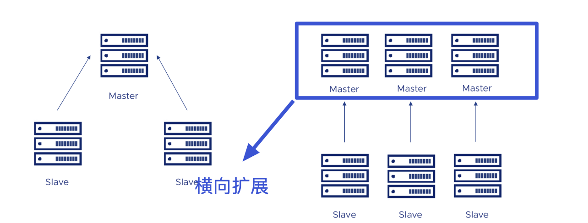
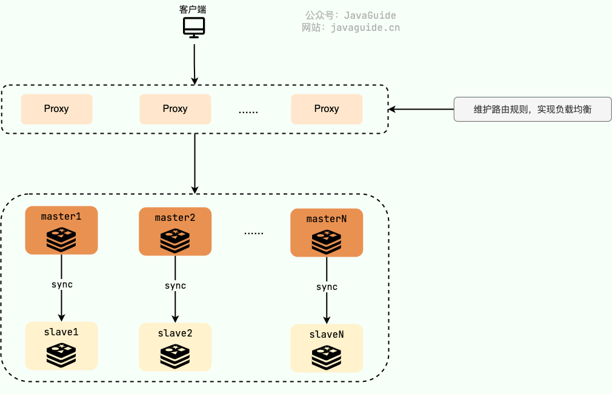
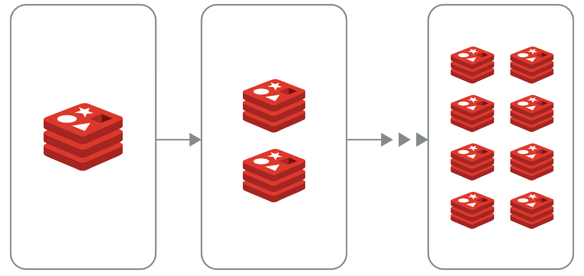
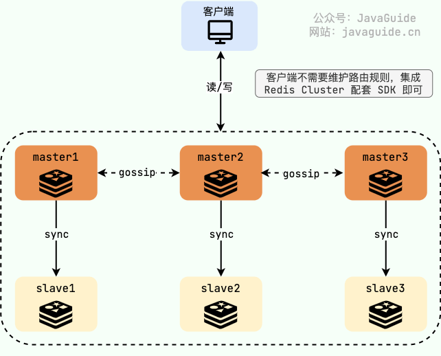
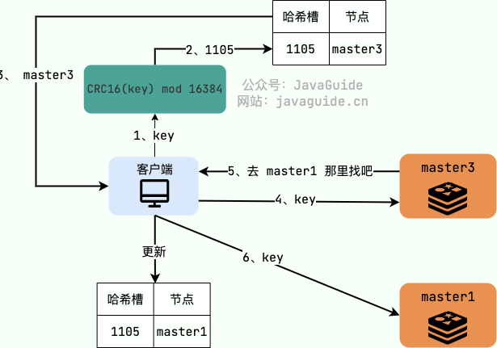
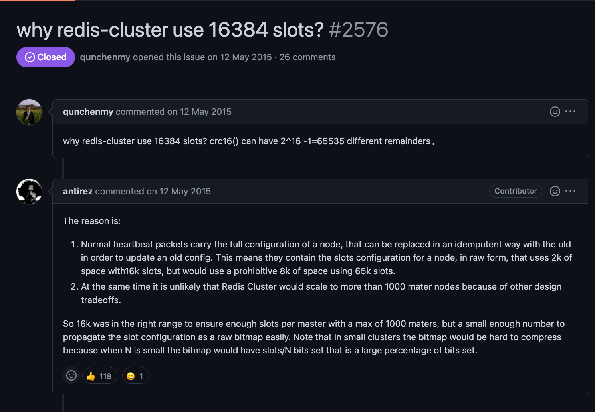

# Redis Cluster：缓存的数据量太大怎么办？

来来来！一起来盘盘 Redis Cluster 常见的问题。如果你的项目用到了 Redis 的话（大部分人的项目都用到了 Redis 来做分布式缓存），为了能比别人更有亮点，Redis Cluster 是一个不错的选择。


这篇文章原本写了接近 8000 字，有点写嗨了，后面删减到了现在的 5000+ 字。为了帮助理解，我手绘了很多张图解，尽可能用大白话的语言来讲。


建议带着下面这些重要的问题（面试常问）阅读：


+ 为什么需要 Redis Cluster？解决了什么问题？有什么优势？
+ Redis Cluster 是如何分片的？
+ 为什么 Redis Cluster 的哈希槽是 16384 个?
+ 如何确定给定 key 的应该分布到哪个哈希槽中？
+ Redis Cluster 支持重新分配哈希槽吗？
+ Redis Cluster 扩容缩容期间可以提供服务吗？
+ Redis Cluster 中的节点是怎么进行通信的？


## 为什么需要 Redis Cluster？


高并发场景下，使用 Redis 主要会遇到的两个问题：


1. **缓存的数据量太大** ：实际缓存的数据量可以达到几十 G，甚至是成百上千 G；
2. **并发量要求太大** ：虽然 Redis 号称单机可以支持 10w 并发，但实际项目中，不可靠因素太多，就比如一些复杂的写/读操作就可能会让这个并发量大打折扣。而且，就算真的可以实际支持 10w 并发，达到瓶颈了，可能也没办法满足系统的实际需求。


主从复制和 Redis Sentinel 这两种方案本质都是通过增加主库（master）的副本（slave）数量的方式来提高 Redis 服务的整体可用性和读吞吐量，都不支持横向扩展来缓解写压力以及解决缓存数据量过大的问题。





对于这两种方案来说，如果写压力太大或者缓存数据量太大的话，我们可以考虑提高服务器硬件的配置。不过，提高硬件配置成本太高，能力有限，无法动态扩容缩容，局限性太大。从本质上来说，靠堆硬件配置的方式并没有实质性地解决问题，依然无法满足高并发场景下分布式缓存的要求。


通常情况下，更建议使用 **Redis 切片集群** 这种方案，更能满足高并发场景下分布式缓存的要求。


简单来说，**Redis 切片集群** 就是部署多台 Redis 主节点（master），这些节点之间平等，并没有主从之说，同时对外提供读/写服务。缓存的数据库相对均匀地分布在这些 Redis 实例上，客户端的请求通过路由规则转发到目标 master 上。


为了保障集群整体的高可用，我们需要保证集群中每一个 master 的高可用，可以通过主从复制给每个 master 配置一个或者多个从节点（slave）。





**Redis 切片集群对于横向扩展非常友好，只需要增加 Redis 节点到集群中即可。**


在 Redis 3.0 之前，我们通常使用的是 [Twemproxy](https://github.com/twitter/twemproxy)、[Codis](https://github.com/CodisLabs/codis) 这类开源分片集群方案。Twemproxy、Codis 就相当于是上面的 Proxy 层，负责维护路由规则，实现负载均衡。


不过，Twemproxy、Codis 虽然未被淘汰，但官方已经没有继续维护了。


到了 Redis 3.0 的时候，Redis 官方推出了分片集群解决方案 [**Redis Cluster**](https://redis.io/topics/cluster-tutorial) 。经过多个版本的持续完善，Redis Cluster 成为 Redis 切片集群的首选方案，满足绝大部分高并发业务场景需求。


Redis Cluster 通过 **分片（Sharding）** 来进行数据管理，提供 **主从复制（Master-Slave Replication）**、**故障转移（Failover）** 等开箱即用的功能，可以非常方便地帮助我们解决 Redis 大数据量缓存以及 Redis 服务高可用的问题。


Redis Cluster 这种方案可以很方便地进行 **横向拓展（Scale Out）**，内置了开箱即用的解决方案。当 Redis Cluster 的处理能力达到瓶颈无法满足系统要求的时候，直接动态添加 Redis 节点到集群中即可。根据官方文档中的介绍，Redis Cluster 支持扩展到 1000 个节点。反之，当 Redis Cluster 的处理能力远远满足系统要求，同样可以动态删除集群中 Redis 节点，节省资源。





可以说，**Redis Cluster 的动态扩容和缩容是其最大的优势。**


虽说 Redis Cluster 可以扩展到 1000 个节点，但强烈不推荐这样做，应尽量避免集群中的节点过多。这是因为 Redis Cluster 中的各个节点基于 **Gossip 协议** 来进行通信共享信息，当节点过多时，Gossip 协议的效率会显著下降，通信成本剧增。


最后，总结一下 Redis Cluster 的主要优势：


+ 可以横向扩展缓解写压力和存储压力，支持动态扩容和缩容；
+ 具备主从复制、故障转移（内置了 Sentinel 机制，无需单独部署 Sentinel 集群）等开箱即用的功能。


## 一个最基本的 Redis Cluster 架构是怎样的？
为了保证高可用，Redis Cluster 至少需要 3 个 master 以及 3 个 slave，也就是说每个 master 必须有 1 个 slave。master 和 slave 之间做主从复制，slave 会实时同步 master 上的数据。


类似于 Redis 主从架构，这里的 slave 除了可以用来保障 master 的高可用之外，还可以对外提供读服务。slave 默认是可读的，不需要使用 `READONLY` 命令来设置从节点为只读模式。但在某些场景下，例如网络分区、手动故障转移，可能需要显式使用 `READONLY` 命令来确保从节点处于只读模式。另外，在 Redis 6 中，`replica-read-only` 参数默认为 `yes`，确保 slave 只能执行读操作，将其设置为 `no` 就是允许从节点执行写操作，但通常不推荐这样做。


如果 master 只有一个 slave 的话，master 宕机之后就直接使用这个 slave 替代 master 继续提供服务。假设 master1 出现故障，slave1 会直接替代 master1，保证 Redis Cluster 的高可用。





如果 master 有多个 slave 的话，Redis Cluster 中的其他节点会从这个 master 的所有 slave 中选出一个替代 master 继续提供服务。Redis Cluster 总是希望数据最完整的 slave 被提升为新的 master。


Redis Cluster 是去中心化的（各个节点基于 Gossip 进行通信），任何一个 master 出现故障，其它的 master 节点不受影响，因为 key 找的是哈希槽而不是 Redis 节点。不过，Redis Cluster 至少要保证宕机的 master 有一个 slave 可用。


如果宕机的 master 无 slave 的话，为了保障集群的完整性，保证所有的哈希槽都指派给了可用的 master ，整个集群将不可用。这种情况下，还是想让集群保持可用的话，可以将`cluster-require-full-coverage` 这个参数设置成 no，`cluster-require-full-coverage` 表示需要 16384 个 slot 都正常被分配的时候 Redis Cluster 才可以对外提供服务。


如果我们想要添加新的节点比如 master4、master5 进入 Redis Cluster 也非常方便，只需要重新分配哈希槽即可。


如果我们想要移除某个 master 节点的话，需要先将该节点的哈希槽移动到其他节点上，这样才可以进行删除，不然会报错。


## Redis Cluster 是如何分片的？


> 类似的问题：
>
>  
>
> + Redis Cluster 中的数据是如何分布的？
> + 如何确定给定 key 的应该分布到哪个哈希槽中？
>


Redis Cluster 并没有使用一致性哈希，采用的是 **哈希槽分区** ，每一个键值对都属于一个 **hash slot**（哈希槽） 。


Redis Cluster 通常有 **16384** 个哈希槽 ，要计算给定 key 应该分布到哪个哈希槽中，我们只需要先对每个 key 计算 CRC-16（XMODEM） 校验码，然后再对这个校验码对 16384(哈希槽的总数) 取模，得到的值即是 key 对应的哈希槽。


哈希槽的计算公式如下：


```c
HASH_SLOT = CRC16(key) mod NUMER_OF_SLOTS
```


创建并初始化 Redis Cluster 的时候，Redis 会自动平均分配这 16384 个哈希槽到各个节点，不需要我们手动分配。如果你想自己手动调整的话，Redis Cluster 也内置了相关的命令比如 `ADDSLOTS`、`ADDSLOTSRANGE`（后面会详细介绍到重新分配哈希槽相关的命令）。


假设集群有 3 个 Redis 节点组成，每个节点负责整个集群的一部分数据，哈希槽可能是这样分配的（这里只是演示，实际效果可能会有差异）：


+ Node 1 ： 0 - 5500 的 hash slots
+ Node 2 ： 5501 - 11000 的 hash slots
+ Node 3 ： 11001 - 16383 的 hash slots


在任意一个 master 节点上执行 `CLUSTER SLOTS`命令即可返回哈希槽和节点的映射关系：


```bash
127.0.0.1:7000>> CLUSTER SLOTS
# 哈希槽的范围
1) 1) (integer) 0
   2) (integer) 5500
   # master 的 ip 和端口号
   3) 1) "127.0.0.1"
      2) (integer) 7002
   # slave 的 ip 和端口号
   4) 1) "127.0.0.1"
      2) (integer) 8002
2) 1) (integer) 11001
   2) (integer) 16383
   3) 1) "127.0.0.1"
      2) (integer) 7000
   4) 1) "127.0.0.1"
      2) (integer) 8000
3) 1) (integer) 5501
   2) (integer) 11000
   3) 1) "127.0.0.1"
      2) (integer) 7001
   4) 1) "127.0.0.1"
      2) (integer) 8001
```


客户端连接 Redis Cluster 中任意一个 master 节点即可访问 Redis Cluster 的数据，当客户端发送命令请求的时候，需要先根据 key 通过上面的计算公示找到的对应的哈希槽，然后再查询哈希槽和节点的映射关系，即可找到目标节点。


如果哈希槽确实是当前节点负责，那就直接响应客户端的请求返回结果，如果不由当前节点负责，就会返回 `-MOVED` 重定向错误，告知客户端当前哈希槽是由哪个节点负责，客户端向目标节点发送请求并更新缓存的哈希槽分配信息。





这个时候你可能就会疑问：**为什么还会存在找错节点的情况呢？根据公式计算难道还会出错？**


这是因为 Redis Cluster 内部可能会重新分配哈希槽比如扩容缩容的时候（后文中有详细介绍到 Redis Cluster 的扩容和缩容问题），这就可能会导致客户端缓存的哈希槽分配信息会有误。


从上面的介绍中，我们可以简单总结出 Redis Cluster 哈希槽分区机制的优点：**解耦了数据和节点之间的关系，提升了集群的横向扩展性和容错性。**


## 为什么 Redis Cluster 的哈希槽是 16384 个?


CRC16 算法产生的校验码有 16 位，理论上可以产生 65536（2^16，0 ~ 65535）个值。为什么 Redis Cluster 的哈希槽偏偏选择的是 16384（2^14）个呢？


2015 年的时候，在 Redis 项目的 issues 区，已经有人提了类似的问题，地址：https://github.com/redis/redis/issues/2576。Redis 作者 antirez 巨佬本人专门对这个问题进行了回复。





antirez 认为哈希槽是 16384（2 的 14 次方） 个的原因是：


+ 正常的心跳包会携带一个节点的完整配置，它会以幂等的方式更新旧的配置，这意味着心跳包会附带当前节点的负责的哈希槽的信息。假设哈希槽采用 16384 ,则占空间 2k(16384/8)。假设哈希槽采用 65536， 则占空间 8k(65536/8)，这是令人难以接受的内存占用。
+ 由于其他设计上的权衡，Redis Cluster 不太可能扩展到超过 1000 个主节点。


也就是说，65536 个固然可以确保每个主节点有足够的哈希槽，但其占用的空间太大。而且，Redis Cluster 的主节点通常不会扩展太多，16384 个哈希槽完全足够用了。


`cluster.h` 文件中定义了消息结构 `clusterMsg`（源码地址：https://github.com/redis/redis/blob/7.0/src/cluster.h） ：


```c
typedef struct {
    // 省略部分字段
    // ......
    // 本节点负责的哈希槽信息,16384/8 个 char 数组，一共为16384bit
    unsigned char myslots[CLUSTER_SLOTS/8];
    // 集群的状态
    unsigned char state;
    // 消息的内容
    union clusterMsgData data;
} clusterMsg;
```


`myslots` 字段用于存储哈希槽信息， 属于无符号类型的 char 数组，数组长度为 16384/8 = 2048。C 语言中的 char 只占用一个字节，而 Java 语言中 char 占用两个字节，小伙伴们不要搞混了。


这里实际就是通过 bitmap 这种数据结构维护的哈希槽信息，每一个 bit 代表一个哈希槽，每个 bit 只能存储 0/1 。如果该位为 1，表示这个哈希槽是属于这个节点。


消息传输过程中，会对 myslots 进行压缩，bitmap 的填充率越低，压缩率越高。bitmap 的填充率的值是 **哈希槽总数/节点数** ，如果哈希槽总数太大的话，bitmap 的填充率的值也会比较大。


最后，总结一下 Redis Cluster 的哈希槽的数量选择 16384 而不是 65536 的主要原因：


+ 哈希槽太大会导致心跳包太大，消耗太多带宽；
+ 哈希槽总数越少，对存储哈希槽信息的 bitmap 压缩效果越好；
+ Redis Cluster 的主节点通常不会扩展太多，16384 个哈希槽已经足够用了。


## Redis Cluster 如何重新分配哈希槽？


如果你想自己手动调整的话，Redis Cluster 也内置了相关的命令：


+ `CLUSTER ADDSLOTS slot [slot ...]` : 把一组 hash slots 分配给接收命令的节点，时间复杂度为 O(N)，其中 N 是 hash slot 的总数；
+ `CLUSTER ADDSLOTSRANGE start-slot end-slot [start-slot end-slot ...]` （Redis 7.0 后新加的命令）： 把指定范围的 hash slots 分配给接收命令的节点，类似于 `ADDSLOTS` 命令，时间复杂度为 O(N) 其中 N 是起始 hash slot 和结束 hash slot 之间的 hash slot 的总数。
+ `CLUSTER DELSLOTS slot [slot ...]` : 从接收命令的节点中删除一组 hash slots；
+ `CLUSTER FLUSHSLOTS` ：移除接受命令的节点中的所有 hash slot；
+ `CLUSTER SETSLOT slot MIGRATING node-id`： 迁移接受命令的节点的指定 hash slot 到目标节点（node_id 指定）中；
+ `CLUSTER SETSLOT slot IMPORTING node-id`： 将目标节点（node_id 指定）中的指定 hash slot 迁移到接受命令的节点中；
+ ......


简单演示一下:


```bash
# 将 slot 1 2 3 4 5 分配给节点
> CLUSTER ADDSLOTS 1 2 3 4 5
OK
# 可以使用 ADDSLOTSRANGE 命令完成一样的效果
> CLUSTER ADDSLOTSRANGE 1 5
OK
# 从接收命令的节点中删除 hash slot 1000 1001 1002
> CLUSTER DELSLOTS 1000 1001 1002
# 迁移接受命令的节点的 hash slot 1005 到 node_id(一长串字符串)对应的节点中
> CLUSTER SETSLOT 1005 MIGRATING node_id(一长串字符串)
# 将node_id(一长串字符串)对应的节点中的 hash slot 1005 迁移到接受命令的节点中
> CLUSTER SETSLOT 1005 IMPORTING 92fd7c2a7b7b8933d1019e72a852f621f6b4faff
```


## Redis Cluster 扩容缩容期间可以提供服务吗？


> 类似的问题：
>
>  
>
> + 如果客户端访问的 key 所属的槽正在迁移怎么办？
> + 如何确定给定 key 的应该分布到哪个哈希槽中？
>


**Redis Cluster 扩容和缩容本质是进行重新分片，动态迁移哈希槽。**


为了保证 Redis Cluster 在扩容和缩容期间依然能够对外正常提供服务，Redis Cluster 提供了重定向机制，两种不同的类型：


+ **ASK 重定向** ：可以看做是临时重定向，后续查询仍然发送到旧节点。
+ **MOVED 重定向** ：可以看做是永久重定向，后续查询发送到新节点。


客户端向指定节点发送请求命令，从客户端的角度来看，ASK 重定向是下面这样的：


1. 如果请求的 key 对应的哈希槽还在当前节点的话，就直接响应客户端的请求。
2. 如果请求的 key 对应的哈希槽在迁移过程中，但是请求的 key 还未迁移走的话，说明当前节点任然可以处理当前请求，同样可以直接响应客户端的请求。
3. 如果客户端请求的 key 对应的哈希槽当前正在迁移至新的节点且请求的 key  已经被迁移走的话，就会返回 `-ASK` 重定向错误，告知客户端要将请求发送到哈希槽被迁移到的目标节点。 `-ASK` 重定向错误信息中包含请求 key 迁移到的新节点的信息。
4. 客户端收到 `-ASK` 重定向错误后，将会临时（一次性）重定向，自动向新节点发送一条 [ASKING](https://redis.io/commands/asking/) 命令。也就是说，接收到 ASKING 命令的节点会强制执行一次请求，下次再来需要重新提前发送 ASKING 命令。
5. 新节点在收到 ASKING 命令后可能会返回重试错误（TRYAGAIN），因为可能存在当前请求的 key 还在导入中但未导入完成的情况。
6. 客户端发送真正需要请求的命令。
7. ASK 重定向并不会同步更新客户端缓存的哈希槽分配信息，也就是说，客户端对正在迁移的相同哈希槽的请求依然会发送到旧节点而不是新节点。


如果客户端请求的 key 对应的哈希槽已经迁移完成的话，就会返回 `-MOVED` 重定向错误，告知客户端当前哈希槽是由哪个节点负责，客户端向新节点发送请求并更新缓存的哈希槽分配信息，后续查询将被发送到新节点。


## Redis Cluster 中的节点是怎么进行通信的？


Redis Cluster 是一个典型的分布式系统，分布式系统中的各个节点需要互相通信。既然要相互通信就要遵循一致的通信协议，Redis Cluster 中的各个节点基于 **Gossip 协议** 来进行通信共享信息，每个 Redis 节点都维护了一份集群的状态信息。


Redis Cluster 的节点之间会相互发送多种 Gossip 消息：


+ **MEET** ：在 Redis Cluster 中的某个 Redis 节点上执行 `CLUSTER MEET ip port` 命令，可以向指定的 Redis 节点发送一条 MEET 信息，用于将其添加进 Redis Cluster 成为新的 Redis 节点。
+ **PING/PONG** ：Redis Cluster 中的节点都会定时地向其他节点发送 PING 消息，来交换各个节点状态信息，检查各个节点状态，包括在线状态、疑似下线状态 PFAIL 和已下线状态 FAIL。
+ **FAIL** ：Redis Cluster 中的节点 A 发现 B 节点 PFAIL ，并且在下线报告的有效期限内集群中半数以上的节点将 B 节点标记为 PFAIL，节点 A 就会向集群广播一条 FAIL 消息，通知其他节点将故障节点 B 标记为 FAIL 。
+ ......


有了 Redis Cluster 之后，不需要专门部署 Sentinel 集群服务了。Redis Cluster 相当于是内置了 Sentinel 机制，Redis Cluster 内部的各个 Redis 节点通过 Gossip 协议互相探测健康状态，在故障时可以自动切换。


`cluster.h` 文件中定义了所有的消息类型（源码地址：https://github.com/redis/redis/blob/7.0/src/cluster.h） 。Redis 3.0 版本的时候只有 9 种消息类型，到了 7.0 版本的时候已经有 11 种消息类型了。


```c
// 注意，PING 、 PONG 和 MEET 实际上是同一种消息。
// PONG 是对 PING 的回复，它的实际格式也为 PING 消息，
// 而 MEET 则是一种特殊的 PING 消息，用于强制消息的接收者将消息的发送者添加到集群中（如果节点尚未在节点列表中的话）
#define CLUSTERMSG_TYPE_PING 0          /* Ping 消息 */
#define CLUSTERMSG_TYPE_PONG 1          /* Pong 用于回复Ping */
#define CLUSTERMSG_TYPE_MEET 2          /* Meet 请求将某个节点添加到集群中 */
#define CLUSTERMSG_TYPE_FAIL 3          /* Fail 将某个节点标记为 FAIL */
#define CLUSTERMSG_TYPE_PUBLISH 4       /* 通过发布与订阅功能广播消息 */
#define CLUSTERMSG_TYPE_FAILOVER_AUTH_REQUEST 5 /* 请求进行故障转移操作，要求消息的接收者通过投票来支持消息的发送者 */
#define CLUSTERMSG_TYPE_FAILOVER_AUTH_ACK 6     /* 消息的接收者同意向消息的发送者投票 */
#define CLUSTERMSG_TYPE_UPDATE 7        /* slots 已经发生变化，消息发送者要求消息接收者进行相应的更新 */
#define CLUSTERMSG_TYPE_MFSTART 8       /* 为了进行手动故障转移，暂停各个客户端 */
#define CLUSTERMSG_TYPE_MODULE 9        /* 模块集群API消息 */
#define CLUSTERMSG_TYPE_PUBLISHSHARD 10 /* 通过发布与订阅功能广播分片消息 */
#define CLUSTERMSG_TYPE_COUNT 11        /* 消息总数 */
```


`cluster.h` 文件中定义了消息结构 `clusterMsg`（源码地址：https://github.com/redis/redis/blob/7.0/src/cluster.h） ：


```c
typedef struct {
    char sig[4];        /* 标志位，"RCmb" (Redis Cluster message bus). */
    uint32_t totlen;    /* 消息总长度 */
    uint16_t ver;       /* 消息协议版本 */
    uint16_t port;      /* 端口 */
    uint16_t type;      /* 消息类型 */
    char sender[CLUSTER_NAMELEN];  /* 消息发送节点的名字（ID） */
    // 本节点负责的哈希槽信息,16384/8 个 char 数组，一共为16384bit
    unsigned char myslots[CLUSTER_SLOTS/8];
    // 如果消息发送者是一个从节点，那么这里记录的是消息发送者正在复制的主节点的名字
    // 如果消息发送者是一个主节点，那么这里记录的是 REDIS_NODE_NULL_NAME
    // （一个 40 字节长，值全为 0 的字节数组）
    char slaveof[CLUSTER_NAMELEN];
    // 省略部分属性
    // ......
    // 集群的状态
    unsigned char state;
    // 消息的内容
    union clusterMsgData data;
} clusterMsg;
```


`clusterMsgData` 是一个联合体(union）,可以为 PING，MEET，PONG 、FAIL 等消息类型。当消息为 PING、MEET 和 PONG 类型时，都是 ping 字段是被赋值的，这也就解释了为什么我们上面说 PING 、 PONG 和 MEET 实际上是同一种消息。


```c
union clusterMsgData {
    /* PING, MEET and PONG */
    struct {
        /* Array of N clusterMsgDataGossip structures */
        clusterMsgDataGossip gossip[1];
    } ping;

    /* FAIL */
    struct {
        clusterMsgDataFail about;
    } fail;

    /* PUBLISH */
    struct {
        clusterMsgDataPublish msg;
    } publish;

    /* UPDATE */
    struct {
        clusterMsgDataUpdate nodecfg;
    } update;

    /* MODULE */
    struct {
        clusterMsgModule msg;
    } module;
};
```


## 参考


+ Redis Cluster 官方规范：[https://redis.io/docs/reference/cluster-spec/](https://redis.io/docs/reference/cluster-spec/)
+ Redis Cluster 官方教程：[https://redis.io/topics/cluster-tutorial](https://redis.io/topics/cluster-tutorial)
+ Redis Cluster 官方公开 PDF 讲义：[https://redis.io/presentation/Redis_Cluster.pdf](https://redis.io/presentation/Redis_Cluster.pdf)
+ Redis 集群详述：[https://juejin.cn/post/7016865316240097287](https://juejin.cn/post/7016865316240097287)
+ Redis 专题：了解 Redis 集群，这篇就够了：[https://juejin.cn/post/6949832776224866340](https://juejin.cn/post/6949832776224866340)
+ Redis Notes - Cluster mode：[https://www.stevenchang.tw/blog/2020/12/08/redis-notes-cluster-mode](https://www.stevenchang.tw/blog/2020/12/08/redis-notes-cluster-mode)
+ 带有详细注释的 Redis 3.0 代码（开源项目）：[https://github.com/huangz1990/redis-3.0-annotated](https://github.com/huangz1990/redis-3.0-annotated)


> 更新: 2025-01-14 16:16:35  
> 原文: <https://www.yuque.com/snailclimb/mf2z3k/ikf0l2>