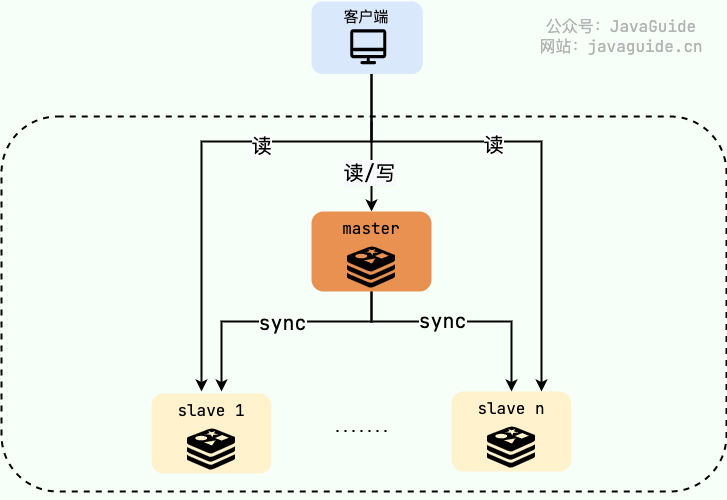
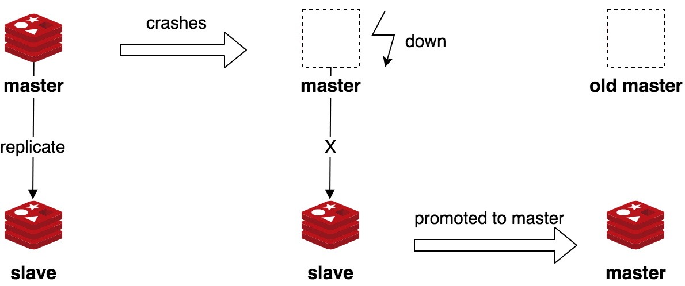
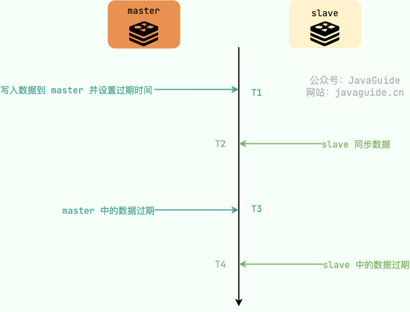
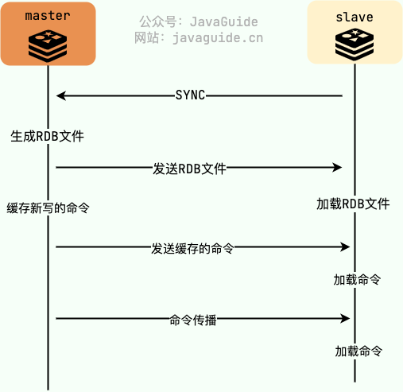
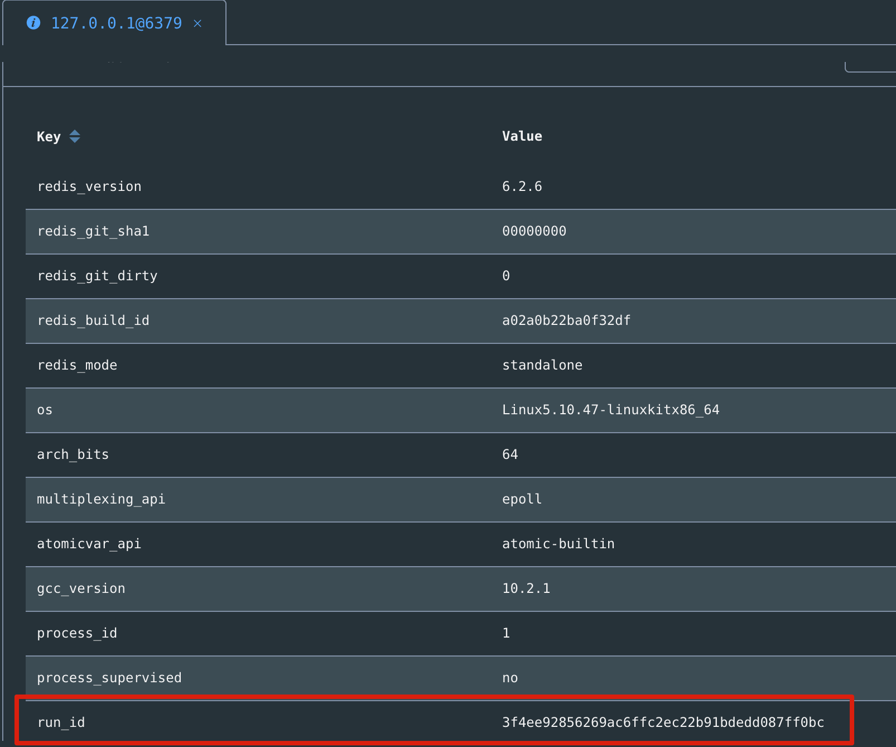
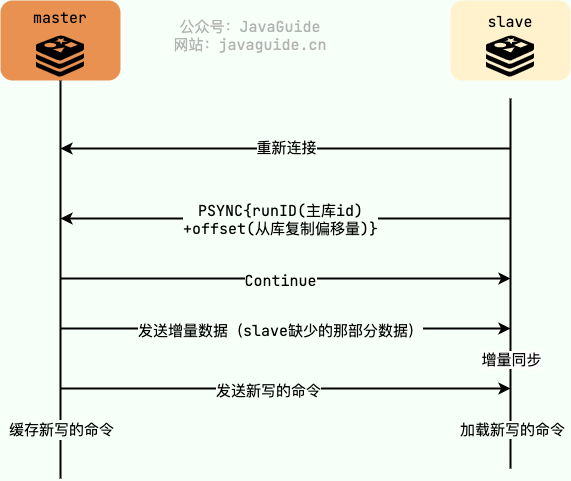
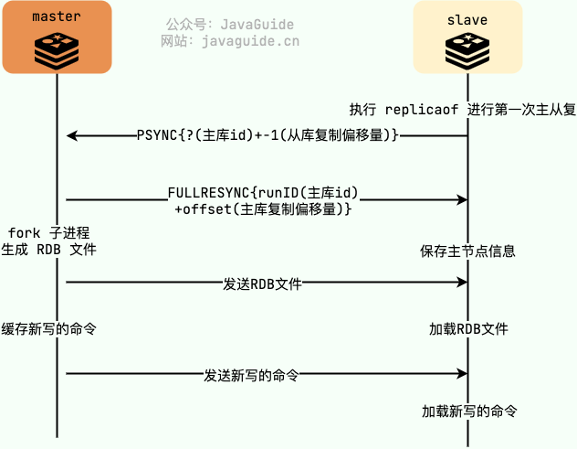
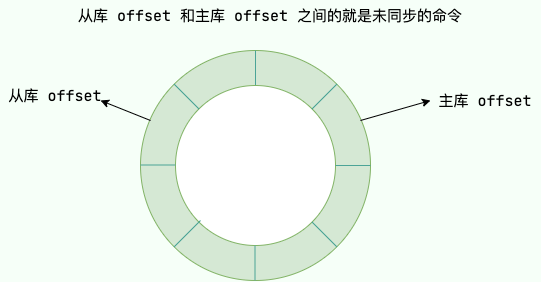
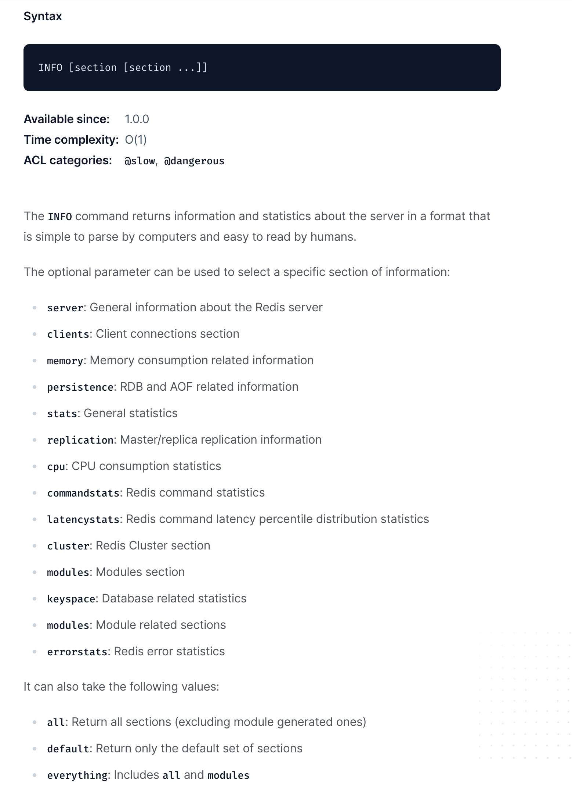

# Redis 主从复制：主从节点之间如何同步数据？

单机 Redis 存在单点风险问题，也就是说，如果唯一的一个 Redis 节点宕机的话，就会导致大量的请求直接被打到数据库，严重的情况下，数据库很可能会直接被干宕机了。


这个时候，保障 Redis 服务的高可用就成为了我们不得不面对的问题。


**如何保证 Redis 服务高可用？** 最简单的一种办法就是基于 **主从复制** 搭建一个 Redis 集群，master（主节点）主要负责处理写请求，slave（从节点）主要负责处理读请求。





如果 master 宕机的话，从 slave 中选出一台作为 master 即可实现故障转移（Failover）。





是不是有点类似于 MySQL 的读写分离？这其实就是一种典型的多副本/备份的思想，经常被用在高可用架构上。


## 什么是主从复制？


简单来说，**主从复制** 就是将一台 Redis 主节点的数据复制到其他的 Redis 从节点中，尽最大可能保证 Redis 主节点和从节点的数据是一致的。主从复制是 Redis 高可用的基石，我们后面介绍到的 Redis Sentinel 以及 Redis Cluster 都依赖于主从复制。


**主从复制这种方案不仅保障了 Redis 服务的高可用，还实现了读写分离，提高了系统的并发量，尤其是读并发量。**


主从复制这种方案基于 [Redis replication](https://redis.io/docs/manual/replication/)（默认使用异步复制），开发者可以通过 `replicaof` （Redis 5.0 之前是 slaveof 命令）命令来配置各个 Redis 节点的主从关系。


```bash
# 在指定 redis 节点上执行 replicaof 命令就可以让其成为 master 的 slave
# ip port 是 master 的
replicaof ip port
```


配置完成之后，主从节点之间的数据同步会自动进行，不需要人为插手。


至于具体要配置多少 slave 节点，主要取决于项目的读吞吐量，因为 slave 节点分担的是读请求，写请求由 master 节点负责。


## 主从复制下从节点会主动删除过期数据吗？


> 类似的问题：
>
>  
>
> + 主从复制下会读取到过期的数据吗？
> + 主从复制下如何避免读取到过期的数据?
>


这是一个常见的问题，面试中也经常会问到。


我们知道，Redis 中常用的过期数据的删除策略就两个（重要！自己造缓存轮子的时候需要格外考虑的东西）：


+ **惰性删除** ：只会在取出 key 的时候才对数据进行过期检查。这样对 CPU 最友好，但是可能会造成太多过期 key 没有被删除。
+ **定期删除** ： 每隔一段时间抽取一批 key 执行删除过期 key 操作。并且，Redis 底层会通过限制删除操作执行的时长和频率来减少删除操作对 CPU 时间的影响。


定期删除对内存更加友好，惰性删除对 CPU 更加友好。两者各有千秋，所以 Redis 采用的是 **定期删除+惰性/懒汉式删除** 。


**那客户端读取从节点会读取到过期数据么？** 答案是：有可能，但要看具体的情况。


+ Redis 3.2 版本之前，客户端读从库并不会判断数据是否过期，有可能返回过期数据。Redis 3.2 版本及之后，客户端读从库会先判断数据是否过期，如果读取的数据已经过期了，从库虽然不会删除，但是会返回空值，这就避免了客户端读到过期数据。
+ 采用 `EXPIRE` 或者`PEXPIRE`设置过期时间的话，表示的是从执行这个命令开始往后 TTL 时间过期。如果从节点同步执行命令因为网络等原因延迟的话，客户端就可能会读取到过期的数据（如下图所示，客户端在 T3-T4 之间读取到的就是过期数据）。这种情况可以考虑使用 `EXPIREAT` 和 `PEXPIREAT`，这两个命令语义和效果和 `EXPIRE` 或者`PEXPIRE`类似，但不是指定 TTL（生存时间）的秒数/毫秒数，而是使用绝对的 [Unix 时间戳](http://en.wikipedia.org/wiki/Unix_time)（自 1970 年 1 月 1 日以来的秒数）。由于设置的是时间点，主从节点的时钟需要保持一致。





## 主从节点之间如何同步数据？


> 类似的问题：
>
>  
>
> + 主从复制的原理是什么？
> + master 节点的数据是如何同步给 slave 节点的?
> + 复制积压缓冲区的有什么用?
>


这个问题其实还挺复杂的，Redis 主从复制经历了多次改进，每一次的改进都解决了上一个版本的一些痛点。想要彻底搞懂的话，我们需要耐心地看看 Redis 主从复制的演进历程，这里主要分为下面 3 个阶段：


+ Redis 2.8 之前的 SYNC 方案
+ Redis 2.8 PSYNC 方案
+ Redis 4.0 PSYNC2.0 方案


为了让大家更好理解，我这里已经是经我所能使用大白话讲解了，并且，还配有图解。


需要注意：每一个版本的方案基本都是持续优化改进得到的。


### Redis 2.8 之前的 SYNC 方案


Redis 在 2.8 版本之前都是基于 [SYNC](https://redis.io/commands/sync/) 命令执行全量同步，整个步骤简化后是这样的：


1. slave 向 master 发送 SYNC 命令请求启动复制流程；
2. master 收到 SYNC 命令之后执行 [BGSAVE](https://redis.io/commands/bgsave/) 命令（子线程执行，不会阻塞主线程）生成 RDB 文件（dump.rdb）；
3. master 将生成的 RDB 文件发送给 slave；
4. slave 收到 RDB 文件之后就开始加载解析 RDB 同步更新本地数据；
5. 更新完成之后，slave 的状态相当于是 master 执行 BGSAVE 命令时的状态。master 会将 BGSAVE 命令之后接受的写命令缓存起来，因为这部分写命令 slave 还未同步；
6. master 将自己缓存的这些写命令发送给 slave，slave 执行这些写命令同步 master 的最新状态；
7. slave 到这个时候已经完成全量复制，后续会通过和 master 维护的长连接来进行命令传播，同步最新的写命令。





master 为每一个 slave **单独** 开辟一块 **replication buffer（复制缓存区）**来记录 RDB 文件生成后 master 收到的所有写命令。


replication buffer 可以通过下面这些参数来控制，超过指定的阈值后，master 就会强制断开对应 slave 的连接。


```c
client-output-buffer-limit normal 0 0 0
client-output-buffer-limit replica 256mb 64mb 60
client-output-buffer-limit pubsub 32mb 8mb 60
```


执行 BGSAVE 命令之后，Redis 主线程会专门 fork 一个子进程，子进程共享主线程的内存数据。子进程会读取主线程中的内存数据写入 RDB 文件中，不会阻塞主线程。


> 这里说 Redis 主线程而不是主进程的主要是因为 Redis 启动之后主要是通过单线程的方式完成主要的工作。如果你想将其描述为 Redis 主进程，也没毛病。
>


虽然 BGSAVE 子进程写入 RDB 的工作不会阻塞主线程，但会对机器的 CPU 资源和内存资源产生影响，严重的情况下甚至会直接把 Redis 服务干宕机。


+ 写入 RDB 的过程中，为了避免影响写操作，主线程修改的内存数据会被复制一份副本，BGSAVE 子进程把这个副本数据写入 RDB 文件。如果修改内存数据的请求比较多的话，生成内存数据副本产生的内存消耗是非常大的。这个过程称为 **Copy On Write（写时复制，COW）** ，操作系统层面提供的机制。
+ 大量的写时复制会产生大量的分页错误（也叫缺页中断、页缺失），消耗大量的 CPU 资源。


也就是说，通过 BGSAVE 操作属于重量级操作，会对机器的 CPU 资源和内存资源产生影响。在生产环境中，我们应该尽量避免在 master 实例上频繁执行 BGSAVE 命令。


除了上面这个问题之外，Redis 在 2.8 版本之前主从复制还存在下面这些迫切需要解决的问题：


+ slave 加载 RDB 的过程中不能对外提供读服务。
+ slave 和 master 断开连接之后，slave 重新连上 master 需要重新进行全量同步。


### Redis 2.8 PSYNC 方案


Redis 2.8 版本 SYNC 命令被 [PSYNC](https://redis.io/commands/psync/) 取代，PSYNC 格式如下（相比较于 SYNC 命令，多了两个参数）：


```bash
PSYNC replicationid offset
```


PSYNC 解决了 slave 和 master 断开连接之后需要重新进行全量同步的问题。不过，部分情况（比如 slave 突然宕机或者被重启）重连之后依然需要进行全量同步。


具体是怎么解决的呢？原理其实也很简单，slave 会记录 master 的运行 id （也就是 runid）和自己的复制进度/偏移量（slave_repl_offset）。


每个 Redis 节点启动时都有一个 40 字节随机字符串作为运行 id，你可以通过 `info server` 命令查看 runid 的值。





master 也会记录自己写入缓冲区的偏移量（master_repl_offset），如果 runid 匹配的话，通过 slave_repl_offset 和 master_repl_offset 就可以确认 slave 缺少的数据是否在缓冲区中以及缺少的具体是哪一部分的数据。


这里集合 Redis 的源码简单介绍一下整个过程，源码地址：[https://github.com/redis/redis/blob/2.8/src/replication.c](https://github.com/redis/redis/blob/2.8/src/replication.c)。


`masterTryPartialResynchronization()` (`replication.c`中的一个方法)的部分重要源码：


```c
// slave 发送的 runid 值必须和 master 的 runid 值相等
// 只有相等才有机会进行增量同步
// strcasecmp()函数用忽略大小写比较字符串，相等则返回 0
if (strcasecmp(master_runid, server.runid)) {
    // 判断是否是第一次进行主从复制
    // 第一次进行主从复制，还不知道 master 的 runid，所以将 runid 设为”？“
    // 第一次复制的话也是全量同步
    if (master_runid[0] != '?') {
      // 不是第一次复制
      redisLog(REDIS_NOTICE,"Partial resynchronization not accepted: "
               "Runid mismatch (Client asked for '%s', I'm '%s')",
               master_runid, server.runid);
    } else {
      // 开始全量同步
      redisLog(REDIS_NOTICE,"Full resync requested by slave %s",
               replicationGetSlaveName(c));
    }
    goto need_full_resync;
}
```


如果 slave 和 master **重连** （注意这里是重连！！！首次连接依然要进行全量复制） 的话，slave 会告诉 master 自己记录的 runid 以及 slave_repl_offset。


master 接收到之后，会先判断 slave 发送的 runid 值是否和自己的 runid 值相等，只有相等才有机会进行增量同步。


`masterTryPartialResynchronization()` (`replication.c`中的一个方法)的部分重要源码:


```c
// 判断 slave 缺少的那部分数据是否在缓冲区中
// repl_backlog 是一个固定大小(默认1M)的环形缓冲区
// repl_backlog_histlen 是缓冲区中的实际数据大小,repl_backlog_histlen 只能增长到 repl_backlog_size(缓冲区规定的大小)
// redis replication lag #2375：https://github.com/redis/redis/issues/2375
if (!server.repl_backlog ||
      psync_offset < server.repl_backlog_off ||
      psync_offset > (server.repl_backlog_off + server.repl_backlog_histlen))
  {
    redisLog(REDIS_NOTICE,
             "Unable to partial resync with slave %s for lack of backlog (Slave request was: %lld).", replicationGetSlaveName(c), psync_offset);
    if (psync_offset > server.master_repl_offset) {
      redisLog(REDIS_WARNING,
               "Warning: slave %s tried to PSYNC with an offset that is greater than the master replication offset.", replicationGetSlaveName(c));
    }
    goto need_full_resync;
}
```


如果 master 发现 slave 缺少的数据自己刚好缓存了的话，就会直接发给 slave。如果没有的话，那就没办法了，还是要进行全量同步操作，和 Redis 在 2.8 版本之前的 [SYNC](https://redis.io/commands/sync/) 一样。





**注意！！！** PSYNC 方案中，如果是首次连接的话，还是要进行全量复制。


如下图所示，slave 向 master 发送 PSYNC 命令，由于当前是第一次进行主从复制，还不知道 master 的 runid，所以将 runid 设为“？”，将 offset 设为 -1。





**master 如何通过复制偏移量找到 slave 缺少的数据从而避免全量复制呢？**


master 通过一个环形的 **复制积压缓冲区（repl_backlog_buffer）** 来记录从生成 RDB 文件开始收到的所有写命令。一个 master 中只有一个复制积压缓冲区，master 所有的 slave **共用**。





repl_backlog_buffer 是一个固定长度的队列（FIFO，先进先出），默认为 1MB 大小，支持自定义大小。


repl_backlog_buffer 的信息在 Replication 块里，你可以通过 `INFO replication` 命令查看：


```java
> INFO replication
# Replication
role:master
connected_slaves:0
master_failover_state:no-failover
master_replid:7fcbcb3ce3cf865d10f760ac96c1eebe83736b5c
master_replid2:0000000000000000000000000000000000000000
master_repl_offset:0
second_repl_offset:-1
repl_backlog_active:0
repl_backlog_size:1048576
repl_backlog_first_byte_offset:0
repl_backlog_histlen:0
```


如果 slave 缺少的那部分数据存在这个队列中，可以进行增量同步。否则的话， 还是要进行全量同步操作。


> 多提一嘴，[INFO](https://redis.io/commands/info/) 命令非常强大，可以看的信息非常多，比如你可以使用 `INFO clients`查看连接的客户端信息、使用 `INFO memory` 查看内存相关的信息。
>
>  
>
> 一定要掌握INFO 命令的使用！
>
>  
>
> 
>


另外，下面这些情况也还是需要进行全量同步：


+ slave 突然宕机或者被重启， runid、offset 都丢失了；
+ master 突然宕机，新选出来的 master 的 runid 和 offset 都会发生变化。


可以看出，Redis 2.8 PSYNC 依然还是有很多缺陷，全量同步问题依然没有真正解决。


### Redis 4.0 PSYNC2.0 方案


PSYNC 方案中，我们通过 runid（master 的 id）+ offset（复制偏移量）来实现增量同步。不过，由于主从切换之后新选出来的 master 的 runid 和 offset 都会发生变化，依然需要进行全量同步。


Redis 4.0 PSYNC2.0 方案优化了 PSYNC 方案的增量同步方案，即使发生了主从切换，依然有可能进行增量同步而不是必须要全量同步。


举个例子：master 有 2 个 slave(slave1 和 slave2)，master 宕机后，slave1 成为了新的 master。PSYNC 方案中，slave2 只能和新的 master 进行全量同步（master 的 runid 已经改变了）。PSYNC2.0 方案中，slave2 是有可能是可以和新的 master 进行增量同步的。


为了达到这一效果，PSYNC2.0 舍弃了 runid 的概念了，取而代之的是`replid` 和 `replid2`：


+ 对于 master 来说，`replid` 就是自己的复制 id。没有发生主从切换之前，`replid2`为空。发生主从切换之后，新的 master 的 `replid2`是旧 master （前一个自己同步的 master） 的 replid，在主从角色切换的时候会用到。
+ 对于 slave 来说，`replid` 保存的是自己当前正在同步的 master 的 replid。`replid2`保存的是旧 master 的 replid，在主从角色切换的时候会用到。


还有两个和偏移量相关的字段：


+ `master_repl_offset` : 当前的复制偏移量。
+ `second_replid_offset` ：没有发生主从切换之前，`second_replid_offset`的值为 -1。发生主从切换之后，新的 master 的 `second_replid_offset`是旧 master 的复制偏移量。


对应的源码如下：


```c
struct redisServer {
    // ...
    char replid[CONFIG_RUN_ID_SIZE+1];  /* My current replication ID. */
    char replid2[CONFIG_RUN_ID_SIZE+1]; /* replid inherited from master*/
    long long master_repl_offset;   /* My current replication offset */
    long long second_replid_offset; /* Accept offsets up to this for replid2. */
    // ...
}
```


这里集合 Redis 的源码简单介绍一下整个过程，源码地址：[https://github.com/redis/redis/blob/4.0/src/replication.c](https://github.com/redis/redis/blob/4.0/src/replication.c) 。


`masterTryPartialResynchronization()` (`replication.c`中的一个方法)的部分重要源码:


```c
// 下面是判断是否需要全量同步的逻辑
// strcasecmp()函数用忽略大小写比较字符串，相等则返回 0
if (  // slave 发送过来的 replid 和当前 master 的 replid 不同
    strcasecmp(master_replid, server.replid) &&
    // slave 发送过来的 replid 和当前 master 的 replid2 不同
    // 或者 slave 和当前 master 的同步进度不匹配
    (strcasecmp(master_replid, server.replid2) ||
     psync_offset > server.second_replid_offset)) {
  // 判断是否是第一次进行主从复制
  // 第一次进行主从复制，还不知道 master 的 runid，所以将 runid 设为”？“
  // 第一次复制的话也是全量同步
  if (master_replid[0] != '?') {
    if (strcasecmp(master_replid, server.replid) &&
        strcasecmp(master_replid, server.replid2)) {
      serverLog(LL_NOTICE,
                "Partial resynchronization not accepted: "
                "Replication ID mismatch (Replica asked for '%s', my "
                "replication IDs are '%s' and '%s')",
                master_replid, server.replid, server.replid2);
    } else {
      serverLog(LL_NOTICE,
                "Partial resynchronization not accepted: "
                "Requested offset for second ID was %lld, but I can reply "
                "up to %lld",
                psync_offset, server.second_replid_offset);
    }
  } else {
    serverLog(LL_NOTICE, "Full resync requested by replica %s",
              replicationGetSlaveName(c));
  }
  //需要全量同步
  goto need_full_resync;
}
}
```


`replid` 和 `replid2`用于判断发生主从切换之后，新的 master 和 slave 曾经属于同一个主库。如果属于同一个主库，可以进行增量同步的尝试。


`masterTryPartialResynchronization()` (`replication.c`中的一个方法)的部分重要源码:


```c
// slave 和 master 的同步进度必须在规定范围，不能超过 repl_backlog  的大小
// master 的同步进度也要比 slave 更快
if (!server.repl_backlog ||
        psync_offset < server.repl_backlog_off ||
        psync_offset > (server.repl_backlog_off + server.repl_backlog_histlen))
  serverLog(LL_NOTICE,
            "Unable to partial resync with replica %s for lack of backlog "
            "(Replica request was: %lld).",
            replicationGetSlaveName(c), psync_offset);
  if (psync_offset > server.master_repl_offset) {
    serverLog(LL_WARNING,
              "Warning: replica %s tried to PSYNC with an offset that is "
              "greater than the master replication offset.",
              replicationGetSlaveName(c));
  }
  goto need_full_resync;
}
// ...
}
```


master 的同步进度必须比 slave 更快并且两者的同步进度必须在规定范围，不能超过 repl_backlog 的大小，否则的话，还是要进行全量同步操作。


另外，为了解决 slave 在重启之后需要跟 master 全量同步的问题，RDB 会记录主从复制相关的信息（比如 replid）。


## 为什么主从全量复制使用 RDB 而不是 AOF？


题其实本质是在对比 RDB 和 AOF 这两种持久化方式。


+ RDB 文件存储的内容是经过压缩的二进制数据，文件很小。AOF 文件存储的是每一次写命令，类似于 MySQL 的 binlog 日志，通常会必 RDB 文件大很多。因此，传输 RDB 文件更节省带宽，速度也更快。
+ 使用 RDB 文件恢复数据，直接解析还原数据即可，不需要一条一条地执行命令，速度非常快。而 AOF 则需要依次执行每个写命令，速度非常慢。也就是说，与 AOF 相比，恢复大数据集的时候，RDB 速度更快。
+ AOF 需要选择合适的刷盘策略，如果刷盘策略选择不当的话，会影响 Redis 的正常运行。并且，根据所使用的刷盘策略，AOF 的速度可能会慢于 RDB。


## 主从复制方案有什么痛点？


主从复制方案下，master 发生宕机的话可以手动将某一台 slave 升级为 master，Redis 服务可用性提高。slave 可以分担读请求，读吞吐量大幅提高。


但其缺陷也很明显，一旦 master 宕机，我们需要从 slave 中手动选择一个新的 master，同时需要修改应用方的主节点地址，还需要命令所有从节点去复制新的主节点，整个过程需要人工干预。人工干预大大增加了问题的处理时间以及出错的可能性。


这个时候你肯定在想：如果能够自动化地完成故障切换就好了！我们后面介绍的 Redis Sentinel（哨兵）就可以帮助我们来解决这个痛点。


另外，主从复制方案在高并发场景下能力有限。如果缓存的数据量太大或者并发量要求太高，主从复制就没办法满足我们的要求了。


主从复制和 Redis Sentinel 这两种方案都不支持横向扩展来缓解写压力以及解决缓存数据量过大的问题。我们后面介绍的 Redis Cluster（官方切片集群解决方案）就可以帮助我们来解决这个痛点。


## 参考


+ Redis Replication：[https://redis.io/docs/manual/replication/](https://redis.io/docs/manual/replication/)
+ Redis persistence：[https://redis.io/docs/manual/persistence/](https://redis.io/docs/manual/persistence/)
+ 《Redis 设计与实现》十五 | 复制
+ 《Redis 核心技术与实战》06 | 数据同步：主从库如何实现数据一致？：[http://gk.link/a/11Cxj](http://gk.link/a/11Cxj)
+ Redis 主从复制演进历程与百度实践 - InfoQ：[https://mp.weixin.qq.com/s/N8kkF2zVZfRK2tSkuLJb7A](https://mp.weixin.qq.com/s/N8kkF2zVZfRK2tSkuLJb7A)
+ Redis系列（2） — 主从读写分离：[https://juejin.cn/post/7033001311180488735](https://juejin.cn/post/7033001311180488735)
+ Redis 4.0 psync 优化：[https://toutiao.io/posts/oir83l/preview](https://toutiao.io/posts/oir83l/preview)
+ The difference between AOF and RDB persistence：[https://www.sobyte.net/post/2022-04/redis-rdb-and-aof/](https://www.sobyte.net/post/2022-04/redis-rdb-and-aof/)


> 更新: 2024-11-02 21:12:14  
> 原文: <https://www.yuque.com/snailclimb/mf2z3k/ks9olb19hc9wse5k>