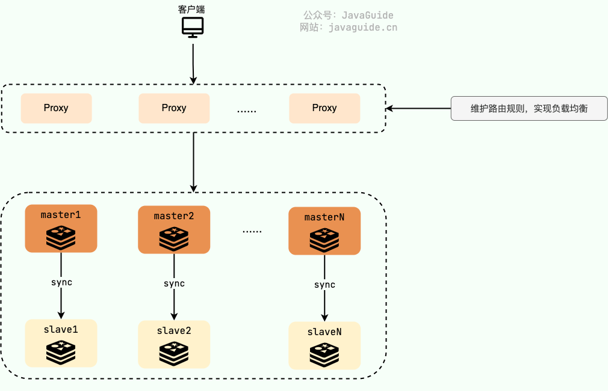

# Redis 生产问题：内存满了怎么解决？

Redis 的内存使用受最大内存阈值 `maxmemory` 参数限制。这个阈值是通过`redis.conf`的`maxmemory`参数来定义的。64 位操作系统下，`maxmemory` 默认为 0 ，表示不限制内存大小。32 位操作系统下，默认的最大内存值是 3GB。


你可以使用命令 `config get maxmemory` 来查看 `maxmemory`的值，使用 `info memory` 命令查看 Redis 内存相关的信息。


```bash
> config get maxmemory
maxmemory
0
> info memory
used_memory:104857600
maxmemory:0
...
```


如果要修改最大内存阈值的话，一种方式是修改 `redis.conf` 中对应配置（找到 `maxmemory` 参数），还有一种方式是使用 `config set` 命令：


```bash
config set maxmemory 2147483648 # 设置为 2GB（单位为字节）
```


Redis 的内存淘汰策略只有在运行内存达到了配置的最大内存阈值时才会触发。


Redis 提供了 6 种内存淘汰策略：

1. **volatile-lru（least recently used）**：从已设置过期时间的数据集（`server.db[i].expires`）中挑选最近最少使用的数据淘汰。
2. **volatile-ttl**：从已设置过期时间的数据集（`server.db[i].expires`）中挑选将要过期的数据淘汰。
3. **volatile-random**：从已设置过期时间的数据集（`server.db[i].expires`）中任意选择数据淘汰。
4. **allkeys-lru（least recently used）**：从数据集（`server.db[i].dict`）中移除最近最少使用的数据淘汰。
5. **allkeys-random**：从数据集（`server.db[i].dict`）中任意选择数据淘汰。
6. **no-eviction**（默认内存淘汰策略）：禁止驱逐数据，当内存不足以容纳新写入数据时，新写入操作会报错。

4.0 版本后增加以下两种：

7. **volatile-lfu（least frequently used）**：从已设置过期时间的数据集（`server.db[i].expires`）中挑选最不经常使用的数据淘汰。
8. **allkeys-lfu（least frequently used）**：从数据集（`server.db[i].dict`）中移除最不经常使用的数据淘汰。


`allkeys-xxx` 表示从所有的键值中淘汰数据，而 `volatile-xxx` 表示从设置了过期时间的键值中淘汰数据。


`config.c`中定义了内存淘汰策略的枚举数组：

```c
configEnum maxmemory_policy_enum[] = {
    {"volatile-lru", MAXMEMORY_VOLATILE_LRU},
    {"volatile-lfu", MAXMEMORY_VOLATILE_LFU},
    {"volatile-random",MAXMEMORY_VOLATILE_RANDOM},
    {"volatile-ttl",MAXMEMORY_VOLATILE_TTL},
    {"allkeys-lru",MAXMEMORY_ALLKEYS_LRU},
    {"allkeys-lfu",MAXMEMORY_ALLKEYS_LFU},
    {"allkeys-random",MAXMEMORY_ALLKEYS_RANDOM},
    {"noeviction",MAXMEMORY_NO_EVICTION},
    {NULL, 0}
};
```


你可以使用 `config get maxmemory-policy` 命令来查看当前 Redis 的内存淘汰策略。


```bash
> config get maxmemory-policy
maxmemory-policy
noeviction
```


可以通过`config set maxmemory-policy 内存淘汰策略` 命令修改内存淘汰策略，立即生效，但这种方式重启 Redis 之后就失效了。修改 `redis.conf` 中的 `maxmemory-policy` 参数不会因为重启而失效，不过，需要重启之后修改才能生效。


```properties
maxmemory-policy noeviction
```

****

**Redis 内存淘汰策略选择建议**：

+ **缓存优化**：选择 `allkeys-lru` 或 `allkeys-lfu`。
+ **避免关键数据丢失**：选择 `noeviction` 并监控内存。
+ **TTL 优先**：选择 `volatile-xxx`。


没有银弹，具体选择哪种策略取决于你的具体应用场景和需求。


关于淘汰策略的详细说明可以参考 Redis 官方文档：[https://redis.io/docs/reference/eviction/](https://redis.io/docs/reference/eviction/) 。


如果 Redis 单节点的内存实在无法满足需求，可以使用 **Redis 切片集群**。简单来说，**Redis 切片集群** 就是部署多台 Redis 主节点（master），这些节点之间平等，并没有主从之说，同时对外提供读/写服务。缓存的数据库相对均匀地分布在这些 Redis 实例上，客户端的请求通过路由规则转发到目标 master 上。





在 Redis 3.0 之前，我们通常使用的是 [Twemproxy](https://github.com/twitter/twemproxy)、[Codis](https://github.com/CodisLabs/codis) 这类开源分片集群方案。Twemproxy、Codis 就相当于是上面的 Proxy 层，负责维护路由规则，实现负载均衡。不过，Twemproxy、Codis 虽然未被淘汰，但官方已经没有继续维护了。


到了 Redis 3.0 的时候，Redis 官方推出了分片集群解决方案 [**Redis Cluster**](https://redis.io/topics/cluster-tutorial) 。经过多个版本的持续完善，Redis Cluster 成为 Redis 切片集群的首选方案，满足绝大部分高并发业务场景需求。


关于 Redis Cluster 的详细介绍可以阅读《Java面试指北》的下面这篇文章：


[Redis Cluster：缓存的数据量太大怎么办？](https://www.yuque.com/snailclimb/mf2z3k/ikf0l2)


生产环境，我们一般还会对内存进行监控，例如使用 `info memory` 命令监控 Redis 的内存使用情况。或者，引入更完善的监控工具（如 Prometheus + Grafana）并设置内存预警。


除了上面提到的之外，为了优化内存使用，还应该采用选择合适的数据类型、避免大 key，及时清理垃圾数据等手段。


最后，简单总结一下：


+ 根据应用场景和需求，设置合理的 `maxmemory` 和淘汰策略。
+ 如果 Redis 单节点的内存实在无法满足需求，可以使用 Redis 切片集群。
+ 对内存进行监控，例如使用 `info memory` 命令监控 Redis 的内存使用情况。或者，引入更完善的监控工具（如 Prometheus + Grafana）并设置内存预警。
+ 为了优化内存使用，还应该采用选择合适的数据类型、避免大 key，及时清理垃圾数据等手段。


> 更新: 2024-12-17 18:34:03  
> 原文: <https://www.yuque.com/snailclimb/mf2z3k/vkykhe8apka1nc4q>