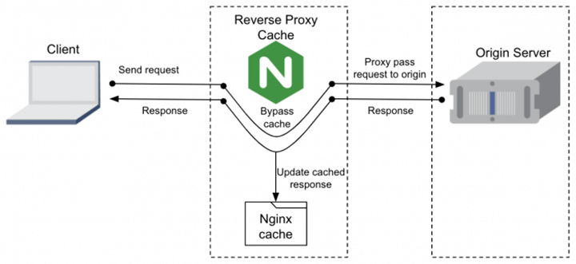
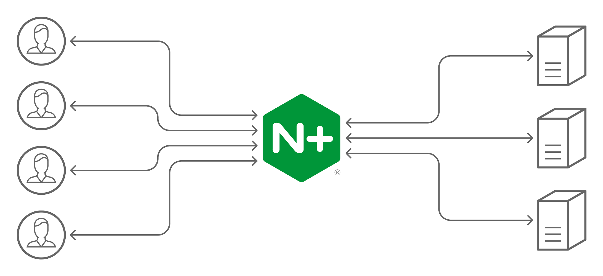
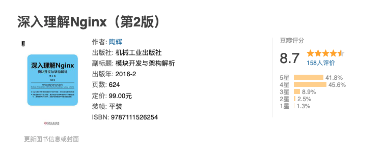
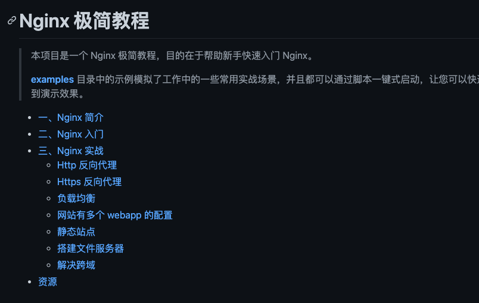
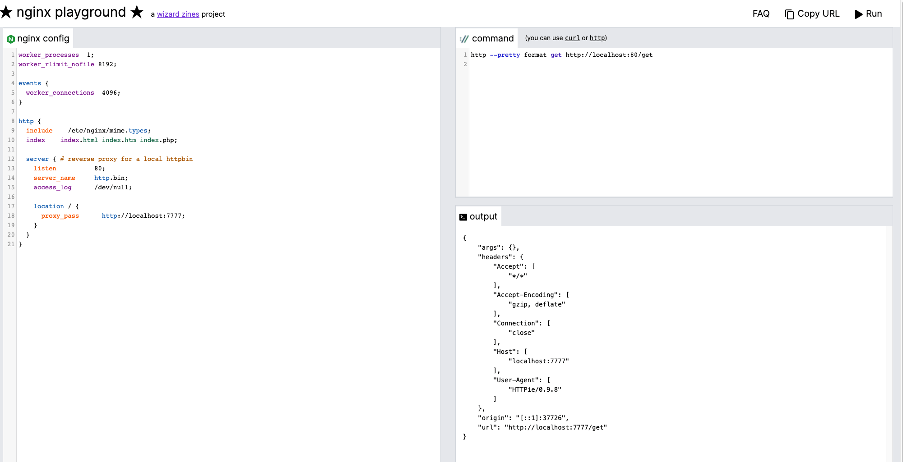

# Nginx 常见面试题总结

## 什么是 Nginx ？


俄罗斯的工程师 Igor Sysoev，在 Rambler Media 工作期间使用 C 语言开发并开源了 Nginx。


Nginx 同 Apache 一样都是 WEB 服务器，不过，Nginx 更加轻量级，它的内存占用少，启动极快，高并发能力强，在互联网项目中广泛应用。并且，Nginx 可以作为反向代理服务器使用，支持 IMAP/POP3/SMTP 服务。


> Web 服务器：负责处理和响应用户请求，一般也称为 HTTP 服务器。
>


官网：[https://nginx.org/](https://nginx.org/)


## Nginx 的特点是有哪些？


1. **内存占用非常少** ：一般情况下，10000 个非活跃的 HTTP Keep-Alive 连接在 Nginx 中仅消耗 2.5MB 的内存，这是 Nginx 支持高并发连接的基础。
2. **高并发** : 单机支持 10 万以上的并发连接
3. **跨平台** :可以运行在 Linux，Windows，FreeBSD，Solaris，AIX，Mac OS 等操作系统上。
4. **扩展性好** ：第三方插件非常多！
5. **安装使用简单** ：对于简单的应用场景，我们很快就能够上手使用。
6. **稳定性好** ：bug 少，不会遇到各种奇葩的问题。
7. **免费** ：开源软件，免费使用。
8. ......


## Nginx 能用来做什么？


### 静态资源服务器


Nginx 可以将服务器上的静态文件（如 HTML、CSS、JS、图片）缓存下来，通过 HTTP 协议展现给客户端。因此，我们可以使用 Nginx 搭建静态资源 Web 服务器/缓存服务器。不过，要记得使用 gzip 压缩静态资源来减少网络传输。


当客户端第一次请求静态资源的时候，会从服务器直接返回，Nginx 同时也会缓存一份静态资源。如果后续客户端请求相同的静态资源，只要对应的缓存未被清理且没有过期，就可以直接从 Nginx 缓存中取出返回给客户端了。





### 反向代理


客户端将请求发送到反向代理服务器，由反向代理服务器去选择目标服务器，获取数据后再返回给客户端。对外暴露的是反向代理服务器地址，隐藏了真实服务器 IP 地址。反向代理“代理”的是目标服务器，这一个过程对于客户端而言是透明的。


举个例子：公司内网部署了 3 台服务器，客户端请求直接经过代理服务器，由代理服务器将请求转发到内网服务器并最终决定哪一台服务器处理客户端请求。


反向代理隐藏了真实的服务器，为服务器收发请求，使真实服务器对客户端不可见。一般在处理跨域请求的时候比较常用。现在基本上所有的大型网站都设置了反向代理。


Nginx 支持配置反向代理，通过反向代理实现网站的负载均衡。


### 正向代理


> **提示** ：想要理解正确理解和区分正向代理和反向代理，你要关注的是代理对象，正向代理“代理”的是客户端，反向代理“代理”的是目标服务器。
>
>  
>
> 一位大佬说的一句话挺精辟的：代理其实就是一个中介，A 和 B 本来可以直连，中间插入一个 C，C 就是中介。刚开始的时候，代理多数是帮助内网 client 访问外网 server 用的（比如 HTTP 代理），从内到外 . 后来出现了反向代理，"反向"这个词在这儿的意思其实是指方向相反，即代理将来自外网 client 的请求 forward 到内网 server，从外到内
>


Nginx 主要被作为反向代理服务器使用，不过，其同样也是正向代理服务器的一个选择。


客户端通过正向代理服务器访问目标服务器。正向代理“代理”的是客户端，目标服务器不知道客户端是谁，也就是说客户端对目标服务器的这次访问是透明的。


为了实现正向代理，客户端需要设置正向代理服务器的 IP 地址以及代理程序的端口。


举个例子：我们无法直接访问外网，但是可以借助科学上网工具 VPN 来访问。VPN 会把访问外网服务器（目标服务器）的客户端请求代理到一个可以直接访问外网的代理服务器上去。代理服务器会把外网服务器返回的内容再转发给客户端。


外网服务器并不知道客户端是通过 VPN 访问的


简单来说： **你可以将正向代理看作是一个位于客户端和目标服务器之间的代理服务器，其主要作用就是转达客户端请求从目标服务器上获取指定的内容。**


相关阅读：


+ [使用 Nginx 作为 HTTPS 正向代理服务器](https://developer.aliyun.com/article/706196)
+ [图解及代码实现正向代理、反向代理及负载均衡](https://bbs.huaweicloud.com/blogs/301714)


### 负载均衡


如果一台服务器处理用户请求处理不过来的话，一个简单的办法就是增加多台服务器（服务器集群）部署相同的服务来处理用户请求。


Nginx 可以将接收到的客户端请求以一定的规则（负载均衡策略）均匀地分配到这个服务器集群中所有的服务器上，这个就叫做 **负载均衡**。


可以看出，Nginx 在其中充当的就是反向代理服务器的作用，负载均衡正是 Nginx 作为反向代理服务器最常见的一个应用。


除此之外，Nginx 还带有**健康检查**（服务器心跳检查）功能，会定期轮询向集群里的所有服务器发送健康检查请求，来检查集群中是否有服务器处于异常状态。





## Nginx 为什么适合做负载均衡？


Nginx 工作在网络的第七层（应用层），可以针对 HTTP 应用本身来做分流策略，支持 HTTP、HTTPS 协议的负载均衡。在工作中，我们通常会使用 **Nginx** 来做七层负载均衡。


Nginx 为什么适合做负载均衡呢？我简单总结了下面几方面主要原因：


+ Nginx 属于软件负载均衡，相比于硬件负载均衡来说，价格非常低廉，一个较低配置的服务器即可满足。
+ Nginx 使用简单，上手比较快。
+ Nginx 基于 C 语言的实现，性能非常好。一般情况下，10000 个非活跃的 HTTP Keep-Alive 连接在 Nginx 中仅消耗 2.5MB 的内存，这是 Nginx 支持高并发连接的基础。并且，Nginx 单机支持 10 万以上的并发连接。
+ Nginx 自带 **健康检查**（服务器心跳检查）功能，会定期轮询向集群里的所有服务器发送健康检查请求，来检查集群中是否有服务器处于异常状态。
+ Nginx 支持热部署，我们可以在不间断服务的情况下，升级 Nginx，这对于服务的高可用具有重大意义。
+ Nginx 支持多种负载均衡策略比如轮询（Round Robin，默认）、IP 哈希、最小连接数。


## Nginx 有哪些负载均衡策略？


> 相关参考：
>
>  
>
> + [五分钟看懂 Nginx 负载均衡](https://cloud.tencent.com/developer/article/1607277)
> + [Nginx 官方文档](https://docs.nginx.com/nginx/admin-guide/load-balancer/http-load-balancer/)
>
>  
>
> Nginx 的负载均衡策略不止下面介绍的这四种，我这里只是列举几个比较常用的负载均衡策略。
>


### 轮询（Round Robin，默认）


轮询为负载均衡中较为基础也较为简单的算法。


如果没有配置权重的话，每个请求按时间顺序逐一分配到不同的服务器处理。


```nginx
upstream backserver {
  server 172.27.26.174:8099;
  server 172.27.26.175:8099;
  server 172.27.26.176:8099;
}
```


如果配置权重的话，权重越高的服务器被访问的概率就越大。


```nginx
upstream backserver {
  server 172.27.26.174:8099 weight=6;
  server 172.27.26.175:8099 weight=2;
  server 172.27.26.176:8099 weight=3;
}
```


未加权重的轮询算法适合于服务器性能相近的集群，其中每个服务器承载相同的负载。加权轮询算法适合于服务器性能不等的集群，权重的存在可以使请求分配更加合理化。


### IP 哈希


根据发出请求的和客户端 ip 的 hash 值来分配服务器，可以保证同 IP 发出的请求映射到同一服务器，或者具有相同 hash 值的不同 IP 映射到同一服务器。


```nginx
upstream backserver {
  ip_hash;
  server 172.27.26.174:8099;
  server 172.27.26.175:8099;
  server 172.27.26.176:8099;
}
```


和轮询一样，IP 哈希也可以配置权重，如果有两个活动连接数相同的服务器，权重大的被访问的概率就越大。


该算法在一定程度上解决了集群部署环境下 Session 不共享的问题。


### 最小连接数


当有新的请求出现时，遍历服务器节点列表并选取其中活动连接数最小的一台服务器来响应当前请求。活动连接数可以理解为当前正在处理的请求数。


```nginx
upstream backserver {
  least_conn;
  server 172.27.26.174:8099;
  server 172.27.26.175:8099;
  server 172.27.26.176:8099;
}
```


## Nginx 常用命令有哪些？


+ 启动 `nginx` 。
+ 停止 `nginx -s stop` 或 `nginx -s quit` 。
+ 重载配置 `./sbin/nginx -s reload(平滑重启)` 或 `service nginx reload` 。
+ 重载指定配置文件 `.nginx -c /usr/local/nginx/conf/nginx.conf` 。
+ 查看 nginx 版本 `nginx -v` 。
+ 检查配置文件是否正确 `nginx -t` 。
+ 显示帮助信息 `nginx -h` 。


## Nginx 性能优化的常见方式？


+ **设置 Nginx 运行工作进程个数** ：一般设置 CPU 的核心数或者核心数 x2；
+ **开启 Gzip 压缩** ：这样可以使网站的图片、CSS、JS 等文件在传输时进行压缩，提高访问速度, 优化 Nginx 性能。详细介绍可以参考[Nginx 性能优化功能- Gzip 压缩(大幅度提高页面加载速度)](https://www.cnblogs.com/kevingrace/p/10018914.html)这篇文章；
+ **设置单个 worker 进程允许客户端最大连接数** ：一般设置为 65535 就足够了；
+ **连接超时时间设置** ：避免在建立无用连接上消耗太多资源；
+ **设置缓存** ：像图片、CSS、JS 等这类一般不会经常修改的文件，我们完全可以设置图片在浏览器本地缓存，提高访问速度，优化 Nginx 性能。
+ ......


## LVS、Nginx、HAproxy 有什么区别？


LVS、Nginx、HAProxy 是目前使用最广泛的三种软件负载均衡软件。


+ LVS 是 Linux Virtual Server 的简称，也就是 Linux 虚拟服务器。LVS 是四层负载均衡，建立在 OSI 模型的第四层（传输层）之上，性能非常强大。
+ HAProxy 可以工作在四层和七层（传输层和应用层），是专门用来做代理服务器的。
+ Nginx 负载均衡主要是对七层网络通信模型中的第七层应用层上的 HTTP、HTTPS 进行支持。Nginx 是以反向代理的方式进行负载均衡的。


## Nginx 如何实现后端服务健康检查？


我们可以利用第三方模块 **upstream_check_module** 来检测后端服务的健康状态，如果后端服务器不可用，则所有的请求不转发到这台服务器。


upstream_check_module 是一款阿里的一位大佬开源的，使用 Perl 和 C 编写而成，Github 地址 ：[https://github.com/yaoweibin/nginx_upstream_check_module](https://github.com/yaoweibin/nginx_upstream_check_module) 。


关于 upstream_check_module 实现后端服务健康检查的具体做法可以参考[Nginx 负载均衡健康检查功能](https://cloud.tencent.com/developer/article/1700001)这篇文章。


## 如何保证 Nginx 服务的高可用？


Nginx 可以结合 Keepalived 来实现高可用。


**什么是 Keepalived ？** 根据官网介绍：


> Keepalived 是一个用 C 语言编写的开源路由软件，是 Linux 下一个轻量级别的负载均衡和高可用解决方案。Keepalived 的负载均衡依赖于众所周知且广泛使用的 Linux 虚拟服务器 (IPVS 即 IP Virtual Server，内置在 Linux 内核中的传输层负载均衡器) 内核模块，提供第 4 层负载平衡。Keepalived 实现了一组检查器用于根据服务器节点的健康状况动态维护和管理服务器集群。
>
>  
>
> Keepalived 的高可用性是通过虚拟路由冗余协议（VRRP 即 Virtual Router Redundancy Protocol，实现路由器高可用的协议）实现的，可以用来解决单点故障。
>
>  
>
> Github 地址：[https://github.com/acassen/keepalived](https://github.com/acassen/keepalived)
>


Keepalived 不仅仅可以和 Nginx 搭配使用，还可以和 [LVS](https://wsgzao.github.io/post/lvs-keepalived/)、[MySQL](https://programmer.group/high-availability-scheme-implementation-of-mysql-master-replication-keepalived.html)、[HAProxy](https://docs.oracle.com/cd/E37670_01/E41138/html/section_sm3_svy_4r.html) 等软件配合使用。


再来简单介绍一下 Keepalived+Nginx 实现高可用的常见方法：


1. 准备 2 台 Nginx 服务器，一台为主服务，一台为备用服务；
2. 在两台 Nginx 服务器上安装并配置 Keepalived；
3. 为两台 Nginx 服务器绑定同一个虚拟 IP；
4. 编写 Nginx 检测脚本用于通过 Keepalived 检测 Nginx 主服务器的状态是否正常；


如果 Nginx 主服务器宕机的话，会自动进行故障转移，备用 Nginx 主服务器升级为主服务。并且，这个切换对外是透明的，因为使用的虚拟 IP，虚拟 IP 不会改变。


相关阅读：


+ [Nginx 系列教程（五）| 利用 Nginx+Keepalived 实现高可用技术 |](https://juejin.cn/post/6970093569096810526)
+ [搭建 Keepalived Nginx 高可用 Web 集群 - 华为云](https://support.huaweicloud.com/bestpractice-vpc/bestpractice_0010.html)

---

> 📄**友情提示** ：下面的内容属于 Nginx 的进阶指点，主要是一些 Nginx 底层原理相关的知识。你可以根据自身情况选择是否掌握这部分内容，如果你的简历没有写熟练掌握 Nginx 使用及原理的话，面试官一般不会问这么深入。
>


## Nginx 总体架构了解吗？


> 关于 Nginx 总结架构的详细解答，请看这篇文章：[最近和 Nginx 杠上了！](https://mp.weixin.qq.com/s/CxapDUkSdqBbuJU4JrQ8Aw)
>


对于传统的 HTTP 和反向代理服务器而言，在处理并发请求的时候会使用单进程或线程的模式处理，同时会止网络或输入/输出操作。


这种方式会消耗大量的内存和 CPU 资源。因为每产生一个单独的进程或线程需要准备一套新的运行时环境，包括分配堆和堆栈内存，以及创建新的执行上下文。


可以想象在处理多请求时会生成对应数目的线程或进程，导致由于线程在不断上下文切换上耗费大量资源。


由于上面的原因，Nginx 在设计之初就使用了模块化、事件驱动、异步处理，非阻塞的架构。


一张图来了解 Nginx 的总结架构:


## Nginx 进程模型了解么？


> 关于进程模型的详细解答，请看这篇文章：[Nginx 工作模式和进程模型](https://learnku.com/articles/38414)
>


Nginx 启动后，会产生一个 master 主进程，主进程执行一系列的工作后会产生一个或者多个工作进程 worker 进程。master 进程用来管理 worker 进程， worker 进程负责处理网络请求。也就是说 **Nginx 采用的是经典的 master-worker 模型的多进程模型** 。


## Nginx 如何处理 HTTP 请求？


+ [Nginx 是如何处理 HTTP 头部的？](https://segmentfault.com/a/1190000022348375)
+ [Nginx 处理 HTTP 请求的 11 个阶段](https://segmentfault.com/a/1190000022709975)


## 系统学习资料


Guide 整理了下面一些文章和书籍帮助你系统学习 Nginx。


### 文章推荐


+ [连前端都看得懂的《Nginx 入门指南》](https://juejin.cn/post/6844904129987526663)
+ [Nginx 入门教程，敲简单，10 分钟搞定](https://juejin.cn/post/7046190661015437325)
+ [Nginx 最全操作总结 - 腾讯技术工程](https://mp.weixin.qq.com/s?src=11&timestamp=1644900743&ver=3621&signature=kF*VLvQFEeSVlGkPxn542LNLa7S1gQpIZrgywwvQR5EH*p3jwU*HW0GeyQYOeQ3HrPJag8mIjHQg3C0PW72Y-JyGFgsUh-yUiIbrxwnzsHE02e4Plp8vyYINJfb-3WYW&new=1)
+ [Nginx 系列：Nginx 原理](http://ningg.top/nginx-series-principle/)
+ [Nginx 流量复制](https://www.cnblogs.com/cjsblog/p/12163207.html)


### 书籍推荐


[《深入理解 Nginx（第 2 版）》](https://book.douban.com/subject/26745255/) 这本书是初学者学习 Nginx 的首选，讲的非常细致！





你可以配合 [**nginx-tutorial**](https://github.com/dunwu/nginx-tutorial) 这个开源 Nginx 极简教程食用。





最后再推荐一个可以在线练习使用 Nginx 的网站：[https://nginx-playground.wizardzines.com/](https://nginx-playground.wizardzines.com/) 。





> 更新: 2023-12-08 17:19:23  
> 原文: <https://www.yuque.com/snailclimb/mf2z3k/ykb2ix>