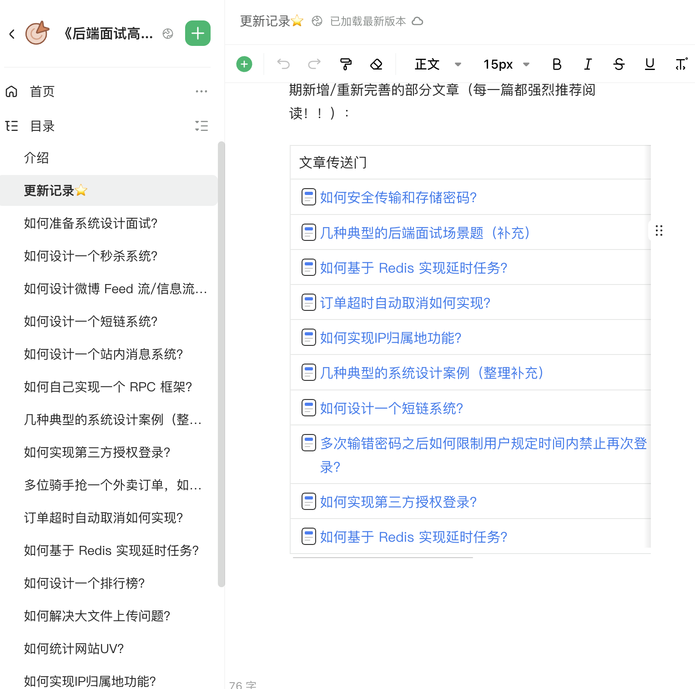

# 系统设计&场景题

**注意！！！**：系统设计&场景题已经移动到了**《后端面试高频系统设计&场景题》 **中，地址**：**[**https://t.zsxq.com/18rZ6D7Wk**](https://t.zsxq.com/18rZ6D7Wk)** 。**

****

欢迎阅读**「系统设计面试题」**相关的文章，这个系列我会总结一些面试中常见的系统设计相关的问题：

- [x] 如何准备系统设计面试面试？
- [x] 如何设计微博 Feed 流？
- [x] 如何设计一个 RPC 框架？
- [x] 如何设计一个短链系统？
- [x] 如何设计一个排行榜？
- [x] 如何设计一个秒杀系统？
- [x] 如何设计一个站内消息系统？
- [x] 如何解决大文件上传问题？
- [x] 如何统计网站 UV？

> 更新: 2024-03-16 09:05:10  
> 原文: <https://www.yuque.com/snailclimb/mf2z3k/unri6r>