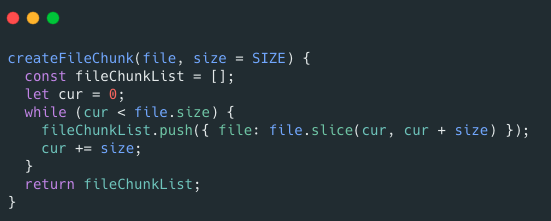

# 如何解决大文件上传问题？

如果你的项目涉及到文件上传的话，面试官很可能会问你这个问题。

我们先看第一个场景：**大文件上传中途，突然失败！**

试想一个，你想上传一个 5g 的视频，上传进度到 99% 的时候，特么的，突然网络断了，这个时候，你发现自己竟然需要重新上传。我就问你抓狂不？

**有没有解决办法呢？** 答案就是：**分片上传！**

**什么是分片上传呢？** 简单来说，我们只需要先将文件切分成多个文件分片（就像我下面绘制的图片所展示的那样），然后再上传这些小的文件分片。

前端发送了所有文件分片之后，服务端再将这些文件分片进行合并即可，这样就得到的一个完整的文件。

大致流程如下：

1. 生成要上传文件的唯一标识（如SHA-256）；
2. 将需要上传的文件按照一定的分割规则，分割成相同大小的分片；
3. 初始化一个分片上传任务，返回本次分片上传的唯一标识；
4. 每个分片在发送前，客户端会计算其哈希值（如SHA-256），并将这个哈希值与分片一起发送给服务器；
5. 按照一定的策略（串行或并行）发送各个分片；
6. 服务器接收到分片后，会重新计算分片的哈希值，并与客户端发送的哈希值进行比对；
7. 如果哈希值匹配，则认为该分片有效，服务器会存储该分片并等待其他分片的到来；如果哈希值不匹配，服务器会通知客户端重新发送该分片；
8. 所有分片发送完成后，服务端会根据判断数据上传是否完整。如果数据完整，服务端则进行分片的合成，以得到原始文件。
9. 再计算合并后的文件的唯一标识，两者进行对比，一致则说明没问题。

使用分片上传主要有下面 2 点好处：

1. **断点续传** ：上传文件中途暂停或失败（比如遇到网络问题）之后，不需要重新上传，只需要上传那些未成功上传的文件分片即可。所以，分片上传是断点续传的基础。
2. **多线程上传** ：我们可以通过多线程同时对一个文件的多个文件分片进行上传，这样的话就大大加快的文件上传的速度。

**前端怎么生成文件分片呢？后端如何合并文件分片呢？**

前端可以通过 `**Blob.slice()**` 方法来对文件进行切割（`File` 对象是继承 `Blob` 对象的，因此 `File` 对象也有 `slice()` 方法）。

生成文件切片的示例代码如下：

`**RandomAccessFile**` 类可以帮助我们合并文件分片，示例代码如下：

**何为秒传？**

秒传说的就是我们在上传某个文件的时候，首先根据文件的唯一标识判断一下服务端是否已经上传过该文件，如果上传过的话，直接就返回给用户文件上传成功即可。

一般情况下，这个唯一标识可以通过对文件的大小、名称、最后修改时间等信息取 MD5 值得到的。不过，MD 算法已经不被推荐使用，建议使用更安全的哈希算法比如 SHA-2（包括 SHA-224、SHA-256、SHA-384、SHA-512 等等），可减少哈希碰撞，更加安全。

需要注意的是：你不能根据文件名就决定文件是否已经上传到服务端，因为很可能存在文件名相同，但是，内容不同的情况。另外，体验更好的是文件内容不变，唯一标识就不应该改变。因此，我们可以根据文件的内容来计算唯一标识。

另外，还存在一种情况是我们要上传的文件已经上传了部分文件切片到服务端。这个时候，我们直接返回已上传的切片列表给前端即可。

然后，前端再将剩余未上传的分片上传到服务端。

我简单画了一张图描述一下断点续传和秒传。

相关阅读：

+ [大规格文件的上传优化](https://juejin.cn/post/6844904155086061576)
+ [一个 Java 实现的，多线程，断点续传下载器](https://github.com/niumoo/down-bit)

> 更新: 2024-03-25 10:00:07  
> 原文: <https://www.yuque.com/snailclimb/mf2z3k/akmquq>