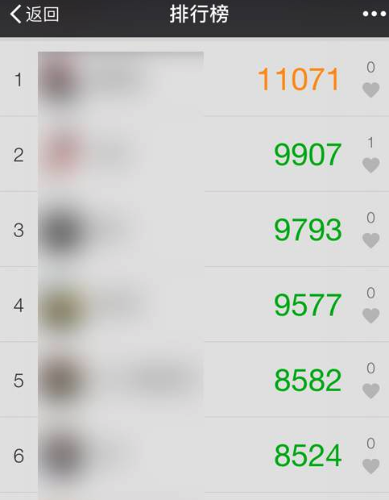
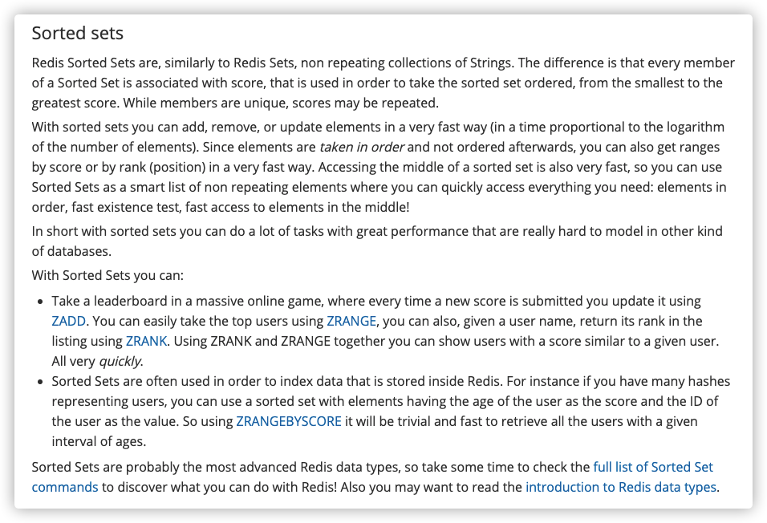
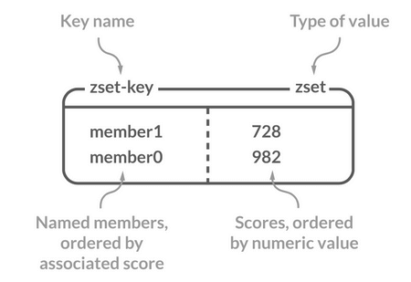
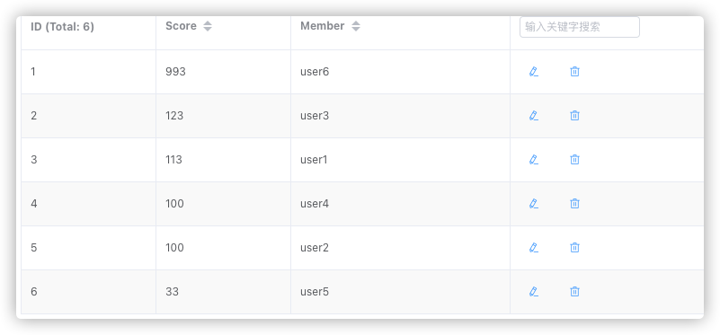
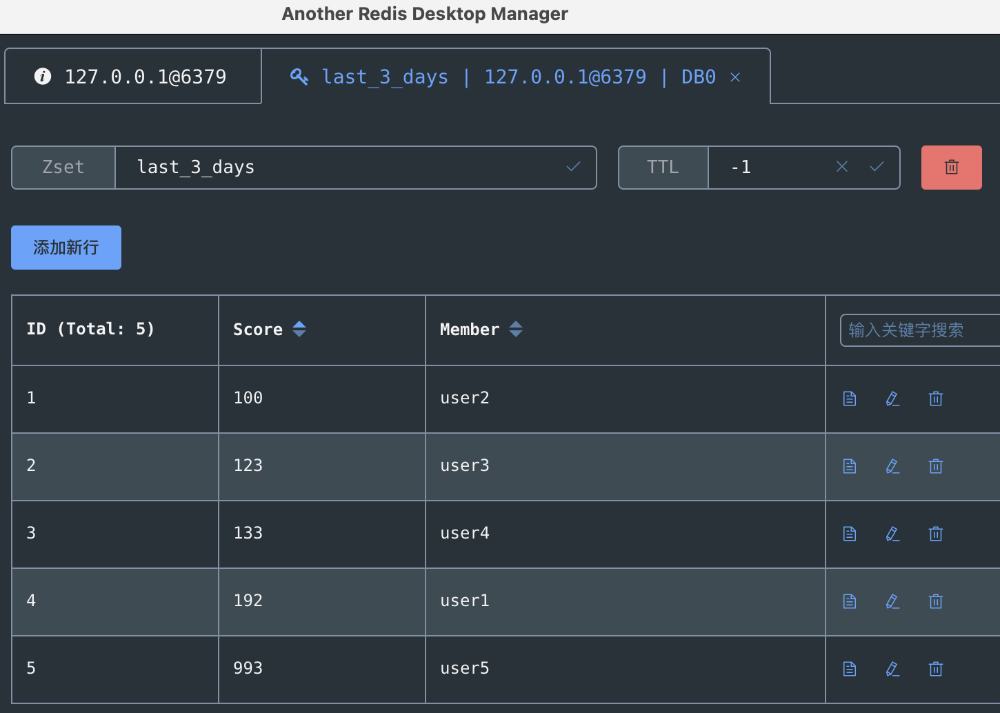

# 如何设计一个排行榜？

排行榜到处可见，比如直播间送礼物的排行榜、朋友圈的微信步数排行榜、王者荣耀中的段位排行榜等等。





今天让我们从程序设计的角度，来看看如何设计一个排行榜！


我们先从最基础的实现方式来说起。


## MySQL 的 ORDER BY 关键字


第一种要介绍的实现方式就是直接使用 MySQL 的 `ORDER BY` 关键字。 `ORDER BY` 关键字可以对查询出来的数据按照指定的字段进行排序。


我相信但凡是学过 MySQL 的人，一定都用过 `ORDER BY` 关键字！没用过的，先不要看下面的文章了，麻烦默默反思 3 分钟。


```sql
SELECT column1, column2, ...
FROM table_name
ORDER BY column1, column2, ... ASC/DESC;
```


我之前在一个用户数据量不大（6w 用户左右）并且排序需求并不复杂的项目中使用的就是这种方法。


这种方式的优缺点也比较明显。**好处是比较简单，不需要引入额外的组件，成本比较低。坏处就是每次生成排行榜都比较耗时，对数据库的性能消耗非常之大，数据量一大，业务场景稍微复杂一点就顶不住了。**


我们这里创建一个名为 `cus_order` 的表，来实际测试一下这种排序方式。为了测试方便， `cus_order` 这张表只有 `id`、`score`、`name`这 3 个字段。


```sql
CREATE TABLE `cus_order` (
  `id` int(11) unsigned NOT NULL AUTO_INCREMENT,
  `score` int(11) NOT NULL,
  `name` varchar(11) NOT NULL DEFAULT '',
  PRIMARY KEY (`id`)
) ENGINE=InnoDB AUTO_INCREMENT=100000 DEFAULT CHARSET=utf8mb4;
```


我们定义一个简单的存储过程（PROCEDURE）来插入 100w 测试数据。


```sql
DELIMITER ;;
CREATE DEFINER=`root`@`%` PROCEDURE `BatchinsertDataToCusOder`(IN start_num INT,IN max_num INT)
BEGIN
      DECLARE i INT default start_num;
      WHILE i < max_num DO
          insert into `cus_order`(`id`, `score`, `name`)
          values (i,RAND() * 1000000,CONCAT('user', i));
          SET i = i + 1;
      END WHILE;
  END;;
DELIMITER ;
```


存储过程定义完成之后，我们执行存储过程即可！


```sql
CALL BatchinsertDataToCusOder(1, 1000000); # 插入100w+的随机数据
```


等待一会，100w 的测试数据就插入完成了！


为了能够对这 100w 数据按照 `score` 进行排序，我们需要执行下面的 SQL 语句。


```sql
SELECT `score`,`name` FROM `cus_order` ORDER BY `score` DESC;#降序排序
```


为了能够查看这套 SQL 语句的执行时间，我们需要通过`show profiles`命令。


不过，请确保你的 `profiling` 是开启（on）的状态（可以通过 `show variables` 命令查看）。


默认情况下， `profiling` 是关闭（off）的状态，你直接通过`set @@profiling=1`命令即可开启。


然后，我们就查询到了具体的执行速度。


```json
{
  "Query_ID": 6,
  "Duration": 3.63526325,
  "Query": "SELECT `score`,`name` FROM `cus_order` ORDER BY `score` DESC"
}
```


可以看到，一共耗时了接近 4 s。


**如何优化呢？** **加索引并且限制排序数据量** 是一种比较常见的优化方式。


我们对 `score` 字段加索引，并限制只排序 `score` 排名前 500 的数据。


这个时候，我们再执行下面的 SQL 语句，速度就快了很多，只需要 0.01 秒就排序了前 500 名的数据。


```json
{
  "Query_ID": 38,
  "Duration": 0.0102915,
  "Query": "SELECT `score`,`name` FROM `cus_order` ORDER BY `score` DESC LIMIT 500"
}
```


当然了，这只是一个最简单的场景，实际项目中的复杂度要比我这里列举的例子复杂很多，执行速度也会慢很多。


不过，**能不能用 MySQL 的 ORDER BY 关键字还是要看具体的业务场景。如果说你的项目需要排序数据量比较小并且业务场景不复杂的话（比如你对你博客的所有文章按照阅读量来排序），我觉得直接使用 MySQL 的 **`**ORDER BY**`** 关键字就可以了。**


## Redis 的 Sorted Set





了解过 Redis 常见数据结构的小伙伴，都知道 Redis 中有一个叫做 Sorted Set 的数据结构经常被用在各种排行榜的场景下。


通过 Sorted Set，我们能够轻松应对百万级别的用户数据排序。这简直就是专门为排行榜设计的数据结构啊！


### Sorted Set 介绍


Sorted Set 类似于 Set，但和 Set 相比，Sorted Set 增加了一个权重参数 `score`，使得集合中的元素能够按 `score` 进行有序排列，还可以通过 `score` 的范围来获取元素的列表。有点像是 Java 中 `HashMap` 和 `TreeSet` 的结合体。





### Sorted Set 常用命令
| 命令 | 介绍 |
| --- | --- |
| ZADD key score1 member1 score2 member2 ... | 向指定有序集合添加一个或多个元素 |
| ZCARD KEY | 获取指定有序集合的元素数量 |
| ZSCORE key member | 获取指定有序集合中指定元素的 score 值 |
| ZINTERSTORE destination numkeys key1 key2 ... | 将给定所有有序集合的交集存储在 destination 中，对相同元素对应的 score 值进行 SUM 聚合操作，numkeys 为集合数量 |
| ZUNIONSTORE destination numkeys key1 key2 ... | 求并集，其它和 ZINTERSTORE 类似 |
| ZDIFF destination numkeys key1 key2 ... | 求差集，其它和 ZINTERSTORE 类似 |
| ZRANGE key start end | 获取指定有序集合 start 和 end 之间的元素（score 从低到高） |
| ZREVRANGE key start end | 获取指定有序集合 start 和 end 之间的元素（score 从高到底） |
| ZREVRANK key member | 获取指定有序集合中指定元素的排名(score 从大到小排序) |


更多 Redis Sorted Set 命令以及详细使用指南，请查看 Redis 官网对应的介绍：[https://redis.io/commands/?group=sorted-set](https://redis.io/commands/?group=sorted-set) 。


### Sorted Set 排序实战


#### 基本排序操作


我们把下表中的数据添加到 Sorted Set 中。

| User | Score |
| --- | --- |
| user1 | 112.0 |
| user2 | 100.0 |
| user3 | 123.0 |
| user4 | 100.0 |
| user5 | 33.0 |
| user6 | 993.0 |


```bash
# 通过 zadd 命令添加了 6 个元素到 cus_order_set 中
127.0.0.1:6379> ZADD cus_order_set 112.0 user1 100.0 user2 123.0 user3 100.0 user4 33.0 user5 993.0 user6
(integer) 6
```





Sorted Set 基本可以满足大部分排行榜的场景，下面我们来具体看看。


**如果我们要查看包含所有用户的排行榜怎么办？**


通过 `ZRANGE` (从小到大排序) / `ZREVRANGE` （从大到小排序）


```bash
# -1 代表的是全部的用户数据，
127.0.0.1:6379> ZREVRANGE cus_order_set 0 -1
1) "user6"
2) "user3"
3) "user1"
4) "user4"
5) "user2"
6) "user5"
```


**如果我们要查看只包含前 3 名的排行榜怎么办？**


限定参与排序的元素范围区间即可。


```bash
# 0 为 start  2 为 stop
127.0.0.1:6379> ZREVRANGE cus_order_set 0 2
1) "user6"
2) "user3"
3) "user1"
```


**如果我们需要查询某个用户的分数怎么办呢？**


通过 `ZSCORE` 命令即可。 `ZSCORE` 可以获取指定有序集合中指定元素的 `score` 值。


```bash
127.0.0.1:6379> ZSCORE  cus_order_set "user1"
"112"
```


**如果我们需要查询某个用户的具体排名怎么办呢？**


通过 `ZREVRANK` 命令即可。 `ZREVRANK` 可以获取指定有序集合中指定元素的排名(`score` 从大到小排序)


```bash
127.0.0.1:6379> ZREVRANK  cus_order_set "user3"
(integer) 1 # user3 排名第2
```


**如何对用户的排名数据进行更新呢？**


通过 `ZINCRBY`命令即可。 `ZINCRBY`可以对指定有序集合中指定元素的 `score` 值加上一个具体的数值（可以是整数值或双精度浮点数），这个数值如果是负数的话，就相当于实现一个减操作。


```bash
# 对 user1 的分数加2
127.0.0.1:6379> ZINCRBY cus_order_set +2 "user1"
"114"
# 对 user1 的分数减1
127.0.0.1:6379> ZINCRBY cus_order_set -1 "user1"
"113"
# 查看 user1 的分数
127.0.0.1:6379> ZSCORE  cus_order_set "user1"
"113"
```


除了我上面提到的之外，还有一些其他的命令来帮助你解决更多排行榜场景的需求，想要深入研究的小伙伴可以仔细学习哦！


不过，需要注意的一点是：**Redis 中只保存了排行榜展示所需的数据，需要用户的具体信息数据的话，还是需要去对应的数据库（比如 MySQL）中查。**


#### 复杂排序操作


**你以为这样就完事了？**


不存在的！还有一些无法仅仅通过 Redis 提供的命令解决的场景。


比如，**如何实现多条件排序？**


其实，答案也比较简单，对于大部分场景，我们直接对 `score` 值做文章即可。


更具体点的话就是，我们根据特定的条件来拼接 `score` 值即可。比如我们还要加上时间先后条件的话，直接在`score` 值添加上时间戳即可。


再比如，**如何实现指定日期（比如最近 7 天）的用户数据排序？**


我说一种比较简单的方法：我们把每一天的数据都按照日期为名字，比如 20350305 就代表 2035 年 3 月 5 号。


如果我们需要查询最近 n 天的排行榜数据的话，直接 `ZUNIONSTORE`来求 n 个 `sorted set` 的并集即可。


> `ZUNIONSTORE destination numkeys key1 key2 ...`：求并集，将给定所有有序集合的并集存储在 `destination` 中，对相同元素对应的 `score` 值进行 `SUM` 聚合操作(可以通过`AGGREGATE` 参数指定聚合函数，默认为 `SUM`)，`numkeys` 为集合数量。
>


```bash
ZUNIONSTORE last_n_days n 20350305 20350306....
```


不知道大家看懂了没有，这里还是简单地造一些数据模拟一下吧！


**Zset 20350305** :

| User | Score |
| --- | --- |
| user1 | 112.0 |
| user2 | 100.0 |
| user3 | 123.0 |


**Zset 20350306** :

| User | Score |
| --- | --- |
| user1 | 80.0 |
| user4 | 100.0 |


**Zset 20350307** :

| User | Score |
| --- | --- |
| user4 | 33.0 |
| user5 | 993.0 |


```bash
# 分别添加了 3 天的数据
127.0.0.1:6379> ZADD 20350305 112.0 user1 100.0 user2 123.0 user3
(integer) 3
127.0.0.1:6379> ZADD 20350306 80.0 user1 100.0 user4
(integer) 2
127.0.0.1:6379> ZADD 20350307 33.0 user4 993.0 user5
(integer) 2
```


通过 `ZUNIONSTORE` 命令来查看最近 3 天的排行榜情况：


```bash
127.0.0.1:6379> ZUNIONSTORE last_3_days 3 20350305 20350306 20350307
(integer) 5
```


现在，这 3 天的数据都集中在了 `last_3_days` 这个有序集合中。


```bash
127.0.0.1:6379> ZRANGE last_3_days 0 -1 WITHSCORES
 1) "user2"
 2) "100"
 3) "user3"
 4) "123"
 5) "user4"
 6) "133"
 7) "user1"
 8) "192"
 9) "user5"
10) "993"
```





如果一个用户同时在多个 `sorted set` 中的话，它最终的 `score` 值就等于这些 `sorted set` 中该用户的 `score` 值之和。


如果说你不想对 `score` 值求和也没关系，我们通过 `AGGREGATE` 参数指定聚合函数：


+ `SUM`：对于不同集合的相同元素使用和作为结果集中对应元素的`score`。默认使用 `SUM`，如果不指定的话。
+ `MIN`：对于不同集合的相同元素使用某个元素最小的`score` 值作为结果集中对应元素的`score`。
+ `MAX`：对于不同集合的相同元素使用某个元素最大的`score` 值作为结果集中对应元素的`score`。


指定聚合函数为 `MAX` 的情况：


```java
127.0.0.1:6379>  ZUNIONSTORE last_3_days 3 20350305 20350306 20350307 AGGREGATE MAX
(integer) 5
127.0.0.1:6379> ZRANGE last_3_days 0 -1 WITHSCORES
 1) "user2"
 2) "100"
 3) "user4"
 4) "100"
 5) "user1"
 6) "112"
 7) "user3"
 8) "123"
 9) "user5"
10) "993"
```


指定聚合函数为 `MIN` 的情况：


```bash
127.0.0.1:6379> ZRANGE last_3_days 0 -1 WITHSCORES
 1) "user4"
 2) "33"
 3) "user1"
 4) "80"
 5) "user2"
 6) "100"
 7) "user3"
 8) "123"
 9) "user5"
10) "993"
```


既然可以求并集，那必然也可以求交集。你可以通过 `ZINTERSTORE` 命令来求多个 n 个 `sorted set` 的交集。


> `ZINTERSTORE destination numkeys key1 key2 ...` :将给定所有有序集合的交集存储在 destination 中，对相同元素对应的 score 值进行 SUM 聚合操作，numkeys 为集合数量。
>


**有哪些场景可以用到多个**`**sorted set**`** 的交集呢？**


比如每日打卡的场景，你对某一段时间每天打卡的人进行排序。


`ZUNIONSTORE` 和 `ZINTERSTORE`命令还有一个常用的权重参数 `weights` （默认为 1）。在进行并集/交集的过程中，每个集合中的元素会将自己的 `score` *`weights` 。


我下面演示一下这个参数的作用。


```bash
# staff_set 存放员工的排名信息
127.0.0.1:6379> ZADD staff_set 3.0 staff1 4.0 staff2
(integer) 2
# staff_set 存放管理者的排名信息
127.0.0.1:6379> ZADD manager_set 1.0 manager1 2.0 manager2
(integer) 2
```


如果，我们需要将员工和管理者放在一起比较，不过，两者权重分别为 1 和 3。


```bash
# staff_set 的权重为1 manager_set的权重为3
127.0.0.1:6379> ZUNIONSTORE all_user_set 2 staff_set manager_set WEIGHTS 1 3
(integer) 4
```


最终排序的结果如下：


```bash
127.0.0.1:6379> ZREVRANGE all_user_set 0 -1 WITHSCORES
1) "manager2"
2) "6"
3) "staff2"
4) "4"
5) "staff1"
6) "3"
7) "manager1"
8) "3"
```


## 总结


上面我一共提到了两种设计排行榜的方法：


1. MySQL 的 ORDER BY 关键字
2. Redis 的 sorted set


其实，这两种没有孰好孰坏，还是要看具体的业务场景。如果说你的项目需要排序数据量比较小并且业务场景不复杂的话（比如你对你博客的所有文章按照阅读量来排序），我觉得直接使用 MySQL 的 `ORDER BY` 关键字就可以了，没必要为了排行榜引入一个 Redis。


另外，**在没有分页并且数据量不大的情况下，直接在前端拿到所有需要用到的数据之后再进行排序也是可以的。**


相关阅读：


+ [43 丨如何使用 Redis 搭建玩家排行榜？](https://time.geekbang.org/column/article/134595) —《SQL 必知必会》
+ [构建一个科学的排行榜体系](https://time.geekbang.org/column/article/5933) —《推荐系统三十六式》
+ [如何设计一个排行榜？](https://mp.weixin.qq.com/s/2p84utXldMaeR4wU5guK1Q)—why 技术
+ [亿级用户游戏排行榜设计方案](https://mp.weixin.qq.com/s/jWozyJ9vk9vM6u5_1WLGdw) —老周聊架构


> 更新: 2023-10-14 22:30:49  
> 原文: <https://www.yuque.com/snailclimb/mf2z3k/hbsnl8>