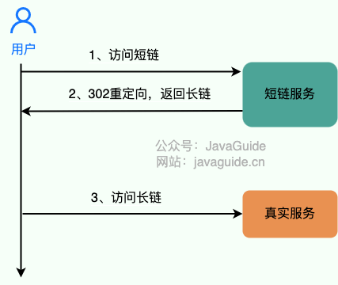
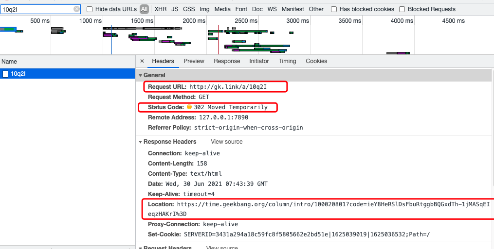
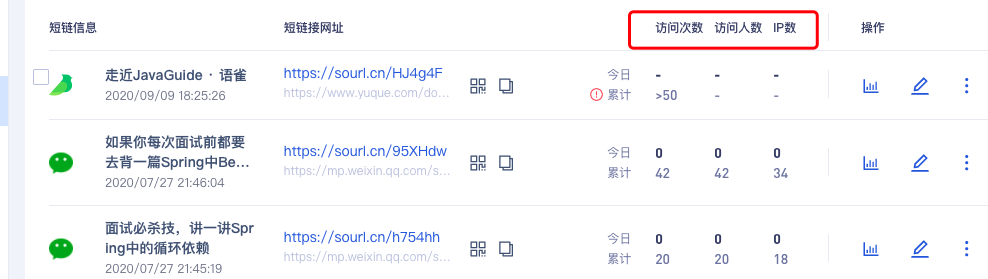

# 如何设计一个短链系统？

我平时经常看极客时间上的专栏，上面的每一个专栏 URL 地址都有一个短链与之对应。比如你使用下面两个链接打开的都是 《MySQL 实战 45 讲》这门课程。


+ 原始链接：[https://time.geekbang.org/column/intro/100020801](https://time.geekbang.org/column/intro/100020801)
+ 短链 ：[http://gk.link/a/10q2I](http://gk.link/a/10q2I)


有了长链，为什么还要再弄一个短链呢?


1. 短链更简洁，更方便传播：过长的链接不利于在互联网传播；
2. 方便对链接的点击情况做后续追踪：比如查看短链最近一周的访问量、访客数、访问来源......；
3. 对于短信等限制字数的场景来说更加友好：很多社交平台发表动态是有字数限制的，如果你直接使用长链的话，那留给你自己想表达的其他内容的文字就少了很多；
4. ......


## 短链原理


短链的具体原理其实比较简单，说白了就是： **通过短链找到长链（原始链接），然后再重定向到长链地址即可！**


我画了一个简单的示意图：





🌰 举个例子：我们来访问 “http://gk.link/a/10q2I” 这个链接，从 HTTP 请求信息可以看到请求被重定向了，返回的状态码为 “302”。





另外还有一个比较常用的重定向状态 “301” ， **我们应该用“301” 还是“302”作为状态码更好呢？**


答案是：“302” ，绝大部分短链系统也都是使用的 “302” 作为状态码。


这是因为 “301” 状态码代表永久重定向，只要浏览器拿到长链之后就会对其缓存，下次再请求短链就直接从缓存中拿对应的长链地址。这样的话，我们就没办法对短链进行相关分析了。


而“302” 状态码代表资源被临时重定向了，不会存在上面说的这种问题。


🌰 举个例子：你的活动链接通过短链发送给了 10w+用户，你想知道短链后续的点击情况的话，你使用 “301” 状态码就不行了。


## 唯一短链生成


原始链接必定是唯一的，我们也要确保生成的短链唯一。


如何生成唯一的短链呢？换言之就是我们如何通过唯一的字符串来表示长链。


比较常见的一种方法就是: **通过哈希算法对长链去哈希**。


一般建议使用用非加密型哈希算法比如 `MurmurHash` 。因为，相比于 `MD5`，`SHA` 等加密型哈希算法，非加密型哈希算法往往效率更高！


我们拿 `MurmurHash` 来说，`MurmurHash` 当前最新的版本是 `MurmurHash3`，它能够产生出 32-bit 或 128-bit 哈希值。对于绝大部分场景来说，32-bit 的一般就已经够用了。


```java
//Guava 自带的 MurmurHash 算法实现
String url = "https://time.geekbang.org/column/intro/100020801";
long s = Hashing.murmur3_32().hashUnencodedChars(url).padToLong();// 3394174629
```


生成的哈希值是 10 进制的，为了缩短它的长度，我们可以将其转变为 62 进制即可。10 进制的 3394174629 转换为 62 进制就是 3HHBS5。


我们将 3HHBS5 作为短链的唯一标识拼接即可。


既然使用了哈希算法，那不可避免会出现哈希冲突（不同的长链生成的短链是一样的），虽然概率比较小，但是我们也还是要解决。


**如何判断是否发生了哈希冲突呢？**


判断是否发生哈希冲突也就是看我们生成的短链是否是唯一的。


如果我们使用的是 MySQL，PostgreSQL 这类关系型数据库的话，我们可以给存放短链的字段 `sort_url` 添加唯一索引。不过，为了提高性能以及应对高并发，还是建议利用布隆过滤器解决这个问题。


**如何解决哈希冲突呢？**


解决办法其实也很简单。如果发生哈希冲突，我们就在长链后拼接一个随机字符串。如果拼接了随机字符串还是发生哈希冲突那就再拼接一个随机字符串。并且，我们要将拼接之后得到的字符串和拼接的字符串都存储起来，通过这两者可以获取长链（原始链接）。这种解决方法会导致数据库额外要多一个字段存储随机字符串。


除了这种方法之外，我们还可以利用唯一标识符来解决哈希冲突，比如在哈希生成的短链后再拼接一个分布式 ID。分布式 ID 介绍&实现方案总结可以看我写的这篇文章：[https://javaguide.cn/distributed-system/distributed-id.html](https://javaguide.cn/distributed-system/distributed-id.html) 。


**一个长链对应一个短链还是多个短链呢？**


这个还是要看具体的业务需求。个人建议是一个长链可以在不同的条件（比如生成短链的用户不同）下对应上不同的短链。这样的话，我们可以更好地对短链进行相关分析。


🌰 举个例子：通过小码短连接后台，我们可以看到短连接的访问次数、访问人数等信息。





这样的话，我们对长网址取哈希的时候加上对应的条件信息即可（比如生成短链的用户 ID）。


**如何做长链合法性校验？**


在生成短链接之前，我们首先需要对用户提供的原始长链接进行验证，以确保链接指向的是合法且可信任的目标资源。


为了进行合法性校验，我们通常会考虑以下两个方面：


1. **主域名合法性**： 我们会解析原始长链接，提取其中的域名信息。然后，我们会将这个域名与预先定义的合法域名列表进行比对，以确认链接是否指向了我们期望的域名。这样做可以有效地防止恶意链接或指向不安全网站的情况。
2. **查询参数域名合法性**： 链接中的查询参数域名也可能影响到用户安全。我们也需要验证这些域名是否合法，以免引发潜在的安全风险。


## 短链存储


如果我们使用 MySQL，PostgreSQL 这类关系型数据库存储的话，表结构大概是下面这样（利用唯一标识符来解决哈希冲突的情况）：


```sql
CREATE TABLE `url_map` (
  `id` int(11) unsigned NOT NULL AUTO_INCREMENT,
  `long_url` varchar(160) DEFAULT NULL COMMENT '长链',
  `sort_url` varchar(10) DEFAULT NULL COMMENT '短链',
  PRIMARY KEY (`id`)
) ENGINE=InnoDB DEFAULT CHARSET=utf8;
```


当我们存放一个长链的时候，我们首先判断一下这个长链是否已经被转换过短链。


如果需要对长链就行区分的话（比如不同的用户使用同一个长链生成的短链不同），我们在判断的时候加上对应的条件即可（比如这个长链对应的用户）。


这里不能直接根据长链哈希之后得到的短链来判断长链是否已经被转换过短链，因为不同的长链生成的短链可能是一样的（哈希冲突，不过，概率很低）。


## 性能优化


### 数据库索引


在上面我们提到的短链表结构是下面这样的：


```sql
CREATE TABLE `url_map` (
  `id` int(11) unsigned NOT NULL AUTO_INCREMENT,
  `long_url` varchar(160) DEFAULT NULL COMMENT '长链',
  `sort_url` varchar(10) DEFAULT NULL COMMENT '短链',
  PRIMARY KEY (`id`)
) ENGINE=InnoDB DEFAULT CHARSET=utf8;
```


实际上，只需要两列即可。将长链的唯一标识 ID 作为主键索引，对应生成的短链建立唯一索引或者普通索引。


### 缓存


缓存是性能优化的万金油，性价比很高。建议将最近比较活跃的短链映射关系存放在缓存中，可以选择分布式数据库 Redis 或者本地缓存。为了避免缓存的数据量过大，我们可以为这些放在缓存中的短链映射关系设置一个过期时间，如果某个短链被访问到就续期过期时间。


如果需要对长链进行区分的话，只需要缓存短链到长链的映射关系即可。如果不需要对长链就行区分的话，建议同时缓存长链映射到短链的映射关系。


> 更新: 2023-08-10 12:18:25  
> 原文: <https://www.yuque.com/snailclimb/mf2z3k/kochkf>