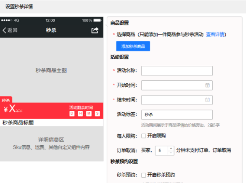
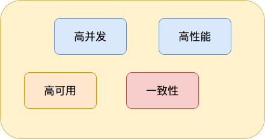
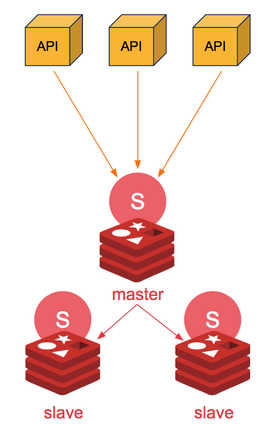
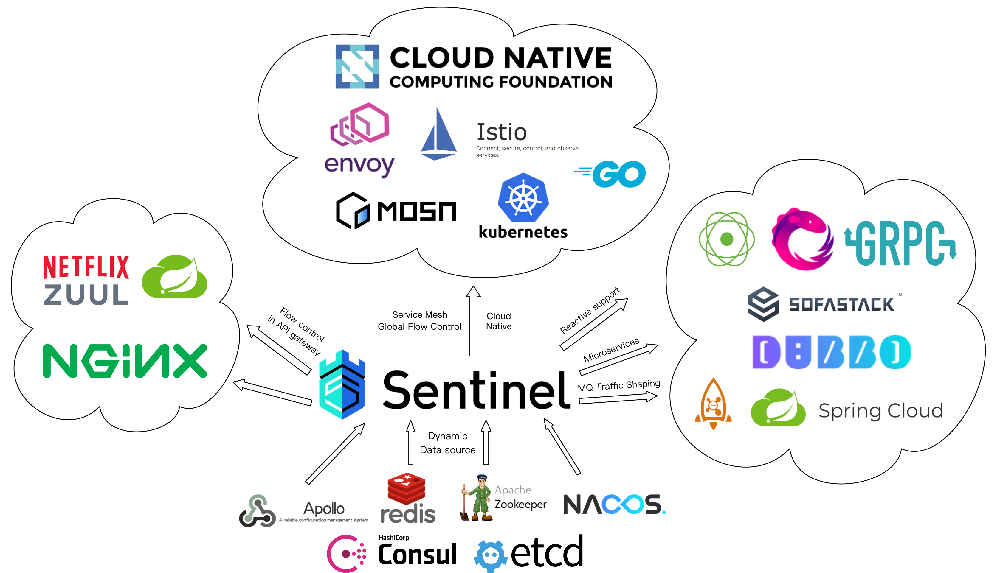

# 如何设计一个秒杀系统？

**<font style="color:#DF2A3F;">注意！！！</font>**：系统设计&场景题已经移动到了**《后端面试高频系统设计&场景题》 **中，地址**：**[**https://t.zsxq.com/18rZ6D7Wk**](https://t.zsxq.com/18rZ6D7Wk)** 。**


今天这篇文章咱们就开始从后端的角度来谈谈：“如何设计秒杀系统？”。


在你看这篇文章之前，我想说的是系统设计没有一个标准答案，你需要结合自己的过往经验来回答，我这篇文章也是简单说说自己的看法。


**下面是正文！**


设计秒杀系统之前，我们首先需要对秒杀系统有一个清晰的认识。


秒杀系统主要为商品（往往是爆款商品）秒杀活动提供支持，这个秒杀活动会限制商品的个数以及秒杀持续时间。





**为什么秒杀系统的设计是一个难点呢？** 是因为它的业务复杂么？ 当然不是！


秒杀系统的业务逻辑非常简单，一般就是下订单减库存，难点在于我们如何保障秒杀能够顺利进行。





+ 秒杀开始的时候，会有大量用户同时参与进来，因此秒杀系统一定要满足 **高并发** 和 **高性能** 。
+ 为了保证秒杀整个流程的顺利进行，整个秒杀系统必须要满足 **高可用** 。
+ 除此之外，由于商品的库存有限，在面对大量订单的情况下，一定不能超卖，我们还需要保证 **一致性** 。


> 很多小伙伴可能不太了解当代三高互联网架构：高并发、高性能、高可用。
>
>  
>
> 我这里简单解释一下：高并发简单来说就是能够同时处理很多用户请求。高性能简单来说就是处理用户的请求速度要快。高可用简单来说就是我们的系统要在趋近 100% 的时间内都能正确提供服务。
>


知道了秒杀系统的特点之后，我们站在技术层面来思考一下：“设计秒杀系统的过程中需要重点关注哪些问题”。


1. 参与秒杀的商品属于热点数据，我们该如何处理热点数据？
2. 商品的库存有限，在面对大量订单的情况下，如何解决超卖的问题？
3. 如果系统用了消息队列，如何保证消息队列不丢失消息？
4. 如何保证秒杀系统的高可用？
5. 如何对项目进行压测？有哪些工具？
6. ......


好的，废话不多说！正式开始！


## 高性能


### 热点数据处理


**何为热点数据？** 热点数据指的就是某一时间段内被大量访问的数据，比如爆款商品的数据、新闻热点。


**为什么要关注热点数据？** 热点数据可能仅仅占据系统所有数据的 0.1% ，但是其访问量可能是比其他所有数据之和还要多。不重点处理热点数据，势必会给系统资源消耗带来严峻的挑战。


**热点数据的分类？** 根据热点数据的特点，我们通常将其分为两类：


+ **静态热点数据** ：可以提前预测到的热点数据比如要秒杀的商品。
+ **动态热点数据** ： 不能够提前预测到的热点数据，需要通过一些手段动态检测系统运行情况产生。


另外，处理热点数据的问题的关键就在于 **我们如何找到这些热点数据（或者说热 key），然后将它们存在 jvm 内存里。** 对于并发量非常一般的系统直接将热点数据存放进缓存比如 Redis 中就可以了，不过像淘宝、京东这种级别的并发量，如果把某些热点数据放在 Redis 中，直接可能就将整个 Redis 集群给干掉了。


**如何检测热点数据？**


我了解到的是市面上也有一些类似的中间件，比如京东零售的 [hotkey](https://gitee.com/jd-platform-opensource/hotkey) 就是一款专门用于检测热点数据的中间件，它可以毫秒级探测热点数据，毫秒级推送至服务器集群内存。相关阅读：[京东毫秒级热 key 探测框架设计与实践，已完美支撑 618 大促](https://mp.weixin.qq.com/s/xOzEj5HtCeh_ezHDPHw6Jw) 。


另外，我们平时使用 Redis 做缓存比较多，关于如何快速定位 Redis 热点数据，可以看下[如何快速定位 Redis 热 key](https://www.infoq.cn/article/3l3zaq4h8xpnom2glsyi)这篇文章。


**如何处理热点数据？** 热点数据一定要放在缓存中，并且最好可以写入到 jvm 内存一份（多级缓存），并设置个过期时间。需要注意写入到 jvm 的热点数据不宜过多，避免内存占用过大，一定要设置到淘汰策略。


**为什么还要放在 jvm 内存一份？** 因为放在 jvm 内存中的数据访问速度是最快的，不存在什么网络开销。


### 静态资源处理


秒杀页面可能涉及到很多静态资源比如商品图片、CSS、JS。秒杀开始之前以及进行中的时候，会有大量的用户点开页面，有的用户还会不断的刷新秒杀界面。如果这些界面中的静态资源全部通过服务器获取，会造成大量的带宽消耗，甚至造成秒杀还没开始服务器就崩了。


对于这些静态资源，我们可以使用 CDN 进行处理，这是业内目前比较成熟的解决方案。


CDN 全称是 Content Delivery Network/Content Distribution Network，翻译过的意思是内容分发网络 。CDN 的作用是将静态资源分发到多个不同的地方以实现就近访问，进而加快静态资源的访问速度，减轻服务器以及带宽的负担。


你可以将 CDN 看作是服务上一层的特殊缓存服务，分布在全国各地，主要用来处理静态资源的请求。


基于成本、稳定性和易用性考虑，建议直接选择专业的云厂商（比如阿里云、腾讯云、华为云、青云）或者 CDN 厂商（比如网宿、蓝汛）提供的开箱即用的 CDN 服务。


## 高可用


### 集群化


如果我们想要保证系统中某一个组件的高可用，往往需要搭建集群来避免单点风险，比如说 Nginx 集群、Kafka 集群、Redis 集群。


我们拿 Redis 来举例说明。**如果我们需要保证 Redis 高可用的话，该怎么做呢？**


你直接通过 Redis replication（异步复制） 搞个一主(master)多从(slave)来提高可用性和读吞吐量，slave 的多少取决于你的读吞吐量。


这样的方式有一个问题：一旦 master 宕机，slave 晋升成 master，同时需要修改应用方的主节点地址，还需要命令所有从节点去复制新的主节点，整个过程需要人工干预。


不过，这个问题我们可以通过 Sentinel（哨兵） 来解决。Redis Sentinel 是 Redis 官方推荐的高可用性(HA)解决方案。


Sentinel 是 Redis 的一种运行模式 ，它主要的作用就是对 Redis 运行节点进行监控。当 master 节点出现故障的时候， Sentinel 会帮助我们实现故障转移，确保整个 Redis 系统的可用性。整个过程完全自动，不需要人工介入!





Sentinel 也是一个 Redis 进程，只是不对外提供读写服务，通常哨兵要配置成单数。


### 限流


> 限流是秒杀业务最常用的一个手段，所以经常你一参加秒杀就会提示“当前人数过多，请稍后再试”。
>


#### 接口限流


限流是从用户访问压力的角度来考虑如何应对系统故障。接口限流是为了对服务端的接口接受请求的频率进行限制，防止服务挂掉。


🌰 举个例子：我们的秒杀接口一秒只能处理 10w 个请求，结果秒杀活动刚开始一下子来了 15w 个请求。这肯定不行啊！我们只能通过限流把 5w 个请求给拦截住，不然系统直接就给整挂掉了！


接口限流的话可以直接用 Redis 来做（建议基于 Lua 脚本），也可以使用现成的流量控制组件比如 Sentinel 、Hystrix 、Resilience4J 。


[Hystrix](https://github.com/Netflix/Hystrix) 是 Netflix 开源的熔断降级组件。


[Sentinel](https://github.com/alibaba/Sentinel) 是阿里巴巴体提供的面向分布式服务架构的流量控制组件，经历了淘宝近 10 年双 11（11.11）购物节的所有核心场景（比如秒杀活动）的考验。


Sentinel 主要以流量为切入点，提供 **流量控制**、**熔断降级**、**系统自适应保护**等功能来保护系统的稳定性和可用性。


个人比较建议使用 Sentinel ，更新维护频率更高，功能更强大，并且生态也更丰富（Sentinel 提供与 Spring Cloud、Dubbo 和 gRPC 等常用框架和库的开箱即用集成， Sentinel 未来还会对更多常用框架进行适配，并且会为 Service Mesh 提供集群流量防护的能力）。





**除了直接对接口进行限流之外，我们还可以对用户、IP进行限流，限制同一用户以及IP单位时间内可以请求接口的次数。**


#### 问题/验证码


我们可以在用户发起秒杀请求之前让其进行答题或者输入验证码。


这种方式一方面可以避免用户请求过于集中，另一方面可以有效解决用户使用脚本作弊。


回答问题/验证码这一步建议除了对答案的正确性做校验，还需要对用户的提交时间做校验，比如提交时间过短（<1s）的话，大概就是使用脚本来处理的。


#### 提前预约


采用提前预约才能参加秒杀活动的方式过滤一批人。并且，我们在秒杀活动开始之前，还可以对预约的这些人进行筛选，通过某些方式找出潜在的黄牛。


### 流量削峰


对于突发的大流量我们还可以使用消息队列进行流量削峰。


秒杀开始之后的流量不是很大，我处理不了嘛！那我就先把这些请求放到消息队列中去。然后，咱后端服务再慢慢根据自己的能力去消费这些消息，这样就避免直接把后端服务打垮掉。


对于秒杀场景来说，用户发送秒杀请求之后先存到消息队列中，然后再慢慢去消费。


不过，如果你已经对接口进行的限流处理的话，这里其实就没必要再上消息队列了。


### 降级


降级是从系统功能优先级的角度考虑如何应对系统故障。


服务降级指的是当服务器压力剧增的情况下，根据当前业务情况及流量对一些服务和页面有策略的降级，以此释放服务器资源以保证核心任务的正常运行。**降级的核心思想就是丢车保帅，优先保证核心业务。**x


🌰 举个例子：当请求量达到一个阈值的时候，我们对系统中一些非核心的功能直接关闭或者让它们功能降低。这样的话，系统就有更多的资源留给秒杀功能了！


### 熔断


熔断和降级是两个比较容易混淆的概念，两者的含义并不相同。降级的目的在于应对系统自身的故障，而熔断的目的在于应对当前系统依赖的外部系统或者第三方系统的故障。


熔断可以防止因为秒杀交易影响到其他正常服务的提供


🌰 举个例子： 秒杀功能位于服务 A 上，服务 A 上同时还有其他的一些功能比如商品管理。如果服务 A 上的商品管理接口响应非常慢的话，其他服务直接不再请求服务 A 上的商品管理这个接口，从而有效避免其他服务被拖慢甚至拖死。


## 一致性


### 减库存方案


常见的减库存方案有：


+ **下单即减库存** ：只要用户下单了，即使不付款，我们就扣库存。
+ **付款再减库存** ：当用户付款了之后，我们再减库存。不过， 这种情况可能会造成用户下订单成功，但是付款失败。


一般情况下都是 **下单减扣库存** ，像现在的购物网站比如京东都是这样来做的。


不过，我们还会对业务逻辑做进一步优化，比如说对超过一定时间不付款的订单特殊处理，释放库存。


对应到代码层面，我们应该如何保证不会超卖呢？


我们上面也说，我们一般会提前将秒杀商品的信息放到缓存中去。我们可以通过  Lua 脚本对库存进行原子操作。伪代码如下：


```lua
-- 第一步：先检查 库存是否充足，库存不足，返回 0
local stockNum=tonumber(redis.call("get",key);
if stockNum<1 then
  	return 0;
-- 第二步：如果库存充足，减少库存（假设只能购买一件）,返回 1
else
	redis.call('DECRBY',key,1);
  return 1;
end
```


不过，如果 Lua 脚本运行时出错并中途结束，出错之后的命令是不会被执行的。并且，出错之前执行的命令是无法被撤销的，无法实现类似关系型数据库执行失败可以回滚的那种原子性效果。因此， 严格来说的话，通过 Lua 脚本来批量执行 Redis 命令实际也是不完全满足原子性的。如果想要让 Lua 脚本中的命令全部执行，必须保证语句语法和命令都是对的


在 Redis 中扣减库存成功后，需要将库存同步到 MySQL 。MySQL 的库存并不需要去实时进行更新，只需要库存达到最终一致性即可，即先对 Redis 的库存进行更新，然后再异步同步到 MySQL 的库存。这里的异步实现方式建议使用 MQ，由 MQ 保证消息被消费，实现最终一致性，毕竟秒杀场景本身就要引入 MQ 进行流量削峰。


### 余额扣减方案


在高并发下，余额扣减也是关键。假设用户同时下了两单 a,b，这两单都同时查到用户余额为 10000，然后执行扣款，那有一个订单就相当于没付款。


如何解决呢？在并发量高情况下推荐使用悲观锁，如果并发量不高可以考虑使用乐观锁。


悲观锁可以基于Redis 或者 ZooKeeper 实现，但一般不会这么做，因为还要考虑他们的异常情况。余额扣减场景，对于正确性要求极高！我们可以直接利用数据库自带的排他锁（X 锁），这种方案用的最多，大部分银行都是这样做的。


在 MySQL 里使用排他锁：


```sql
SELECT ... FOR UPDATE
```


乐观锁建议使用版本号机制实现，同时要注意 ABA 问题。


### 接口幂等


通过接口幂等保证用户不重复下单和支付，接口幂等常见方案可以查看《Java面试指北》中的这篇文章：


[高可用：如何保证接口幂等性？](https://www.yuque.com/snailclimb/mf2z3k/mlnfrc6kk95kmli6)


对于秒杀这种场景，建议搭配状态机实现幂等。如果使用分布式锁的话， key 可以根据请求内容生成。


## 性能测试


上线之前压力测试是必不可少的。推荐 4 个比较常用的性能测试工具：


1. **Jmeter** ：Apache JMeter 是 JAVA 开发的性能测试工具。
2. **LoadRunner**：一款商业的性能测试工具。
3. **Galtling** ：一款基于 Scala 开发的高性能服务器性能测试工具。
4. **ab** ：全称为 Apache Bench 。Apache 旗下的一款测试工具，非常实用。


没记错的话，除了 **LoadRunner** 其他几款性能测试工具都是开源免费的。


## 总结


我简单画了一张图来总结一下上面涉及到的一些技术。


另外，上面涉及到知识点还蛮多的，如果面试官单独挑出一个来深挖还是能够问出很多问题的。


比如面试官想在消息队里上进行深挖，可能会问：


+ 常见消息队列的对比
+ 如何保证消息的消费顺序？
+ 如何保证消息不丢失？
+ 如何保证消息不重复消费？
+ 如何设计一个消息队列？
+ ......


再比如面试官想在 Redis 上深挖的话，可能会问：


+ Redis 常用的数据结构了解么？
+ Redis 如何保证数据不丢失？
+ Redis 内存占用过大导致响应速度变慢怎么解决？
+ 缓存穿透、缓存雪崩了解么？怎么解决？
+ ......


因此，要想要真正搞懂秒杀系统的设计，你还需要将其涉及到的一些技术给研究透！


> 更新: 2024-06-06 11:02:14  
> 原文: <https://www.yuque.com/snailclimb/mf2z3k/wividn>