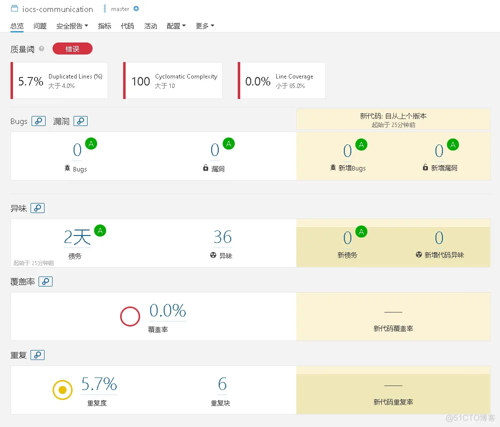

# 你的项目单测是如何做的？

### 为什么需要单元测试？

1. **为重构保驾护航**：单元测试可以为重构提供信心，降低重构的成本。
2. **提高代码质量**：由于每个单元有独立的逻辑，做单元测试时需要隔离外部依赖，确保这些依赖不影响验证逻辑。因为要把各种依赖分离，单元测试会促进工程进行组件拆分，整理工程依赖关系，更大程度减少代码耦合。这样写出来的代码，更好维护，更好扩展，从而提高代码质量。
3. **快速定位 bug**：如果程序有 bug，我们运行一次全部单元测试，找到不通过的测试，可以很快地定位对应的执行代码。修复代码后，运行对应的单元测试；如还不通过，继续修改，运行测试……直到测试通过。
4. **减少 bug**：一个可单元测试的工程，会把业务、功能分割成规模更小、有独立的逻辑部件，称为单元。单元测试的目标，就是保证各个单元的逻辑正确性。单元测试保障工程各个“零件”按“规格”（需求）执行，从而保证整个“机器”（项目）运行正确，最大限度减少 bug。
5. **持续集成依赖单元测试**：持续集成需要依赖单元测试，当持续集成服务自动构建新代码之后，会自动运行单元测试来发现代码错误。

### 为什么选择 JUnit + Mockito？

对于单测来说，目前常用的单测框架有：JUnit、Mockito、Spock、PowerMock、JMockit、TestableMock 等等。

JUnit 几乎是默认选择，但是其不支持 Mock，因此我们还需要选择一个 Mock 工具。Mockito 和 Spock 是最主流的两款 Mock 工具，一般都是在这两者中选择。

究竟是选择 Mockito 还是 Spock 呢？我这里做了一些简单的对比分析：

+ Spock 没办法 Mock 静态方法和私有方法 ，Mockito 3.4.0 以后，支持静态方法的 Mock，具体可以看这个 issue：[https://github.com/mockito/mockito/issues/1013](https://github.com/mockito/mockito/issues/1013)，具体教程可以看这篇文章：[https://www.baeldung.com/mockito-mock-static-methods。](https://www.baeldung.com/mockito-mock-static-methods%E3%80%82)
+ Spock 基于 Groovy，写出来的测试代码更清晰易读，比较规范(自带 given-when-then 的常用测试结构规范)。Mockito 没有具体的结构规范，需要项目组自己约定一个或者遵守比较好的测试代码实践。通常来说，同样的测试用例，Spock 的代码要更简洁。
+ Mockito 使用的人群更广泛，稳定可靠。并且，Mockito 是 SpringBoot Test 默认集成的 Mock 工具。

Mockito 和 Spock 都是非常不错的 Mock 工具，相对来说，Mockito 的适用性更强一些。

### JaCoCo 有什么用？

对于 Java/Kotlin 语言来说，JaCoCo（Java Code Coverage Library，Java 代码覆盖率库）是常用的一个开源代码覆盖率工具，支持生成单元测试覆盖率和接口测试覆盖率。

+ **单元测试覆盖率**：通常是开发者最关注的，因为单元测试直接对应于代码库中的最小功能单位。JaCoCo 可以在运行单元测试时收集覆盖率数据，帮助开发者了解哪些代码被测试覆盖，哪些没有。
+ **接口测试覆盖率**：接口测试通常涉及到系统的外部交互，比如 REST API 的测试。在运行这些测试时，可以启用 JaCoCo 来收集覆盖率数据，了解这些外部接口相关的代码部分的覆盖情况。

Jacoco 报告可以以多种格式展示，包括 HTML、XML 和 CSV。并且，还能将相应数据推送到其他第三方工具比如 SonarQube。

### JaCoCo 覆盖率报告有哪些指标？

+ **方法覆盖率**：执行的方法数 / 代码总方法数，检测是否有方法被遗漏，构造方法也看作为方法。
+ **分支覆盖率**：有多少控制结构的分支（例如 if 语句）被执行，一般用于检测是不是`if/else`都有测试覆盖。注意，异常处理一般不算做分支；
+ **行覆盖率**：执行代码行数 / 总代码行数，判断有多少行代码被测试执行；
+ **类覆盖率**：执行的类 / 代码中类总个数
+ **圈复杂度**：用于判断代码结构的复杂程序，JaCoCo 不考虑异常处理的分支。圈复杂度大说明程序代码可能质量低且难于测试和维护。一般认为圈复杂度大于 10，就存在比较大的风险，严格要求不可大于 15。

### SonarQube 有什么用？

SonarQube 是一个基于 Java 开发的开源代码分析平台，用来持续分析和评测项目源代码的质量，支持 Java、C#、JavaScript 等二十余种编程语言。通过 SonarQube 可以检测出项目的代码异味、潜在错误、复杂度以及安全漏洞等问题。它还可以集成 JaCoCo 的覆盖率报告，将这些数据与其他代码质量指标结合起来，以提供更全面的代码健康评估。

实际项目中，我们可以将 SonarQube 集成到 Jenkins 中。

### 为什么要在项目中同时使用 JaCoCo 和 SonarQube？

虽然 JaCoCo 提供了详细的代码覆盖率数据，但它主要关注的是量化测试的广度和深度。SonarQube 则提供了更全面的代码质量分析，包括维护性、可读性、复杂度和安全性分析。将 JaCoCo 的数据集成到 SonarQube 中，可以在单一平台上评估代码的整体质量，这对于维护代码健康、识别潜在问题以及优化代码结构至关重要。

> 更新: 2024-06-06 11:11:22  
> 原文: <https://www.yuque.com/snailclimb/mf2z3k/xn8bbwno39g815hk>