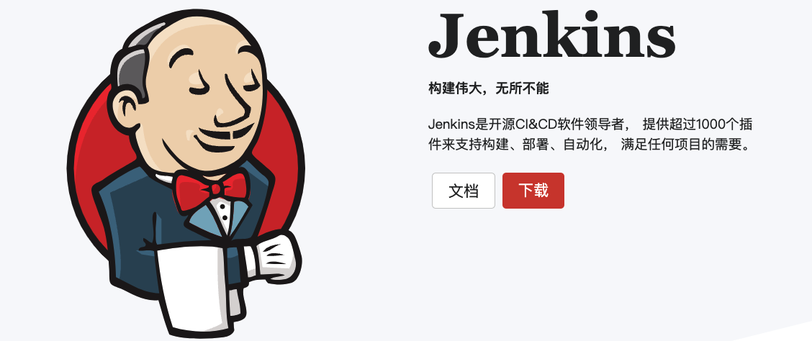
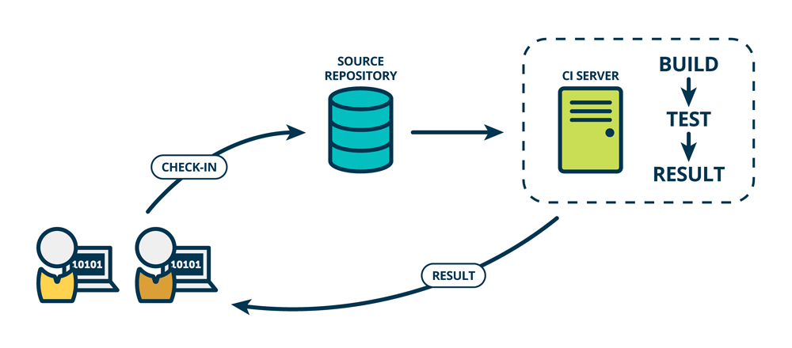
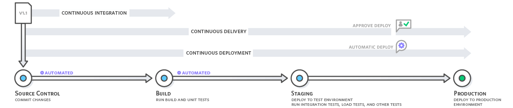
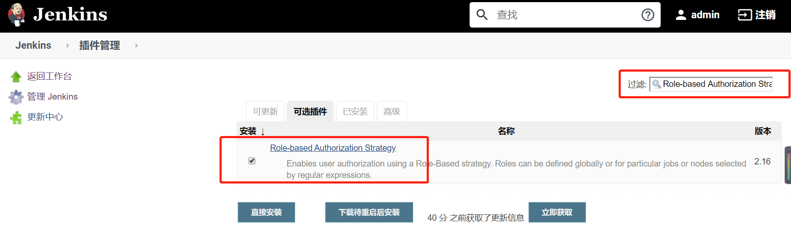
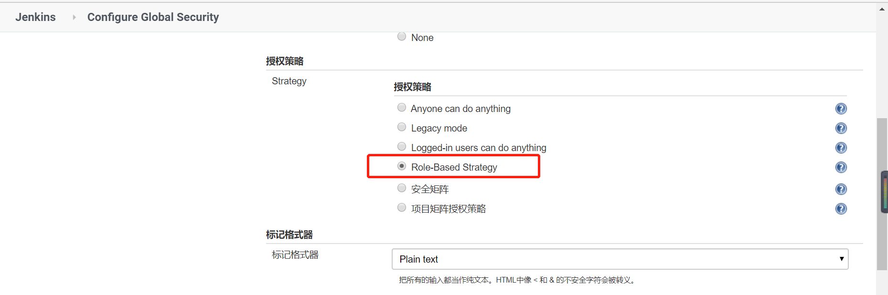
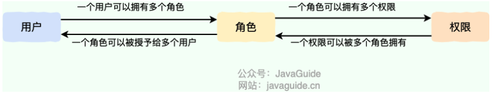
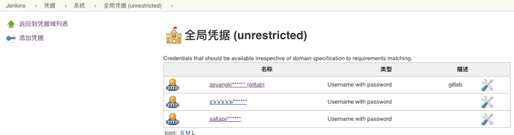

# 你的项目用到了Jenkins，有什么用？

## Jenkins 是什么？


Jenkins 的前身是 Hudson，它基于 Java 语言开发，是一款开源的持续集成（Continuous Integration, CI）和持续交付（Continuous Delivery, CD）软件。Jenkins 用于自动化各种任务，包括构建、测试和部署软件，帮助开发团队实现自动化的软件开发流程。





Jenkins 支持多种运行方式，包括系统包、Docker 或者作为一个独立的 Java 程序运行。


Jenkins 的主要特点包括：

+ **易于安装**：可以作为独立的程序运行，不需要额外的安装或数据库支持。
+ **易于配置**：通过其网页界面可以轻松设置和配置，提供即时错误检查和内置帮助。
+ **插件丰富**：拥有超过 1000 个插件来支持构建、部署、自动化等任务，满足不同项目的需求。
+ **分布式构建**：能够在多台机器上分配工作，加快构建、测试和部署的速度。


官网：[https://www.jenkins.io/zh/](https://www.jenkins.io/zh/) 。


## 什么是持续集成？有什么好处？
****

**什么是集成？**

****

集成就是把团队不同开发人员的代码集中在一起，使之成为一个可工作软件。

我们应该把开发的完成定义为代码已经集成起来，而站在个体的角度，我们应该尽早提交自己的代码，早点开始集成。



****

**什么是持续集成？**


持续集成（Continuous Integration, CI）是一种 DevOps 实践，主要目标是迅速发现和解决缺陷，提升软件质量，并缩短验证和发布新版本所需的时间。在持续集成过程中，开发人员会定期将他们的代码变更合并到一个中央存储库中。每次合并后，系统会自动执行构建和测试，以确保代码的正确性。


**为什么需要持续集成？**

****

1. **早期发现并修复问题**：持续集成通过自动化的构建、编译和测试流程，在代码合并到主分支后立即执行。这种即时反馈机制能够尽早发现错误和缺陷，相较于项目后期发现，此时修复的成本和影响都较小。这有助于降低项目延期和成本超支的风险。
2. **持续健康检查，确保系统稳定**：CI 像一个不间断的守护者，对系统的每一个改动进行健康检查。
3. **减少人工干预，消除重复劳动**：手动构建、测试和部署不仅耗时而且容易出错。持续集成自动化了这些重复性高的任务，释放了开发人员的时间，让他们能够专注于更有价值的工作。
4. **加速交付周期，实现持续部署与交付**：CI 是实现持续部署（CD）的基础。

****

**持续集成的工作原理是什么？**

****

1. 开发人员使用诸如 Git 之类的版本控制系统，将更新频繁提交到共享存储库中。
2. 每次提交前，开发人员可以选择在集成前对其代码执行本地单元测试，这是第一层保障。
3. 持续集成服务在新代码更改上自动构建和运行单元测试，以立即发现任何错误。




## 持续集成和持续交付的区别是什么？


持续交付（Continuous Delivery, CD） 是在持续集成（Continuous Integration, CI）的基础上，进一步确保代码库中的每一个更改在通过自动化测试后都可以随时部署到生产环境。你可以将 CD 看作是 CI 的扩展。


CI 主要关注代码集成和自动化测试，确保每次代码更改不会破坏现有功能。CD 包含 CI 的所有活动，并进一步确保代码可以随时安全地部署到生产环境。也就是说，CI 的目标是保持代码库的健康和可用性。CD 的目标是让代码库中的每个更改都可以随时发布到生产环境（并不意味着每次提交都必须立即部署，持续交付不是持续部署，这点很多人容易误解），并确保发布过程稳定且可控。


最后，总结一下：


+ **持续集成（CI）**是确保代码频繁集成并通过自动化测试的过程，目的是尽早发现和修复问题。
+ **持续交付（CD）**是在 CI 基础上，进一步确保代码可以随时部署到生产环境。

## Jenkins 如何实现 RBAC 权限模型？


**Jenkins 对权限的支持是比较弱的，存在以下不足：**

****

+ 有多个流水线任务，期望不同用户能看到的任务不一样。
+ 一个项目有多套环境，期望用户只能部署某些环境。
+ 有的项目只让用户有查看权限，期望不给部署权限。


为了弥补这些不足，Jenkins 可以通过 **RBAC 插件**（Role-based Authorization Strategy）来实现对权限的细粒度控制。这个插件允许管理员定义不同的角色，并为不同用户或用户组分配相应的权限，从而确保不同用户只能访问和操作他们被授权的部分。





安装好 Role-based Authorization Strategy 插件之后，全局安全设置中就可以找到对应的授权策略：**Role-Base Strategy**。





全局安全设置的访问路径如下：


```plain
Dashboard->Manage Jenkins->Configure Global Security
```


选择该授权策略之后，在 Manage Jenkins 中就会多出一个 Manage and Assign Roles 选项。点击这个选项，就可以进行用户的创建以及角色和角色权限的分配。


这里再简单介绍一下 RBAC 权限模型。


系统权限控制最常采用的访问控制模型就是 **RBAC 模型** 。

****

**什么是 RBAC 呢？** RBAC 即基于角色的权限访问控制（Role-Based Access Control）。这是一种通过角色关联权限，角色同时又关联用户的授权的方式。


简单地说：一个用户可以拥有若干角色，每一个角色又可以被分配若干权限，这样就构造成“用户-角色-权限” 的授权模型。在这种模型中，用户与角色、角色与权限之间构成了多对多的关系。





在 RBAC 权限模型中，权限与角色相关联，用户通过成为包含特定角色的成员而得到这些角色的权限，这就极大地简化了权限的管理。


JavaGuide 上有几篇认证授权相关的文章，推荐看看：


+ [认证授权基础概念详解](https://javaguide.cn/system-design/security/basis-of-authority-certification.html)
+ [JWT 基础概念详解](https://javaguide.cn/system-design/security/jwt-intro.html)
+ [JWT 身份认证优缺点分析](https://javaguide.cn/system-design/security/advantages&disadvantages-of-jwt.html)
+ [权限系统设计详解](https://javaguide.cn/system-design/security/design-of-authority-system.html)

## Jenkins Pipeline 是什么？为什么要用？
在 Jenkins 1.x 中，用户只能通过 Web 界面手动操作来描述部署流水线，这种方式限制了自动化和复杂流程的管理。Jenkins Pipeline（或简称为 "Pipeline"）是 Jenkins 2.x 的核心特性之一，它是一套插件，允许用户以代码的形式定义和管理整个持续交付流程。


Pipeline 通过代码（通常是 Groovy 脚本）来定义整个持续交付流程，代码通常保存在名为 `Jenkinsfile` 的文件中。一个代码项目中可以根据需要创建多个不同的 `Jenkinsfile`，以适应不同的构建和部署需求。


Pipeline 支持两种语法：


+ **Declarative Pipeline（声明式）**:在 Pipeline 2.5 中引入， 提供了更简单、更结构化（more opinionated）的语法，可维护性更好，官方更推荐的方式。
+ **Scripted Pipeline（脚本式）**:通常基于 Groovy 写，可以为用户提供巨大的灵活性和可扩展性，但语法复杂一些。


两种语法都遵循“Pipeline as Code”的理念，均可纳入版本控制系统。选择哪种语法取决于项目需求、团队熟悉度以及对 Pipeline 复杂度和可读性的偏好。


```groovy
pipeline {
    agent any
    stages {
        stage('Build') {
            steps {
                //
            }
        }
        stage('Test') {
            steps {
                //
            }
        }
        stage('Deploy') {
            steps {
                //
            }
        }
    }
}
```


以下是一个简单的 `Jenkinsfile`（声明式语法），演示如何构建和测试一个基于 Maven 的  Spring Boot 项目：


```groovy
pipeline {
    agent any
    tools {
        maven 'Maven 3.6.3' // 这里的 'Maven 3.6.3' 是在 Jenkins 全局工具配置中定义的 Maven 名称
    }
    stages {
        // 拉取代码阶段
        stage('Checkout') { 
            steps {
                git 'https://github.com/your-repo/spring-boot-app.git'
            }
        }
        // 构建代码阶段
        stage('Build') {
            steps {
                sh './mvnw clean package'
            }
        }
        // 测试代码阶段
        stage('Test') {
            steps {
                sh './mvnw test'
            }
        }
    }
}
```


Pipeline 通过代码来实现，其实就具有很多代码的优势了，比如：


+ **支持传参**：可以在 Pipeline 代码中配置用户输入或选择的参数，例如传递 Git 分支名、选择部署的服务等。
+ **更好的版本化和协作**：Pipeline 作为代码（Pipeline as Code），可以纳入版本控制系统，便于版本控制、共享和审查。
+ **更好的重用性**：手动操作无法重用，但代码可以重用，从而提高效率。
+ **复杂流程管理**：Pipeline 支持复杂的构建逻辑，包括并行执行、条件分支、循环等，非常适合处理包含多个阶段（如构建、测试、部署）的复杂流程。
+ **持续交付**：Pipeline 天然支持持续交付和持续部署的实践，可以自动化从代码提交到部署的整个生命周期管理。


## 自动触发 Jenkins Pipeline 构建如何实现？


实现自动触发 Jenkins Pipeline 构建的方式有很多种，这里我们来总结对比三种最常见的方式：定时构建、SCM 轮询 和 Webhook。


| 特性 | 定时构建 | 轮询 SCM | Webhook |
| :--- | :--- | :--- | :--- |
| 触发机制 | 按预设时间表 | 定期检查代码库变更 | 代码库事件触发 |
| 实时性 | 差 | 一般 | 高 |
| 资源消耗 | 可能浪费资源（可能会触发不必要的构建，例如代码没有变更） | 可能浪费资源（需要频繁的轮询） | 资源利用率高 |
| 配置复杂度 | 简单 | 简单 | 相对复杂 |
| 应用场景 | 定期任务，如凌晨构建 | 无需实时性要求的项目以及无法配置 Webhook 的环境 | 需要高实时性构建触发的场景，如持续集成和持续部署（CI/CD）流水线 |


## 使用过哪些 Jenkins 插件？


总结一下日常开发中常用的一些 Jenkins 插件：


+ **Git Plugin**：用于从 Git 仓库拉取代码。
+ **GitLab Plugin**：专门针对 GitLab 平台的 Jenkins 插件，提供了与 GitLab 更紧密集成的功能。
+ **Maven Plugin**：用于集成和执行 Maven 构建工具。
+ **Pipeline Plugin**：可以看作是一套插件，用于实现 Jenkins Pipeline 功能。
+ **Blue Ocean Plugin**：为 Jenkins Pipeline 设计的一个聚合工具，提供更现代和直观的 Pipeline 可视化界面。
+ **Role-based Authorization Strategy Plugin**：实现基于角色的访问控制（RBAC），这个在上面提到过。
+ **Email Extension Plugin**：配置和发送构建通知邮件。Jenkins 自带的邮件功能比较鸡肋，因此这里推荐安装专门的邮件插件。
+ **JUnit Plugin**：用于解析和展示 JUnit 测试结果。
+ **JaCoCo Plugin**：用于借助 JaCoCo（Java Code Coverage Library） 生成代码覆盖率报告。
+ **SonarQube Scanner**：用于借助 SonarQube 持续分析和评测项目源代码的质量。
+ **Docker Pipeline Plugin**：用于在 Pipeline 脚本中集成和管理 Docker 容器。
+ **Ansible Plugin**：集成 Ansible，用于配置管理和部署。
+ ......

## 如何在 Jenkins 中配置和管理多个环境？
在 Jenkins 中配置和管理多个环境主要通过以下方法实现：


1. **参数化构建**： 参数化构建允许在构建时选择或指定不同的环境配置。
2. **环境特定的配置文件**： 为每个环境维护一个配置文件，包含该环境特定的设置和参数。
3. **Pipeline 脚本**： 使用 Pipeline 脚本，可以定义不同阶段在不同环境下的操作。这样可以在一个脚本中管理多个环境的构建、测试和部署流程。
4. **插件和工具**： 利用 Jenkins 的插件和外部工具，如配置管理工具（Ansible、Chef、Puppet），可以更灵活和动态地管理多环境配置。


这样的配置管理确保了不同环境下的一致性和自动化部署的可靠性。

## Jenkins 如何安全存储敏感信息？


可以使用 Jenkins 的凭据来安全地存储和使用敏感信息（如 API 密钥、数据库密码）。





Jenkins 支持多种类型的凭据，根据需要选择合适的类型：


+ **Username and password（常用）**：存储用户名和密码。
+ **GitLab API token**：存储与 GitLab 集成时所需的 API 令牌。
+ **Docker Host Certificate Authentication**：存储与 Docker 进行安全通信所需的证书和私钥。
+ **Secret file**：存储需要保密的文件，例如配置文件。
+ **Secret text**：存储需要保密的文本信息，例如 API 密钥。
+ **SSH Username with private key**：存储 SSH 公钥/私钥对。
+ **Certificate**：存储证书。


凭证的作用域，主要有下面几种：


+ Global（全局，默认，一般用这个）: 所有 Jobs 和 Pipelines 中都可用，是最常用的凭据类型。
+ System（系统）: 仅用于 Jenkins 本身的系统管理任务，不对普通的 Jobs 和 Pipelines 可见。
+ Job（作业）：凭据仅供特定 Job 使用，仅该 Job 可以使用这些凭据。
+ User（用户）：凭据与特定用户关联，仅该用户可以使用这些凭据。


每个凭据会有一个唯一的 ID，这个 ID 很重要，可以自定义也可以随机生成（后续流水线中引用都是通过凭据 ID 引用的）。为便于管理和使用，强烈建议使用统一的命名约定来指定凭据 ID，例如 `gitlab-api-token`、`db-password` 等。在 “描述” 字段中，需要写清楚凭据的作用，便于后期维护和复用。

## 你的项目是如何使用 Jenkins 部署项目的？


面试中提到编写的 Jenkinsfile 涉及到的核心步骤即可：拉取代码、构建、打包、构建 Docker 镜像、推送镜像到 Docker Hub、部署 SpringBoot 项目。


有几点需要注意：


1. 在 Jenkins 中需要配置 Git 和 Docker Hub 的访问凭据。
2. 如果项目包含多个服务，可以使用 Docker Compose 进行多容器应用的编排。
3. 建议在构建失败或成功时发送邮件通知，以便及时了解构建状态。发送邮件可以用我们上面提到的`Email Extension Plugin`。
4. 可以将常用的 Pipeline 代码抽取到共享库中，可以提高代码复用性和维护性。


详细步骤可以参考这篇文章：[Jenkins Pipeline 流水线方式部署 SpringBoot 项目](https://juejin.cn/post/7132503611786919972)。


## 推荐
除了上面提到的问题之外，再推荐一些 Jenkins 学习资料：


+ [Jenkins 官方文档](https://www.jenkins.io/zh/doc/)
+ [《Devops 系列》-悟空聊架构](https://sourl.cn/GnTLmq)


> 更新: 2024-07-19 18:58:21  
> 原文: <https://www.yuque.com/snailclimb/mf2z3k/uba4g8fvxmkvvodl>