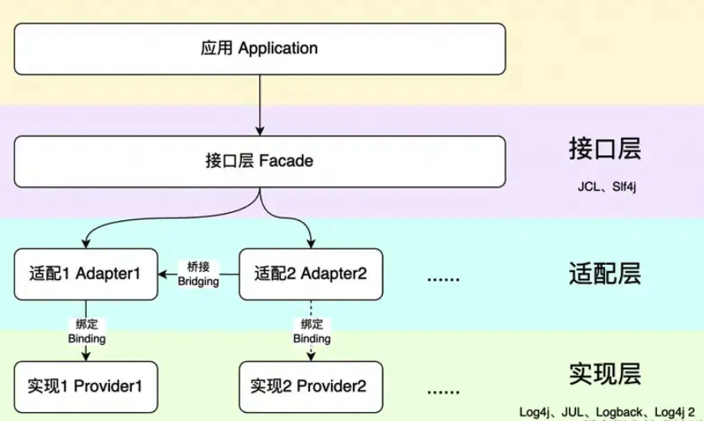

# 日志记录方案有哪些？

## 什么是日志？有什么用？


日志（Log）本质就是一种系统记录文件，是由系统在运行过程中产生的结构化或者非结构化的文字信息，用于存储发生在操作系统、应用软件、网络和存储设备上的事件，主要用于问题诊断、审计和性能监控。


在我看来，日志就是系统对某些行为的一些记录，这些行为包括：系统出现错误（定位问题、解决问题）、记录关键的业务信息（定位问题、解决问题）、记录操作行为（保障安全）等等。


实际项目中，日志多用于问题排查。没有日志，系统上线后出问题就等于抓瞎（生产环境直接调试通常是不可能的，因此日志成为了识别和解决问题的主要手段）。


除了方便问题定位之外，日志还可以被集成到监控系统中，这不仅允许团队实时监控系统的运行状况，还可以记录和分析用户行为。

## 日志记录方案有哪些？


### 业务代码嵌套


在业务逻辑代码中直接调用日志记录接口，将日志信息打印到日志文件或数据库中。


+ 优点：简单易用，可以灵活地控制日志的内容和级别
+ 缺点：业务代码的复杂度和耦合度增加（不利于代码的维护和重用）


### AOP


AOP(Aspect-Oriented Programming:面向切面编程)能够将那些与业务无关，却为业务模块所共同调用的逻辑或责任（例如事务处理、日志管理、权限控制等）封装起来，便于减少系统的重复代码，降低模块间的耦合度，并有利于未来的可拓展性和可维护性。


利用面向切面编程（Aspect-oriented Programming，AOP），将日志记录作为一个切面，与业务逻辑分离，通过注解或配置的方式，将日志记录的功能织入到目标方法的执行过程中。


```java
@OperateLog(operateModule = "用户管理", operateType = "GET", operateDesc = "获取用户")
public Response<User> get(String name){
    //...
}
```


这种方案可以看作是业务代码嵌套方案的改进。


+ 优点：业务代码的复杂度和耦合度降低（利于代码的维护和重用）
+ 缺点：对性能有轻微影响（需要在运行时动态创建代理对象，调用切面方法等等）


实际项目用的最多的还是 AOP 日志记录这种方案。


美团技术团队分享过一篇文章介绍如何优雅地使用 AOP 的方式生成动态的操作日志。


[如何优雅地记录操作日志？](https://tech.meituan.com/2021/09/16/operational-logbook.html)


### 监听数据库 Binlog


利用 MySQL 二进制日志（Binlog）的特性，通过监听 Binlog 来追踪数据库的数据变化，进而记录操作日志。


我们可以利用阿里开源的 MySQL Binlog 增量订阅和消费组件**Canal [kə'næl]**来监听 Binlog。


+ 优点：日志记录和业务逻辑完全分离
+ 缺点：局限性太大（只能针对数据库的更改做操作日志记录）、系统复杂度增加（需要额外的中间件）


## <font style="color:rgb(59, 69, 78);">什么时候需要记录日志？</font>


阿里技术的[系统日志规范及最佳实践](https://mp.weixin.qq.com/s/QOfkdC4iQO77dk8Sp5piIA)这篇文章详细总结了记录日志的时机，这里直接贴一下：


1. **代码初始化时或进入逻辑入口时**：系统或者服务的启动参数。核心模块或者组件初始化过程中往往依赖一些关键配置，根据参数不同会提供不一样的服务。务必在这里记录 INFO 日志，打印出参数以及启动完成态服务表述。
2. **编程语言提示异常**：这类捕获的异常是系统告知开发人员需要加以关注的，是质量非常高的报错。应当适当记录日志，根据实际结合业务的情况使用 WARN 或者 ERROR 级别。
3. **业务流程预期不符**：项目代码中结果与期望不符时也是日志场景之一，简单来说所有流程分支都可以加入考虑。取决于开发人员判断能否容忍情形发生。常见的合适场景包括外部参数不正确，数据处理问题导致返回码不在合理范围内等等。
4. **系统/业务核心逻辑的关键动作**：系统中核心角色触发的业务动作是需要多加关注的，是衡量系统正常运行的重要指标，建议记录 INFO 级别日志。
5. **第三方服务远程调用**：微服务架构体系中有一个重要的点就是第三方永远不可信，对于第三方服务远程调用建议打印请求和响应的参数，方便在和各个终端定位问题，不会因为第三方服务日志的缺失变得手足无措。

## Java 日志框架有哪些？


日志发展到今天，被抽象成了三层：接口层、实现层、适配层（下图来源于[Java 日志通关（一） - 前世今生](https://mp.weixin.qq.com/s/eIiu08fVk194E0BgGL5gow)这篇文章）：





+ **接口层（日志门面）**： 只定义接口，等待其他组件来实现。
+ **实现层（独立实现）**： 真正执行日志记录工作的工具。但请注意，它不是直接实现接口层的接口，因为它不感知也不直接实现这些接口，而是独立的实现。
+ **适配层（Adapter）**： 适配层才是接口层的实现。由于接口层和实现层可能并非由同一方开发，它们之间可能不直接兼容，因此需要适配层来桥接它们。在计算机科学领域，增加一个中间层（如适配器）常常可以解决这种不兼容的问题。


下面总结一下重要的日志接口层、实现层和适配层：


+ Log4j (1999)：由 Ceki Gülcü 开发，2001 年被开源后加入 Apache 基金会成为 Apache Log4j，提供了强大的日志功能。不过，Log4j 有比较明显的性能短板，在 Logback 和 Log4j 2 推出后逐渐式微，最终 Apache 在 2015 年宣布终止开发 Log4j 并全面迁移至 Log4j 2。
+ java.util.logging (2002.2)：Java 标准库中自带的一个简单的日志实现，简称 JUL，随 Java 1.4 发布，但功能和性能落后于 Log4j。
+ Slf4j (2005)：Simple Logging Facade for Java，由 Ceki 推出。Slf4j 是一个日志门面，它并不是具体的日志实现，而是提供了一套统一的接口。开发人员只需要编写 SLF4J 的 API 代码，而不需要直接调用具体的日志实现，这样就可以轻松地在不同的日志实现之间切换。
+ Logback (2006)：由 Ceki 开发，优于 Log4j，支持 Slf4j。目前，Logback 已经成为 Java 社区最被广泛接受的日志实现层。
+ Log4j 2 (2012)：Apache Log4j 2，提供了插件化结构和异步化输出。虽然 Log4j 2 在多线程场景下对比 Logback 有性能提升，但并未能撼动 Logback 的地位。
+ spring-jcl (2017)：JCL 全称为 Jakarta Commons Logging，是 Apache 提供通用日志接口。spring-jcl 是 spring 用于处理日志打印的模块，从 JCL 改造而来，目的是同时适配 Slf4j 和 JCL。


[Java 日志系统历史从入门到崩溃 - segmentfault - 2019](https://segmentfault.com/a/1190000021121882)这篇文章详细<font style="color:rgb(59, 69, 78);">介绍了 Java 日志框架的发展历史，非常有意思，感兴趣的可以看看。</font>

## 日志打印的规范有哪些？
1、不要随意打印日志，确保自己打印的日志是后面能用到的。


打印太多无用的日志不光影响问题排查，还会影响性能，加重磁盘负担。


2、打印日志中的敏感数据比如身份证号、电话号、密码需要进行脱敏。[相关阅读：Spring Boot 3 步完成日志脱敏，简单实用！！](https://mp.weixin.qq.com/s/MxKuqQYEf4nVXWH7wZchGA)


3、选择合适的日志打印级别。最常用的日志级别有四个： DEBUG、INFO、WARN、ERROR。


+ DEBUG（调试）：开发调试日志，主要开发人员开发调试过程中使用，生产环境禁止输出 DEBUG 日志。
+ INFO（通知）：正常的系统运行信息，一些外部接口的日志，通常用于排查问题使用。
+ WARN（警告）：警告日志，提示系统某个模块可能存在问题，但对系统的正常运行没有影响。
+ ERROR（错误）：错误日志，提示系统某个模块可能存在比较严重的问题，会影响系统的正常运行。


4、生产环境禁止输出 DEBUG 日志，避免打印的日志过多（DEBUG 日志非常多）。


5、应用中不可直接使用日志系统（Log4j、Logback）中的 API，而应依赖使用日志框架 SLF4J 中的 API，使用门面模式的日志框架，有利于维护和各个类的日志处理方式统一。


Spring Boot 应用程序可以直接使用内置的日志框架 Logback，Logback 就是按照 SLF4J API 标准实现的。


6、异常日志需要打印完整的异常信息。


反例：


```java
try {
    //读文件操作
    readFile();
} catch (IOException e) {
    // 只保留了异常消息，栈没有记录
    log.error("文件读取错误, {}", e.getMessage());
}
```


正例：


```java
try {
    //读文件操作
    readFile();
} catch (IOException e) {
    log.error("文件读取错误", e);
}
```


7、避免层层打印日志。


举个例子：method1 调用 method2，method2 出现 error 并打印 error 日志，method1 也打印了 error 日志，等同于一个错误日志打印了 2 遍。


8、不要打印日志后又将异常抛出。


反例：


```java
try {
  	 ...
} catch (IllegalArgumentException e) {
    log.error("出现异常啦", e);
    throw e;
}
```


在日志中会对抛出的一个异常打印多条错误信息。


正例：


```java
try {
  	 ...
} catch (IllegalArgumentException e) {
    log.error("出现异常啦", e);
}
// 或者包装成自定义异常之后抛出
try {
  	 ...
} catch (IllegalArgumentException e) {
    throw new MyBusinessException("一段对异常的描述信息.", e);
}
```


## 分布式下如何进行日志管理？


[服务治理：分布式下如何进行日志管理？](https://www.yuque.com/snailclimb/mf2z3k/ma1byh)


> 更新: 2024-07-05 12:53:16  
> 原文: <https://www.yuque.com/snailclimb/mf2z3k/srwasy4ubg4htbzg>