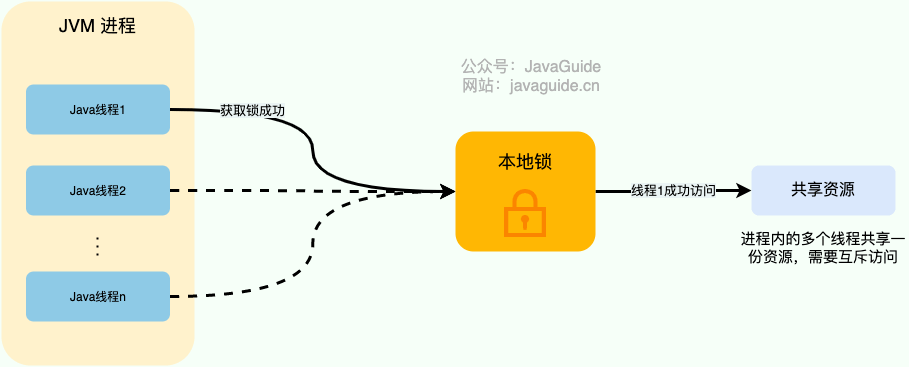

# 高可用：如何保证接口幂等性？

接口幂等性是面试中常见的问题，也是日常开发过程中经常需要解决的问题。


## 什么是幂等(idempotency)？


幂等(idempotency)本身是一个数学概念，常见于抽象代数中，表示一个函数或者操作的结果不受其输入或者执行次数的影响。例如， f(n) = 1^n ，无论 n 为多少，f(n)的值永远为 1。


在软件开发领域，幂等是对请求操作结果的一个描述，这个描述就是不论执行多少次相同的请求，产生的效果和返回的结果都和发出单个请求是一样的。


针对数据操作来说就是：


+ `insert`操作要保证不插入重复的数据；
+ `update`操作要保证多次相同请求数据依然正确。


接口幂等性问题通常是由于网络波动、用户重复操作、超时重试、消息重复消费、响应速度慢等原因导致的。


**不保证幂等会有什么后果？**


没有保证幂等会导致产生严重的生产级别的 Bug，比较典型的就是涉及到钱的业务场景。就比如在没有保证幂等性的情况下，我作为用户在付款的时候，我同时点击了多次付款按钮，后端处理了多次相同的扣款请求，结果导致我的账户被扣了多次钱。这就是属于非常非常非常严重的 Bug 了！只要业务涉及到钱就一定要格外注意！！！


综上，保证接口的幂等性至关重要。


另外，保证幂等性这个 **操作并不是说前端做了就可以的，后端同样也要做。**


## 如何保证接口幂等性？


前端保证幂等性的话比较简单，一般通过当用户提交请求后将按钮致灰来做到。


后端保证幂等性就稍微麻烦一点，方法也是有很多种，比如悲观锁、唯一索引、去重表、乐观锁 、分布式锁、Token 机制等等。


悲观锁和分布式锁的核心思想都是通过加锁来保证同一时刻只有一个请求能被执行。但仅仅这样是不够的，还需要配合根据业务逻辑进行幂等性判断，例如，注册场景检测指定的电话/邮箱/用户名是否已经被注册、订单支付场景检测订单的状态。


实际项目中，一般采用分布式锁这种方案比较多。


### 悲观锁


在 Java 中，可以使用 `ReetrantLock` 类、`synchronized` 关键字这类 JDK 自带的悲观锁来保证同一时刻只有一个线程能够进行修改。不过，JDK 自带的锁属于是本地锁，分布式环境下无法使用。





除了利用 JDK 提供的悲观锁之外，数据库自身也带了排他锁（X 锁）。排他锁又称写锁/独占锁，事务在修改记录的时候获取排他锁，不允许多个事务同时获取。如果一个记录已经被加了排他锁，那其他事务不能再对这条事务加任何类型的锁（锁不兼容）。


在 MySQL 里使用排他锁：


```sql
SELECT ... FOR UPDATE
```


排他锁只能在支持事务的存储引擎（如 InnoDB）中使用，且只能在事务中使用。另外，排他锁只能在有索引的字段上使用，否则会锁住整个表，影响并发性能。


高并发的场景下，激烈的锁竞争会造成线程阻塞，大量阻塞线程会导致系统的上下文切换，增加系统的性能开销。并且，悲观锁还可能会存在死锁问题，影响代码的正常运行。


### 乐观锁


乐观锁一般会使用版本号机制或 CAS 算法实现。


拿版本号机制来说，通过在表中增加一个版本号字段，每次更新数据时，检查当前的版本号否和数据库中的一致。如果一致，则更新成功，并且版本号加一。如果不一致，则更新失败，表示数据已经被其他请求修改过。


```sql
# 更新数据，修改 price 并将 version 加一，并且检查 version 是否为 1（假设 version 的初始值为 1）
update goods set price = price + 100 version = version + 1 where id = 1 and version = 1;
# 由于 version 已经变为 2 ，因此，下面的 sql 执行无效
update goods set price = price + 100, version = version + 1 where id = 1 and version = 1;
```


高并发的场景下，乐观锁相比悲观锁来说，不存在锁竞争造成线程阻塞，也不会有死锁的问题，在性能上往往会更胜一筹。但是，如果冲突频繁发生（写占比非常多的情况），会频繁失败和重试（悲观锁的开销是固定的），这样同样会非常影响性能，导致 CPU 飙升。不过，这种方法只适用于更新数据的场景。


### 唯一索引


通过在表中加上唯一索引，保证数据的唯一性。如果有重复的数据插入，会抛出异常，程序可以捕获异常并处理。不过，这种方法只适用于插入数据的场景。


```sql
create table t_order(
id int unsigned PRIMARY KEY AUTO_INCREMENT COMMENT "主键",
    `code` varchar(200) not null COMMENT "流水号",
    `customer_id`  int unsigned COMMENT "会员id",
    `amount` decimal(10,2) unsigned not null COMMENT "总金额",
    -- 省略其他订单字段
    -- 省略其他索引
    # 订单流水号唯一
    UNIQUE unq_code(`code`)
) COMMENT="订单表";
```


不要依靠唯一索引来保证接口幂等，但建议使用唯一索引作为兜底，避免产生脏数据。


### 去重表


去重表本质上也是一种唯一索引方案。去重表是一张专门用于记录请求信息的表，其中某个字段需要建立唯一索引，用于标识请求的唯一性当客户端发出请求时，服务端会将这次请求的一些信息（如订单号、交易流水号等）插入到去重表中，如果插入成功，说明这是第一次请求，可以执行后续的业务逻辑；如果插入失败，说明这是重复请求，可以直接返回或者忽略。


```sql
CREATE TABLE deduplication_table (
    id int unsigned PRIMARY KEY AUTO_INCREMENT COMMENT "主键",
    processed_code varchar(200) not null COMMENT "已处理的订单流水号",
    -- 省略其他字段
    UNIQUE unq_processed_code(processed_code)
) COMMENT="去重表";
```


### 分布式锁


分布式系统下，不同的服务/客户端通常运行在独立的 JVM 进程上，需要使用**分布式锁**。


基于 MySQL 也可以实现分布式锁，但一般我们不会采用这种方式。


通常情况下，我们一般会选择基于 Redis 或者 ZooKeeper 实现分布式锁，Redis 用的要更多一点。


我们上面提到的关系型数据的乐观锁、唯一索引和排他锁也算是分布式锁的实现方式，只是一般不会采用这种方式实现分布式锁，问题太多比如性能太差、不具备锁失效机制。


关于分布式锁的详细介绍以及如何基于 Redis 和 ZooKeeper 实现分布式锁，我写过专门的文章介绍，推荐看看：


+ [分布式锁介绍](https://javaguide.cn/distributed-system/distributed-lock.html)
+ [分布式锁常见实现方案总结](https://javaguide.cn/distributed-system/distributed-lock-implementations.html)


需要注意的是，这里的分布式锁是根据唯一标识（比如订单号）生成的。如果能够获取到对应的锁，说明请求还没有被处理。


Redisson 的 `RLock`实现幂等的伪代码如下：


```java
// 唯一标识
String uniqueId = "order123";

// 1. 根据唯一标识生成分布式锁对象
RLock lock = redisson.getLock("lock:" + uniqueId);

try {
    // 2. 尝试获取锁(Watch Dog 自动续期机制) 
    if (lock.tryLock()) {
        // 3. 如果成功获取到锁，说明请求还没有被处理，执行业务逻辑
        ...
    } else {
        // 请求已经被处理，直接返回
        ...
    }
} finally {
    // 4. 释放锁
    lock.unlock();
}
```


### Token 机制


Token 机制的核心思想是为每一次操作生成一个唯一性的凭证 token。这个 token 需要由服务端生成的，因为服务端可以对 token 进行签名和加密，防止篡改和泄露。如果由客户端生成 token，可能会存在安全隐患，比如客户端伪造或重复 token，导致服务端无法识别和校验。


这样的话，就需要两次请求才能完成一次业务操作：


1. 请求获取服务器端 token，token 需要设置有效时间（可以设置短一点），服务端将该 token 保存起来（通常保存在缓存中）。
2. 执行真正的请求，将上一步获取到的 token 放到 header 或者作为请求参数。服务端验证 token 的有效性，如果有效（一般是通过删除 token 的方式来验证，删除成功则有效），执行业务逻辑，并删除 token，防止重复提交；如果无效，拒绝请求，返回提示信息。


得物技术的[分布式系统设计中的并发访问解决方案](https://mp.weixin.qq.com/s/yvKASWcRLfOok-NFPrIRsw)这篇文章把这个过程图解的挺清晰的。


先执行业务逻辑再删除 token 还是先删除 token 再执行业务逻辑呢？两者似乎都有风险：


+ 先执行业务逻辑的话，客户端可能会在该 token 还存在的时候又携带 token 发起请求，由于 token 还存在，第二次请求也会验证通过。
+ 先删除 token 的话，如果业务逻辑执行超时或者出现网络波动，客户端需要重试请求，那 token 就用不成了。


一般还是建议先删除 token，如果出现执行异常就重新获取 token 再请求，只有极少一部分请求才会遇到这种问题。


## 参考


+ 高并发下如何保证接口的幂等性？：[https://mp.weixin.qq.com/s/7P2KbWjjX5YPZCInoox-xQ](https://mp.weixin.qq.com/s/7P2KbWjjX5YPZCInoox-xQ)
+ 解决幂等问题，只需要记住这个口诀！：[https://mp.weixin.qq.com/s/EatpiCzNlTw1viO_flQIpg](https://mp.weixin.qq.com/s/EatpiCzNlTw1viO_flQIpg)


> 更新: 2024-06-28 16:34:07  
> 原文: <https://www.yuque.com/snailclimb/mf2z3k/mlnfrc6kk95kmli6>