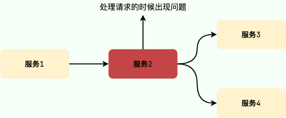
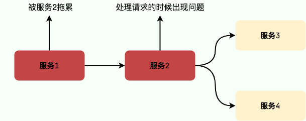

# 高可用：如何避免微服务中的雪崩问题？

在接触缓存的时候，你一定听过缓存雪崩这个概念。

缓存雪崩描述的就是这样一个简单的场景：**缓存在同一时间大面积的失效，后面的请求都直接落到了数据库上，造成数据库短时间内承受大量请求。** 这就好比雪崩一样，摧枯拉朽之势，数据库的压力可想而知，可能直接就被这么多请求弄宕机了。

举个例子：系统的缓存模块出了问题比如宕机导致不可用。造成系统的所有访问，都要走数据库。

还有一种缓存雪崩的场景是：**有一些被大量访问数据（热点缓存）在某一时刻大面积失效，导致对应的请求直接落到了数据库上。**

举个例子 ：秒杀开始 12 个小时之前，我们统一存放了一批商品到 Redis 中，设置的缓存过期时间也是 12 个小时，那么秒杀开始的时候，这些秒杀的商品的访问直接就失效了。导致的情况就是，相应的请求直接就落到了数据库上，就像雪崩一样可怕。

那在微服务中，雪崩指的是什么呢？我们先来看看这个问题。

## 微服务中的雪崩指的是什么？

微服务架构下，系统被拆分成了很多微服务（比如电商系统可能分为用户服务、商品服务、订单服务等服务），这些微服务协同工作对外提供服务，一个用户请求可能会需要多个服务参与。

在没有任何措施的情况下，如果某个服务调用出现了异常（比如请求的响应时间变长），那就会波及到调用这个服务的所有相关服务，从而引起了一系列连锁反应，最终导致 **整个服务链路崩溃** ，这就是 **微服务中的雪崩** 。

很多小伙伴估计要说了，微服务之间进行调用（RPC 或者 HTTP）的时候，一般会有 **超时和重试机制** 来确保服务的成功执行，是不会整个服务链路崩溃出现这种问题的。这样想的话，那就有问题了。超时和重试机制很实用，但微服务下仅仅有超时重试机制是不行的，高并发场景下，依然可能有大量请求挤压的问题发生。

举个例子：一个用户请求需要经过服务 1、服务 2、服务 3 和服务 4。假如服务 2 的调用出现异常，导致需要 10 秒才能返回响应，这就必然会导致 10 秒内该请求线程会一直处于阻塞状态。

随着时间的推移，如果系统收到的请求越来越多的话，会导致大量请求阻塞等待积压在服务 1 和服务 2，直接导致连接池爆满，系统负载过高，最终导致服务 1 和服务 2 崩溃。

由于微服务中的服务间调用关系错综复杂，一个微服务往往依赖于多个其它微服务。随着时间推移，依赖于服务 1 和服务 2 的服务最终也会变得不可用，形成级联失败，最终导致整个服务链路崩溃。

高并发场景下，这种情况是绝对不允许出现的，后果极其严重。出现这种问题，至少也是生产环境 P0 级事故，年终奖什么的就不要想了。

那导致微服务中的雪崩问题的常见原因有哪些呢？接下来，我们来简单总结一下。

## 微服务中的雪崩问题导致原因有哪些？

+ **流量突然爆发** ：这个是导致雪崩问题的很常见的一个原因。在某些情况下（比如节假日、活动、网站被大博主推荐、出现热点性事件），系统的流量可能会突然猛增，某个服务顶不住的话就直接挂掉了，进而影响到其他服务。
+ **代码出现 bug** : 代码质量有问题比如比较常见的内存泄漏、循环依赖都是对系统可用性极大的损害。大家都喜欢谈限流、降级、熔断，但是我觉得从代码质量这个源头把关是首先要做好的一件很重要的事情。
+ **调用第三方服务出现异常** ：调用第三方服务比如微信支付接口的时候出现超时。
+ **缓存雪崩和击穿** ：大量请求直接访问数据库，把数据库打垮了。
+ **硬件故障或者网络异常** ：比如服务器坏掉、服务所在的网络突然出现问题。
+ ......

## 如何避免微服务中的雪崩问题？

常见的方案有下面几种：

+ 服务限流
+ 服务熔断和降级
+ 横向扩容

一般我们会将这些方案结合起来用，而不是只用其中的某一个方案就可以解决微服务中的雪崩问题。

### 服务限流

服务限流就是对用户请求的速率进行限制，保证流量在一个可控的范围内，避免瞬时的大量请求击垮系统。

常见的限流算法有固定窗口计数器算法、滑动窗口计数器算法、漏桶算法、令牌桶算法。

单机限流可以直接使用 Google Guava 自带的限流工具类 `RateLimiter` 。 `RateLimiter` 基于令牌桶算法，可以应对突发流量。

除了最基本的令牌桶算法(平滑突发限流)实现之外，Guava 的`RateLimiter`还提供了 **平滑预热限流** 的算法实现。平滑突发限流就是按照指定的速率放令牌到桶里，而平滑预热限流会有一段预热时间，预热时间之内，速率会逐渐提升到配置的速率。

另外，**Bucket4j** 是一个非常不错的基于令牌/漏桶算法的限流库。

相对于，Guava 的限流工具类来说，Bucket4j 提供的限流功能更加全面。不仅支持单机限流和分布式限流，还可以集成监控，搭配 Prometheus 和 Grafana 使用。

Spring Cloud Gateway 中自带的单机限流的早期版本就是基于 Bucket4j 实现的。后来，替换成了 **Resilience4j**。

分布式限流常见的方案总结：

+ **借助中间件架限流** ：可以借助 Sentinel 或者使用 Redis 来自己实现对应的限流逻辑。
+ **网关层限流** ：比较常用的一种方案，直接在网关层把限流给安排上了。不过，通常网关层限流通常也需要借助到中间件/框架。就比如 Spring Cloud Gateway 的分布式限流实现`RedisRateLimiter`就是基于 Redis+Lua 来实现的，再比如 Spring Cloud Gateway 还可以整合 Sentinel 来做限流。

如果你要基于 Redis 来手动实现限流逻辑的话，建议配合 Lua 脚本来做。

### 服务熔断和降级

服务降级是从系统功能优先级的角度考虑如何应对系统故障。当服务器压力剧增的情况下，根据当前业务情况及流量对一些服务和页面有策略的降级，以此释放服务器资源以保证核心任务的正常运行。

服务熔断是应对雪崩效应的一种微服务链路保护机制。当调用链路的某个微服务不可用或者响应时间太长时，会进行服务熔断，不再有该节点微服务的调用，快速返回错误的响应信息。当检测到该节点微服务调用响应正常后，恢复调用链路。

个人建议使用阿里开源的 Sentinel 来做服务熔断和降级，功能全面，文档丰富，社区也比较活跃。而且，Sentinel 还支持限流，限流问题也跟着解决了。

《Java 面试指北》的高并发章节专门有一篇文章来介绍服务熔断和降级，这里就不再重复介绍了。

### 横向扩容

如果某一个服务需要处理的流量比较大的话，我们直接对其进行横向扩容也就是部署更多服务实例，这样的话，就可以处理更多的请求了。

> 更新: 2023-03-02 16:18:47  
> 原文: <https://www.yuque.com/snailclimb/mf2z3k/mt8dad>