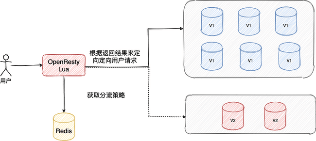
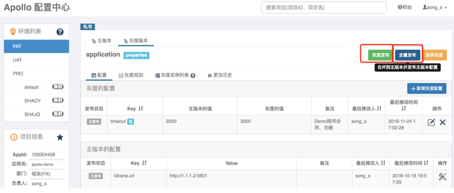
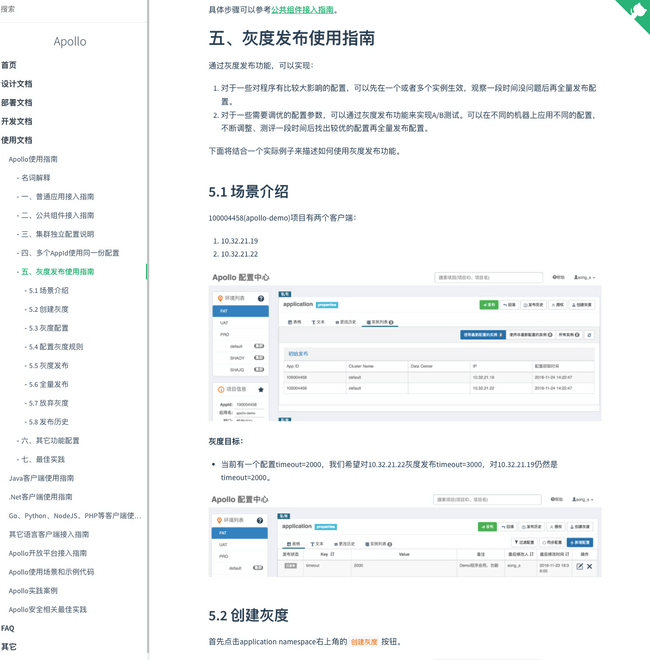
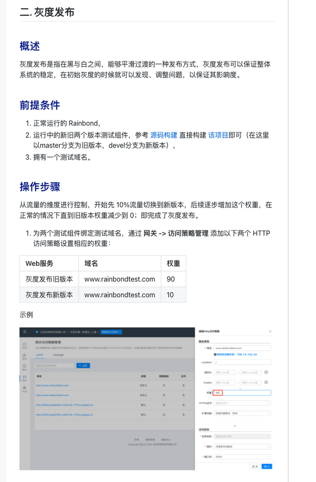
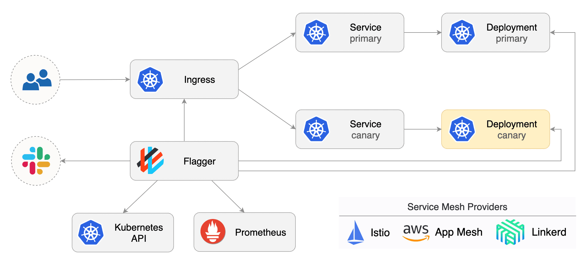

# 高可用：灰度发布和回滚有什么用？

> 这部分内容为可选内容，你也可以选择不进行学习。
>
>  
>
> **相关面试题** ：
>
>  
>
> + 什么是灰度发布？有什么好处？
> + 你的项目是如何做灰度发布的？
> + 为什么灰度发布又被称为金丝雀发布呢？
> + 回滚通常的做法是怎样的呢？
>

# 灰度发布与回滚（可选）

线上的系统通常情况下会一直迭代更新下去，这意味着我们需要不断发布新版本来替换老版本。**如何保证新版本稳定运行呢？** 必要的测试必不可少，但灰度发布与回滚也是两个制胜法宝！

## 灰度发布

### 灰度发布介绍

**灰度发布（又名金丝雀发布）** 是一种平滑发布新版本系统的方式。

我举一个简单的例子，大家一看应该就明白灰度发布的思想了。

假如我们有一个服务器集群，每个用户固定访问服务器集群中的某一台服务器，当我们需要发布新版本或者上新功能的时候，我们可以将服务器集群分成若干部分，每天只发布新版本到一部分服务器，这样的话，就有一部分用户可以使用最新版本。发布之后，我们需要观察新版本的服务器运行是否稳定且没有故障。如果没问题的话，我们第二天继续发布一部分服务器，通常需要持续几天才把整个集群全部发布完毕。期间如果发现有问题的话，只需要回滚已发布的那部分服务器即可。

上面列举的这个例子其实是灰度发布常用的一种方式 - **AB 测试**。AB 测试的思想就是就是把用户分成两组，一组用户使用 A 方案（新版本），一组用户使用 B 方案（老版本）。

另外，这个例子是通过服务器来区分的用户，比较粗暴，而且在一些情况下无法使用。一般情况下，我们是建议在进行灰度发布之前对系统用户进行筛选，根据用户的相关信息和各项指标（比如活跃度，违规次数）来筛选出一批可以优先使用新版的用户。我们只需要通过一些手段将这些用户的请求定向到新版本服务即可！为了直观对新版本服务的稳定性进行观测，灰度发布的正确完成还需要依赖可靠的 **监控系统** 。

好了！相信前面的介绍已经让你搞清了灰度发布是个什么东西。下面，我们来简单总结一下灰度发布的思想： **简单来说，灰度发布的思想就是先分配一小部分请求流量到新版本，看看有没有问题，没问题的话，再一点点地增加流量，最终让所有流量都切换到新版本。**

**为什么灰度发布又被称为金丝雀发布呢？**

金丝雀也被称为瓦斯报警鸟，对于有毒气体非常敏感，在 90 年代的时候经常被拿来检测毒气（有点残忍，后来被禁止了）。为了避免金丝雀直接被毒死了，人们想到了一个办法，把金丝雀放在一个可以控制通气口气体流量的笼子，需要金丝雀预警的时候把通气口慢慢打开，如果笼子中的金丝雀被毒气毒晕，关闭通气口然后让往笼子里充氧气抢救一下金丝雀。

金丝雀预警毒气通过控制通气口气体流量来减小潜在的毒气对金丝雀的影响，金丝雀发布通过控制发布的新版本的使用范围来减小潜在的问题对整体服务的影响，两者思想非常类似。

很多程序员有可能也是为了纪念那些因为毒气而牺牲的金丝雀才把这种发布方式冠上了金丝雀的名称。

### 灰度发布常见方案

这里介绍几种比较常见的方案，对于 Java 后端开发来说，我觉得了解就行了，一般在公司里这种事情一般是由 Devops 团队来做的。

1、基于 Nginx+OpenResty+Redis+Lua 实现流量动态分流来实现灰度发布，新浪的 [ABTestingGateway](https://github.com/CNSRE/ABTestingGateway) 就是这种基于这种方案的一个开源项目。

2、使用 Jenkins + Nginx 实现灰度发布策，具体做法可以参考：[手把手教你搭建一个灰度发布环境](https://juejin.cn/post/6844904110601273357) 。这种方案的原理和第一种类似，都是通过对 Nginx 文件的修改来实现流量的定向分流。类似地，如果你用到了其他网关比如 Spring Cloud Gateway 的话，思路也是一样的。另外， Spring Cloud Gateway 配合 Spring Cloud LoadBalancer（官方推荐）/Ribbon 也可以实现简单的灰度发布，核心思想也还是自定义负载均衡策略来分流。

3、基于 [Apollo](https://www.apolloconfig.com/) 动态更新配置加上其自带的灰度发布策略来实现灰度发布。

这种方法也是通过修改灰度发布配置的方式来实现灰度发布，如果灰度的配置测试没问题的话，再全量发布配置。

具体做法可以参考：

+ [灰度发布使用指南 - 官方文档](https://www.apolloconfig.com/#/zh/usage/apollo-user-guide?id=%E4%BA%94%E3%80%81%E7%81%B0%E5%BA%A6%E5%8F%91%E5%B8%83%E4%BD%BF%E7%94%A8%E6%8C%87%E5%8D%97)
+ [灰度实战基础之 Apollo](https://github.com/dangnianchuntian/gray)

4、通过一些现成的工具来做，比如说 [Rainbond](https://www.rainbond.com/)（云原生应用管理平台）就自带了灰度发布解决方案并且还支持滚动发布和蓝绿发布。

5、Flagger

这是之前看马若飞老师的《Service Mesh 实战》这门课的时候看到的一个方法。

Flagger 是一种渐进式交付工具，可自动控制 Kubernetes 上应用程序的发布过程。通过指标监控和运行一致性测试，将流量逐渐切换到新版本，降低在生产环境中发布新软件版本导致的风险。

Flagger 可以使用 Service Mesh（App Mesh，Istio，Linkerd）或 Ingress Controller（Contour，Gloo，Nginx）来实现多种部署策略（金丝雀发布，A/B 测试，蓝绿发布）。

## 回滚机制

光有灰度发布还不够，如果在灰度发布过程中（灰度期）发现了新版本有问题，我们还需要有回滚机制来应对。类似于数据库事务回滚，系统发布回滚就是将新版本回退到老版本。

**回滚通常的做法是怎样的呢？**

1. 提前备份老版本，新版本遇到问题之后，重新部署老版本。
2. 同时部署一套新版本，一套旧版本，两者规模相同新版本出问题之后，流量全部走老版本（蓝绿发布）。

正如余春龙老师在《软件架构设计：大型网站技术架构与业务架构融合之道》这本书中写道：

> 既然无法避免系统变更，我们能做的就是让这个过程尽可能平滑、受控，这就是灰度与回滚策略。
>

不过， **灰度发布和回滚也不是银弹，毕竟计算机世界压根不存在银弹。**

在一些要求非常严格的系统（如交易系统、消防系统、医疗系统）中，灰度发布和回滚使用不当就会带来非常严重的生产问题。

## 参考

+ [漫谈金丝雀部署-Thoughtworks 洞见](https://insights.thoughtworks.cn/canary-deployment/)
+ [金丝雀发布、滚动发布、蓝绿发布到底有什么差别？关键点是什么？](https://mp.weixin.qq.com/s?__biz=MzI4MTY5NTk4Ng==&mid=2247489100&idx=1&sn=eab291eb345c074114d946b732e037eb&source=41#wechat_redirect)
+ [基于 Flagger 和 Nginx-Ingress 实现金丝雀发布](https://mp.weixin.qq.com/s/Qbr3TEif_ZiD9tBpIwwdNw)

## 文章推荐

+ [有赞灰度发布与蓝绿发布实践 - 有赞技术](https://tech.youzan.com/gray-deloyments-and-blue-green-deployments-practices-in-youzan/)
+ [如何设计可靠的灰度方案 - 阿里技术](https://developer.aliyun.com/article/787754)
+ [什么是灰度发布，以及灰度发布 A/B 测试](https://testerhome.com/topics/15746?order_by=like&)
+ [美团收银灰度发布设计与实践](https://tool.lu/en_US/deck/jw/detail)

> 更新: 2024-04-15 23:42:22  
> 原文: <https://www.yuque.com/snailclimb/mf2z3k/pssohl>