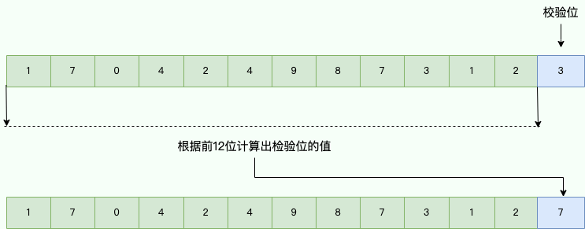
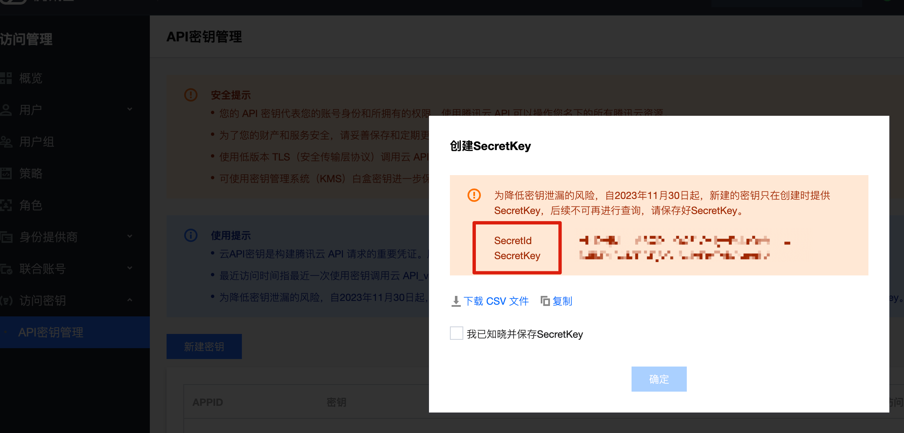
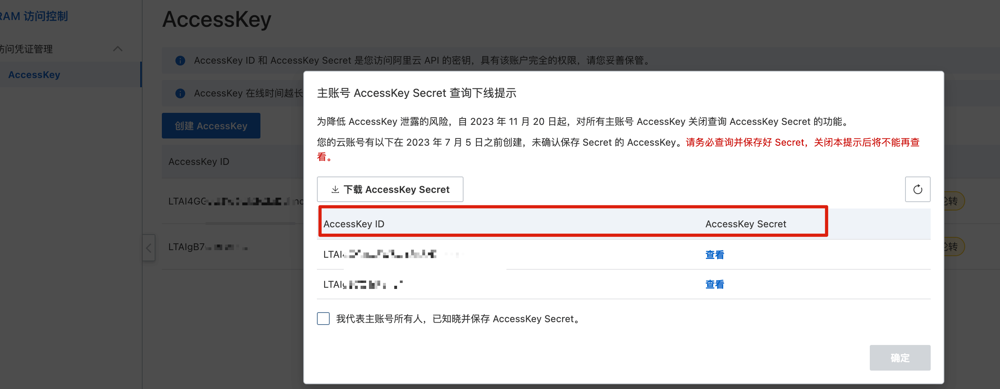

# 高可用：防止接口被盗刷/如何保证接口的安全？

接口防盗刷是指通过一些技术手段，防止恶意用户或者黑客对某个接口进行频繁的请求，造成服务器资源的浪费或者服务的不可用。

下面这些是一些必须要要做防盗刷的接口：

+ 短信/邮件发送接口
+ 投票接口
+ 登录接口
+ ……

防盗刷是接口安全的一个方面，除了防盗刷之外，还需要防止接口被非法调用、数据被篡改（攻击者拦截并篡改请求的数据）和重放攻击（攻击者截获并重复发送有效的请求）。

下面我会简单列举一些常用保证接口安全的策略。

### 前置验证码

建议行为式验证码（点触、滑块、文字点选、推理拼图等等，可使用第三方验证码服务），普通验证码很容易被破解。前置验证码是非常实用有效的方法，适用于登录、发送短信/邮件验证码等场景。不过，不能仅仅依靠前置验证码来防止接口盗刷，需要搭配其他方法共同使用。

### 限流

根据用户或者 IP 对接口进行限流，对于异常频繁的访问行为，还可以采取黑名单机制，例如将异常 IP 列入黑名单。

使用代理 IP 池可能会绕过简单的 IP 黑名单措施，因为攻击者可以轻松更改其 IP 地址。代理 IP 池允许攻击者在请求之间更改 IP，这使得传统的基于 IP 的防护措施不再那么有效。

针对短信/邮件发送接口，还可以限制同一手机号/邮箱在固定时间之内限制发送短信发送次数，这个方法还是非常有用的。

### 监控告警

接口调用量激增的时候要及时报警，例如通过短信通知。必要的情况下，需要进行人工干预或者直接暂时禁止该接口的调用，以免造成不必要的损失。

### 请求中加入 timestamp（非常规做法）

请求中加入 timestamp（时间戳），但不是常规的 timestamp 做法。

这是看别人分享的一个接口安全处理小技巧，挺巧妙。

具体做法就是给客户端提供一个 timestamp 参数，值是 13 位的毫秒级时间戳，例如 1704249873123，将第 12 位或者 13 位设定为检验位，通过指定的算法对根据其他 12 位的值算出来一个值（需要和校验位的值不同），然后将这个值替换校验位的值。

假设第 13 位为检验位，那时间戳=时间戳前 12 位+ 自定义算法（时间戳截取 12 位）。

举例：现在实际时间是 1704249873123，校验位选择的第 13 位，过前 12 位算出来校验位的值是 7，那时间戳就是：170424987312+7 = 1704249873127。值传到服务端后通过前 12 位也可以算出来值，来判断这个时间戳是不是合法的。

一般大家都不会关注 timestamp 参数，很难想到会这么做，所以这种做法还是比较有用的。不过，防不住硬翻代码这种情况，需要结合其他手段。

这种方式和 sign 挺类似，核心区别在于恶意用户一般不会想到会在 timestamp 上做手脚。

### 请求中加入 sign（签名）

请求中加入 sign 是一种常见的保证接口安全的方法（API 签名机制），它可以确保请求的来源和数据的完整性，防止数据被篡改或者重放攻击。

签名机制的原理是，客户端和服务器端预先约定的密钥和签名算法（需要保密，避免泄露），对请求数据（请求体、时间戳、随机数等按照特定规则进行排序和拼接）计算出一个 sign。客户端将生成的 sign 作为请求头或请求参数的一部分，随请求一起发送。服务端接收到请求后，使用相同的密钥和签名算法，对请求数据（和客户端采用一样的排序和拼接方式）计算出一个 sign，并与客户端发送过来的 sign 进行比对，如果一致则处理请求，否则拒绝请求。

sign 可以确保请求的来源和数据的完整性，防止数据被篡改或者重放攻击。不过，如果加密规则被破解，sign 就失效了。而且，使用签名机制会对接口性能有轻微的影响。

云平台对外开发 API 一般用的就是这种方法，一般在使用之前，需要先申请安全凭证（ SecretId 和 SecretKey）：

+ SecretId 用于标识 API 调用者身份
+ SecretKey 用于加密签名字符串和服务器端验证签名字符串的密钥。

这里仅仅是多了一个 SecretId，其他的思路都是一样的。

[腾讯云 API 安全凭证申请](https://console.cloud.tencent.com/capi) ：

[阿里云 API 安全凭证申请](https://ram.console.aliyun.com/manage/ak) ：

使用建议：

1. 对外访问的接口可以考虑使用签名机制，对内接口可以不用。
2. 为了避免重放攻击，可以在签名计算规则中加入时间戳（timestamp）和 nonce（随机数）。
3. 在选择签名算法时，应兼顾效率和安全性，如 HMAC、AES。
4. 妥善管理和保护密钥，定期更换密钥。

### 使用 HTTPS

HTTP 协议运行在 TCP 之上，所有传输的内容都是明文，客户端和服务器端都无法验证对方的身份。HTTPS 是运行在 SSL/TLS 之上的 HTTP 协议，SSL/TLS 运行在 TCP 之上。所有传输的内容都经过加密，加密采用对称加密，但对称加密的密钥用服务器方的证书进行了非对称加密。所以说，HTTP 安全性没有 HTTPS 高，但是 HTTPS 比 HTTP 耗费更多服务器资源。

关于 HTTP 和 HTTPS 的详细对比可以看这篇文章：[HTTP vs HTTPS（应用层）](https://javaguide.cn/cs-basics/network/http-vs-https.html)。

### 总结

HTTPS 是必备的，也是最基本的。像登录、发送短信/邮件验证码这类场景建议加一个前置验证码，比较实用。对外访问的接口，尤其是稀缺资源的接口，建议限流一定要加上。监控告警可以直接通过现成的监控系统来做，例如 SkyWalking（可以满足一些基本的监控告警需求）、Prometheus。对外访问的接口可以考虑使用签名机制来确保请求的来源和数据的完整性，防止数据被篡改或者重放攻击，云平台对外开发 API 一般用的就是这种方法。请求中加入 timestamp（时间戳）并设置校验位是一种取巧的做法，绝大部分时候还是非常有效的。

### 参考

+ [短信接口防盗刷解决方案 - 赛先生和泰先生 - 2022](https://cloud.tencent.com/developer/article/1978295)
+ [SpringBoot 如何保证接口安全？老鸟们都是这么玩的！ - JAVA 日志录 - 2023](https://mp.weixin.qq.com/s/MVA2WUErBYYC_Bn4cWZVaQ)
+ [API 接口到底要不要添加签名机制？ - 路多辛 - 2023](https://mp.weixin.qq.com/s/gl6S7j0H_ddTH0BnMjFgbw)

> 更新: 2024-05-24 17:34:10  
> 原文: <https://www.yuque.com/snailclimb/mf2z3k/pauv7l8rmidckudq>