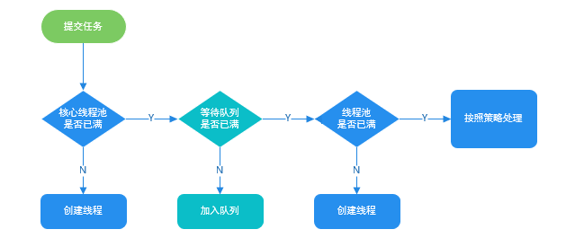
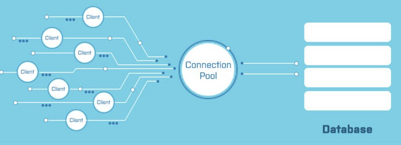

# 高性能：池化技术的应用场景

## 池化技术简介


简单来说，池化技术就是将可重复利用的对象比如连接、线程统一管理起来。线程池、数据库连接池、HTTP、Redis 连接池等等都是对池化技术的应用。


通常来说，池化技术所管理的对象，无论是连接还是线程，**它们的创建过程都比较耗时，也比较消耗系统资源** 。所以，我们把它们放在一个池子里统一管理起来，以达到 **提升性能和资源复用的目的** 。


从上面对池化技术的介绍，我们可以得出池化技术的核心思想是空间换时间。它的核心策略是使用已经创建好的对象来减少频繁创建对象的性能开销，同时还可以对对象进行统一的管理。


不过，池化技术也不是并非没有缺点的。如果池子中的对象没有被充分利用的话，也会造成多余的内存浪费（相对于池化技术的优点来说的话，这个缺点几乎可以被忽略）。


## 池化技术常见应用


线程池和数据库连接池我们平时开发过程中应该接触的非常多。因此，我会以线程池和数据库连接池为例来介绍池化技术的实际应用。


### 线程池


正如其名，线程池主要负责创建和管理线程。


没有线程池的时候，我们每次用到线程就需要单独创建，用完了之后再销毁。然而，创建线程和销毁线程是比较耗费资源和时间的操作。


有了线程池之后，我们可以重复利用已创建的线程降低线程创建和销毁造成的消耗。并且，线程池还可以方便我们对线程进行统一的管理。


我们拿 JDK 1.5 中引入的原生线程池 `ThreadPoolExecutor` 来举例说明。


`**ThreadPoolExecutor**`** 有 3 个最重要的参数：**


+ `**corePoolSize**`** :** 核心线程数线程数定义了最小可以同时运行的线程数量。
+ `**maximumPoolSize**`** :** 当队列中存放的任务达到队列容量的时候，当前可以同时运行的线程数量变为最大线程数。
+ `**workQueue**`**:** 当新任务来的时候会先判断当前运行的线程数量是否达到核心线程数，如果达到的话，新任务就会被存放在队列中。





> 线程池 `ThreadPoolExecutor` 不是上来就是直接初始化 `corePoolSize` 个线程，而是有任务来了才创建线程处理任务。
>


假如我们需要提交任务给线程池执行的话，整个步骤是这样的：


1. 提交新任务
2. 判断线程池线程数是否少于 `coreThreadCount` ，是的话就创新线程处理任务，否则的话就将任务丢到队列中等待执行。
3. 当队列中的任务满了之后，继续创建线程，直到线程数量达到 `maxThreadCount`。
4. 当线程数量达到 `maxThreadCount`还是有任务提交，那我们就直接按照拒绝策略处理。


可以看出，JDK 自带的线程池 `ThreadPoolExecutor` 会优先将处理不过来的任务放到队列中去，而不是创建更多的线程来处理任务。只有当队列中的等待执行的任务满了之后，线程池才会创建线程，直到线程数达到 `maximumPoolSize` 。如果任务执行时间过长的话，还会很容易造成队列中的任务堆积。


并且，当线程数大于核心线程数时，如果线程等待 `keepAliveTime` 没有任务处理的话，该线程会被回收，直到线程数缩小到核心线程数才不会继续对线程进行回收。


可以看出，JDK 自带的的这个线程池 `ThreadPoolExecutor` 比较适合执行 CPU 密集型的任务，不太适合执行 I/O 密集型任务。


**为什么这样说呢？** 因此执行 CPU 密集型的任务时 CPU 比较繁忙，只需要创建和 CPU 核数相当的线程就好了，多了反而会造成线程上下文切换。


**如何判断是 CPU 密集任务还是 IO 密集任务？** CPU 密集型简单理解就是利用 CPU 计算能力的任务比如你在内存中对大量数据进行排序。但凡涉及到网络读取，文件读取这类都是 IO 密集型，这类任务的特点是 CPU 计算耗费时间相比于等待 IO 操作完成的时间来说很少，大部分时间都花在了等待 IO 操作完成上。


在看极客时间的专栏[《深入拆解 Tomcat & Jetty》](http://gk.link/a/10r1C)的时候，我了解到：**Tomcat 扩展了原生的 Java 线程池，来满足 Web 容器高并发的需求。**


简单来说，Tomcat 自定义线程池继承了 JDK 线程池 `java.util.concurrent.ThreadPoolExecutor` 重写了部分方法的逻辑（主要是 `execute()` 方法）。Tomcat 还通过继承 `LinkedBlockingQueue` 重写 `offer()` 方法实现了自定义的队列。


这些改变使得 Tomcat 的线程池在任务量大的情况下会优先创建线程，而不是直接将不能处理的任务放到队列中。


Tomcat 自定义线程池的使用方法如下：


```java
//创建定制版的任务队列
TaskQueue taskqueue = new TaskQueue(maxQueueSize);

//创建定制版的线程工厂
TaskThreadFactory tf = new TaskThreadFactory(namePrefix,daemon,getThreadPriority());

//创建定制版的线程池
ThreadPoolExecutor executor = new ThreadPoolExecutor(getMinSpareThreads(), getMaxThreads(), maxIdleTime, TimeUnit.MILLISECONDS,taskqueue, tf);
```


下面我们来详细看看 Tomcat 的线程池做了哪些改变。


Tomcat 的线程池通过重写 `ThreadPoolExecutor` 的 `execute()` 方法实现了自己的任务处理逻辑。Tomcat 的线程池在线程总数达到最大时，不是立即执行拒绝策略，而是再尝试向自定义的任务队列添加任务，添加失败后再执行拒绝策略。那具体如何实现呢，其实很简单，我们来看一下 Tomcat 线程池的 `execute()`方法的核心代码。


```java

public class ThreadPoolExecutor extends java.util.concurrent.ThreadPoolExecutor {

  ...

  public void execute(Runnable command, long timeout, TimeUnit unit) {
      submittedCount.incrementAndGet();
      try {
          //调用Java原生线程池的execute去执行任务
          super.execute(command);
      } catch (RejectedExecutionException rx) {
         //如果总线程数达到maximumPoolSize，Java原生线程池执行拒绝策略
          if (super.getQueue() instanceof TaskQueue) {
              final TaskQueue queue = (TaskQueue)super.getQueue();
              try {
                  //继续尝试把任务放到Tomcat自定义的任务队列中去
                  if (!queue.force(command, timeout, unit)) {
                      submittedCount.decrementAndGet();
                      //如果这个队列也满了，插入失败，执行拒绝策略。
                      throw new RejectedExecutionException("...");
                  }
              }
          }
      }
}
```


到重点的地方了！Tomcat 自定义队列`TaskQueue` 重写了 `LinkedBlockingQueue` 的 `offer` 方法，这是关键所在！


当提交的任务数量大于当前的线程数的时候，`offer()` 会返回 false，线程池会去创建新的线程，而不是等到任务队列满了之后再创建线程。


```java
public class TaskQueue extends LinkedBlockingQueue<Runnable> {

  ...

   @Override
  //线程池调用任务队列的方法时，当前线程数肯定已经大于核心线程数了
  public boolean offer(Runnable o) {
     // 没有找到 Tomcat 扩展线程池的话，直接调用父类的offer方法
      if (this.parent == null)
            return super.offer(o);
      //如果线程数已经到了最大值，不能创建新线程了，只能把任务添加到任务队列。
      if (parent.getPoolSize() == parent.getMaximumPoolSize())
          return super.offer(o);
      //执行到这里，表明当前线程数大于核心线程数，并且小于最大线程数。
      //表明是可以创建新线程的，那到底要不要创建呢？分两种情况：

      //1. 如果已提交的任务数小于当前线程数，表示还有空闲线程，无需创建新线程
      if (parent.getSubmittedCount()<=(parent.getPoolSize()))
          return super.offer(o);

      //2. 如果已提交的任务数大于当前线程数，线程不够用了，返回false去创建新线程
      if (parent.getPoolSize()<parent.getMaximumPoolSize())
          return false;

      //默认情况下总是把任务添加到任务队列
      return super.offer(o);
  }

}
```


`LinkedBlockingQueue` 默认情况下长度是没有限制的，Tomcat 自定义队列定义了一个 `capacity` 变量来限制队列长度。


```java
public class TaskQueue extends LinkedBlockingQueue<Runnable> {

  public TaskQueue(int capacity) {
      super(capacity);
  }
  ...
}
```


`TaskQueue` 的 `capacity` 的默认值是 `Integer.MAX_VALUE` ，也就是说默认情况下 Tomcat 的任务队列是没有长度限制的。不过，你可以通过设置 `maxQueueSize` 参数来限制任务队列的长度。


如果你想要获取更多关于线程的介绍的话，建议阅读我写的下面这几篇文章：


+ [Java 线程池详解](https://javaguide.cn/java/concurrent/java-thread-pool-summary.html)
+ [Java 线程池最佳实践](https://javaguide.cn/java/concurrent/java-thread-pool-best-practices.html)


### 数据库连接池





数据库连接池属于连接池，类似于 HTTP、Redis 连接池，它们的实现原理类似。连接池的结构示意图，如下所示（图片来自：[《Java 业务开发常见错误 100 例》](http://gk.link/a/10u4d)）：


连接池负责连接的管理包括连接的建立、空闲连接回收等工作。


我们这里以数据库连接池为例来详细介绍。


没有数据库线程池之前，我们接收到一个需要用到数据库的请求，通常是这样来访问数据库的：


1. 装载数据库驱动程序；
2. 通过 JDBC 建立数据库连接；
3. 访问数据库，执行 SQL 语句；
4. 断开数据库连接。


假如我们为每一个请求都建立一次数据库连接然后再断开连接是非常耗费资源和时间的。因为，**建立和断开数据库连接本身就是比较耗费资源和时间的操作。**


如果我们频繁进行数据库连接的建立和断开操作的话，势必会影响到系统的性能。当请求太多的话，系统甚至会因为创建太多数据库连接而直接宕机。


因此，有了数据库连接池来管理我们的数据库连接。当有请求的时候，我们现在数据库连接池中检查是否有空闲的数据库连接，如果有的话，直接分配给它。


如果我们需要获取数据库连接，整个步骤是这样的：


1. 系统首先检查空闲池内有没有空闲的数据库连接。
2. 如果有的话，直接获取。
3. 如果没有的话，先检查数据库连接池的是否达到所允许的最大连接数，没达到的话就新建一个数据库连接，否则就等待一定的时间（timeout）看是否有数据库连接被释放。
4. 如果等待时间超过一定的时间（timeout）还是没有数据库连接被释放的话，就会获取数据库连接失败。


实际开发中，我们使用 HikariCP 这个线程的数据库连接池比较多，SpringBoot 2.0 将它设置为默认的数据源连接池。


HikariCP 为了性能的提升（号称是史上性能最好的数据库连接池），做了非常多的优化，比如 HikariCP 自定义 `FastStatementList` 来代替 `ArrayList` 、自定义 `ConcurrentBag` 来提高并发读写的效率，再比如 HikariCP 通过 Javassist 来优化并精简字节码。


想要继续深入了解 HikariCP 原理的小伙伴，可以看看下面这几篇文章：


+ [SpringBoot 2.0 中 HikariCP 数据库连接池原理解析 - vivo 互联网技术](https://mp.weixin.qq.com/s/4ty3MrsymRsdz0BSB_lfyw)
+ [HikariCP 的这波优化，太炸裂了！](https://mp.weixin.qq.com/s/xM4r8fHQAwmgpX02F51N2A)
+ [HikariCP 中的 ConcurrentBag(HikariCP的核心) 源码解析](https://mp.weixin.qq.com/s/ayCXva50GRsV8_X5aIykRQ)
+ [“光”速？HakariCP为什么这么快？](https://juejin.cn/post/7200782261997191225)


HikariCP 是性能超强，在监控方面的话，数据库连接池 Druid 做的不错。不过，一般监控都是有专门的监控组件（例如 Prometheus + Grafana）来做的，个人不太建议使用 Druid 。


## 池化技术注意事项


+ 池子的最大值和最小值的设置很重要，初期可以依据经验来设置，后面还是需要根据实际运行情况做调整。
+ 池子中的对象需要在使用之前预先初始化完成，这叫做池子的预热，比方说使用线程池时就需要预先初始化所有的核心线程。如果池子未经过预热可能会导致系统重启后产生比较多的慢请求。


## 参考


+ [《Java 业务开发常见错误 100 例：04 | 连接池：别让连接池帮了倒忙》](http://gk.link/a/10u4d)
+ [《深入拆解 Tomcat & Jetty》：17 | Executor 组件：Tomcat 如何扩展 Java 线程池？](http://gk.link/a/10r1C)


> 更新: 2024-07-14 12:35:20  
> 原文: <https://www.yuque.com/snailclimb/mf2z3k/bqwmm1>