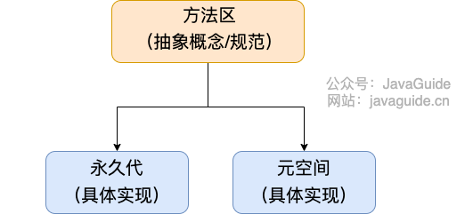
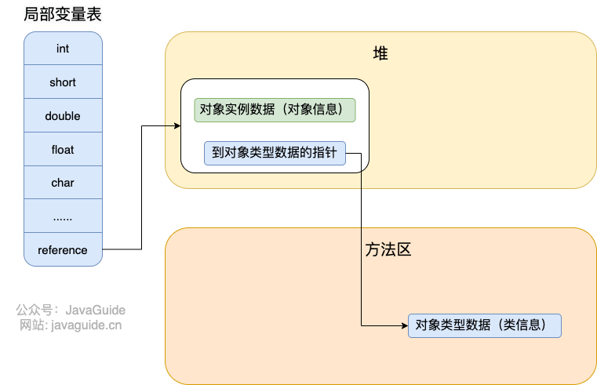

# JVM 常见面试题自测

> 如非特殊说明，本文主要针对的就是 HotSpot VM 。
>


## 运行时数据区


**运行时数据区中包含哪些区域？哪些线程共享？哪些线程独享？哪些区域可能会出现**`**OutOfMemoryError**`**？哪些区域不会出现**`**OutOfMemoryError**`**?**【⭐⭐⭐⭐⭐】


💡 提示：把下面两张图记在心里！并且，你还要搞懂这些区域大概的作用是什么。


**JDK 1.8 之前：**


**JDK 1.8 ：**


线程私有的：程序计数器、虚拟机栈、本地方法栈


线程共享的：堆、方法区、直接内存 (非运行时数据区的一部分)


相关阅读：[Java 内存区域详解](https://javaguide.cn/java/jvm/memory-area.html)


**方法区和永久代的关系。**【⭐⭐⭐】


💡 提示：其实就有点像 Java 中接口和类的关系。





相关阅读：[Java 内存区域详解](https://javaguide.cn/java/jvm/memory-area.html)


**Java 对象的创建过程。**【⭐⭐⭐⭐】


💡 提示：下图便是 Java 对象的创建过程，我建议最好是能默写出来，并且要掌握每一步在做什么。


相关阅读：[HotSpot 虚拟机对象探秘](https://javaguide.cn/java/jvm/memory-area.html#hotspot-%E8%99%9A%E6%8B%9F%E6%9C%BA%E5%AF%B9%E8%B1%A1%E6%8E%A2%E7%A7%98)


**对象的访问定位的两种方式知道吗？各有什么优缺点。**【⭐⭐⭐⭐】


💡 提示：句柄和直接指针。


句柄：


直接指针：





**堆空间的基本结构了解吗？什么情况下对象会进入老年代？**【⭐⭐⭐⭐⭐】


提示：


1. 大部分情况，对象都会首先在 Eden 区域分配。
2. 长期存活的对象将进入老年代。
3. 大对象直接进入老年代。


🌈 拓展：动态对象年龄判定。


## 垃圾收集


**如何判断对象是否死亡（两种方法）。** 【⭐⭐⭐⭐】


💡 提示：引用计数法和可达性分析算法。


**讲一下可达性分析算法的流程。 哪些对象可以作为 GC Roots 呢？**


💡 提示：可达性分析算法法的基本思想就是通过一系列的称为 **“GC Roots”** 的对象作为起点，从这些节点开始向下搜索，节点所走过的路径称为引用链，当一个对象到 GC Roots 没有任何引用链相连的话，则证明此对象是不可用的，需要被回收。


下面这些对象可以作为 GC Roots：


+ 虚拟机栈(栈帧中的本地变量表)中引用的对象
+ 本地方法栈(Native 方法)中引用的对象
+ 方法区中类静态属性引用的对象
+ 方法区中常量引用的对象
+ 所有被同步锁持有的对象


**对象可以被回收，就代表一定会被回收吗？ 【****⭐⭐⭐****】**


💡 提示：不一定。


**JDK 中有几种引用类型？分别的特点是什么？**【⭐⭐】


💡 提示：JDK1.2 以后，Java 对引用的概念进行了扩充，将引用分为强引用、软引用、弱引用、虚引用四种（引用强度逐渐减弱）。对这些概念简单了解，有印象就可以了。


**垃圾收集有哪些算法，各自的特点？**【⭐⭐⭐⭐⭐】


💡 提示：


**有哪些常见的 GC?谈谈你对 Minor GC、还有 Full GC 的理解。Minor GC 与 Full GC 分别在什么时候发生？ Minor GC 会发生 stop the world 现象吗？**【⭐⭐⭐⭐⭐】


💡 提示：


针对 HotSpot VM 的实现，它里面的 GC 其实准确分类只有两大种：


部分收集 (Partial GC)：


+ 新生代收集（Minor GC / Young GC）：只对新生代进行垃圾收集；
+ 老年代收集（Major GC / Old GC）：只对老年代进行垃圾收集。需要注意的是 Major GC 在有的语境中也用于指代整堆收集；
+ 混合收集（Mixed GC）：对整个新生代和部分老年代进行垃圾收集。


整堆收集 (Full GC)：收集整个 Java 堆和方法区。


**讲一下 CMS 垃圾收集器的四个步骤。CMS 有什么缺点？**【⭐⭐⭐⭐】


💡 提示：初始标记、并发标记、重新标记、并发清除。


**并发标记要解决什么问题？并发标记带来了什么问题？如何解决并发扫描时对象消失问题？**【⭐⭐⭐⭐】


相关阅读：[面试官:你说你熟悉 jvm?那你讲一下并发的可达性分析](https://juejin.cn/post/6844904070788939790) 。


**G1 垃圾收集器的步骤。有什么缺点？**【⭐⭐⭐⭐】


💡 提示：和 CMS 类似。


**ZGC 了解吗？**【⭐⭐⭐⭐】


💡 提示： [新一代垃圾回收器 ZGC 的探索与实践](https://tech.meituan.com/2020/08/06/new-zgc-practice-in-meituan.html)


**JVM 中的安全点和安全区各代表什么？**【⭐⭐⭐】


💡 提示：：[浅谈 JVM GC 的安全点与安全区域](https://www.cnblogs.com/chenchuxin/p/15259439.html)


## 类


**什么是字节码？类文件结构的组成了解吗？**【⭐⭐⭐⭐】


💡 提示：在 Java 中，JVM 可以理解的代码就叫做`字节码`（即扩展名为 `.class` 的文件）。


`ClassFile` 的结构如下：


```java
ClassFile {
    u4             magic; //Class 文件的标志
    u2             minor_version;//Class 的小版本号
    u2             major_version;//Class 的大版本号
    u2             constant_pool_count;//常量池的数量
    cp_info        constant_pool[constant_pool_count-1];//常量池
    u2             access_flags;//Class 的访问标记
    u2             this_class;//当前类
    u2             super_class;//父类
    u2             interfaces_count;//接口
    u2             interfaces[interfaces_count];//一个类可以实现多个接口
    u2             fields_count;//Class 文件的字段属性
    field_info     fields[fields_count];//一个类会可以有多个字段
    u2             methods_count;//Class 文件的方法数量
    method_info    methods[methods_count];//一个类可以有个多个方法
    u2             attributes_count;//此类的属性表中的属性数
    attribute_info attributes[attributes_count];//属性表集合
}
```


**类的生命周期？类加载的过程了解么？加载这一步主要做了什么事情？初始化阶段中哪几种情况必须对类初始化？**【⭐⭐⭐⭐⭐】


💡 提示：


**双亲委派模型了解么？如果我们不想用双亲委派模型怎么办？**【⭐⭐⭐⭐⭐】


💡 提示：可以参考 Tomcat 的自定义类加载器 `WebAppClassLoader`


**双亲委派模型有什么好处？双亲委派模型是为了保证一个 Java 类在 JVM 中是唯一的？ **【⭐⭐⭐⭐⭐】


**JDK 中有哪些默认的类加载器？** 【⭐⭐⭐⭐】


💡 提示：


JVM 中内置了三个重要的 ClassLoader，除了 BootstrapClassLoader 其他类加载器均由 Java 实现且全部继承自`java.lang.ClassLoader`：


1. **BootstrapClassLoader(启动类加载器)** ：最顶层的加载类，由 C++实现，负责加载 `%JAVA_HOME%/lib`目录下的 jar 包和类或者被 `-Xbootclasspath`参数指定的路径中的所有类。
2. **ExtensionClassLoader(扩展类加载器)** ：主要负责加载 `%JRE_HOME%/lib/ext` 目录下的 jar 包和类，或被 `java.ext.dirs` 系统变量所指定的路径下的 jar 包。
3. **AppClassLoader(应用程序类加载器)** ：面向我们用户的加载器，负责加载当前应用 classpath 下的所有 jar 包和类。


## 性能调优&问题排查


这部分内容在面试大厂的时候比较重要，相关的实践案例我已经整理到了[JVM线上问题排查和性能调优案例](https://javaguide.cn/java/jvm/jvm-in-action.html)这篇文章中。


**虚拟机基础故障处理工具有哪些？**【⭐⭐⭐】


💡 提示： 简单了解几个最重要的即可！


**堆内存相关的 JVM 参数有哪些？你在项目中实际配置过了吗？** 【⭐⭐⭐⭐⭐】


💡 提示：一定要自己动手操作一下。


相关问题：


+ 如何设置年轻代和老年代的大小？
+ 如何调整调整新生代和老年代的比值？
+ ......


相关阅读：[JVM 参数配置说明 - 阿里云官方文档 - 2022](https://help.aliyun.com/document_detail/148851.html)。


**你在项目中遇到过 GC 问题吗？怎么分析和解决的？【****⭐⭐⭐⭐⭐****】**


💡 提示：比较有含金量的问题！比较能反映出求职者的水平，应该重点准备。


相关问题：


+ Young GC 频繁如何排查和解决？可能是什么原因导致的？
+ Old GC 频繁如何排查和解决？可能是什么原因导致的？
+ 堆外内存 OOM 如何排查和解决？可能是什么原因导致的？
+ ......


相关阅读：[Java 中 9 种常见的 CMS GC 问题分析与解决 - 美团技术团队 - 2020](https://tech.meituan.com/2020/11/12/java-9-cms-gc.html)


**GC 性能指标了解吗？调优原则呢？**【⭐⭐⭐⭐⭐】


+ GC 性能指标通常关注吞吐量、停顿时间和垃圾回收频率。
+ GC 优化的目标就是降低 Full GC 的频率以及减少 Full GC 的执行时间。


**如何降低 Full GC 的频率？**【⭐⭐⭐⭐⭐】


💡 提示： 可以通过减少进入老年代的对象数量可以显著降低 Full GC 的频率。如何减少进入老年代的对象数量呢？JVM 垃圾回收这部分有提到过。


**项目中实践过 JVM 调优吗？怎么做的？【****⭐⭐⭐⭐⭐****】**


💡 提示：比较笼统的一个问题，面试官主要考察的是个人对于 JVM 调优的整体实践情况。


相关阅读：[JVM 调优实践 - 掘金 - 2022](https://juejin.cn/post/7128377003224334373)


> 更新: 2024-09-25 17:40:39  
> 原文: <https://www.yuque.com/snailclimb/mf2z3k/xkhs3e>