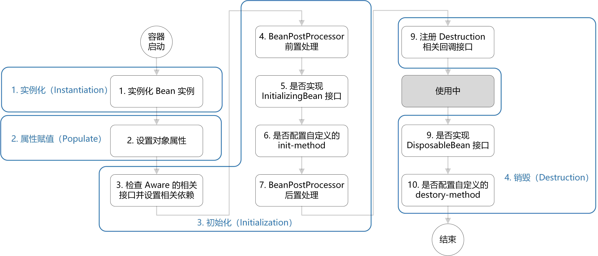

# Spring&SpringBoot 常见面试题自测

本来是不准备更新 Spring 和 Spring Boot 的自测了，但星球里的很多小伙伴明确表示需要，所以还是认真整理了一下。每一道问题不光有提示和重要程度说明，有一些还会给出加分的回答小技巧。

Spring 和 Spring Boot 这俩框架类的知识点非常多，但实际面试中常问的也就那几道，一般不会问特别偏的。

📌**说明**：

1. 下面这些 Spring&SpringBoot 自测问题的详细参考答案你都可以在 [JavaGuide ](https://javaguide.cn/cs-basics/network/other-network-questions.html) 和 [《Java面试指北》](https://t.zsxq.com/Uv3ByZn)中找到。
2. ⭐代表重要程度，⭐越多表现面试越爱问，越要认真准备。

如果觉得 Spring 和 SpringBoot 知识点太多的话，完全可以按照这个自测来准备，把握重点，这样可以节省不少时间！

### 列举一些重要的 Spring 模块？⭐⭐⭐
💡 提示：

Spring4.x 版本：

Spring5.x 版本：

### 谈谈你对 Spring IoC 的理解 ⭐⭐⭐⭐⭐
💡 提示：

1. IoC（Inversion of Control，控制反转）是一种设计思想，而非具体的技术实现。
2. IoC 的核心在于“控制反转”，即将对象的创建和管理权从应用程序代码中转移到外部容器（如 Spring IoC 容器）中，这样应用程序只需关注业务逻辑，而无需关心对象的创建和管理。
3. IoC 使得对象之间的耦合度（或依赖程度）降低。

### IoC 和 DI 有区别吗？⭐⭐⭐⭐
💡 提示：

IoC 最常见以及最合理的实现方式叫做依赖注入（Dependency Injection，简称 DI）。DI 通过将对象的依赖关系注入到对象内部来实现控制反转。换句话说，DI 是一种实现 IoC 的技术，它通过构造函数注入、setter 方法注入或字段注入等方式，将所需的依赖对象传递给需要它们的组件。

### 什么是 Spring Bean？作用域有哪些？⭐⭐⭐
💡 提示：

Bean 代指的就是那些被 IoC 容器所管理的对象。

Bean 的作用域通常有下面几种：

| 作用域 | 描述 |
| --- | --- |
| `singleton` | 容器中唯一的 Bean 实例（默认）。 |
| `prototype` | 每次获取都会创建新实例。 |
| `request` | 每次 HTTP 请求创建新实例（仅 Web 应用）。 |
| `session` | 每次 HTTP Session 创建新实例（仅 Web 应用）。 |
| `application/global-session` | 每个 Web 应用启动时创建一个实例（仅 Web 应用）。 |
| `websocket` | 每次 WebSocket 会话创建新实例（仅 Web 应用）。 |

`singleton`（最常用，默认的作用域）和`prototype`这两个作用域是相对用的多点的，其他的基本不会用到。

### Bean 是线程安全的吗？⭐⭐⭐⭐
💡 提示：

在 Spring 中，默认的 Singleton Bean 不是线程安全的。这是因为单例模式下，所有线程共享同一个 Bean 实例。如果 Bean 有可变状态，就需要自行管理线程安全。

+ 无状态 Bean（如大部分 Service、Dao）通常是线程安全的。
+ 有状态 Bean 需要通过同步机制、ThreadLocal 等方式来确保线程安全。

### Spring Bean 的生命周期说一下
💡 提示：

整体还是比较复杂和难记的！

**如何记忆更快呢？**

1. 整体上可以简单分为四步：实例化 —> 属性赋值 —> 初始化 —> 销毁。
2. 初始化这一步涉及到的步骤比较多，包含 `Aware` 接口的依赖注入、`BeanPostProcessor` 在初始化前后的处理以及 `InitializingBean` 和 `init-method` 的初始化操作。
3. 销毁这一步会注册相关销毁回调接口，最后通过`DisposableBean` 和 `destory-method` 进行销毁。

下面是一张清晰的图解：

📌 再说一个小技巧：实际面试中，如果你的项目利用 Spring Bean 生命周期搞事的话，你可以结合项目聊聊，这会加分不少！

📌 例如，可以使用 `InitializingBean` 接口与 `ApplicationContextAware` 接口来优化策略模式的实现，实现策略 beans 的自动装配。详细介绍可以参考这篇文章：[设计模式最佳实践探索—策略模式](https://mp.weixin.qq.com/s/Ovoy1CnN92xCYHbbO4H_DQ)，

### `BeanDefinition` 的作用？其中的懒加载是什么？⭐⭐⭐
💡 提示：

+ `BeanDefinition` 是 Spring 框架中用于描述和封装一个 Bean 的元信息的重要概念。它包含了 Spring 容器在创建 Bean 实例时所需要的全部信息。
+ 一个 Bean 所创建过程中所需要的一些信息都可以从 BeanDefinition 中获取，比如这个 Bean 的 Class 类型、作用域、懒加载（Lazy Initialization）等等。其中，懒加载决定该 Bean 是否应当延迟加载。如果设置为懒加载，则该 Bean 只有在第一次被请求时才会实例化，而不是在容器启动时立即创建。

### 注入 Bean 的方式有哪些？你的项目是构造函数注入还是 Setter 注入？⭐⭐⭐⭐
💡 提示：

依赖注入 (Dependency Injection, DI) 的常见方式：

1. 构造函数注入：通过类的构造函数来注入依赖项。
2. Setter 注入：通过类的 Setter 方法来注入依赖项。
3. Field（字段） 注入：直接在类的字段上使用注解（如 `@Autowired` 或 `@Resource`）来注入依赖项。

**Spring 官方推荐构造函数注入**，这种注入方式的优势如下：

1. 依赖完整性：确保所有必需依赖在对象创建时就被注入，避免了空指针异常的风险。
2. 不可变性：有助于创建不可变对象，提高了线程安全性。
3. 初始化保证：组件在使用前已完全初始化，减少了潜在的错误。
4. 测试便利性：在单元测试中，可以直接通过构造函数传入模拟的依赖项，而不必依赖 Spring 容器进行注入。

### Spring AOP 有什么用？你的项目哪里用到了 AOP？⭐⭐⭐⭐⭐
💡 提示：

**AOP(Aspect-Oriented Programming:面向切面编程)** 能够将那些与业务无关，却为业务模块所共同调用的逻辑或责任（例如事务处理、日志管理、权限控制等）封装起来，便于**减少系统的重复代码**，**降低模块间的耦合度**，**提高系统可拓展性和可维护性**。

实际面试中，你可以根据自己的项目去介绍。

这里列举几条最常见的例子：

1. 基于 AOP 实现统一的日志管理。
2. 基于 Redisson + AOP 实现了接口防刷，一个注解即可限制接口指定时间内单个用户可以请求的次数。
3. 基于 Spring Security 提供的 `@PreAuthorize` 实现权限控制，其底层也是基于 AOP。
4. 基于 `@Transactional`注解实现事务管理。

详细介绍可以参考星球的这篇文章：[https://articles.zsxq.com/id_dg9grrz7ukcn.html](https://articles.zsxq.com/id_dg9grrz7ukcn.html)。

### Spring 的事务管理了解吗？`@Transactional`注解有什么用？你的项目是如何使用的？⭐⭐⭐⭐
💡 提示：

回答这个问题首先需要知道事务的基本概念（比如 ACID ），其次需要搞清 Spring 对事务的支持（比如 Spring 支持两种方式的事务管理、事务传播行为、事务隔离级别）。

⚠️ 注意: 考察事务传播行为的时候，面试官可能会给出代码示例，问你在特定的传播行为下，事务如何回滚。

Spring 事务的详细介绍可以看我写的这篇文章：[Spring 事务详解](https://javaguide.cn/system-design/framework/spring/spring-transaction.html)。

### Spring 循环依赖了解吗，怎么解决？⭐⭐⭐⭐⭐
💡 提示：

+ 循环依赖是指 Bean 对象循环引用，是两个或多个 Bean 之间相互持有对方的引用，例如 CircularDependencyA → CircularDependencyB → CircularDependencyA。
+ Spring 框架通过使用三级缓存来解决这个问题。三级缓存一定要搞懂吃透！
+ 在 Spring Boot 2.6.x 之前，Spring 默认允许循环依赖存在，即使代码中出现循环依赖问题，一般情况下也不会报错。从 Spring Boot 2.6.x 开始，官方不再推荐编写存在循环依赖的代码，并且默认禁用了循环依赖。

📌 再说一个小技巧：绝大部分求职者并不清楚 Spring Boot 2.6.x 这个版本开始对循环依赖处理的改变，你如果能够在面试中提到的话，能够加分不少。

### `@Lazy` 能解决循环依赖吗？⭐⭐⭐
💡 提示：

`@Lazy` 能够在一定程度上打破循环依赖链，允许 Spring 容器顺利地完成 Bean 的创建和注入。但这并不是一个根本性的解决方案，尤其是在构造函数注入、复杂的多级依赖等场景中，`@Lazy` 无法有效地解决问题。因此，最佳实践仍然是尽量避免设计上的循环依赖。

### Spring MVC 包含哪些组件？当收到请求时的处理流程是什么样的？⭐⭐⭐
💡 提示：

记住了下面这些组件，也就记住了 SpringMVC 的工作原理。

| **组件** | **作用** |
| :--- | :--- |
| **DispatcherServlet** | 核心的中央处理器，负责接收请求、分发，并给予客户端响应。 |
| **HandlerMapping** | 处理器映射器，根据 URL 匹配查找能处理的 Handler，并将请求涉及到的拦截器和 Handler 一起封装。 |
| **HandlerAdapter** | 处理器适配器，根据 HandlerMapping 找到的 Handler，适配执行对应的 Handler。 |
| **Handler** | 请求处理器，处理实际请求的处理器。 |
| **ViewResolver** | 视图解析器，根据 Handler 返回的逻辑视图 / 视图，解析并渲染真正的视图，并传递给 DispatcherServlet 响应客户端。 |

Spring MVC 原理如下图所示：

### Spring, SpringMVC 和 SpringBoot 的区别 ⭐⭐⭐
💡 提示：

1. Spring MVC 是 Spring 中的一个很重要的模块，主要赋予 Spring 快速构建 MVC 架构的 Web 程序的能力。
2. Spring Boot 旨在简化 Spring 开发（减少配置文件，开箱即用！）。

### 什么是 Spring Boot Starter?⭐⭐⭐
💡 提示：

Spring Boot Starter 是一组便捷的依赖描述符（dependency descriptors），它们将一组常用的库和配置打包在一起，帮助开发者快速构建 Spring 应用程序。通过使用 Starters，开发者只需添加一个简单的依赖项，就可以自动引入与特定功能相关的所有必要依赖，而无需手动逐一添加和配置这些依赖。

实际面试中被问到可以举例说明，例如 `spring-boot-starter-web`包含了构建 Web 应用程序需要的 Spring MVC、Tomcat（默认嵌入式服务器）、Jackson（JSON 库）等依赖，不需要我们手动添加和配置。

📌 再说一个小技巧：如果你实际开发过 Spring Boot Starter 的话，你可以和面试官聊聊，这会加分不少。

### Spring Boot 支持哪些嵌入式 Web 容器？默认用的是哪个？⭐⭐⭐
💡 提示：

Spring Boot 提供了三种 Web 容器，分别为 **Tomcat**、**Jetty** 和 **Undertow** 。

默认情况下，Spring Boot 使用 Tomcat 作为嵌入式服务器，但我们也可以根据项目需求选择其他容器，例如高并发场景下 Tomcat 可能不如 Undertow 表现出色。

### Spring Boot 的自动配置是如何实现的?⭐⭐⭐⭐
💡 提示：

Spring Boot 的自动配置机制通过 `@EnableAutoConfiguration` 启动。该注解利用 `@Import` 注解导入了 `AutoConfigurationImportSelector` 类，而 `AutoConfigurationImportSelector` 类则负责加载并管理所有的自动配置类。这些自动配置类通常在`META-INF/spring.factories` 文件中声明，并根据项目的依赖和配置条件，通过条件注解（如 `@ConditionalOnClass`、`@ConditionalOnBean` 等）判断是否应该生效。

⭐ 自动配置是详细的源码解读可以参考 [JavaGuide](https://javaguide.cn/) 上这篇文章：[SpringBoot 自动装配原理详解](https://javaguide.cn/system-design/framework/spring/spring-boot-auto-assembly-principles.html)。

> 更新: 2024-08-20 16:00:29  
> 原文: <https://www.yuque.com/snailclimb/mf2z3k/glfl8qdvpiuf3ost>