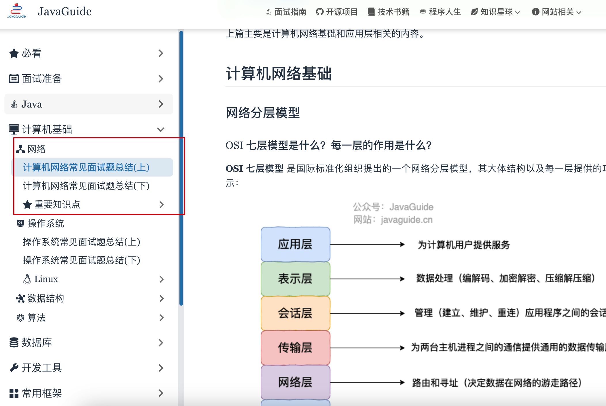
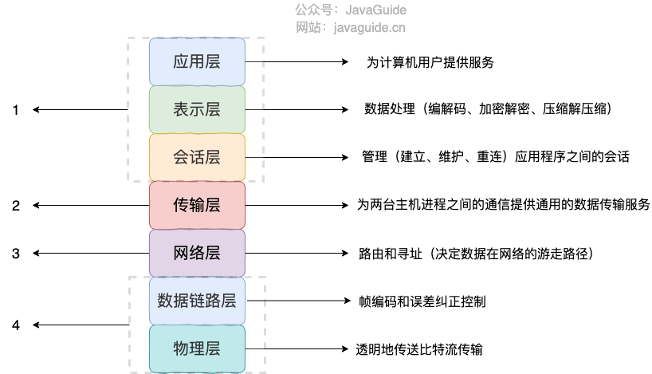
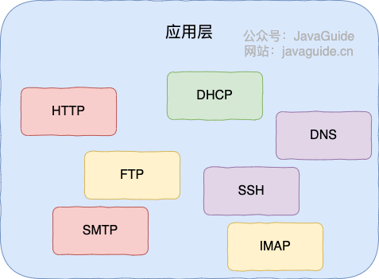
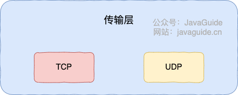
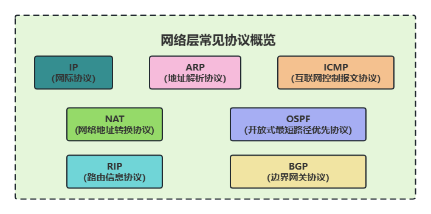
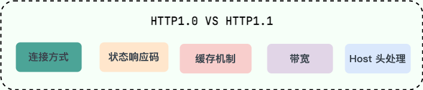
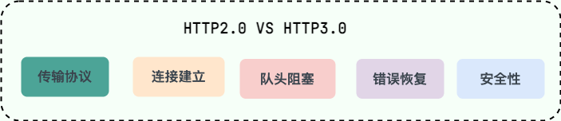

# 计算机网络常见面试题自测

像中小厂一般问计算机基础比较少一些，有些大厂比如字节比较重视计算机基础尤其是算法。这样的话，如果你的目标是中小厂的话，计算机基础就准备面试来说不是那么重要了。如果复习时间不够的话，可以暂时先放放，腾出时间给其他重要的知识点。

📌**说明**：

1. 下面这些计算机网络自测问题的详细参考答案你几乎都可以在 [JavaGuide ](https://javaguide.cn/cs-basics/network/other-network-questions.html) 中找到。对于网站上没有的内容，我也会给出对应的优质参考答案。因此，不需要担心自测遇到不懂的问题找不到答案。

2. 标注😖的问题代表这个问题比较难，通常只有大厂面试会比较喜欢问，目标在中小厂的同学可以直接跳过。

## 网络分层模型

**OSI 与 TCP/IP 各层的结构与功能。**【⭐⭐⭐⭐】

💡 提示：TCP/IP 四层模型是 OSI 七层模型的精简版本，也是目前所广泛使用的，以这个为主就好。【⭐⭐⭐⭐⭐】

1. 应用层
2. 传输层
3. 网络层
4. 网络接口层

**为什么网络要分层？**【⭐⭐⭐】

💡 提示：各层之间相互独立、提高了灵活性和可替换性、大问题化小。

**OSI 与 TCP/IP 各层都有哪些协议?**【⭐⭐⭐⭐】

💡 提示：

## HTTP（重要）

**HTTP 状态码有哪些？**【⭐⭐⭐】

💡 提示：

**从输入 URL 到页面展示到底发生了什么？**【⭐⭐⭐⭐⭐】

💡 提示：这个问题非常重要，可以把很多重要的网络知识点串起来。

完整流程如下：

1. 在浏览器中输入指定网页的 URL。
2. 浏览器通过 DNS 协议，获取域名对应的 IP 地址。
3. 浏览器根据 IP 地址和端口号，向目标服务器发起一个 TCP 连接请求。
4. 浏览器在 TCP 连接上，向服务器发送一个 HTTP 请求报文，请求获取网页的内容。
5. 服务器收到 HTTP 请求报文后，处理请求，并返回 HTTP 响应报文给浏览器。
6. 浏览器收到 HTTP 响应报文后，解析响应体中的 HTML 代码，渲染网页的结构和样式，同时根据 HTML 中的其他资源的 URL（如图片、CSS、JS 等），再次发起 HTTP 请求，获取这些资源的内容，直到网页完全加载显示。
7. 浏览器在不需要和服务器通信时，可以主动关闭 TCP 连接，或者等待服务器的关闭请求。

相关阅读：[访问网页的全过程（知识串联）](https://javaguide.cn/cs-basics/network/the-whole-process-of-accessing-web-pages.html)

**HTTP 和 HTTPS 的区别了解么？HTTPS 的安全性体现在什么方面？**【⭐⭐⭐⭐⭐】

💡 提示：

HTTPS 之所以能达到较高的安全性要求，就是结合了 SSL/TLS 和 TCP 协议，对通信数据进行加密，解决了 HTTP 数据透明的问题。

相关阅读：[HTTP vs HTTPS（应用层）](https://javaguide.cn/cs-basics/network/http-vs-https.html)

**😖****HTTPS 加密过程是怎么样的？**【⭐⭐⭐⭐⭐】

💡 提示：HTTPS 的加密过程可以分为以下步骤：

1. 客户端向服务器发送 HTTPS 请求。
2. 服务器将公钥证书发送给客户端。
3. 客户端验证服务器的证书。
4. 如果验证通过，客户端生成一个用于会话的对称密钥。
5. 客户端使用服务器的公钥对对称密钥进行加密，并将加密后的密钥发送给服务器。
6. 服务器使用私钥对客户端发送的加密密钥进行解密，得到对称密钥。
7. 服务器和客户端使用对称密钥进行加密和解密数据传输。

相关阅读：[HTTPS 的加密过程及其工作原理](https://xie.infoq.cn/article/007a9bd16f44303fbd8b40689)

**HTTP/1.0 和 HTTP/1.1 有什么区别？**【⭐⭐⭐】

💡 提示：

**HTTP/1.1 和 HTTP/2.0 有什么区别？**【⭐⭐⭐⭐】

💡 提示：

**HTTP/2.0 和 HTTP/3.0 有什么区别？**【⭐⭐⭐⭐】

💡 提示：

## WebSocket

**WebSocket 是什么？和 HTTP 有什么区别？**【⭐⭐⭐⭐】

💡 提示：WebSocket 是一种基于 TCP 连接的全双工通信协议，即客户端和服务器可以同时发送和接收数据，常用于实时消息推送、实时游戏对战、社交聊天等场景。

WebSocket vs HTTP：

+ WebSocket 双向，HTTP 单向；
+ WebSocket 支持扩展；
+ WebSocket 通信数据格式比较轻量；

**WebSocket 的工作过程是什么样的？**【⭐⭐⭐⭐】

💡 提示：客户端先发送 HTTP 请求到服务器升级协议为 WebSocket，再建立 WebSocket 连接。

**SSE 与 WebSocket 有什么区别？**【⭐⭐⭐】

💡 提示：两者都可以建立服务端与浏览器之间的通信，实现服务端向客户端推送消息。但 SSE 只能由服务端向客户端单向通信，这是主要区别。

## PING

**PING 命令的作用是什么？**【⭐⭐⭐】

💡 提示：测试网络中主机之间的连通性和网络延迟。

**😖****PING 命令的工作原理是什么？**【⭐⭐⭐】

💡 提示：PING 基于网络层的 ICMP（Internet Control Message Protocol，互联网控制报文协议），其主要原理就是通过在网络上发送和接收 ICMP 报文实现的。

## DNS

**DNS 是什么？解决了什么问题？是哪一层的协议？**【⭐⭐⭐⭐⭐】

💡 提示：

+ DNS（Domain Name System）域名管理系统，是当用户使用浏览器访问网址之后，使用的第一个重要协议。DNS 要解决的是域名和 IP 地址的映射问题。
+ DNS 是应用层协议，基于 UDP 协议之上，端口为 53 。

**DNS 能解析端口吗？**【⭐⭐⭐⭐】

💡 提示：DNS 是域名解析协议，只能将域名和 IP 地址相互映射，不能指定端口。如果想要通过域名访问特定端口的服务，可以通过 Nginx 反向代理（也可以使用其他反向代理服务器）。

**DNS 服务器有哪些？根服务器有多少个？**【⭐⭐⭐】

💡 提示：

+ DNS 服务器自底向上可以依次分为这 4 个层级(所有 DNS 服务器都属于这 4 个类别之一)：根 DNS 服务器、顶级域 DNS 服务器、权威 DNS 服务器、本地 DNS 服务器。
+ 千万不要认为世界上只有 13 台根服务器，这是一个常见的误解。

**😖****DNS 解析的过程是什么样的？**【⭐⭐⭐】

💡 提示：DNS 的查询解析过程分为迭代和递归这两种模式，整个过程比较复杂。

**😖****DNS 劫持了解吗？如何应对？**【⭐⭐】

💡 提示：DNS 劫持是一种网络攻击，它通过修改 DNS 服务器的解析结果，使用户访问的域名指向错误的 IP 地址，从而导致用户无法访问正常的网站，或者被引导到恶意的网站。DNS 劫持有时也被称为 DNS 重定向、DNS 欺骗或 DNS 污染。DNS 劫持详细介绍可以参考：[黑客技术？没你想象的那么难！——DNS 劫持篇](https://cloud.tencent.com/developer/article/1197474)。

## TCP 与 UDP（重要）

**TCP 的三次握手与四次挥手**【⭐⭐⭐⭐⭐】

💡 提示：非常重要的一个问题，一定要吃透搞懂下面这些要点：

+ 为什么要三次握手和四次挥手？
+ 三次握手和四次挥手的整个过程是怎样的？
+ 为什么不能把服务器发送的 ACK 和 FIN 合并起来，变成三次挥手？
+ 为什么第四次挥手客户端需要等待 2*MSL（报文段最长寿命）时间后才进入 CLOSED 状态？

**TCP 与 UDP 的区别及使用场景？**【⭐⭐⭐⭐】

💡 提示：

|  | TCP | UDP |
| --- | --- | --- |
| 是否面向连接 | 是 | 否 |
| 是否可靠 | 是 | 否 |
| 是否有状态 | 是 | 否 |
| 传输效率 | 较慢 | 较快 |
| 传输形式 | 字节流 | 数据报文段 |
| 首部开销 | 20 ～ 60 bytes | 8 bytes |
| 是否提供广播或多播服务 | 否 | 是 |

相关阅读：[为什么 DNS 协议使用 UDP？只使用了 UDP 吗？](https://cloud.tencent.com/developer/article/1818152)

**TCP 是如何保证传输的可靠性？**【⭐⭐⭐⭐⭐】

💡 提示：这个问题涉及到的知识点非常多，每个都能挖掘不少问题，例如重传机制、流量控制、拥塞控制。如果目标是大厂的话，一定要吃透，面试经常会问的。

**使用 TCP 的协议有哪些?使用 UDP 的协议有哪些?**【⭐⭐⭐】

💡 提示：

+ 运行于 TCP 协议之上的协议：HTTP （HTTP/3.0 之前）、HTTPS、FTP、SMTP、DNS 等等
+ 运行于 UDP 协议之上的协议：HTTP （HTTP/3.0 ）、DHCP 协议、DNS 等等。

**HTTP 基于 TCP 还是 UDP？**【⭐⭐⭐】

💡 提示：HTTP/3.0 之前是基于 TCP 协议的，而 HTTP/3.0 将弃用 TCP，改用 基于 UDP 的 QUIC 协议 。

**为什么 DNS 协议使用 UDP？只使用了 UDP 吗？**【⭐⭐⭐】

💡 提示：虽然 UDP 速度更快，DNS 协议也确实大面积使用了 UDP，但是由于 UDP 面向报文、只能传输小于 512 字节的特性，DNS 并非只使用了 UDP，具体的 TCP 和 UDP 使用场景如下：

+ DNS 在域名解析的过程中，会根据 DNS 响应报文的大小选择使用 TCP 还是 UDP。但是一般情况下，返回的 DNS 响应报文都不会超过 512 字节，所以事实上，很多 DNS 服务器进行配置的时候，也仅支持 UDP 查询包；
+ DNS 在进行区域传输的时候使用 TCP 协议。

## ARP

**什么是 Mac 地址？IP 地址到 MAC 地址如何转换？**【⭐⭐⭐⭐】

💡 提示：一切网络设备都由 MAC（Media Access Control Address，媒体访问控制地址） 地址唯一标识。ARP 协议，全称地址解析协议（Address Resolution Protocol），解决了 IP 地址转 MAC 地址的一些问题。

**ARP 协议的工作原理？**【⭐⭐⭐⭐】

💡 提示：希望大家记住几个关键词：ARP 表、广播问询、单播响应。

相关阅读：[ARP 协议详解(网络层)](https://javaguide.cn/cs-basics/network/arp.html)

> 更新: 2024-08-20 13:31:25  
> 原文: <https://www.yuque.com/snailclimb/mf2z3k/xs5il4mv8ge9h545>