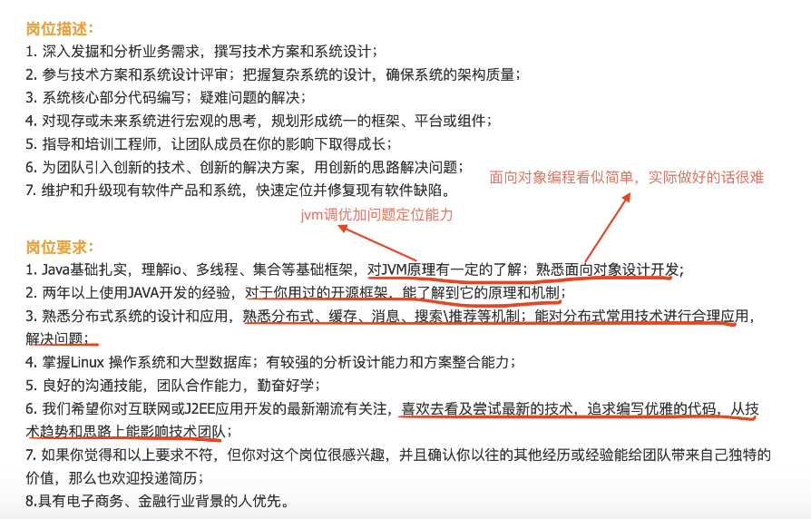
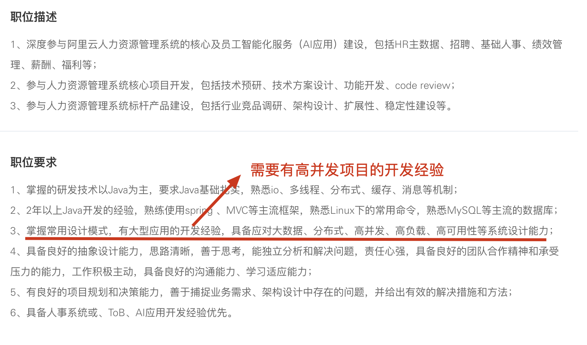
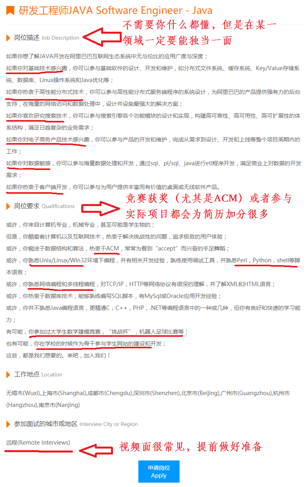
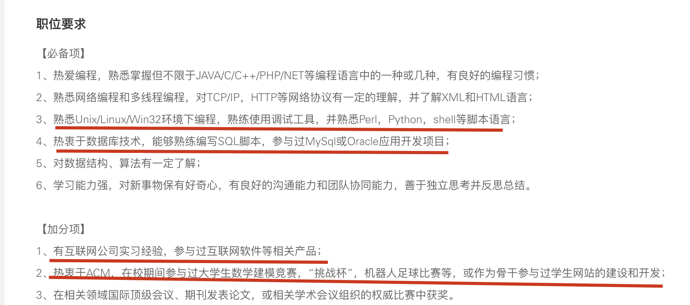

# 大厂招聘更看重什么能力？

我们平时要拿大厂的要求来鞭策自己，尽量避免一直待在自己的舒适区。

那大厂想要什么样的人才呢？我们可以从大厂的招聘要求中得到答案！

**先从已经有两年左右开发经验的工程师角度来看：** 

支付宝高级 Java 开发工程师招聘要求：

阿里云智能高级 Java 开发工程师招聘要求：

从上面这些招聘信息可以看出，除去 Java 基础/集合/多线程这些，下面这些点格外重要：

1. **底层知识比如 JVM、网络、操作系统** ：不只是懂理论更会实操；
2. **面向对象编程能力** ：我理解这个不仅包括“面向对象编程”，还有 SOLID 软件设计原则以及各种设计模式的应用，最终目的是写出高质量的代码。
3. **Linux**：需要熟练使用 Linux 下的常用命令，最好有 Linux 下的实际开发经验或者部署项目的经历。
4. **底层原理** ：搞懂框架以及中间件的底层原理，举一反三。
5. **系统设计能力** ：从零开始设计一个系统，从零启动一个项目。
6. **解决问题的能力：**线上遇到问题之后有独立排查和解决问题的经验。
7. **分布式知识应用** ：常见的分布式理论尽量要搞懂，缓存、消息队列等等都要掌握，关键是还要能使用这些技术解决实际问题而不是纸上谈兵。
8. **高并发项目开发经验**：很多大厂的岗位都会要求求职者必须有高并发项目的实际开发经验。这个要求无可厚非，毕竟大厂的很多项目并发量确实高。
9. **优秀技术品质** :喜欢和尝试新技术、追求编写优雅的代码等等。

**再从应届生的角度来看：**

阿里 Java 工程师招聘要求：

阿里云 Java 开发工程师招聘要求：

从上面这些招聘信息可以看出，下面是这些点在面试大厂的时候是比较重要：

1. 有互联网公司的实习经验；
2. 参加过竞赛（ 含金量超高的是 ACM ）；
3. 对数据结构与算法非常熟练；
4. 参与过实际项目（比如学校网站）
5. 熟悉 Python、Shell、Perl 其中一门脚本语言；
6. 熟悉如何优化 Java 代码、有写出质量更高的代码的意识；
7. 熟悉分布式相关的知识，最好是有相关的实践经验（很卷！）；
8. 熟悉自己所用框架的底层知识比如 Spring、MyBatis；
9. 有高并发项目的实际开发经验（绝大部分同学都很难有参与高并发项目的机会）；
10. 有大数据开发经验等等（这个我理解的是极少数后端岗位才有要求，并不是必需的，没有大数据开发经验也没关系）。

虽然上面列举的是 Java 方向的招聘要求，但对于其他后端方向大体上也是类似的，具备参考价值！

从来到大学之后，我的好多阅历非常深的老师经常就会告诫我们：“ 一定要有一门自己的特长，不管是技术还好还是其他能力 ” 。我觉得这句话真的非常有道理！

刚刚也提到了要有一门特长，所以在这里再强调一点：公司不需要你什么都会，但是在某一方面你一定要有过于常人的优点。换言之就是我们不需要去掌握每一门技术（你也没精力去掌握这么多技术），而是需要去深入研究某一门技术，对于其他技术我们可以简单了解一下。

我觉得一个好的 Java 程序员应该具备下面这些素质：

1. **Java 基础** ：一定要熟练掌握 Java 基本语法、数据类型、泛型、反射、注解、SPI、IO 等等基础知识。
2. **多线程（进阶）** ：不光要掌握多线程的简单实用（尽量要在项目实践，多线程方向优化实践可以参考：https://t.zsxq.com/0c1uS7q2Y），还要搞懂重要知识（比如 Concurrent 包下的一些类、AQS）的原理。
3. **JVM(可选)** ：一般是大厂才会问到，面试中小厂就没必要准备了。JVM 面试中比较常问的是 [Java 内存区域](https://javaguide.cn/java/jvm/memory-area.html)、[JVM 垃圾回收](https://javaguide.cn/java/jvm/jvm-garbage-collection.html)、[类加载器和双亲委派模型](https://javaguide.cn/java/jvm/classloader.html) 以及 JVM 调优和问题排查（我之前分享过一些[常见的线上问题案例](https://t.zsxq.com/0bsAac47U)，里面就有 JVM 相关的）。
4. **算法和数据结构**：如果你想进入大厂的话，我推荐你在学习完 Java 基础或者多线程之后，就开始每天抽出一点时间来学习算法和数据结构。为了提高自己的编程能力，你也可以坚持刷 Leetcode。
5. **前端知识** ：学习前端基础(HTML、CSS、JavaScript),当然 BootStrap、VUE 等等前端框架你也可以了解一下。
6. **Git** : 版本控制工具 Git 是团队协作开发必备的。
7. **Maven** ： 学习常用框架之前可以提前花时间学习一下 Maven 的使用，千万不要 到处找 Jar 包，下载 Jar 包（如果你做的项目没用上包管理工具，那请你尽快换一个新点的教程看）。
8. **Docker**：我们可以使用 Docker 安装各种软件和中间件，还可以将自己的程序部署到 Docker 中。
9. **MySQL** : 学习 MySQL 的基本使用，基本的增删改查，索引需要重点关注，存储过程可以简单了解一下。
10. **PostgreSQL（可选）**：和 MySQL 一样，PostgreSQL 也是开源免费且功能强大的关系型数据库。PostgreSQL 的 Slogan 是“**世界上最先进的开源关系型数据库**” 。客观来说，PostgreSQL 确实比 MySQL 优秀。不过，目前国内 MySQL 还是主流，PostgreSQL 是可选择性学习的。
11. **Redis**：作为最常用的分布式缓存，Redis 是必须要掌握的。除了 Redis 作为缓存的基本使用之外，Redis 的其他应用场景尽量要掌握，比如 Redis 实现分布式锁、限流、延迟队列、各种复杂的业务场景（比如维护排行榜）等等，更进一步，你还要知道 Redis 常见性能优化方式以及生产问题的解决。
12. **框架** ：学习 Spring AOP 和 IoC 这俩比较重要的概念，掌握 SpringBoot、Mybatis、JUnit、Mockito 等框架的使用，吃透 Spring 原理（可选，大厂面试必备）。
13. **Linux** ：学会 Linux 的基本使用(常见命令、基本概念)即可，一些底层概念性的东西不是必需的。
14. **分布式（进阶）** ：常见的分布式理论（CAP 理论、BASE 理论、Paxos 算法、Gossip 协议、Raft 算法等等）、远程调用（RPC 和 HTTP 客户端）、服务注册于发现、API 网关、配置中心、分布式 ID、分布式事务、分布式链路追踪。
15. **微服务（进阶）** ：微服务的一些基本概念、SpringCloud 和 Spring Cloud Alibaba 那一套都可以学习一下。我比较推荐的是学习 Spring Cloud Alibaba，因为首先它是阿里开源的，文档比较丰富，另外，它比较新，各种组件都可以说很不错。
16. **高性能（进阶）** ： CDN（掌握概念和原理即可）、消息队列（选择主流消息队列中的一个深入学习即可）、读写分离&分库分表（掌握概念和原理即可）、负载均衡、缓存……这些。
17. **高可用（进阶）** ： 主要就是限流&降级&熔断、集群、超时和重试机制这些。
18. **云原生（可选）** ：算是未来的一个趋势，可以作为一个新的职业方向考虑，目前正处于蓝海阶段，具体可以参考我写的这篇文章：[云原生时代，程序员应该掌握哪些能力？](https://mp.weixin.qq.com/s/ZVbwNnvRwXxQqk7A-OA27g) 。
19. **核心竞争力（进阶）** ：Java 编码优秀实践、SQL 调优、定位解决线上问题的能力等等。

Java 后端完整的学习路线可以参考：[耗时一个月，这可能是你所见过的最用心、最全面的 Java 后端学习路线](https://t.zsxq.com/15y1s9mA5)。

最后，关于如何高效自学编程和快速学习新技术，可以参考下面这两篇文章：

[如何更高效地自学编程？](https://www.yuque.com/snailclimb/mf2z3k/imaxdd)

[如何快速学习新技术？](https://www.yuque.com/snailclimb/mf2z3k/cpo8gd)

> 更新: 2023-12-22 17:03:50  
> 原文: <https://www.yuque.com/snailclimb/mf2z3k/sg31f0>