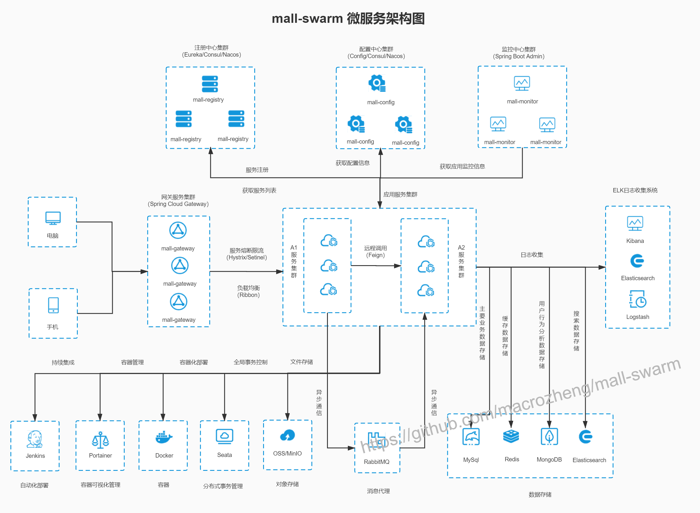

# 如何快速上手一个新项目？

今天的文章标题就是我平时被问过的一个高频问题。

确实，很多小伙伴在学习或者接手一个项目的时候，不知道如何快速了解项目。

今天这篇文章我就简单聊聊“如何快速上手一个新项目？面试被问项目经历有哪些小技巧？”。

下面是正文！

---

## 项目学习五步走

**一般项目都会有遗留文档，不论是传统的项目开发模式还是敏捷开发模式。上项目之前自己抽时间看一下相关文档，大概了解一下这个项目整体的情况比如基本的业务还有技术选型啊这些。**

****

如果能有同事带你简单熟悉一下项目的话，那是最好的，可以让你少踩很多坑。据我了解，很多公司都会有带新人熟悉项目的好传统。如果你入职的项目组没有人带你的话，你可以主动询问一下。

如果项目是单机的话，大部分就是增删改查的逻辑，主要是对于业务的理解。如果项目是分布式或者微服务的话，会涉及各个服务之间的调用以及一些其他问题比如限流、分布式锁、分布式 ID 这些，稍微会复杂一些。

不过，不论是什么类型的项目，上手的姿势大概是下面几步。

### 第一步:了解业务

先搞清你接受的新项目:

1. **是做什么的？** 主要面向什么人群使用？
2. **主要提供了哪些功能？**
3. 项目背景是什么样的？
4. 项目涉及的关键业务流程是怎么样的？
5. 项目目前面临的挑战是什么？未来规划是什么？
6. ......

**技术本身就是为了业务而服务，只有首先搞清楚了业务之后你才真正算是步入了这个项目的大门。**

### 第二步:搭建项目开发环境

是骡子是马总要拉出来溜溜。所以，第二步我推荐尝试在本地搭建开发环境，试着把项目运行起来。稍微正规点的项目都有项目环境搭建相关的文档介绍，跟着文档来就好。如果没有文档的话，需要自己去分析项目依赖环境，必要的情况下询问一下同事。

### 第三步:看项目技术架构

这个直接看项目的相关依赖就好。拿 Java 后端项目举例子，如果是 Maven 项目的话看 `pom.xml`，如果是 Gradle 项目就看 `build.gradle`。

可能会涉及下面这几部分，但是并不完全。

1. 项目最底层框架是什么？是 Spring 还是 Spring Boot，又或者是其他框架呢？
2. 项目依赖了哪些相关的包？挑重点看，比如数据库是 MyBatis 还是 JPA 或者是公司自研的框架呢？
3. 项目使用的什么数据库？是 MySQL 还是 PostgreSQL，又或者是其他数据库呢？
4. 项目用到了缓存吗？是 Redis 缓存吗?有没有用到本地缓存呢？
5. 项目用到了消息队列吗？ Kafka 还是 RocketMQ?
6. 项目的权限管理这块是怎么做的呢？
7. .......

### 第四步:看项目的代码结构

项目的代码结构是怎么划分的，比如常见的项目可能会分为下面三层（复杂的系统分层可能会更多）。

1. Repository（数据库操作）
2. Service（业务操作）
3. Controller（数据交互）

如果是 DDD 分层架构的话，可能是下面这样的：

1. User Interface（用户界面层）
2. Application（应用层）
3. Domain（模型层）
4. Infrastructure（基础实施层）

不同的公司对于项目的结构的划分可能也不同，不过大体都是类似的。比如《阿里巴巴 Java 开发手册》中所推荐的项目代码结构是下面这样的。

### 第五步:从功能主线/问题出发研究项目源码

一个比较成熟的项目的源码量是非常多，我们不可能都完完整整地看完，也没有必要。

你可以通过 debug 调试,研究项目核心代码逻辑。比较推荐的方式就是通过一个功能主线（比如 Dubbo 是如何暴露服务的？）或者问题（比如 ？）出发。

对于企业项目来说，大部分还是知道如何进行 debug 调试的。但是，对于 Spring 这种顶级开源框架来说，很多人就不知道怎么打断点了。

我比较推荐的是你可以先把源码拷贝到本地，然后运行源码中提供的 Demo。对于你想研究的问题比如 Spring 的 IoC 源码，你先去找找对应的 API 调用方式的 Demo，然后根据 Demo 中的方法调用来研究整个过程。如果你觉得这种方法比较难的话，你也可以先去网上看看别人的分析。

## 项目经历的四个小技巧

面试中，对于项目经历的考察是重中之重。下面我就分享 4 个面试被问项目经历的小技巧：

**1.提前搞清楚项目的架构图、技术选型等等。**

比如下面这个就是我之前写的一个简易 RPC 框架（[guide-rpc-framework](https://github.com/Snailclimb/guide-rpc-framework)）的架构图。

再比如下面这个是一个微服务的电商网站的架构图。

**2.提前想好项目的亮点，针对项目涉及的关键技术进行深度复习。**

比如说，你的项目用了消息队列的话，你就很有必要提前想好怎么回答消息队列相关的一些问题：消息队列解决了什么问题、常见消息队列对比、如何保证消息只被消费一次、如何保证消息不被重复消费......。

**3.引导面试官问你熟悉的技术。**

比如说，你对消息队列比较了解的话，介绍项目的时候就可以多介绍一下自己通过消息队列解决了什么问题。

**4.突出个人的贡献比如自己在项目中解决了什么问题，而不只是叙述自己做了什么。**

****

## 文章推荐

+ [如何阅读代码 - ThoughtWorks洞见 - 2022](https://mp.weixin.qq.com/s/-wS9YGW0ll1hwSycH3HEUQ)：日常读代码的一点经验比如先通过文档了解全景，再逐步深入代码。
+ [快速阅读一个SpringBoot工程 - 掘金 - 2023](https://juejin.cn/post/7250513276236808229)：这篇文章介绍了一个常规的 SpringBoot 项目应该如何上手阅读，这方面基础较差的同学可以看看。
+ [如何吃透一个 Java 项目？（附学习实践） - 淘系技术 - 2021](https://mp.weixin.qq.com/s/1VVu25bzea1jzAWz7fKEUA)：介绍了很多吃透 Java 项目的使用建议。
+ [你可以 3 分钟熟悉一个系统吗？- 阿里中间件 - 2020](https://mp.weixin.qq.com/s/odjcRpVrDDghWFuISVOK5w)：从三个方面进行总结，提供一个系统的方法帮助快速上手一个完全陌生的系统，同时也可以用来 review 已有的系统，查漏补缺。

> 更新: 2024-06-21 21:30:57  
> 原文: <https://www.yuque.com/snailclimb/mf2z3k/dbhn2f>