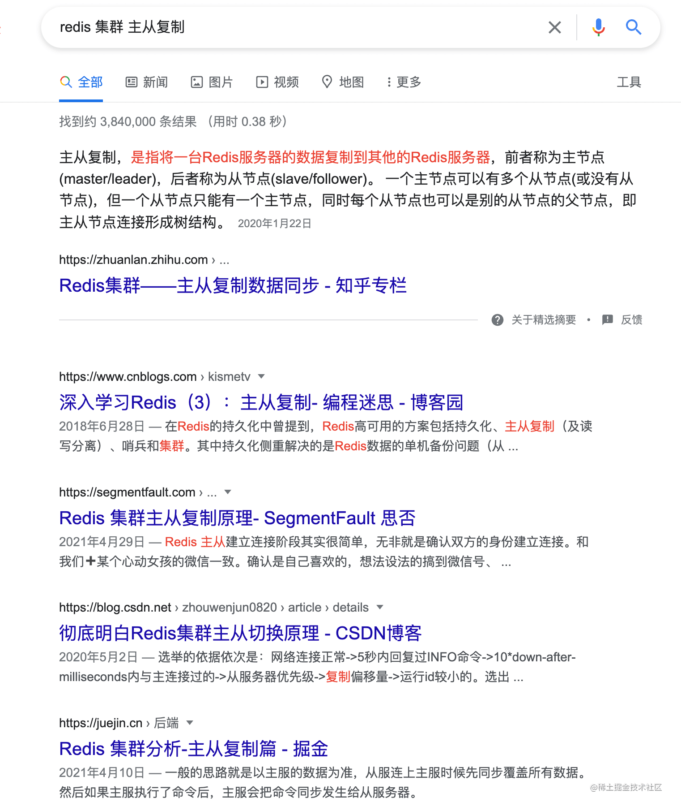
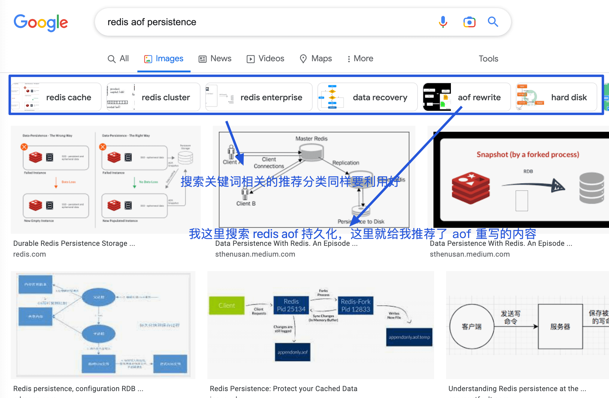
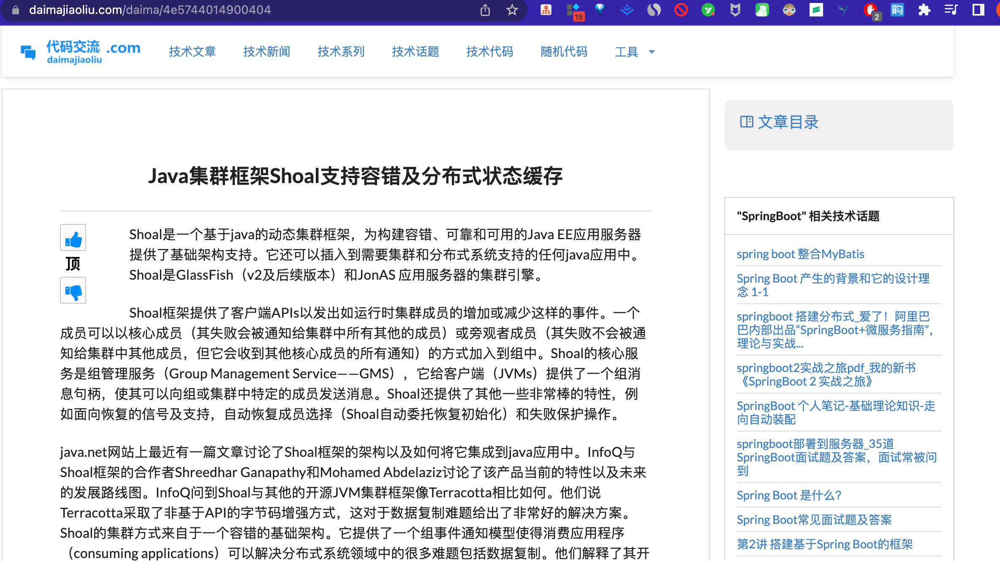
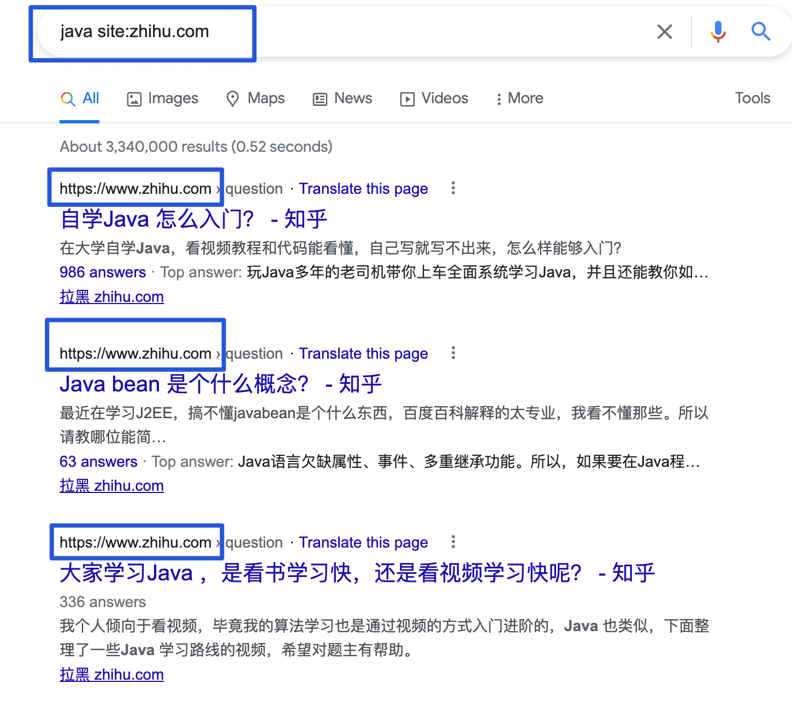

# 如何成为一个合格的程序员？

对于下面的每一点建议的理解，每个人可能都不一样。

如果你觉得某一点对你有用的话，不要关了这篇文章之后你就忘记了，建议你一定要记录下来。从当下开始就去努力践行。

**本文概览** ：

+ 用好 Google
+ 修改代码要慎重
+ 谨慎使用网上搜索的代码片段
+ Code Review 很重要
+ 尽量减少 TODO
+ 不要放任破窗
+ 不要孤立地写代码
+ 试着从更高的层面去了解大部分代码的功能
+ 尽量多沟通交流，提高表达能力
+ 你永远无法写出完美的软件
+ 工作经验 != 能力
+ 提高自己的核心竞争力
+ 你永远无法写出完美的软件

## 用好 Google

相比于百度，更建议使用 Google。如果你无法访问 Google 的话，必应也是不错的。

分享一些个人使用 Google 搜索的实用建议， 这里就不专门介绍各种繁杂的搜索参数了，说了也记不住，实用性不强。

**1、选择合适的关键词，多个关键词手动使用空格进分割。**

如果搜索出来的内容你不满意的话，建议重新更换/删减关键词进行搜索或者调整关键词的顺序。

**2、利用好 Google 图片搜索，一张好的技术配图有更大概率带你进入更优质的页面。**

**3、往往同时需要多打开多个页面之后，才有可能找到自己需要的内容。**

你可以先从第一页的搜索结果中选择打开 5 个页面，内容差的直接关闭，全平台采集文章类的盗文网站直接选择屏蔽掉即可。

像下面这个网站就是一个典型的需要被屏蔽的垃圾文章收集网站，文章排版和网站体验极差且文章都是从其他平台收集整理过来的。

你可以使用 **uBlacklist** 这个 Chrome 插件屏蔽特定的网站。

**4、搜索参数上加上 **`**site:网站或域名**`** 搜索指定网站或者域名下的内容**

搜索参数有很多，个人比较常用的是 `site:网站或域名` ，更多搜索参数你可以在这篇文章中找到：[Google Search Operators: The Complete List (42 Advanced Operators)](https://ahrefs.com/blog/google-advanced-search-operators/)。

**5、过滤搜索结果**

你可以通过 Google 高级搜索过滤搜索结果，缩小搜索结果的范围，地址：[https://www.google.com/advanced_search](https://www.google.com/advanced_search) 。

我们上面讲到的 `site:网站或域名` 功能也可以在这个高级搜索页面上完成。

## 修改代码要慎重

**修改代码之前，一定要思考清楚，不要自以为很简单，结果改了之后出现了大问题。这个在我们写代码的时候也一样，一定要思考清楚之后再写。**

就拿我自己举例子，我们一般项目上都是开发做完相关功能之后，测试随后会对你做的功能进行一系列测试。很多时候，QA 测出一些问题之后，我都自以为很简单，并没有太多思考，然后修改之后发现又出现了其他问题。

**代码很多时候就是这样的，这个地方的 Bug 补上了，说不定另外一个地方的 Bug 又出现了。所以说，修改代码和写代码的时候一定要慎重，一定要思考清楚一点。**

## 谨慎使用网上搜索的代码片段

作为一个 CRUD 程序员，我们经常需要在网上搜索各种代码片段用在项目上。

不过，如果使用不当，这些代码片段就会在潜移默化中引起项目腐化以及代码变质。因此，在使用别人的代码片段的时候，一定先要搞懂了这段代码之后再使用，一定不要直接复制粘贴！

并且，一定不要无脑信 StackOverflow ，上面很多问题的回答以及代码片段也不是 100% 准确的，依然还有很多存在问题或者可以优化的回答以及代码片段。在国内的话，大部分程序员都是通过在 CSDN 上找答案，那你就更需要多留点心思上，上面的低质量文章太多了，能不用就不用。

## Code Review 很重要

代码复查或者说 Code Review 很重要！这是一项成本不大，但是做好了之后收益非常非常大的活动。

一般情况下，大部分项目定期都是要做 Code Review（一天一次最好）的 ，尽量细致到每一行代码或者每一行重要的代码。对于代码中存在的问题，不论是命名问题、潜在的 Bug 还是某部分代码有更好的写法都要当场指出。

我听到过很多人说平时工作太忙，根本没有时间 Code Review，我觉得这只是一个逃避 Code Review 的接口。孤尽大佬在他分享[《Code Review 是一场苦涩但有意思的修行》](https://mp.weixin.qq.com/s?__biz=MzU4NzU0MDIzOQ==&mid=2247489170&idx=1&sn=e47dcf2227517172ff97105e8a0543d0&scene=21#wechat_redirect) 这篇文章中也说到：

> 业务跑得快，代码写得快，可能写的是一堆没有营养甚至是有毒的代码。我们需要追求的是 Code Review 的效能，而不是逃避 Code Review 。Code Review 是一种修行，对于双方都是一样的收获。
>

## 尽量减少 TODO

TODO 描述的是那些我们应该做，但是出于某些原因暂时还没有做的事情。

随着项目的发展，你们项目的 TODO 是不是越来越多了呢？你自己写的 TODO 最后是不是到了项目结束或者上线还没有做呢？

实际上这是一个不那么好的习惯，现实工作中尽量做到记得定期查看 TODO 注释，能完成的尽量完成！不能完成的呢？emmm....留着以后接手代码的人来做吧（开个玩笑~能做还是要尽量做）！

## 不要放任破窗

这是《程序员修炼之道》这本书中的一个建议，这里分享一下原文的描述：

> 熵在软件中定义和解释：虽然软件开发不受绝大多数物理法则的约束，但我们无法躲避来自熵的增加的重击。熵是一个物理学术语，它定义了一个系统的“无序”总量。不幸的是，热力学法则决定了宇宙中的熵会趋向最大化。当软件中的无序化增加时，程序员会说“软件在腐烂”。有些人可能会用更乐观的术语来称呼它，即“**技术债**”，潜台词是说他们总有一天会偿还的——恐怕不会还了。
>
>  
>
> **不要搁置“破窗”（糟糕的设计、错误的决定、低劣的代码）不去修理。每发现一个就赶紧修一个。** 如果没有足够的时间完全修好，那么就把它钉起来。也许你可以注释掉那些糟糕的代码，显示一行“尚未实现”的信息，或用假数据先替代一下。采取行动，预防进一步的损害发生，表明一切尽在你的掌握中。
>

## 不要孤立地写代码

**一定不要孤立地写代码，多看看别人的代码。** 这样我觉得有下面几方面的好处：

1. 避免了团队的单点因素，比如某一部分的代码只有某个人懂；
2. 提高了代码质量；
3. 从别人的代码中或许也能学到一些东西；
4. ......

另外，国外很多公司都是结对编程，这玩意好像在国内行不通啊！

> **结对编程**（英语：Pair programming）是一种敏捷软件开发的方法，两个程序员在一个计算机上共同工作。一个人输入代码，而另一个人审查他输入的每一行代码。输入代码的人称作**驾驶员**，审查代码的人称作**观察员**（或**导航员**）。两个程序员经常互换角色。
>

## 试着从更高的层面去了解大部分代码的功能

**大型系统几乎没有一个人能够明白所有代码或者功能。除了你正在开发的功能之外，试着从更高的层面去了解大部分代码的功能，这样你就可以理解各个功能块之间是如何交互的了。** 这个建议在我经历的上一个项目（学生答题类）中感受颇深。整个项目虽然不是很庞大，但是业务功能点还是比较多，初期的时候，我没有搞懂学生教材选择那块的逻辑 ，导致后面我做学生答题统计模块的时候又花了很久询问相关的同事才搞清楚。

## 你永远无法写出完美的软件

这是《程序员修炼之道》这本书中的一个建议，这里分享一下原文的描述：

> 软件不可能是完美的。对于在所难免的错误，要保护代码和用户免受其影响。
>
>  
>
> **没有完美的软件！！！**
>

## 工作经验 != 能力

对于咱程序员来说，有一个很现实但又不得不面对的问题：“**你的工作经验是否匹配你自己当前的能力？**”。

我们刚从学校毕业的时候，最大的优势就是“年轻”。说好听点，年轻意味着你未来可发展空间要稍微更大一点。然而！现实中，互联网公司更偏爱年轻人，往往是因为年轻人更有精力加班、成本也更低。

对于工作时间比较长时间的朋友来说，“年轻”这个优势就不复存在了。我们需要依靠我们的工作经验来为自己打开一片天地。然而！咱这一行又存在很多劳动密集型的那些工作，工作经验并不代表你的真实能力/水平。

如果你工作了5年，甚至是10年，都是在做一些简单的业务系统，每天的工作都是 CRUD 的话。我觉得你实际的工作经验，可能只有 1年左右。那你出去找工作的话，别人肯定不愿意招聘你了。

## 提高自己的核心竞争力

那很多小伙伴都要说了：“我们公司业务比较简单，基本都是 CRUD 的任务，没办法提高自己的能力啊!”。其实，解决这类问题的办法也很简单，关键要看我们是否愿意跳出自己的舒适区。我们作为一个正常人，往往都是会更倾向于过比较安逸的生活嘛！人之常情，无可厚非！

**如果工作无法给你足够的锻炼，那你就要自己多留点心，工作之外多提高一下自己的核心竞争力。** 比如你可以课外多去研究一些优秀的开源项目（比如 `Kafka`、`sharding-jdbc`）、多看看自己平时经常使用的框架（比如`SpringBoot`、`MyBatis`）的源码。

我还推荐你没事就要多造轮子，多写点框架层面的东西，而不是天天用别人的框架。

**我们实际项目开发中是比较忌讳造轮子的，但是，自己在学习过程中造轮子绝对是对自己百利而无一害的！造轮子是一种特别能够提高自己系统编程能力的手段。**

通过自己造轮子，你更能体会到框架底层的原理，更有机会接触到一些底层的东西，这对你以后的发展绝对是百利而无一害的！

如果说你从你的工作中学习不到什么对你有价值的东西，每天的工作强度又很大，你连自己充电的时间都没有的话。那我建议你可以直接跳槽，**跳槽到一家对你的发展更有帮助的公司**。

**人生路漫漫，不要过于在意短期的利益，眼光要放的更长远一些。**

另外，在我们平时日常工作中，有一个非常重要的能力，经常会被我们忽略。这个能力就是**系统设计能力** 。

## 不要把自己局限在技术上

技术作为我们程序员的核心竞争力，毋庸置疑，非常重要！但是，不要把自己的“束缚”在“技术”上，被“技术”绑架。

**技术本身往往不会产生价值，必须依托于产品才能体现。** 比如你是一个提供技术服务的公司，你创造的技术产品有人买单或者有人使用。再比如你是一个普通的互联网公司，你们通过技术创造了某个热门 App 为公司创造了营收。

但是，我们大多数人喜欢在技术上自嗨，这当然也包括我自己。

拿我自己来说，我觉得在技术之外，我还需要提高自己的产品设计能力、演讲能力、理财能力......。

产品设计能力，一是为以后自己可能独立做产品做下铺垫，二是这个在日常工作中也会用到。

演讲能力和理财能力就不用多说了吧！当代社会必备的能力。

**往美好的方向讲，技术是为了让人们的生活更好。现实来说，技术就是为了帮助公司创造更多利润。**

另外，技术更新换代太快，但是，底层技术比如数据结构和算法、计算机组成原理、操作系统的内容其实一直没怎么么改变的。就那些东西。

当自己年龄上来之后或者成家之后，自己投入在技术上的时间一定是会减少的。为了避免自己未来产生“**技术焦虑**” ，还是要把这些底层东西给吃透啊！

> 更新: 2023-06-06 13:39:14  
> 原文: <https://www.yuque.com/snailclimb/mf2z3k/tm6xk3>