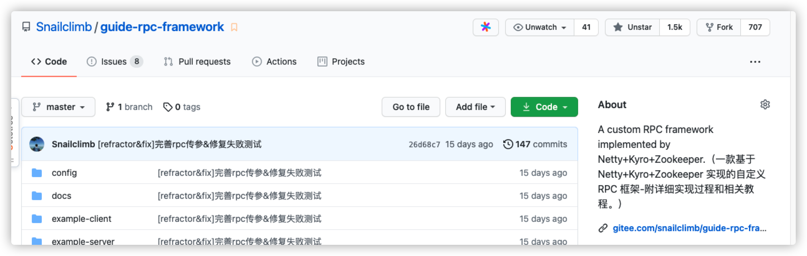

# 如何提高编程能力？

对于下面的每一点建议的理解，每个人可能都不一样。

如果你觉得某一点对你有用的话，不要关了这篇文章之后你就忘记了，建议你一定要记录下来。从当下开始就去努力践行，知行合一。

**本文概览** ：

+ 练好基本功，勿过于追赶技术时髦
+ 选择值得投入的技术
+ 深入学习，学会总结沉淀
+ 避免货物崇拜编程
+ 批判性地分析你读到和听到的东西
+ 提高系统设计能力
+ 不要让技术栈限制住了手脚
+ 造轮子

## 练好基本功，勿过于追赶技术时髦

**一定要把基本功的修炼放在首位**。高楼大厦起于坚实的地基，顶尖的程序员同样起于过硬的基本功。

**哪些算是程序员的基本功呢？**

+ **技术方面**： 计算机技术基础知识、优秀的编码实践、系统设计、设计模式、各种技术的原理，定位问题的能力等等。
+ **非技术方面** ： 对业务的理解能力、抗压能力、表达能力等等。

一定不要把自己的精力都花在各种工具库、框架和中间件的使用以及配置上！从投资角度来说，这些东西的投资价值并不高，有很大概率过几年就过时或者被淘汰了。举点例子：Struts2 被 Spring 干掉、Spring 又被 Spring Boot 替代、ActiveMQ 被 Kafka，RabbitMQ等优秀的消息队列干掉，太多太多这样的例子了。就算是 Spring Boot 目前依然存在着被其他框架替代的可能性，没有什么永恒不变，尤其对于工具库、框架和中间件来说。

不过，这些工具库和中间件的底层原理还是值得学习的。

基础以及原理性的知识一般不会被淘汰，只会被更先进的技术给颠覆。

**如何修炼自己的基本功呢？**

+ 不断学习，提升自己的认知。
+ 不要单纯为了完成需求而完成需求，还要考虑代码质量比如可读性、bug 数量、是否对扩展友好等等
+ 经常总结复盘。
+ 理论+实践并行。

## 选择值得投入的技术

在我大学刚学 Java 后台开发的时候，我学习过什么呢？实话实说是 JSP、Struts2....这些现在看起来老掉牙的技术，这些技术放在现在确实没有学习的理由了。

我自己当时学这些实际也是踩了坑，被一个学长忽悠了，他对我说很多公司做项目还是用这些技术。奈何他当时比我厉害，所以，我选择相信了他。

**我们每个人的时间都是有限的，这个在工作之后的感触尤其明显，所以，我们一定要尽量在有限的时间去学习那些值得我们长期投入学习的技术。**

一项技术是否值得长期投入学习，简单来说，我觉得主要可以下面 3 点：

1. 这个技术的学习成本。
2. 这个技术的发展势头如何（Google trends 能很好的反映一项技术的发展势头）。
3. 看看一些业界比较权威的技术大佬对这个技术的看法。

## 深入学习，学会总结沉淀

做咱们这一行，很多人最喜欢抱怨的就是：“我每天都是在做重复的 CRUD 工作啊！没啥意思。”、“这个公司的项目不行，没用到某某高大上的技术”......

然而，很多这样抱怨的人连特么 CRUD 都写不好，写个基本的业务功能一测贼多 Bug。

我在刚工作那会也是这样的。不过，现在再听到别人这样抱怨的时候，我一般都会首先觉得这个人有点浮躁，不知道如何学习提升自己。

**单纯把业务代码写好真的没那么容易，抱怨自己天天做 CRUD 工作之前，一定要先看看自己 CRUD 的代码写好没。**

另外，**就单纯一个 CRUD 的工作，只要你善于学习，还是能从项目中挖掘到很多值得你学习的点。** 举个例子，你项目用的是 JPA ，你把 JPA 玩的很溜了之后，是不是可以考虑去研究一下 JPA 的底层原理呢！还比如说，项目某个模块的响应速度太慢，自己是不是可以考虑通过某些手段比如 SQL 优化、DB 参数调优、JVM 参数调优、索引、读写分离、缓存等手段来优化一下呢！

真的！就单纯一个最基本的 CRUD 的项目要考虑到的点就已经够多了。一定不要眼高手低，整天就想着微服务、高并发，总觉得“低级”的开发工作配不上自己的身份了。

**再来聊一下回顾总结。**

很多时候，我们做一个项目，做完了之后就感觉自己就和这个项目没有关系了。项目上学到的一些东西或者可以改进的地方，完全不想花时间总结。

**以至于，很多年之后，你学到的东西还是比较零散的，不成体系。** 别人询问你“有没有从上个项目学到点什么？”的时候，自己却没法回答。

**不会进行思考总结，你做再多的项目，了解再多的技术又如何？可能就只是表面上好看而已，有些东西永远都成为不了自己的。**

**对应到我们平时学习技术的时候也是一样，记得一定要多总结思考！**

## 不要让技术栈限制住了手脚

一定不要有那种学了一种编程语言或者框架就想着用这一种编程语言或者框架做任何事情的想法。

**一定不要让技术栈限制住了自己！！！**

很多时候你用这种编程语言很难做到的事情，使用其他编程语言可能很简单就解决了，就比如说我们项目平时如果有爬虫场景，基本都是用 Python 写的，又快有简单。

## 避免货物崇拜编程

**何为货物编程？**

维基百科是这样解释的：

> 货物崇拜编程（Cargo Cult Programming）是一种计算机程序设计中的反模式，其特征为不明就里地、仪式性地使用代码或程序架构。货物崇拜编程通常是程序员既没理解他要解决的 bug、也没理解表面上的解决方案的典型表现。
>

简单来说，货物编程就是我们不明就理地使用各种框架/优秀实践（比如设计模式）/软件架构，最后把项目搞得像个四不像。

列举一些我身边发生过的实际的例子吧！

+ 看到一些比较火的框架就直接套用在自己的项目上，而不知道这个框架究竟能解决项目上的什么问题？是否适合项目？有没有什么风险？
+ 学习了某个设计模式/工程实践之后，不顾项目实际情况，刻意使用在项目上！
+ 直接复制从网上（比如 Stack Overflow ）找到的代码，只要运行 OK 就好。
+ 看到一些比较火的概念就魔怔了，比如前两年开始爆火的中台概念。

## 批判性地分析你读到和听到的东西

这是《程序员修炼之道》这本书中的一个建议，这里分享一下原文的描述：

> **批判性思维本身就是一门完整的学科，非常值得仔细研究和学习！**
>
>  
>
> 我最喜欢的咨询技巧是：至少问五次“为什么”。就是说，每当有了答案后，还要追问“为什么”。像个烦人的四岁小孩那样经常性重复提问，不过记得要比小朋友更有礼貌。这样做可以让你更接近本源。
>

## 提高系统设计能力

### 有哪些考察系统设计能力的问题

不论是面试应届生还是高级开发，系统设计能力是大部分面试官会重点关注的对象。比如面试官可能会问题你：

+ 如何设计一个 RPC 框架？消息队列？
+ 如何设计一个秒杀系统？
+ 如何设计一个排行榜？
+ 如何设计一个视频网站？有哪些需要注意的地方？(比如如何解决大文件上传问题、如何保证视频的安全性)
+ 如何设计微博 Feed 流？
+ ......

这些问题都是非常能够考验你的工程能力的，相比于理论性的题目，这种问题的细节点较多，要更难准备一些。

### 如何提高系统设计能力

想要提供系统设计能力，需要我们的刻意训练。**那到底该怎么训练呢？**

简单说说我自己的看法，欢迎大家补充：

1. 多对你做过的系统进行复盘总结，思考一下这个系统有哪些需要改进/完善的地方。
2. 多进行系统设计实战，比如你可以多问问自己：“如果让你去设计 xx 系统，你该怎么做？”。你最好把这个系统设计的过程记录下来，以便后续再完善改进。

系统设计不一定非要我们实际写代码去实现，系统设计好了之后，写代码并不是什么难事。我这样说并不是代码实践不重要，只是每个人的精力都有限，你应该把你的精力用在最值得你投入时间的地方。

## 造轮子

### 何为造轮子

在编程领域，你可以把造轮子中的“轮子”简单地理解为各种框架、标准库或者软件。

造轮子说的就是我们对现有的各种框架、标准库或者软件进行改进或者重新创造一个类似的。就比如说已经有了现成的任务调度框架，你自己又创造了一个更满足自己需求的任务调度框架。

不知道何时起，“重复造轮子”被大家看作是一个很傻叉的行为。我却不是这么认为的！在我看来，不论是对于个人还是公司，亦或是技术本身来说，造轮子都有其重要的意义存在。

虽然，造轮子很有意义。但是，有一点不可否认的是：**我们在实际项目开发中，会从成本、稳定性、成熟度等方面优先考虑使用比较可靠的开源项目。**

另外，我们不是每个人能够写出一个被广泛使用的框架或者标准库。这个需要坚持，也需要我们长期积累的经验。我认识到的很多优秀开源库的作者，他们大部分都是工作中遇到一个问题，现有的开源库没办法很好地解决，最后自己经过很长时间才写出来的。比如安全框架 [sureness](https://github.com/dromara/sureness) 的作者，自己在使用 shiro 的时候，不太满意，就花了 2 年多写了这个框架。再比如 [sa-token](https://github.com/dromara/sa-token) 这个项目的作者公司的项目需要用到踢人下线、账号封禁等功能，现有的权限认证框架没有现成的功能，于是他就自己写了这个框架。

**那造轮子会为我们带来什么呢？**

### 为什么要造轮子

#### 从个人角度来说

**第一，造轮子能够非常有效地提高自己的系统编程能力。**

我之前在搞懂了 RPC 的原理之后，就自己动手写了[一个简单的 RPC 框架](https://mp.weixin.qq.com/s?__biz=Mzg2OTA0Njk0OA==&mid=2247487683&idx=1&sn=3318ad136c98aa8d9a96eedd3a855e82&chksm=cea25f08f9d5d61ed0f422844a991b61583b1551b36d85875b6e999afcc11b645804385f69e3&scene=21#wechat_redirect)。我的 RPC 框架肯定是无法和 Dubbo 这类已经这么成熟的相提并论。但是，在自己去写 RPC 框架的时候，更加加深了自己对于 RPC 框架的认识。实现的过程中，遇到了很多问题，解决问题的过程中也提高了自己的编程能力。

**第二，造轮子可以提高自己的影响力。**

那我自己来说，我写的建议一个建议的 RPC 框架 [guide-rpc-framework](https://github.com/Snailclimb/guide-rpc-framework) 虽然功能很简陋，但是，凭借这详细的 README 介绍以及清晰的代码结构还是被很多热爱技术的小伙伴喜欢。

一年不到，这个项目的 star 数量就达到了 1.5k， 有 700 位小伙伴 fork 了这个项目。

**第三，造轮子可以倒逼自己学习。**

造轮子的过程中，我们往往需要做大量的功课，学习很多自己之前没有接触过的东西。

就比如我在写 [guide-rpc-framework](https://github.com/Snailclimb/guide-rpc-framework) 之前，自己对于 Netty 的使用仅仅停留在发送和接收消息。在写 [guide-rpc-framework](https://github.com/Snailclimb/guide-rpc-framework) 的过程中，我就学习了很多关于 Netty 更高级的使用比如粘包/半包处理、 心跳机制。

#### 从项目/公司角度来说

**第一，造轮子可以更好地适应项目需求**

当项目业务比较复杂和庞大之后，很可能存在现有的轮子不满足我们的需求的情况。这个时候，我们就需要自己造一个更适合自己的轮子了。

**第二，一个好的轮子的诞生可以提高公司的技术影响力**

像现在国内的很多公司都在搞开源，甚至有的公司的部门还有开源项目的 KPI。

不可否认的是，我们程序员在找工作的时候很看重这个公司有没有比较好的开源项目的。

拿 Java 来说，为什么大家觉得阿里的技术很厉害。主要原因其实并不是因为阿里的业务场景的技术挑战有多大，而是阿里开源了很多还不错的框架比如 Dubbo、Spring Cloud Alibaba。

**第三，造轮子可以让公司的技术得到沉淀。**

公司可以把自己解决某一领域的问题通过造轮子的方式沉淀下来，这样的话，以后再遇到类似的问题就可以直接使用现成的轮子解决了。就比如很多公司内部都有一套适合自己公司的框架，使用这套框架可以帮助开发者节省很多开发时间。

> 更新: 2023-10-28 20:20:44  
> 原文: <https://www.yuque.com/snailclimb/mf2z3k/iwirmw>