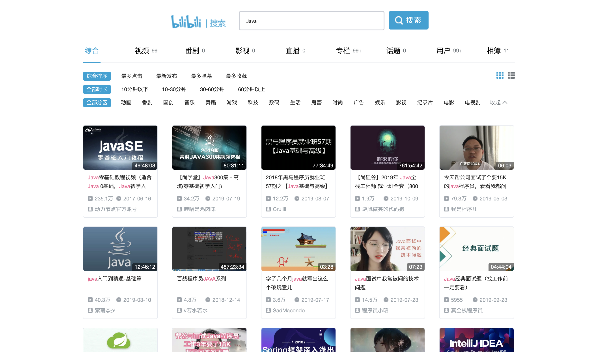
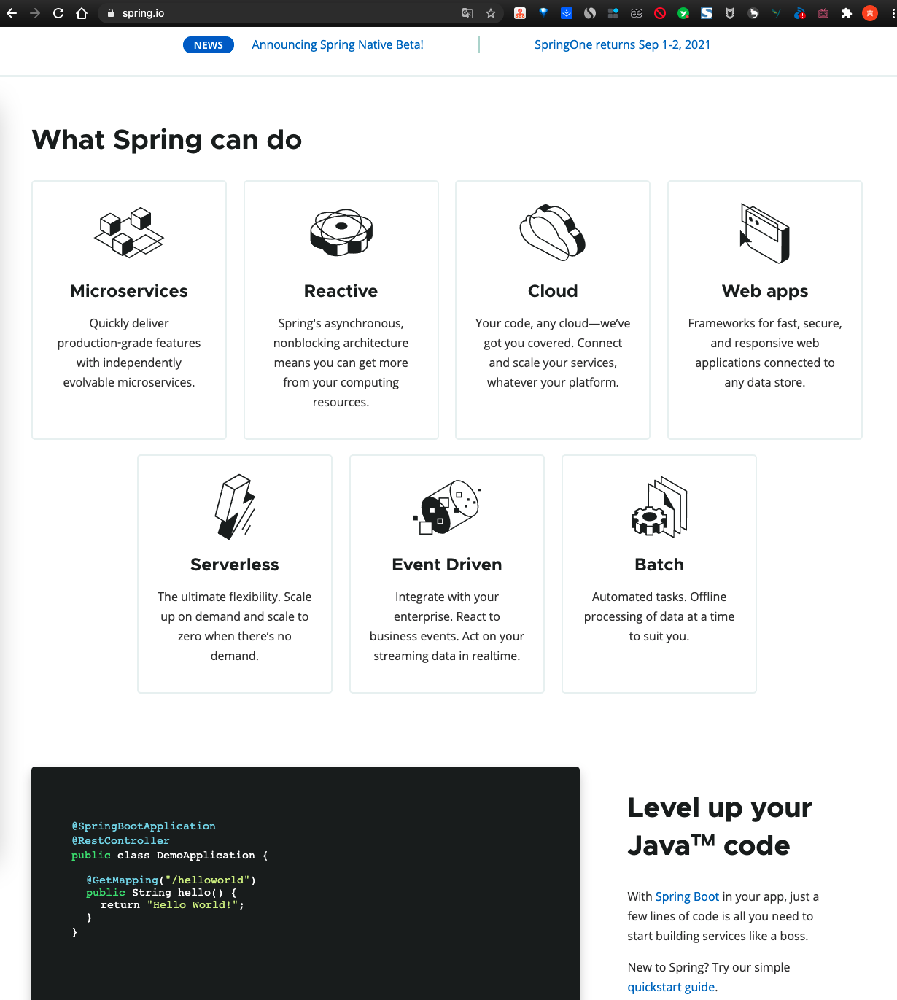
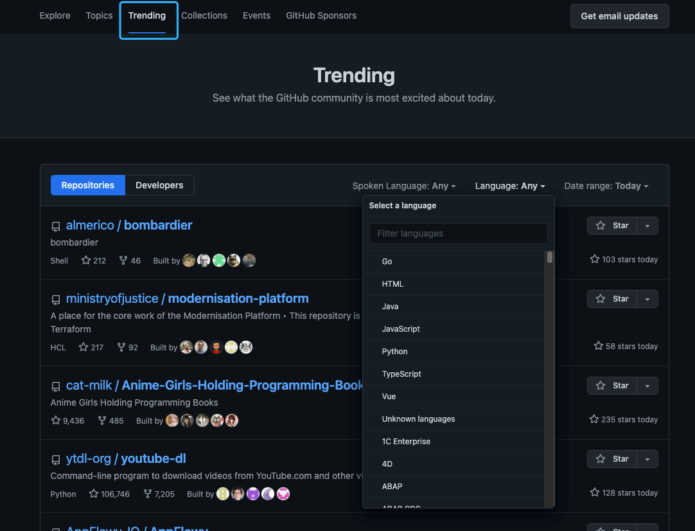
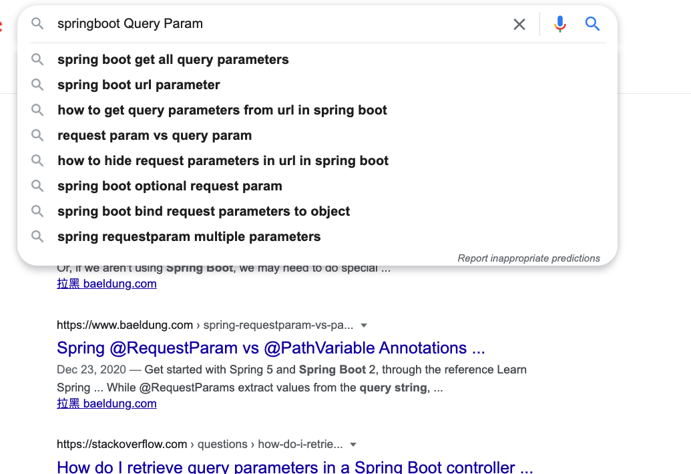

# 如何更高效地自学编程？

我的学校是荆州一所双非一本。整个大一，我都没有怎么认真学习编程，每天就是出去玩，还有参加各种社团活动。

在大二上学期末，最终确定了自己以后要走的技术方向是走 Java 后端。于是，我就开始制定学习计划，开始了自己的 Java 后端领域的打怪升级之路。

到了大三，我基本把 Java 后端领域一些必备的技术都给过了一遍，还用自己学的东西做了两个实战项目。

这篇文章就从下面几个切入点来简单聊聊“如何更高效地自学？”：

+ 有哪些学习的途径
+ 如何获取技术最新动向？
+ 自学过程中有哪些需要注意的地方？

## 有哪些学习的途径？

一般来说，有了一个具体的学习路线，知道学习什么之后，我们通常有下面几个方向来学习:

### 视频

初学编程的小伙伴尽量多看视频，因为，视频教程比较容易理解。不过，对于经验已经比较丰富的小伙伴来说，视频教程相比于文档教程学习起来会更慢一些。

像慕课网和哔哩哔哩上面有挺多学习视频可以看，只直接在上面搜索关键词（比如 Java、MySQL）就可以了。

提个醒哈！在哔哩哔哩上学习的时候，不要学一会就跑到别的分区去了，有点顶不住啊！

### 书籍

**书籍的内容更成体系，更系统。任何时候，书籍都是我们最重要的学习途径！！！**

不过，目前绝大部分高质量的技术书籍还是国外出版的，等到翻译成中文的时候可能已经过了几年了。因此，提高英文阅读能力是每个想要成为优秀工程师的程序员必须要做的。

不过，书籍存在时效问题，你可以通过一些手段来获取技术的最新动向（后面会详细介绍到）。

### 博客

网上的博客大多没有体系，推荐你在解决某一知识点或者问题的时候可以在网上找一些相关的博客看。就比如我在学习消息队列 Pulsar 的时候，先把[Pulsar 官方文档](https://pulsar.apache.org/docs/zh-CN/next/concepts-overview/)看了一遍。然后，自己在网上找了一些相关的文章来深入学习。

+ [《Kafka vs. Pulsar vs. RabbitMQ: Performance, Architecture, and Features Compared》](https://www.confluent.io/kafka-vs-pulsar/)
+ [《为什么放弃 Kafka，选择 Pulsar?》](https://mp.weixin.qq.com/s/msBUvoNn_o_49I59CtSNgw)
+ [《7 Reasons We Chose Apache Pulsar over Apache Kafka》](https://www.datastax.com/blog/2019/05/7-reasons-we-chose-apache-pulsar-over-apache-kafka)
+ [《比拼 Kafka, 大数据分析新秀 Pulsar 到底好在哪》](https://www.infoq.cn/article/1UaxFKWUhUKTY1t_5gPq)
+ [《从 Kafka 到 Pulsar，BIGO 打造实时消息系统之路》](https://mp.weixin.qq.com/s/qHmK_dejIgyvtvEhmlE9ug)
+ [《Apache Pulsar 在 BIGO 的性能调优实战（上）》](https://mp.weixin.qq.com/s/mJViU-elhBwHMDiius2b8g)、[《Apache Pulsar 在 BIGO 的性能调优实战（下）》](https://mp.weixin.qq.com/s/f0vL6gdFJIjNwsfZ3BXePA)
+ [《Apache Pulsar 在能源互联网领域的落地实践》](https://mp.weixin.qq.com/s/sVSsezWLAeycNY8tvg2M0A)
+ ......

Java 领域比较成体系的博客，推荐 [JavaGuide](https://javaguide.cn/) 。

### 官网

**官方文档我们一定是要看的。** 除非是一些国产项目的官方文档提供了中文版本，否则大概率是英文的。并且，官方文档介绍的往往也比较粗糙，不太适合初学者作为学习资料。当然了，如果你经验比较丰富的话，直接看官方文档也是没问题的。

通过官方文档你才能知道你学习的技术最新的技术动态，才能知道这个技术有哪些模块需要学习，才能知道这个技术具体可以帮你解决什么问题。

比如下面是 Spring 的官网，通过网站首页你就可以大概知道 Spring 可以帮助你：

+ 快速开发网站
+ 开发微服务架构的软件
+ 开发响应式架构的软件
+ ......

### 总结

+ 官方文档是必须要看的，通过官方文档你才能知道你学习的技术最新的技术动态，才能知道这个技术有哪些模块需要学习，才能知道这个技术具体可以帮你解决什么问题。
+ 书籍的内容更成体系，更系统。任何时候，书籍都是我们最重要的学习途径！不过，书籍存在时效问题，更适合理论性的知识。
+ 遇到搞不懂的问题或者想要深入研究某个知识点，都可以去找一些优质的博客来阅读。
+ 遇到你觉得比较难的知识点时，可以去看视频学习。视频不仅适合初学者，对进阶学习也有帮助。不过，单纯看视频是不够的，建议搭配文字资料。

## 如何获取技术最新动向？

### Github Trending

Github Trending 我几乎每天必看，通过 Github Trending 我可以大概知道最近有哪些项目比较火，有哪些框架比较热门，有哪些新的中间件被开源了。

并且，Github 的 Trending 可以按照语言和日期来进行筛选，你可以根据自己的需要来选择查看对应的信息。

国内的话，可以关注一下 Gitee 的 [GVP 项目](https://gitee.com/gvp)。

### 公开的技术分享

你可以留意一些公开的技术分享，比如 [JavaOne](https://www.oracle.com/javaone/) 、 [InfoQ 技术大会](https://con.infoq.cn/conference/intro)、[Red Hat Summit](https://www.redhat.com/en/summit)、[GitHub Universe](https://githubuniverse.com/) 等。

通过这些公开的技术分享，你可以了解到当下热门的创新技术、实践案例、产品思维和管理心得。

### 技术大佬

技术无国界，国内外都有很多优秀的工程师。多关注一下他们在干什么，在研究什么技术，或许能给你很大的启发和动力。

国内比较值得关注的技术大佬有：

+ [Liang Zhang](https://github.com/terrymanu)：[Apache ShardingSphere](https://github.com/apache/shardingsphere)，[ElasticJob](https://github.com/apache/shardingsphere-elasticjob) 创始人 & 项目管理委员会主席。
+ [xiaoyu](https://github.com/yu199195) ： 作为主要作者开源了 soul(网关)、hmily(分布式事务框架)等等顶级开源项目，并且参与了[apache/shardingsphere](https://github.com/apache/shardingsphere)等开源项目。
+ [kimmking](https://github.com/kimmking) ：Apache Dubbo/ShardingSphere PMC。前某集团高级技术总监/阿里架构师/某商业银行北京研发中心负责人，阿里云 MVP、腾讯 TVP、TGO 鲲鹏会会员。
+ [Juan Pan](https://github.com/tristaZero) ：京东数科高级 DBA&Apache ShardingSphere PMC，主要负责京东数科分布式数据库开发、数据库运维自动化平台开发等工作。
+ [Jintao Zhang](https://github.com/tao12345666333) ：[《Kubernetes 从上手到实践》](https://juejin.im/book/5b9b2dc86fb9a05d0f16c8ac) [《Docker 核心知识必知必会》](https://gitbook.cn/gitchat/column/5d70cfdc4dc213091bfca46f) 作者、[API7.AI](https://www.apiseven.com/en)任技术专家，负责 [Apache APISIX Ingress](https://github.com/apache/apisix-ingress-controller/) 和 Service Mesh 等云原生技术方向。
+ ……

### 技术社区

技术社区也是一个了解技术动向的好办法，国内外有很多优质的社区，比如 [Reddit 上的 Java 社区](https://www.reddit.com/r/java/)，[InfoQ 中文社区](https://www.infoq.cn/) （近几年质量有所下降）、[Medium 上的技术社区](https://medium.com/tag/technology)等。

### 技术博客

关注或者订阅一些干货比较多的技术博客，不光能够获取到技术最新动向，还可以让自己深入学习很多知识点。

如果你不知道国内有哪些值得推荐的技术博客的话，可以看看这篇文章：[坦白帖！我订阅了哪些技术团队的博客？](https://mp.weixin.qq.com/s/4Cpz4U2QAYdxJbJF_sDi1Q)。

## 自学过程中有哪些需要注意的地方？

### 英语阅读能力

大部分优秀的技术书籍都是国外的，几乎都是英文，并且，大部分技术的官方文档也都是英文的。

所以，提高自己的英文阅读能力很重要。英文阅读能力暂时比较差的也不要紧，有道翻译和谷歌翻译就是你最好的老师。如果是使用 Chrome 浏览器的话，我还推荐你安装一个 Mate Translate 插件。 这个插件对于网页阅读英文文档太友好了，可以一站式翻译您的网页以及标记的文字段落。

### 多练！多记！多实践！多实战！

不论是看视频还是看书，最好都要跟着一起练！

学习编程，不动手实践那都是扯淡。你是不是经常听别人讲的时候感觉自己似乎懂了，好像也并不难，结果，自己写的时候就不会了，过了没几天自己就忘了。

比如说我们学习 Spring Boot 整合其他常见框架的时候，你不光要看对应的 Spring Boot 教程，一定还要动手去实践，去写一些 Spring Boot 的小 Demo。动手实践的过程中，你会发现有很多被自己忽略的细节，遇到一些需要解决的问题。解决问题的过程中，同样也是学习的过程。

再比如说我们学习 Tomcat 原理的时候，我们发现 Tomcat 的自定义线程池挺有意思，那我们自己也可以手写一个定制版的线程池。再比如我们学习 Dubbo 原理的时候，可以自己动手造一个简易版的 RPC 框架。

学习过程中没弄懂的知识点一定要尽快解决。如何解决？首选百度/Google，通过搜索引擎解决不了的话就找身边的朋友或者网上认识的一些人。

另外，一定要进行项目实战！很多人这时候就会问没有实际项目让我做怎么办？我觉得可以通过下面这几种方式：

1. **实战项目视频/专栏** ： 在网上找一个符合自己能力与找工作需求的实战项目视频或者专栏，跟着老师一起做。跟着老师做的过程中，你一定要有自己的思考，不要浅尝辄止。对于很多知识点，别人的讲解可能只是满足项目就够了，你自己想多点知识的话，对于重要的知识点就要自己学会去深入学习。
2. **实战类开源项目** ： Github 或者码云上面有很多实战类别项目，你可以选择一个来研究，为了让自己对这个项目更加理解，在理解原有代码的基础上，你可以对原有项目进行改进或者增加功能。Java 类的实战项目，你可以从 [**awesome-java**](https://github.com/Snailclimb/awesome-java) 这个仓库里面找，里面有很多非常赞的项目。
3. **从头开始做** ：自己动手去做一个自己想完成的东西，遇到不会的东西就临时去学，现学现卖。这个要求比较高，我建议你已经有了一个项目经验之后，再采用这个方法。如果你没有做过项目的话，还是老老实实采用上面两个方法比较好。
4. ......

做项目不光要做，还要改进，改善。另外，如果你的老师有相关 Java 后台项目的话，你也可以主动申请参与进来。

一定要学会分配自己时间，要学的东西很多，真的很多，搞清楚哪些东西是重点，哪些东西仅仅了解就够了。一定不要把精力都花在了学各种框架上，算法和数据结构真的很重要！

### 不要把学习编程还当做学生时代的应试考试来看

你或许也发现了。很多成绩特别特别优异的同学，他们的编程能力其实并不好。在大学的时候，那些编程能力最强的往往是那些成绩比较一般的。

**为什么会这样呢？**

我觉得主要是一个思维的转变问题。很多人学习编程的时候，总是想着我要把这个 API 记下来，把这个库的用法记下来。这样学习，导致的结果只有一个那就是你会很难受！因为，这些根本不是要死记硬背的东西啊！真还当这是上课考试啊！**你要从如何用你学的东西来解决实际编程问题出发，站在做一个实际的项目的角度来学习。**

拿我自己来说：我平时也会写 Python，基本就是自己看着官方文档或者一些书籍的教的语法跟着写。如果哪个地方不会了，我就去查一下。

### 多看优秀的代码

**不看优秀的代码，你写的代码质量很难提高。**

虽然要多看优秀的代码，但是也不要被 “**最佳实践**” 所束缚，很多时候实际是根本不存在适用于任何场景的“最佳实践”，没有银弹。

**有哪些优秀的代码值得学习呢？**

拿 Java 来说，不知道阅读什么源码的话，可以先从 JDK 的几个常用集合看起。另外，我比较推荐看 Dubbo 的，因为感觉会稍微相对容易一点，模块划分清晰，注释也比较详细。搞清楚了 RPC 的基本的原理，知道如何自己实现一个 RPC 框架之后，看起来就没那么吃力了。

另外，随便一个框架的源码都 10w+行了，都看一遍是不可能的。要挑选比较重要的地方看，就比如看 Spring 源码的话你一定要看 IoC 和 AOP，要知道一个 Spring Bean 是如何一步一步被创建出来的。你要看 Spring Boot 源码的话就要知道 Spring Boot 的启动机制是啥，Spring Boot 是如何实现自动配置的。

### 不要死记硬背

学习理论知识的时候，我们可以多花点时间整理笔记。

但是，在学习框架使用的时候，就没有太大必要花大量时间的整理做笔记了。

你完全可以随时查文档，记住关键词即可！比如 Spring Boot 你不知道如何接受 Query Param 的话，你直接搜 Spring Boot Query Param 即可！

再比如你不会使用 Redis ，你做的 Spring Boot 项目需要用到的话，你直接搜“Spring Boot+ Redis”就出来了各种详细的教程。

**你要做的就是把常用的东西串联起来，知道有这个东西就好。根据自己的实际能力，再对底层的东西进行学习就好。**

****

### **学会使用 AI 工具辅助学习**

一定要学会利用 AI 工具（如 ChatGPT）来辅助自己学习，这可以极大地提高学习效率和效果。不过，不要完全信任 AI，要保持独立思考，可以通过查阅官方文档、书籍或权威网站等方式来验证信息的准确性。

### **推荐记录博客**

推荐养成记录博客的习惯。这样不光可以加强你对这个知识点的认识，还可以增加个人影响力。相关阅读：[我坚持写技术博客已经有六年了](https://javaguide.cn/about-the-author/writing-technology-blog-six-years.html)。

> 更新: 2024-07-16 10:00:16  
> 原文: <https://www.yuque.com/snailclimb/mf2z3k/imaxdd>