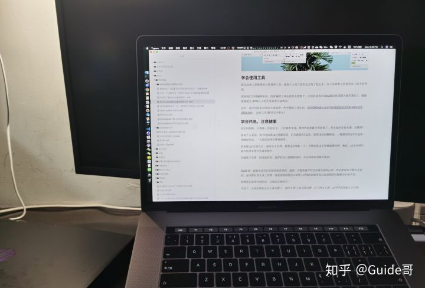

# 如何有效地提高工作效率？

对于下面的每一点建议的理解，每个人可能都不一样。

如果你觉得某一点对你有用的话，不要关了这篇文章之后你就忘记了，建议你一定要记录下来。从当下开始就去努力践行。

本文概览：

+ 根据事情的重要程度安排优先级
+ 会安排自己任务，学会制定计划
+ 工作之外有点自己感兴趣的东西
+ 学会使用工具提升工作效率
+ 学会休息
+ 如何保证精力充沛

### 根据事情的重要程度安排优先级

说实话，在这一点上，我自己刚工作那会做的并不好，也经常因为没有处理好事情的优先级被 diss。

不知道大家会不会有时候在一个不那么重要的事情上，耽搁很久，虽然这件事情不是很重要，自己也知道要先去做最重要的事情，但就是想把当前的事情做完为止。

**如何安排工作上的事情的优先级？**

给几点建议大家参考一下，**总体原则还是重要的事情优先**。

1. 客户、线上、安全问题最优先
2. 对于后续开发依赖比较大的业务优先
3. 工作量小，流程比较长的优先比如账户认证，资源申请等等

### 学会安排自己任务，学会制定计划

工作之后，你会发现自己的时间少了太多太多太多。大部分时间都会感觉每天忙忙碌碌，后头看，却不知道自己究竟做了啥！

前几天自己刚想学习的某个技术、刚想看某本书，忙着忙着却又忘记了。所以，**你需要学会合理安排自己的任务。**

我个人比较推荐 Trello 作为个人任务管理工具。

据我所知国内外很多项目都是用 Trello 来做项目管理的。

**我平时使用 Trello 记录一些自己想写的文章或者代码，以及一些读者的投稿情况和个人突然冒出来的想法。**

下图是我平时用 Trello 记录自己要写的文章或者代码的效果。我还会按照优先级来排列每一个任务和想法。

然后，**平时的一些小任务我是通过 Microsoft To Do来记的**（Windows、Mac、Android）。

我之前使用的是滴答清单，但是，后来发现 Microsoft To Do 用着更舒服点，界面也更加符合我的审美。

最后，**再来安利一下番茄工作法！**  番茄工作法是我一直在用，并且也经常安排给身边朋友的一个时间管理方法，简单易操作，并且效果极好。

> **注意：番茄工作法不一定适合每个人，并且，有的公司根本没条件让你用番茄工作法。**
>

维基百科是这样介绍番茄工作法的：

> 番茄工作法原理：每次专注一段时间（一般是 25 分钟）结束搭配一次休息（一般是 5 分钟），多次专注（一般为 4 次）结束搭配一次长休息（一般为 15 分钟）。劳逸结合，有助于提高工作效率。
>

我每天会根据事情的重要程度以及难易程度给我当天要做的所有事情排一个优先级，然后按照番茄工作法一个一个地去完成。每一次专注的 25 分钟时间内，我都会保证自己只做这一件事情。空余的 5 分钟休息时间，我一般会简单看看邮件、做做眼保健操或者起来站一会放松一下。

我的番茄任务管理工具是在 Apple Store 上 花钱购买的 Be Foucused 的 Pro 版。

不是 Mac 电脑的也没关系，再给小伙伴们再推荐一个多平台（ios、andriod、mac、win）都可以使用的任务管理工具：**番茄土豆** 。

### 工作之外有点自己感兴趣的东西

工作之外要有自己的生活，这样的日子才不会太单调，比如我工作之外喜欢打打游戏放松一下，周末的时候喜欢自己烹饪做好吃的东西给自己。有人可能觉得这个比较浪费时间，不过，在我而言这也是对自己的一种放松，或许在某种程度还能帮助我们提升效率。

### 学会使用工具提升工作效率

就比如我上面推荐的几款效率工具，就我个人而言真的是方便了我太多，在工具效率上给我带来了很大的帮助。

再拿我们平时编程来说，选好编程工具也真的太重要了，比如在我看来 Java 最好的 IDE 当属 IDEA 了，随随便便提升 30%以上的开发效率不是吹的。

另外，我平时也会经常给大家推荐一些不错的工具比如：[浏览 Github 必备的 5 款神器级别的 Chrome 插件](https://mp.weixin.qq.com/s?__biz=Mzg2OTA0Njk0OA==&mid=2247486210&idx=1&sn=609298f537b2aa08b82c9d04ba863de5&chksm=cea244c9f9d5cddf786b508edf8b0bc8e08e5cc1f3d9e96b4eb6e9a9ee0f50a36a2cff6a9ce9&token=1045306289&lang=zh_CN&scene=21#wechat_redirect)，[IDEA 插件](https://mp.weixin.qq.com/mp/appmsgalbum?action=getalbum&album_id=1319419426898329600&__biz=Mzg2OTA0Njk0OA==#wechat_redirect) ，这些工具/插件它不香么？

### 学会休息

别打时间战，少熬夜，休息好了，工作效率才高。熬夜的危害就不用多说了，秃头加内分泌失调，你懂得！

拿我个人来说，我平时如果 12 点前睡的话，白天就是 7 点起来，如果 12 点后睡的话，一般都是 8 点左右起来。没睡好的话，一天真的效率会降低很多。

看电脑 45 分钟之后，起来走 5 分钟，看看远方放松一下。不要觉得这 5 分钟浪费时间，相反，这 5 分钟可能为你带来更大的效率提升。

电脑架子不贵，但是很有用，保护好自己脊椎的同时，办公体验也会提升很多。

### 如何保证精力充沛

除了上面提到的 **学会休息** 之外，还有哪些能够让我们的经历更充沛的好习惯呢？

正所谓 ：**选择大于努力，效率大于堆时间。**

只有我们从下层打好基础，才能稳步上升，最后登顶。

1. 不要吃太多碳水，容易瞌睡。
2. 一定要吃早餐。
3. 咀嚼，具有促进头脑清醒的作用。吃饭的时候，不要太急，多咀嚼一下。
4. 尽量午睡，控制在半小时左右。
5. 运动！拒绝久坐！
6. 早上起来太困的话，洗个澡！
7. 锻炼！
8. 保持积极的心态，减少消极情绪。

相关阅读：

+ 如何拥有旺盛精力？ - 知乎 [https://www.zhihu.com/question/21671881](https://www.zhihu.com/question/21671881)
+ 如何保持精力充沛，有效适应困、倦、疲、乏等周期型生理状况？ - 知乎 [https://www.zhihu.com/question/21097892](https://www.zhihu.com/question/21097892)
+ 低碳水食物清单 ：[https://lowcarbfasthealth.com/low-carb-food-visual-guides/](https://lowcarbfasthealth.com/low-carb-food-visual-guides/)

> 更新: 2022-07-29 23:44:51  
> 原文: <https://www.yuque.com/snailclimb/mf2z3k/ilut9e>