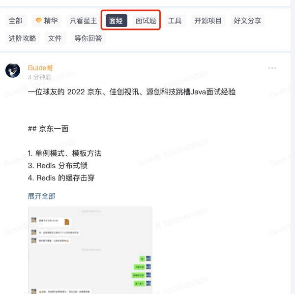

# 面经篇

欢迎阅读**「面经篇」**相关的文章，这个系列主要分享优质面经。

古人云:“**他山之石，可以攻玉**” 。善于学习借鉴别人的面试的成功经验或者失败的教训，可以让自己少走许多弯路。

除了《Java面试指北》中整理的面经之外，星球还有一个专门分享面经的专题：

相比于牛客网或者其他网站的面经，《Java面试指北》中整理的面经质量更高，并且，我会提供优质的参考资料。

有很多同学要说了：“为什么不直接给出具体答案呢？”。主要原因有如下两点：

1. 参考资料解释的要更详细一些，还可以顺便让你把相关的知识点复习一下。
2. 给出的参考资料基本都是我的原创，假如后续我想对面试问题的答案进行完善，就不需要挨个把之前的面经写的答案给修改了（面试中的很多问题都是比较类似的）。当然了，我的原创文章也不太可能覆盖到面试的每个点，部分面试问题的答案，我是精选的其他技术博主写的优质文章，文章质量都很高。

> 更新: 2024-07-10 20:30:18  
> 原文: <https://www.yuque.com/snailclimb/mf2z3k/da3umi>