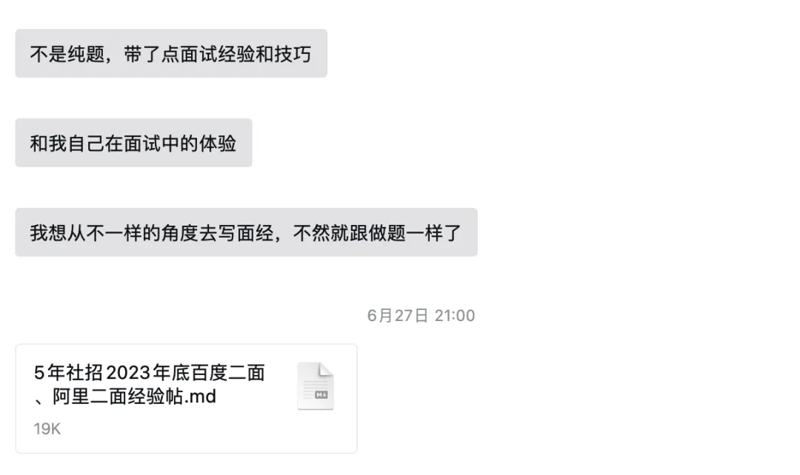

# 5年社招百度、阿里后端面试经验分享！

这是我的博主朋友云雨雪 2023 年底面试百度和阿里的部分原题，为啥不是全部呢？因为有些已经忘了，哈哈哈，毕竟已经过去半年了。

这篇不是纯分享面试题，而是附带分享了一些面试经验和技巧，学到就能直接拿来用，社招和校招都适用，写的很用心！



这篇面经分享会以我的好友云雨雪视角书写，可能会由于笔误不小心写成第一人称视角，请不要误会哦！

# **百度二面**
百度是云雨雪面试的第一家公司，当时 JD（Job Description，职位描述）非常适配云雨雪的工作经历，并且 HR 也相当火热，无法拒绝，于是答应第二天晚上面试。百度的面试工具是如流，一个自研的会议软件，我记得桌面端自带一个写代码的插件，非常顶，目前体验上佳的视频会议软件，点个赞。面试部门是日志部门，除了基建还做业务方向的日志分析，部分大数据技术栈要求，和我的技术栈高度适配。由于是第一次面试大厂，忘了记录和复盘，太紧张了。

一面最后有道面试题，印象比较深刻，题目是：

```plain
有一个大文件，记录一段时间内百度所有的搜索记录，每行放一个搜索词，因为搜索量很大，文件非常大，搜索词数量也很多，内存放不下，求搜索次数最多的TopN个搜索词。
输入：大文件
输出：TopN搜索词列表
```

我的解答是：

```java
import java.io.BufferedReader;
import java.io.File;
import java.io.FileReader;
import java.util.*;

/**
 * 有一个大文件，记录一段时间内百度所有的搜索记录，每行放一个搜索词，因为搜索量很大，文件非常大，搜索词数量也很多，内存放不下，求搜索次数最多的TopN个搜索词。
 * 输入：大文件
 * 输出：TopN搜索词列表
 */
public class Baidu {
    /**
     * 输出TopN搜索词列表
     *
     * @param inputFile 输入文件
     * @param n         TOP N?
     * @return TopN搜索词列表
     * @decsription 该方法未考虑连所有不重复的词语也无法完全加载的情况，只能假设当前内存能存下所有搜索词（如果时间不够，暂时使用当前办法）
     *              TODO 来不及了，先写思路，海量数据问题通常采用分而治之的解决方法，面对上面连所有不重复词语都无法加载的情况
     *              可以先加载一部分已装入wordCountMap的数据，对key也就是词语进行hash，写入到多个小文件中，这样相同key都会聚集在一个小文件中
     *              装载完成后对小文件中的数据读取，对相同key的数据相加，最后汇总所有小文件数据(还是有问题...)
     */
    public static List<String> findTopNWords(File inputFile, int n) {
        List<String> topNWords = new ArrayList<>();
        Map<String, Integer> wordCountMap = new HashMap<>();
        //读取文件
        try (BufferedReader reader = new BufferedReader(new FileReader(inputFile))) {
            String line;
            //一行行读取数据，避免一次性加载不了
            while ((line = reader.readLine()) != null) {
                //每行放一个搜索词，没说是不是句子，假设按照  aa bb  cc对语句按照单词拆分
                String[] words = line.split("\\s+");
                for (String word : words) {
                    //单词对应次数+1
                    wordCountMap.put(word, wordCountMap.getOrDefault(word, 0) + 1);
                }
            }
        } catch (Exception e) {
            e.printStackTrace();//TODO 引入日志组件后用log.error替换
        }
        //转换成List去用sort的API，方便
//        List<Map.Entry<String, Integer>> sortedWordList = new ArrayList<>(wordCountMap.entrySet());
//        sortedWordList.sort(Comparator.comparing(Map.Entry::getValue).reversed());
//        sortedWordList.sort((e1, e2) -> e2.getValue().compareTo(e1.getValue()));
        //找TOP N
//        for (int i = 0; i < n && i < sortedWordList.size(); i++) {
//            topNWords.add(sortedWordList.get(i).getKey());
//        }
        PriorityQueue<Map.Entry<String, Integer>> maxHeap =
                new PriorityQueue<>((e1, e2) -> e2.getValue().compareTo(e1.getValue()));
        for (Map.Entry<String, Integer> entry : wordCountMap.entrySet()) {
            maxHeap.offer(entry);
        }
        if (!maxHeap.isEmpty()) {
            for (int i = 0; i < n; i++) {
                topNWords.add(maxHeap.poll().getKey());
            }
        }
        return topNWords;
    }

    public static void main(String[] args) {
        File inputFile = new File("D:/topn.txt");
        int topN = 10;
        List<String> topNWords = findTopNWords(inputFile, topN);
        System.out.println("TopN搜索词列表:");
        for (String word : topNWords) {
            System.out.println(word);
        }
    }
}
```

云雨雪记不太清了，只记得百度一面确实是很标准的大厂面试，和我之前聊过的面试流程**[5 年普通程序员的工作、面试与情感生活经历(八千字长文)](https://juejin.cn/post/7384326861965164553)**一样，八股居多，都算是比较进阶的八股，场景题问的不多。云雨雪的技术栈比较适配，印象中问了很多 elastic search 的问题，所幸都答上来了。百度面试会卡时间，一小时，云雨雪面的比较好，超时了。

比较令人惊喜的是一面过了，紧接着约了第二天晚上的二面。其实我觉得大中厂面试官普遍态度很好，据我所知面试是会给予一定奖励的，当然本身素质很高，云雨雪面试几乎没有遇到态度很差或者板着脸的。二面的时候印象中还是八股居多，问项目的情况变得更多了，很遗憾，这部分题也没有记录，但是记录了代码题，生产者消费者模型。

```java
import java.util.Queue;
import java.util.concurrent.*;
import java.util.concurrent.atomic.AtomicInteger;

public class ProducerConsumerExample {
    public static void main(String[] args) {
        // 创建共享的并发队列
        Queue<Integer> queue = new ConcurrentLinkedQueue<>();
//        Queue<Integer> queue = new LinkedBlockingQueue<>();
        // 创建线程池
        ThreadPoolExecutor executor = new ThreadPoolExecutor(10, 100, 1, TimeUnit.MINUTES, new LinkedBlockingQueue<>(1000));
        AtomicInteger ai = new AtomicInteger(0);
        // 提交生产者和消费者任务
        for (int i = 0; i < 2; i++) {
            executor.submit(new Producer(queue, ai));
        }
        for (int i = 0; i < 2; i++) {
            executor.submit(new Consumer(queue));
        }
        // 关闭线程池
        executor.shutdown();
    }

    // 生产者任务
    static class Producer implements Runnable {
        private final Queue<Integer> queue;
        private final AtomicInteger value;

        public Producer(Queue<Integer> queue, AtomicInteger value) {
            this.value = value;
            this.queue = queue;
        }

        @Override
        public void run() {
            while (true) {
                // 生产新的数据并添加到队列
                int val = value.incrementAndGet();
                System.out.println("Produced: " + val);
                queue.offer(val);
                // 模拟生产耗时
                try {
                    Thread.sleep(1000);
                } catch (InterruptedException e) {
                    e.printStackTrace();
                }
            }
        }
    }

    // 消费者任务
    static class Consumer implements Runnable {
        private final Queue<Integer> queue;

        public Consumer(Queue<Integer> queue) {
            this.queue = queue;
        }

        @Override
        public void run() {
            while (true) {
                // 从队列中取出数据并消费
                Integer value = queue.poll();
                if (value != null) {
                    System.out.println("Consumed: " + value);
                }
                // 模拟消费耗时
                try {
                    Thread.sleep(10);
                } catch (InterruptedException e) {
                    e.printStackTrace();
                }
            }
        }
    }
}
```

二面结束第二天，HR 跟云雨雪说不好意思 HC("Headcount" 的缩写，指的是公司或团队允许雇佣的员工人数)没了，很多和云雨雪一样在面试中的候选人只能拒了，事后确实了解到百度确实在裁员。云雨雪想进百度的意愿很强，因为当时女友在百度，如果有幸进去将会是一段佳话，哈哈。

最后回到正题，百度给云雨雪的体验是非常好的，很有技术感，问的很多问题都能感觉到面试官是真的在做技术，如流给我的印象也不错，可惜没进。

# **阿里一面**
阿里没记错的话，云雨雪投的 JD 是来自于阿里健康，不是本部，文章末尾会介绍一下云雨雪的个人情况和工作项目经历，方便大家参考。忘了是用的什么会议软件了，应该是内部的，不是钉钉。自我介绍和项目介绍完毕后，面试官直接甩了套卷子...我当时就觉得凉了，因为根据我个人情况，凡是不想聊天直接让做题，多半是因为你的过往经历和技能没有能吸引到面试官的地方。当然说归说，题还是要做的，是给了一个 txt 文件，允许使用本地 IDE，我没有开 AI 编码，毕竟这样有点开挂嫌疑。

题目一共 5 道，两道代码题、一道场景设计和两道 SQL 题，没有评分，没有测试，共享做完面试官会收作业，反问环节结束面试就结束了。

## **代码题**
```java
System.out.println(Arrays.toString(bubbleSort(new int[]{64, 34, 25, 12, 22, 11, 90})));

private static int[] bubbleSort(int[] array) {
    int n = array.length;
    //避免越界
    for (int i = 0; i < n - 1; i++) {
        for (int j = 0; j < n - i - 1; j++) {
            if (array[j] > array[j + 1]) {
                int temp = array[j];
                array[j] = array[j + 1];
                array[j + 1] = temp;
            }
        }
    }
    return array;
}
public static void main(String[] args) {
    AtomicInteger ai = new AtomicInteger(1);
    Semaphore a = new Semaphore(1);
    Semaphore b = new Semaphore(0);
    Semaphore c = new Semaphore(0);
    try (ThreadPoolExecutor executor = new ThreadPoolExecutor(10, 100,
            1, TimeUnit.MINUTES, new LinkedBlockingQueue<>(100));) {
        executor.submit(new Thread(() -> {
            printNum(ai, a, b);
        }));
        executor.submit(new Thread(() -> {
            printNum(ai, b, c);
        }));
        executor.submit(new Thread(() -> {
            printNum(ai, c, a);
        }));
    }
}

private static void printNum(AtomicInteger ai, Semaphore cur, Semaphore next) {
    while (ai.get() <= 100) {
        try {
            cur.acquire();
            //必要--在多线程环境中，有可能一个线程已经通过了循环条件（ai.get() <= MAX_NUMBER）并且获取了信号量，而另一个线程（它已经在等待中）也通过了循环条件。如果没有额外的检查，两个线程可能在释放信号量之前都会打印超过上限的数字，导致输出不正确。
            if (ai.get() <= 100) {
                System.out.println(ai.getAndIncrement());
            }
            next.release();
        } catch (InterruptedException e) {
            throw new RuntimeException();
        }
    }
}
```

## **场景设计题**
百万订单如何做分流策略，有几种，优劣势在哪？如何保证订单的幂等性？如何做重试策略以及告警策略？

云雨雪回答的不好，因为确实没有做过相关的业务，所以只能凭借经验回答，大致可以参考下面 ChatGPT 的答案。

### **分流策略：**
#### **a. 基于订单 ID 的 Hash 分片：**
+ 优势：简单，每个订单都被分配到同一个处理节点。
+ 劣势：如果订单分布不均匀，可能导致某些节点负载过重。

#### **b. 基于订单属性的分片（如地理位置、订单类型等）：**
+ 优势：能够根据订单属性实现更均匀的负载分布。
+ 劣势：需要对订单属性进行分析，可能导致配置复杂。

#### **c. 随机分片：**
+ 优势：简单，对于均匀分布的订单有效。
+ 劣势：不适用于特定条件下需要有选择性的处理订单的情况。

### **幂等性保证：**
+ 使用唯一标识符：为每个订单生成唯一标识符，确保在处理中能够唯一标识订单。数据库中的唯一索引或主键也是一种保证方法。
+ 记录处理状态：在处理每个订单时，记录订单的处理状态。在发生重复请求时，检查订单状态，如果已经处理过，则直接返回处理结果。

### **重试策略：**
+ 指数退避策略：当请求失败时，等待一段时间后进行重试，并逐渐增加重试等待时间。
+ 限制重试次数：设置最大重试次数，超过该次数则放弃请求，需要进行人工或自动干预。

### **告警策略：**
+ 异常监控：监控订单处理过程中的异常情况，如超时、错误响应等。
+ 阈值告警：设置性能指标的阈值，当超过阈值时触发告警。
+ 日志和指标监控：利用日志和指标系统实时监控订单处理状态。

### **其他考虑因素：**
+ 异步处理：将订单处理异步化，使用消息队列等方式，降低实时性要求。
+ 水平扩展：根据系统负载情况，适时增加处理节点，进行水平扩展。
+ 分布式事务：如果涉及到多个服务之间的事务，需要考虑使用分布式事务来保证一致性。

但从现在的角度来看，这样的回答在社招里面是扣分的，据现在的经验来看，面试官更喜欢候选人结合真实的经验和具体的案例讲解其中某一个部分，可以先概括回答，再根据实战展开。

## **SQL**
经典的学生课程成绩 SQL 题，应该算是简单到中等难度，令人尴尬的是云雨雪用 ORM 框架多了之后，只有在联表或者复杂查询时才会写 SQL，有点手生，愣是在面试官一遍遍的提醒下勉强写完了。目前遇到的大厂写 SQL 的少，小厂会偏多一些，可以酌情准备一下。

## **问答**
1. 介绍一下你的项目，业务背景、使用规模、数据量级、技术栈、你在其中的职责、有什么亮点
2. Flink 如何部署，数仓如何做的

记录了俩问题，其实这俩问题就已经暴露了我的工作经历，面试官问完就开始让做题了。我知道对于阿里的体量，我这三瓜俩枣确实不够看了，当然这个问题还是挺常见的，所以后面我针对这俩问题做了下准备。

# **阿里二面**
有的时候面试就很奇怪，当你认为过不了的时候突然就过了，说白了面试还是不仅看实力还得看运气，多尝试总是没毛病的。二面的开场白还是自我介绍和项目经历没啥说的，后面的问题就让我觉得我投错 JD 了。

1. Flink 如何处理一致性问题，有几种一致性方案，为什么你做成批处理
2. 数据倾斜有哪几种处理方案
3. 如何动态感知数据变动并更新数据
4. 你遇到了什么问题，如何发现这些问题

二面面试官通常都会更加具体的挖掘项目，结合他的个人经历和 JD 来对你发出提问，因此从二面开始面经的参考价值就变低了，更多应该注重自己的技术栈去总结属于自己的面经。这里我答得都不好，也是我二面过不了的原因，当然最大的原因是与真实的 JD 不符，这明显要招一个大数据开发。

一致性这个有五种左右，Exactly Once、At Least Once、无状态处理、端到端一致性和使用外部一致性系统(HDFS 等)。我自己做成批处理是因为性能优化需要开时间窗口批量处理数据，这个结合项目直说就行。

数据倾斜这个我单独写了篇文章介绍我怎么解决的，[如何巧妙解决 Flink 数据倾斜问题](https://juejin.cn/post/7243754944809058361) ，其实就是修改了 KeyBy 算法，自己做了映射关系的维护。

如何动态感知数据变动并更新数据，这个问题我今年年初也动手解决了 [青春Flink少年不会梦到"性能优化"学姐](https://juejin.cn/post/7373592723863158799)，状态变量加上广播流去处理。

还问了些其他的，印象不深，因为这几个问题把我问住了，有点红温了。反正很快大概半小时就结束了，也没让写代码题，我就知道铁挂了。

# **云雨雪个人情况**
现可公开情报，男性，学历普通一本，一段小厂(1W+员工，但是制造业)5 年后端开发经验+一些大数据开发经验(数仓、Flink)。

项目核心在简历上体现为三块，复杂业务项目(重构、大数据、性能优化)、技术项目(完整的 EFK，日志收集系统)、门户网站(各种小业务项目、SDK 开发、开发模板及规范制定)。

个人技能方面，JVM 有丰富线上问题处理经验、精通 JAVA 八股、MySQL 原理大王并有调参配置经验、在 Kafka 和 ElasticSearch 的原理和优化上舌绽莲花、Redis 和 Seata 熟练掌握，其他 Cloud 生态组件原理略有涉猎。除了以上常规的还有大数据 Flink、TiDB、DataX 等实操和优化经验。个人经历方面在团队内承担类似业务架构的技术侧角色，提供二三十人的 SDK 和基建，开发模板和超过 5W 字的内部开发文档。和架构组的同事一块承接部门内开发的疑难杂症，写了超过两年的高质量技术博客并公开，自己完整开发了一套日志收集系统和一个实时数仓。

云雨雪的弱项在于网络和算法板块，当然每次面试都会有被问倒的地方，这没关系，大面上能对就行。

# **写在最后**
第一篇面经整理了些记忆不深的，其实百度的没记可惜了，印象中百度的面试题很标准，很有感觉，不是因为前女友，是百度真的给我感觉技术和氛围不错。后面的面经会重点介绍面试题，少一点这种面试感觉和经验的分享，当然有建议的可以评论区发出来。为什么最后公开云雨雪的部分情况？因为我想让大家去了解面试官特别是大中厂的面试官，没有意外的情况下，都是抓你简历、自我介绍和项目经历中的关键词来进行提问，逐渐深入。现在面试，基本没有八股+算法这么简单的模式了，更强调你的经验。3 年以下的看技术能力和学习能力，5 年左右看技术能力和项目经验，8 年以上的看业务能力和设计能力，我们可以预见的是在标准化越明显的地方，比如大中厂越是遵从这套用人标准。所以我对找工作的人唯一的建议就是想跳槽就尽早准备，越晚越难。

生活不易，希望大家都能身体健康，工作顺利，加油(ง •_•)ง！


> 更新: 2024-09-25 07:09:56  
> 原文: <https://www.yuque.com/snailclimb/mf2z3k/cwebdwt2ire3zvyx>