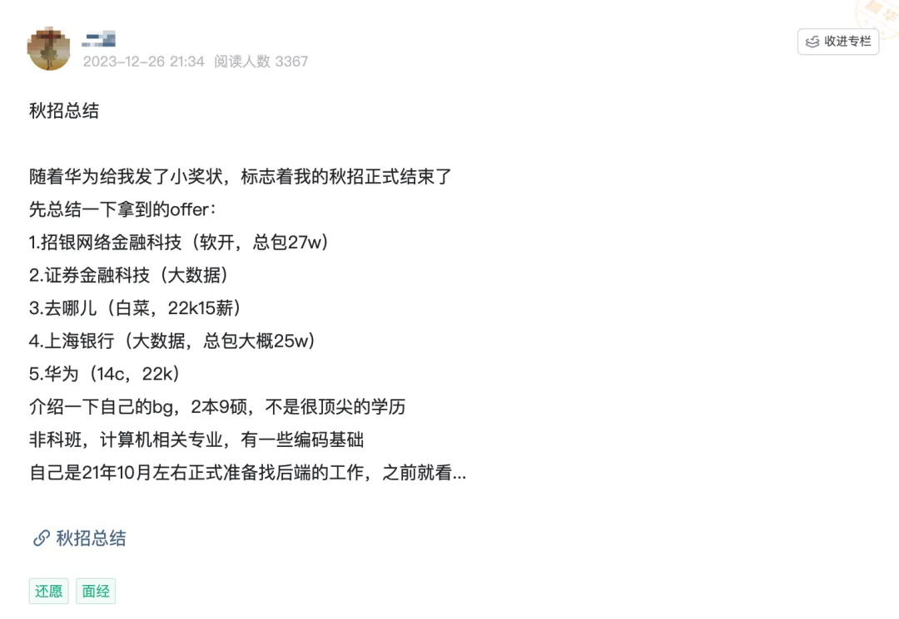

# ⭐️秋招结束，我拿到了华为小奖状！

这位读者的学历是211 本科 + 985 硕士，参加 2024 届秋招，拿到了招银网络金融科技、某证券金融科技、去哪儿、华为等公司的 offer。最后，他选择了离家近的券商。

原贴地址： [https://t.zsxq.com/wCMzS](https://t.zsxq.com/wCMzS) 。

下面是正文。

随着华为给我发了小奖状，标志着我的秋招正式结束了。

## 拿到的 Offer 总结
1. 招银网络金融科技（软开，总包 27w）
2. 证券金融科技（大数据）
3. 去哪儿（白菜，22k15 薪）
4. 上海银行（大数据，总包大概 25w）
5. 华为（14c，22k）

## 背景介绍
+ **学历**：211 本科 + 985 硕士，不算顶尖的学历。
+ **专业**：非科班，计算机相关专业，有一定编码基础。

## 准备过程
我在 2021 年 10 月左右正式开始准备后端工作。在此之前，我仅学习了 Java SE 和 MySQL。之后，我开始学习框架、做项目等。

像大多数人一样，我通过观看黑马程序员和尚硅谷的视频慢慢学习，并做了 LeetCode 刷题。（这里建议慎重选择项目，大厂对项目的要求是实际贴合且具有难度。我曾因项目做法不当被饿了么和美团吐槽。大厂的项目实现方式与我们通常的做法不同）

我做了两个项目，一个是秒杀商城，一个是微服务相关的项目。秒杀商城项目虽然增加了我对框架的理解和能力，但面试时容易被质疑，因为它与实际情况有些脱节。

## 面试问题分享
以下是一些公司的面试问题，公司的名字用缩写代替。

部分面试题的答案，我给出了对应的文章链接。对于没有给出链接的面试题，可以自行搜索一下答案。 

### WD
1. 大数据比赛：在大数据场景下如何进行数据清洗？
2. 什么时候开始学习 Java 开发的？怎么学的？
3. [IoC 的作用，为什么能解耦？](https://mp.weixin.qq.com/s/ab-MLI2VyK9fdTtio5Y9Wg)
4. [AOP 解决了什么问题，应用场景是？](https://mp.weixin.qq.com/s/ab-MLI2VyK9fdTtio5Y9Wg)
5. [Spring Boot 相比 Spring 有什么优化？为什么使用 Spring Boot？](https://mp.weixin.qq.com/s/lPE7hE0KmiJONeJmsTMv_g)
6. [使用过 Spring Cloud 吗？有哪些组件？可以做什么？](https://mp.weixin.qq.com/s/JNJIKnUMc0MU_i2VNXb50A)
7. [Nginx 负载均衡，客户端负载均衡和服务端负载均衡的区别？](https://mp.weixin.qq.com/s/JNJIKnUMc0MU_i2VNXb50A)
8. [如何设计一个优先级任务线程池？](https://mp.weixin.qq.com/s/Inn3bXaML1X0PaXO9jH3dg)
9. [HashMap 的原理？怎么实现的？](https://mp.weixin.qq.com/s/QLhzNoLfpEmyYf5qW8RXjA)
10. [什么是 SPI？SPI 的原理是什么？](https://mp.weixin.qq.com/s?__biz=Mzg2OTA0Njk0OA==&mid=2247533798&idx=1&sn=033f48a9569d29f04ee838f6b9b4d891&chksm=cea10b2df9d6823b6c8f7c033613cf53010dbbd34d209f7c2d8f93f86563fddf56166956356c&token=8884734&lang=zh_CN#rd)

### GT
1. [有用过事务吗？事务的传播属性？](https://javaguide.cn/system-design/framework/spring/spring-transaction.html)
2. [Spring 事务失效的情况有哪些？](https://javaguide.cn/system-design/framework/spring/spring-transaction.html)
    - 在方法中捕获异常而没有抛出去。
    - 非事务方法调用事务方法。
    - 事务方法内部调用事务方法。
    - `@Transactional` 标记的方法不是 public。
    - 抛出的异常与 `rollbackFor` 指定的异常不匹配。
1. 消息丢失了怎么办？
2. 父线程如何传递信息给子线程？
3. [ThreadLocal 了解吗？](https://javaguide.cn/java/concurrent/threadlocal.html)
4. [幂等性，如何避免重复消费？在项目里是怎么做的？如果消息重复了，如何避免库存的重复扣减？](https://www.yuque.com/snailclimb/mf2z3k/mlnfrc6kk95kmli6)
5. [为什么需要分布式事务？常见分布式事务解决方案有哪些？](https://mp.weixin.qq.com/s?__biz=Mzg2OTA0Njk0OA==&mid=2247494827&idx=1&sn=aa5d7401d53b1ca61b5e49462262bd22&chksm=cea1a360f9d62a761dff15a682f69fcacdd5b70a8afc4e1114cc7f6704b31d9aa3ad82ae5233&token=975293393&lang=zh_CN#rd)
6. [多线程，线程池原理、参数、阻塞队列？](https://javaguide.cn/java/concurrent/java-thread-pool-summary.html)
7. [多线程怎么创建？](https://javaguide.cn/java/concurrent/java-concurrent-questions-01.html)
8. [Future 类如果一直等待返回值的话要怎么处理？](https://javaguide.cn/java/concurrent/completablefuture-intro.html)

### Lazada
1. 项目遇到的难点？
2. [库存怎么扣减的？并发场景下怎么实现？](https://www.yuque.com/snailclimb/mf2z3k/wividn)
3. 乐观锁机制的秒杀场景下，SQL 怎么写？库存表是怎么设计的？
4. [线程池参数怎么设置？需要考虑哪些因素？](https://mp.weixin.qq.com/s/GAHsGwaddjw8to46rSP_TA)
5. [哪些工具用来排查内存泄漏问题？](https://t.zsxq.com/0fobVUIx7)
6. [什么是乐观锁和悲观锁？Java 中 CAS 是如何实现的？ABA 问题的解决？](https://mp.weixin.qq.com/s/L05pSKz07zTU_6uJSKjV1w)
7. [如何检测和避免线程死锁?](https://mp.weixin.qq.com/s/RTSPH23dTvLA3hOBT7CwtQ)
8. [LinkedList](https://javaguide.cn/java/collection/linkedlist-source-code.html)、[ArrayList](https://javaguide.cn/java/collection/arraylist-source-code.html)、[HashMap](https://javaguide.cn/java/collection/hashmap-source-code.html) 实现原理？
9. [为什么使用红黑树？有什么优势？红节点和黑节点？](https://javaguide.cn/cs-basics/data-structure/red-black-tree.html)
10. [JVM 运行时数据区讲一下？](https://javaguide.cn/java/jvm/memory-area.html)
11. [死亡对象的判断方法是？](https://javaguide.cn/java/jvm/jvm-garbage-collection.html)
12. [标记清除算法是怎么标记垃圾的？如何解决引用的依赖问题？](https://javaguide.cn/java/jvm/jvm-garbage-collection.html)
13. [JDK 8 的默认垃圾收集器是？JDK 8 之后呢？](https://javaguide.cn/java/jvm/jvm-garbage-collection.html)

### JXJK
1. [synchronized 锁升级的机制？](https://www.cnblogs.com/star95/p/17542850.html)
2. [Java 中的锁机制？](https://zhuanlan.zhihu.com/p/71156910)
3. Spring Boot 自动注入出现空指针的情况如何排查？
4. 自动注入失败的情况？空指针报错的情况？
5. [接口可不可以定义成员变量？](https://javaguide.cn/java/basis/java-basic-questions-02.html)
6. [接口和抽象类的区别是？](https://javaguide.cn/java/basis/java-basic-questions-02.html)
7. [MySQl 索引失效的场景有哪些？](https://mp.weixin.qq.com/s/mwME3qukHBFul57WQLkOYg)
8. 如果一个字段只有“男”，“女”，“其他”，适合拿来作为索引吗？
9. 如果有两个字段一个有 100000 行一个有 100001 行，如何挑出不同的这个数字？
10. [Redis 的内存淘汰策略？](https://mp.weixin.qq.com/s/xkHyitlakAAhVEm86u_I_Q)
11. [除了 Redis，你还知道其他分布式缓存方案吗？](https://mp.weixin.qq.com/s/wLaBKGqFduAYTFRhnVgXNA)

### KS
1. [线程池参数有哪些？](https://javaguide.cn/java/concurrent/java-thread-pool-summary.html)
2. [什么是 CPU 密集型的任务？参数怎么设置？](https://mp.weixin.qq.com/s/GAHsGwaddjw8to46rSP_TA)
3. [NIO 和 BIO，IO 多路复用？](https://javaguide.cn/java/io/io-model.html)
4. [Java 的值传递？](https://javaguide.cn/java/basis/why-there-only-value-passing-in-java.html)
5. [Spring、Spring Boot、MyBatis 源码看过吗？](https://mp.weixin.qq.com/s/QLhzNoLfpEmyYf5qW8RXjA)
6. [TCP 为什么要三次握手和四次挥手？](https://mp.weixin.qq.com/s/WM4FlrTFzGzTEiA415FvbA)
7. [HTTPS 是如何保证传输安全的？](https://mp.weixin.qq.com/s/_SNaXy4qeWGhhPFg8O1zmw)
8. [回文链表](https://leetcode.cn/problems/palindrome-linked-list/)

### MT
1. [线程有哪些状态？状态之间是如何变化的？](https://javaguide.cn/java/concurrent/java-concurrent-questions-01.html)
2. [线程池中线程异常后，销毁还是复用？](https://mp.weixin.qq.com/s/fPH6hY1uPgV2Iqce6sMrDg)
3. [Spring 中 Bean 的生命周期是怎样的？](https://mp.weixin.qq.com/s/eHeGa-YMYAEAZ0Meb1V7mA)
4. [Spring 的 Bean 是线程安全的吗？](https://mp.weixin.qq.com/s/LJt2z3eT9Tx0b97X0djXEw)

### AL
1. 集群和分布式的区别？

分布式是指将不同的业务分布在不同的地方，而集群指的是将几台服务器集中在一起，实现同一业务。分布式中的每一个节点，都可以做集群。而集群并不一定就是分布式的。

2. [高可用：如何避免微服务中的雪崩问题？](https://www.yuque.com/snailclimb/mf2z3k/mt8dad)
3. [高可用：降级和熔断有什么区别？](https://www.yuque.com/snailclimb/mf2z3k/yy2l56)

## 最终选择
最后，我选择了离家近的券商。虽然华为是我心中的意难平，但考虑到我已近三十岁，也没信心一直待下去。唉……

> 更新: 2024-08-31 20:24:42  
> 原文: <https://www.yuque.com/snailclimb/mf2z3k/edrrcom1ybgnni02>