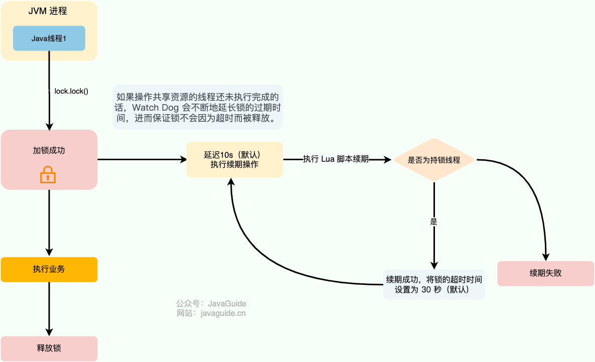

# ⭐️美团面试，拷打了两个多小时

这是一位西南大学 25 届读者的美团面经，目前已经 OC。

## 面试情况
+ 岗位：Java 开发
+ 部门：美团到家

整体面试体验非常 Nice，面试官很有亲和力，很耐心的解答我不清楚的问题，对美团好感 + n！！！

9.4 一面 9.9 二面 ，9.12 HR 面，已 OC。

一面和二面一共拷打的两个多小时。

运气真的是爆棚了！说实话，我并不是觉得自己的技术有多强，真没想到能在差不多一周的时间内“速通”美团。每一轮面试结束时，我都觉得自己可能没戏了，但没过多久又收到了下一轮的邀请。甚至到现在，我仍然觉得，这个 offer 除了运气，真的没有更合理的解释。


这里分享一下一二面比较典型的问题，一面更多的是考察基础，二面主要问实习和项目，八股问相对较少，但也会涉及一点。

问的问题非常多，这里仅对面试中涉及到的最重要问的题进行总结（详细答案由 Guide 补充）。

我主要总结的是 Java 基础、MySQL 、Redis 和场景题，这些是我认为最重要的部分，问的问题都比较典型。JVM、操作系统、计算机网络等知识点也有问，但问的较少，由于篇幅问题这里就省略了。

## Java 基础
### final, finalize, finally 之间的区别
+ `final` 用于声明常量、不可重写的方法和不可继承的类。
+ `finalize()` 是 `Object` 类的一个方法，用于在对象被垃圾回收之前执行清理工作，但它已被标记为过时，不建议使用。
+ `finally` 用于定义无论是否发生异常都会执行的代码块，通常用于释放资源。

### 一个任务需要依赖另外两个任务执行完之后再执行，怎么设计？
这种任务编排场景非常适合通过`CompletableFuture`实现。这里假设要实现 T3 在 T2 和 T1 执行完后执行。

代码如下（这里为了简化代码，用到了 Hutool 的线程工具类 `ThreadUtil` 和日期时间工具类 `DateUtil`）：

```java
// T1
CompletableFuture<Void> futureT1 = CompletableFuture.runAsync(() -> {
    System.out.println("T1 is executing. Current time：" + DateUtil.now());
    // 模拟耗时操作
    ThreadUtil.sleep(1000);
});
// T2
CompletableFuture<Void> futureT2 = CompletableFuture.runAsync(() -> {
    System.out.println("T2 is executing. Current time：" + DateUtil.now());
    ThreadUtil.sleep(1000);
});

// 使用allOf()方法合并T1和T2的CompletableFuture，等待它们都完成
CompletableFuture<Void> bothCompleted = CompletableFuture.allOf(futureT1, futureT2);
// 当T1和T2都完成后，执行T3
bothCompleted.thenRunAsync(() -> System.out.println("T3 is executing after T1 and T2 have completed.Current time：" + DateUtil.now()));
// 等待所有任务完成，验证效果
ThreadUtil.sleep(3000);
```

通过 `CompletableFuture` 的 `allOf()`这个静态方法来并行运行 T1 和 T2 。当 T1 和 T2 都完成后，再利用 `thenRunAsync()`方法执行 T3。

### 如果有一个任务失败了，你如何处理异常？
使用 `CompletableFuture`的时候一定要以正确的方式进行异常处理，避免异常丢失或者出现不可控问题。

下面是一些建议：

+ 使用 `whenComplete` 方法可以在任务完成时触发回调函数，并正确地处理异常，而不是让异常被吞噬或丢失。
+ 使用 `exceptionally` 方法可以处理异常并重新抛出，以便异常能够传播到后续阶段，而不是让异常被忽略或终止。
+ 使用 `handle` 方法可以处理正常的返回结果和异常，并返回一个新的结果，而不是让异常影响正常的业务逻辑。
+ 使用 `CompletableFuture.allOf` 方法可以组合多个 `CompletableFuture`，并统一处理所有任务的异常，而不是让异常处理过于冗长或重复。
+ ……

`CompletableFuture` 的详细介绍可以阅读这篇文章：[从 5s 到 0.5s！看看人家的 CompletableFuture 异步任务优化技巧，确实优雅！](https://mp.weixin.qq.com/s/L5RLrWTzEr_qVXoMQuYedg)。

### 你在使用 CompletableFuture 的时候为什么要自定义线程池？
`CompletableFuture` 默认使用全局共享的 `ForkJoinPool.commonPool()` 作为执行器，所有未指定执行器的异步任务都会使用该线程池。这意味着应用程序、多个库或框架（如 Spring、第三方库）若都依赖 `CompletableFuture`，默认情况下它们都会共享同一个线程池。

虽然 `ForkJoinPool` 效率很高，但当同时提交大量任务时，可能会导致资源竞争和线程饥饿，进而影响系统性能。

为避免这些问题，建议为 `CompletableFuture` 提供自定义线程池，带来以下优势：

+ 隔离性：为不同任务分配独立的线程池，避免全局线程池资源争夺。
+ 资源控制：根据任务特性调整线程池大小和队列类型，优化性能表现。
+ 异常处理：通过自定义 `ThreadFactory` 更好地处理线程中的异常情况。

```java
private ThreadPoolExecutor executor = new ThreadPoolExecutor(10, 10,
        0L, TimeUnit.MILLISECONDS,
        new LinkedBlockingQueue<Runnable>());

CompletableFuture.runAsync(() -> {
     //...
}, executor);
```

### 内置线程池有哪些？
通过`Executors`工具类可以创建多种类型的线程池，包括：

+ `FixedThreadPool`：固定线程数量的线程池。该线程池中的线程数量始终不变。当有一个新的任务提交时，线程池中若有空闲线程，则立即执行。若没有，则新的任务会被暂存在一个任务队列中，待有线程空闲时，便处理在任务队列中的任务。
+ `SingleThreadExecutor`： 只有一个线程的线程池。若多余一个任务被提交到该线程池，任务会被保存在一个任务队列中，待线程空闲，按先入先出的顺序执行队列中的任务。
+ `CachedThreadPool`： 可根据实际情况调整线程数量的线程池。线程池的线程数量不确定，但若有空闲线程可以复用，则会优先使用可复用的线程。若所有线程均在工作，又有新的任务提交，则会创建新的线程处理任务。所有线程在当前任务执行完毕后，将返回线程池进行复用。
+ `ScheduledThreadPool`：给定的延迟后运行任务或者定期执行任务的线程池。

### 为什么不直接使用内置线程池？
在《阿里巴巴 Java 开发手册》“并发处理”这一章节，明确指出线程资源必须通过线程池提供，不允许在应用中自行显式创建线程。

**为什么呢？**

> 使用线程池的好处是减少在创建和销毁线程上所消耗的时间以及系统资源开销，解决资源不足的问题。如果不使用线程池，有可能会造成系统创建大量同类线程而导致消耗完内存或者“过度切换”的问题。
>

另外，《阿里巴巴 Java 开发手册》中强制线程池不允许使用 `Executors` 去创建，而是通过 `ThreadPoolExecutor` 构造函数的方式，这样的处理方式让写的同学更加明确线程池的运行规则，规避资源耗尽的风险

`Executors` 返回线程池对象的弊端如下：

+ `FixedThreadPool` 和 `SingleThreadExecutor`:使用的是有界阻塞队列是 `LinkedBlockingQueue` ，其任务队列的最大长度为 `Integer.MAX_VALUE` ，可能堆积大量的请求，从而导致 OOM。
+ `CachedThreadPool`:使用的是同步队列 `SynchronousQueue`, 允许创建的线程数量为 `Integer.MAX_VALUE` ，如果任务数量过多且执行速度较慢，可能会创建大量的线程，从而导致 OOM。
+ `ScheduledThreadPool` 和 `SingleThreadScheduledExecutor` :使用的无界的延迟阻塞队列 `DelayedWorkQueue` ，任务队列最大长度为 `Integer.MAX_VALUE` ，可能堆积大量的请求，从而导致 OOM。

```java
// 有界队列 LinkedBlockingQueue
public static ExecutorService newFixedThreadPool(int nThreads) {

    return new ThreadPoolExecutor(nThreads, nThreads,0L, TimeUnit.MILLISECONDS,new LinkedBlockingQueue<Runnable>());

}

// 无界队列 LinkedBlockingQueue
public static ExecutorService newSingleThreadExecutor() {

    return new FinalizableDelegatedExecutorService (new ThreadPoolExecutor(1, 1,0L, TimeUnit.MILLISECONDS,new LinkedBlockingQueue<Runnable>()));

}

// 同步队列 SynchronousQueue，没有容量，最大线程数是 Integer.MAX_VALUE`
public static ExecutorService newCachedThreadPool() {

    return new ThreadPoolExecutor(0, Integer.MAX_VALUE,60L, TimeUnit.SECONDS,new SynchronousQueue<Runnable>());

}

// DelayedWorkQueue（延迟阻塞队列）
public static ScheduledExecutorService newScheduledThreadPool(int corePoolSize) {
    return new ScheduledThreadPoolExecutor(corePoolSize);
}
public ScheduledThreadPoolExecutor(int corePoolSize) {
    super(corePoolSize, Integer.MAX_VALUE, 0, NANOSECONDS,
          new DelayedWorkQueue());
}
```

### 线程池的参数有哪些？最大线程数和核心线程数有什么区别？
`ThreadPoolExecutor` 3 个最重要的参数：

+ `corePoolSize`** :** 任务队列未达到队列容量时，最大可以同时运行的线程数量。
+ `maximumPoolSize`** :** 任务队列中存放的任务达到队列容量的时候，当前可以同时运行的线程数量变为最大线程数。
+ `workQueue`**:** 新任务来的时候会先判断当前运行的线程数量是否达到核心线程数，如果达到的话，新任务就会被存放在队列中。

`ThreadPoolExecutor`其他常见参数 :

+ `keepAliveTime`:线程池中的线程数量大于 `corePoolSize` 的时候，如果这时没有新的任务提交，核心线程外的线程不会立即销毁，而是会等待，直到等待的时间超过了 `keepAliveTime`才会被回收销毁。
+ `unit` : `keepAliveTime` 参数的时间单位。
+ `threadFactory` :executor 创建新线程的时候会用到。
+ `handler` :饱和策略。关于饱和策略下面单独介绍一下。

下面这张图可以加深你对线程池中各个参数的相互关系的理解（图片来源：《Java 性能调优实战》）：


当任务队列未满时，最多可以同时运行的线程数量就是核心线程数。任务队列中存放的任务满了之后，最多可以同时运行的线程数量就是最大线程数。

### JDK 内置的常用的锁有哪些？
+ `synchronized`：Java 中的一个关键字，翻译成中文是同步的意思，主要解决的是多个线程之间访问资源的同步性，可以保证被它修饰的方法或者代码块在任意时刻只能有一个线程执行。
+ `ReentrantLock`: 实现了 `Lock` 接口，是一个可重入且独占式的锁，和 `synchronized` 关键字类似。不过，`ReentrantLock` 更灵活、更强大，增加了轮询、超时、中断、公平锁和非公平锁等高级功能。
+ `ReentrantReadWriteLock` ：实现了 `ReadWriteLock` ，是一个可重入的读写锁，既可以保证多个线程同时读的效率，同时又可以保证有写入操作时的线程安全。
+ `StampedLock`： JDK 1.8 引入的性能更好的读写锁，不可重入且不支持条件变量 `Condition`。不同于一般的 `Lock` 类，`StampedLock` 并不是直接实现 `Lock`或 `ReadWriteLock`接口，而是基于 **CLH 锁** 独立实现的（AQS 也是基于这玩意）。

### synchronized 和 ReentrantLock 有什么区别？
#### 两者都是可重入锁
**可重入锁** 也叫递归锁，指的是线程可以再次获取自己的内部锁。比如一个线程获得了某个对象的锁，此时这个对象锁还没有释放，当其再次想要获取这个对象的锁的时候还是可以获取的，如果是不可重入锁的话，就会造成死锁。

JDK 提供的所有现成的 `Lock` 实现类，包括 `synchronized` 关键字锁都是可重入的。

在下面的代码中，`method1()` 和 `method2()`都被 `synchronized` 关键字修饰，`method1()`调用了`method2()`。

```java
public class SynchronizedDemo {
    public synchronized void method1() {
        System.out.println("方法1");
        method2();
    }

    public synchronized void method2() {
        System.out.println("方法2");
    }
}
```

由于 `synchronized`锁是可重入的，同一个线程在调用`method1()` 时可以直接获得当前对象的锁，执行 `method2()` 的时候可以再次获取这个对象的锁，不会产生死锁问题。假如`synchronized`是不可重入锁的话，由于该对象的锁已被当前线程所持有且无法释放，这就导致线程在执行 `method2()`时获取锁失败，会出现死锁问题。

#### synchronized 依赖于 JVM 而 ReentrantLock 依赖于 API
`synchronized` 是依赖于 JVM 实现的，前面我们也讲到了 虚拟机团队在 JDK1.6 为 `synchronized` 关键字进行了很多优化，但是这些优化都是在虚拟机层面实现的，并没有直接暴露给我们。

`ReentrantLock` 是 JDK 层面实现的（也就是 API 层面，需要 lock() 和 unlock() 方法配合 try/finally 语句块来完成），所以我们可以通过查看它的源代码，来看它是如何实现的。

#### ReentrantLock 比 synchronized 增加了一些高级功能
相比`synchronized`，`ReentrantLock`增加了一些高级功能。主要来说主要有三点：

+ **等待可中断** : `ReentrantLock`提供了一种能够中断等待锁的线程的机制，通过 `lock.lockInterruptibly()` 来实现这个机制。也就是说正在等待的线程可以选择放弃等待，改为处理其他事情。
+ **可实现公平锁** : `ReentrantLock`可以指定是公平锁还是非公平锁。而`synchronized`只能是非公平锁。所谓的公平锁就是先等待的线程先获得锁。`ReentrantLock`默认情况是非公平的，可以通过 `ReentrantLock`类的`ReentrantLock(boolean fair)`构造方法来指定是否是公平的。
+ **可实现选择性通知（锁可以绑定多个条件）**: `synchronized`关键字与`wait()`和`notify()`/`notifyAll()`方法相结合可以实现等待/通知机制。`ReentrantLock`类当然也可以实现，但是需要借助于`Condition`接口与`newCondition()`方法。

如果你想使用上述功能，那么选择 `ReentrantLock` 是一个不错的选择。

## MySQL
### MySQL 中 SELECT 语句执行流程
面试美团的同学一定要重视这个问题，这个问题在美团面试中出现的频率还是非常高的。

MySQL 的基础架构：


查询语句语句如下：

```sql
select * from tb_student  A where A.age='18' and A.name=' 张三 ';
```

我们分析下这个语句的执行流程：

1. 先检查该语句是否有权限，如果没有权限，直接返回错误信息，如果有权限，在 MySQL8.0 版本以前，会先查询缓存，以这条 SQL 语句为 key 在内存中查询是否有结果，如果有直接缓存，如果没有，执行下一步。
2. 通过分析器进行词法分析，提取 SQL 语句的关键元素，比如提取上面这个语句是查询 select，提取需要查询的表名为 tb_student，需要查询所有的列，查询条件是这个表的 id='1'。然后判断这个 SQL 语句是否有语法错误，比如关键词是否正确等等，如果检查没问题就执行下一步。
3. 接下来就是优化器进行确定执行方案，上面的 SQL 语句，可以有两种执行方案：a.先查询学生表中姓名为“张三”的学生，然后判断是否年龄是 18。b.先找出学生中年龄 18 岁的学生，然后再查询姓名为“张三”的学生。那么优化器根据自己的优化算法进行选择执行效率最好的一个方案（优化器认为，有时候不一定最好）。那么确认了执行计划后就准备开始执行了。
4. 进行权限校验，如果没有权限就会返回错误信息，如果有权限就会调用数据库引擎接口，返回引擎的执行结果。

详细介绍可以阅读这篇文章：[MySQL 中 SELECT 语句执行流程？](https://mp.weixin.qq.com/s/QevKTIIadpguyWxm7od6SQ)

### 为什么 MySQL 没有使用哈希表作为索引的数据结构呢？
主要是因为 Hash 索引不支持顺序和范围查询。假如我们要对表中的数据进行排序或者进行范围查询，那 Hash 索引可就不行了。并且，每次 IO 只能取一个。

### SELECT * 会导致索引失效吗？
`SELECT *` 不会直接导致索引失效（如果不走索引大概率是因为 where 查询范围过大导致的），但它可能会带来一些其他的性能问题比如造成网络传输和数据处理的浪费、无法使用索引覆盖。

### 索引失效的原因有哪些？
1. 创建了组合索引，但查询条件未遵守最左匹配原则;
2. 在索引列上进行计算、函数、类型转换等操作;
3. 以 % 开头的 LIKE 查询比如 `LIKE '%abc';`;
4. 查询条件中使用 OR，且 OR 的前后条件中有一个列没有索引，涉及的索引都不会被使用到;
5. IN 的取值范围较大时会导致索引失效，走全表扫描(NOT IN 和 IN 的失效场景相同);
6. 发生[隐式转换](https://javaguide.cn/database/mysql/index-invalidation-caused-by-implicit-conversion.html);

### 如何分析语句是否走索引查询？
我们可以使用 `EXPLAIN` 命令来分析 SQL 的 **执行计划** ，这样就知道语句是否命中索引了。执行计划是指一条 SQL 语句在经过 MySQL 查询优化器的优化会后，具体的执行方式。

`EXPLAIN` 并不会真的去执行相关的语句，而是通过 **查询优化器** 对语句进行分析，找出最优的查询方案，并显示对应的信息。

`EXPLAIN` 的输出格式如下：

```sql
mysql> EXPLAIN SELECT `score`,`name` FROM `cus_order` ORDER BY `score` DESC;
+----+-------------+-----------+------------+------+---------------+------+---------+------+--------+----------+----------------+
| id | select_type | table     | partitions | type | possible_keys | key  | key_len | ref  | rows   | filtered | Extra          |
+----+-------------+-----------+------------+------+---------------+------+---------+------+--------+----------+----------------+
|  1 | SIMPLE      | cus_order | NULL       | ALL  | NULL          | NULL | NULL    | NULL | 997572 |   100.00 | Using filesort |
+----+-------------+-----------+------------+------+---------------+------+---------+------+--------+----------+----------------+
1 row in set, 1 warning (0.00 sec)
```

各个字段的含义如下：

| **列名** | **含义** |
| --- | --- |
| id | SELECT 查询的序列标识符 |
| select_type | SELECT 关键字对应的查询类型 |
| table | 用到的表名 |
| partitions | 匹配的分区，对于未分区的表，值为 NULL |
| type | 表的访问方法 |
| possible_keys | 可能用到的索引 |
| key | 实际用到的索引 |
| key_len | 所选索引的长度 |
| ref | 当使用索引等值查询时，与索引作比较的列或常量 |
| rows | 预计要读取的行数 |
| filtered | 按表条件过滤后，留存的记录数的百分比 |
| Extra | 附加信息 |


篇幅问题，我这里只是简单介绍了一下 MySQL 执行计划，详细介绍请看：[MySQL 执行计划分析](https://javaguide.cn/database/mysql/how-sql-executed-in-mysql.html)这篇文章。

## Redis
### Redis Lua 脚本执行满足原子性吗？
Redis 从 2.6 版本开始支持执行 Lua 脚本，它的功能和事务非常类似。我们可以利用 Lua 脚本来批量执行多条 Redis 命令，这些 Redis 命令会被提交到 Redis 服务器一次性执行完成，大幅减小了网络开销。

一段 Lua 脚本可以视作一条命令执行，一段 Lua 脚本执行过程中不会有其他脚本或 Redis 命令同时执行，保证了操作不会被其他指令插入或打扰。

不过，如果 Lua 脚本运行时出错并中途结束，出错之后的命令是不会被执行的。并且，出错之前执行的命令是无法被撤销的，无法实现类似关系型数据库执行失败可以回滚的那种原子性效果。因此， **严格来说的话，通过 Lua 脚本来批量执行 Redis 命令实际也是不完全满足原子性的。**

如果想要让 Lua 脚本中的命令全部执行，必须保证语句语法和命令都是对的。

### 数据库和缓存一致性如何保证？
细说的话可以扯很多，但是我觉得其实没太大必要（小声 BB：很多解决方案我也没太弄明白）。我个人觉得引入缓存之后，如果为了短时间的不一致性问题，选择让系统设计变得更加复杂的话，完全没必要。

下面单独对 **Cache Aside Pattern（旁路缓存模式）** 来聊聊。

Cache Aside Pattern 中遇到写请求是这样的：更新 DB，然后直接删除 cache 。

如果更新数据库成功，而删除缓存这一步失败的情况的话，简单说两个解决方案：

1. **缓存失效时间变短（不推荐，治标不治本）**：我们让缓存数据的过期时间变短，这样的话缓存就会从数据库中加载数据。另外，这种解决办法对于先操作缓存后操作数据库的场景不适用。
2. **增加 cache 更新重试机制（常用）**：如果 cache 服务当前不可用导致缓存删除失败的话，我们就隔一段时间进行重试，重试次数可以自己定。如果多次重试还是失败的话，我们可以把当前更新失败的 key 存入队列中，等缓存服务可用之后，再将缓存中对应的 key 删除即可。

详细介绍可以参考这篇文章：[缓存和数据库一致性问题，看这篇就够了 - 水滴与银弹](https://mp.weixin.qq.com/s?__biz=MzIyOTYxNDI5OA==&mid=2247487312&idx=1&sn=fa19566f5729d6598155b5c676eee62d&chksm=e8beb8e5dfc931f3e35655da9da0b61c79f2843101c130cf38996446975014f958a6481aacf1&scene=178&cur_album_id=1699766580538032128#rd)。

### Redisson 分布式锁实现
Redisson 是一个开源的 Java 语言 Redis 客户端，提供了很多开箱即用的功能，不仅仅包括多种分布式锁的实现。并且，Redisson 还支持 Redis 单机、Redis Sentinel、Redis Cluster 等多种部署架构。

Redisson 中的分布式锁自带自动续期机制，使用起来非常简单，原理也比较简单，其提供了一个专门用来监控和续期锁的 **Watch Dog（ 看门狗）**，如果操作共享资源的线程还未执行完成的话，Watch Dog 会不断地延长锁的过期时间，进而保证锁不会因为超时而被释放。



看门狗名字的由来于 `getLockWatchdogTimeout()` 方法，这个方法返回的是看门狗给锁续期的过期时间，默认为 30 秒（[redisson-3.17.6](https://github.com/redisson/redisson/releases/tag/redisson-3.17.6)）。

```java
//默认 30秒，支持修改
private long lockWatchdogTimeout = 30 * 1000;

public Config setLockWatchdogTimeout(long lockWatchdogTimeout) {
    this.lockWatchdogTimeout = lockWatchdogTimeout;
    return this;
}
public long getLockWatchdogTimeout() {
   return lockWatchdogTimeout;
}
```

`renewExpiration()` 方法包含了看门狗的主要逻辑：

```java
private void renewExpiration() {
         //......
        Timeout task = commandExecutor.getConnectionManager().newTimeout(new TimerTask() {
            @Override
            public void run(Timeout timeout) throws Exception {
                //......
                // 异步续期，基于 Lua 脚本
                CompletionStage<Boolean> future = renewExpirationAsync(threadId);
                future.whenComplete((res, e) -> {
                    if (e != null) {
                        // 无法续期
                        log.error("Can't update lock " + getRawName() + " expiration", e);
                        EXPIRATION_RENEWAL_MAP.remove(getEntryName());
                        return;
                    }

                    if (res) {
                        // 递归调用实现续期
                        renewExpiration();
                    } else {
                        // 取消续期
                        cancelExpirationRenewal(null);
                    }
                });
            }
         // 延迟 internalLockLeaseTime/3（默认 10s，也就是 30/3） 再调用
        }, internalLockLeaseTime / 3, TimeUnit.MILLISECONDS);

        ee.setTimeout(task);
    }
```

默认情况下，每过 10 秒，看门狗就会执行续期操作，将锁的超时时间设置为 30 秒。看门狗续期前也会先判断是否需要执行续期操作，需要才会执行续期，否则取消续期操作。

Watch Dog 通过调用 `renewExpirationAsync()` 方法实现锁的异步续期：

```java
protected CompletionStage<Boolean> renewExpirationAsync(long threadId) {
    return evalWriteAsync(getRawName(), LongCodec.INSTANCE, RedisCommands.EVAL_BOOLEAN,
            // 判断是否为持锁线程，如果是就执行续期操作，就锁的过期时间设置为 30s（默认）
            "if (redis.call('hexists', KEYS[1], ARGV[2]) == 1) then " +
                    "redis.call('pexpire', KEYS[1], ARGV[1]); " +
                    "return 1; " +
                    "end; " +
                    "return 0;",
            Collections.singletonList(getRawName()),
            internalLockLeaseTime, getLockName(threadId));
}
```

可以看出， `renewExpirationAsync` 方法其实是调用 Lua 脚本实现的续期，这样做主要是为了保证续期操作的原子性。

我这里以 Redisson 的分布式可重入锁 `RLock` 为例来说明如何使用 Redisson 实现分布式锁：

```java
// 1.获取指定的分布式锁对象
RLock lock = redisson.getLock("lock");
// 2.拿锁且不设置锁超时时间，具备 Watch Dog 自动续期机制
lock.lock();
// 3.执行业务
...
// 4.释放锁
lock.unlock();
```

只有未指定锁超时时间，才会使用到 Watch Dog 自动续期机制。

```java
// 手动给锁设置过期时间，不具备 Watch Dog 自动续期机制
lock.lock(10, TimeUnit.SECONDS);
```

如果使用 Redis 来实现分布式锁的话，还是比较推荐直接基于 Redisson 来做的。

### 如果缓存的数据量太大，内存不够用怎么办？
1. **垂直扩展（增加硬件配置）：** 最直接的方式是升级现有 Redis 服务器的内存容量，选择配置更高、内存更大的服务器来部署 Redis 实例。 不过，这会受到硬件成本和单机内存容量上限的限制。
2. **水平扩展（Redis 切片集群）：** Redis 切片集群就是部署多台 Redis 主节点（master），这些节点之间平等，并没有主从之说，同时对外提供读/写服务。缓存的数据库相对均匀地分布在这些 Redis 实例上，客户端的请求通过路由规则转发到目标 master 上。Redis 切片集群对于横向扩展非常友好，只需要增加 Redis 节点到集群中即可。

### Redis 切片集群如何实现？
Redis 3.0 官方推出了分片集群解决方案 Redis Cluster 。经过多个版本的持续完善，Redis Cluster 成为 Redis 切片集群的首选方案，满足绝大部分高并发业务场景需求。

如果项目使用的是 Redis 3.0 之前的版本，可以使用 Twemproxy、Codis 这类开源分片集群方案。Twemproxy、Codis 就相当于是 Proxy 层，负责维护路由规则，实现负载均衡。


Redis Cluster 的详细介绍推荐阅读这篇文章：


[Redis Cluster：缓存的数据量太大怎么办？](https://www.yuque.com/snailclimb/mf2z3k/ikf0l2)

## 场景题：千万数据查询优化
题目描述：外卖系统，一天一千万条数据，用户需要查到近 30 天的数据，商家也要查询到 30 天的数据，如何优化？

数据库的优化方式有很多，但这个问题应该是主要在考察数据冷热分离。

数据冷热分离是指根据数据的访问频率和业务重要性，将数据分为冷数据和热数据，冷数据一般存储在存储在低成本、低性能的介质中，热数据高性能存储介质中。

**冷热数据定义:**

+ **热数据:** 指访问频率高，最近被访问过的数据，例如最近 30 天的订单数据。
+ **冷数据:** 指访问频率低，很久没有被访问过的数据，例如更早之前的历史订单数据。

冷数据的存储要求主要是容量大，成本低，可靠性高，访问速度可以适当牺牲。

冷数据存储方案：

+ 中小厂：直接使用 MySQL/PostgreSQL 即可（不改变数据库选型和项目当前使用的数据库保持一致），比如新增一张表来存储某个业务的冷数据或者使用单独的冷库来存放冷数据（涉及跨库查询，增加了系统复杂性和维护难度）
+ 大厂：Hbase（常用）、RocksDB、Doris、Cassandra

如果公司成本预算足的话，也可以直接上 TiDB 这种分布式关系型数据库，直接一步到位。TiDB 6.0 正式支持数据冷热存储分离，可以降低 SSD 使用成本。使用 TiDB 6.0 的数据放置功能，可以在同一个集群实现海量数据的冷热存储，将新的热数据存入 SSD，历史冷数据存入 HDD。

对于热数据来说，在数据量和访问压力都在数据库可承受范围内的情况下，可以不做特殊处理。。不过，如果对性能要求非常高，可以考虑下面这些优化手段：

1. **使用高性能存储介质 SSD:** SSD 的随机读写速度远高于机械硬盘，可以显著提升数据库的读写性能。
2. **使用内存数据库如 Redis：** 完全使用缓存存储 30 天的外卖系统数据不太合适。一天一千万条数据，30 天就是 3 亿条数据，即使做了数据压缩，对内存的占用也非常巨大，一般的缓存系统难以承受。不过，可以缓存部分高频查询的热数据，例如用户/商家最近 1 小时/24 小时的订单信息。
3. **为常用查询字段建立索引:** 索引可以加速数据库的查询速度，避免全表扫描。


> 更新: 2024-09-23 18:52:34  
> 原文: <https://www.yuque.com/snailclimb/mf2z3k/zpcvgrv2m3a4tifl>