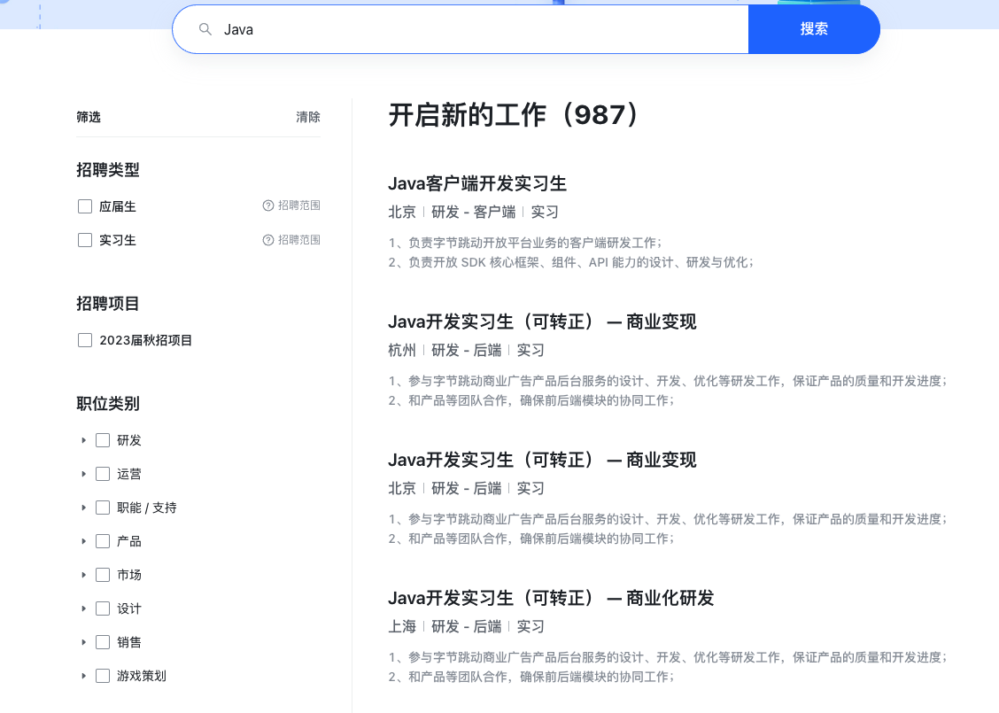

# 字节跳动 Java 后端实习面经（附参考答案）

这是一位读者的 2022  字节跳动 Java 后端实习面经，已经拿到了 offer。字节虽然用 Go 居多，但也是有挺多 Java 岗位的招聘。

我对他在面试遇到的问题进行了整理并给出了详细的参考答案，希望对准备面试的小伙伴有帮助！另外，建议准备面试的小伙伴一定要多看一些面经，根据自己的简历多多自测，这对于面试非常有帮助！

## 个人情况

末流 211，软件工程专业，2023 届毕业生。本来没抱多大希望，没想到最后过了。

## 一面(60分钟)

1. 自我介绍。
2. 问项目：登录鉴权是怎么做的？为什么采用 JWT 的方式？有什么好处？如何防止 Token 被篡改？
3. 问项目：如何使用缓存的？技术选型的考虑？为什么要用 Sorted Set 实现排行榜？Redis 数据同步和数据迁移如何做？
4. 问项目：如何防止表单重复提交？
5. 问 Spring：怎么理解 AOP的？你在项目中是怎么使用的？Spring AOP 和 AspectJ AOP 有什么区别？
6. 问线程池：如何理解线程池、参数、拒绝策略、原理？你的项目是如何使用线程池的？如果然你设计一个线程池，你会怎么做？
7. 问 Java 并发（这块问的太深入了，顶不住啊。。。）：进程和线程，了解协程吗？JMM 的理解，作用。happens-before 原则的理解，作用。Java 里面的锁你知道哪些？ synchronized 关键字的理解、原理、锁升级过程。AQS 了解、原理。`ReentrantLock` 源码。`ThreadLocal` 理解、原理、内存泄露问题。
8. 继续问 Java 并发：手写 DCL（Double Check Lock） 线程安全方法。为什么需要加 volatile?  volatile 的作用、底层原理。
9. 问计算机网络：  HTTPS 和HTTP 区别、 HTTPS 加密过程。
10. [Leetcode 199. 二叉树的右视图](https://leetcode.cn/problems/binary-tree-right-side-view)
11. ......

**参考答案** （根据面试问题的顺序排序，部分微信外链无法直接打开，建议文末阅读原文） ：

+ [虾皮二面：什么是 JWT? 如何基于 JWT 进行身份验证？](https://mp.weixin.qq.com/s/NCbNKZcM7EiLM7tuF3ADxw)、[虾皮二面后续：JWT 身份认证优缺点](https://mp.weixin.qq.com/s/TrgG9oyNfPg2qa_7fpDY4w)
+ [Redis 5 种基础数据结构总结](https://mp.weixin.qq.com/s?__biz=Mzg2OTA0Njk0OA==&mid=2247526650&idx=1&sn=15042ffbe9ef97cccafbe9e4c2de5dad&chksm=cea12731f9d6ae276dee602e769b491e8979068c3f633ba95ea0338cd34dfc613941522e56f2&token=973133388&lang=zh_CN#rd)、[Redis 数据同步和数据迁移如何做？](https://cloud.tencent.com/developer/article/1780093)
+ [招银网络一面：AOP 了解吗？有什么用？切面执行顺序如何控制？](https://mp.weixin.qq.com/s/NUnaiVWADxzDOYPQdAwm6w)
+ [Java 线程池详解](https://javaguide.cn/java/concurrent/java-thread-pool-summary.html)、[面试题 -- 如何设计一个线程池](https://segmentfault.com/a/1190000040631931)
+ [JMM（Java 内存模型）详解](https://javaguide.cn/java/concurrent/jmm.html)
+ [AQS 详解](https://javaguide.cn/java/concurrent/aqs.html#aqs-%E7%AE%80%E5%8D%95%E4%BB%8B%E7%BB%8D)
+ [Java 并发常见面试题总结（上）](https://javaguide.cn/java/concurrent/java-concurrent-questions-01.html)、[Java 并发常见面试题总结（中）](https://javaguide.cn/java/concurrent/java-concurrent-questions-02.html)
+ [ReentrantLock源码详细解读](https://zhuanlan.zhihu.com/p/65727594)
+ [HTTP vs HTTPS（应用层）](https://javaguide.cn/cs-basics/network/http&https.html)

## 二面（50分钟）

1. 自我介绍。
2. 问计算机网络：  HTTPS 和HTTP 区别、SSL/TLS 的工作原理、中间人攻击了解吗？
3. 问计算机网络（比较深入，有一些没有回答上来，还是要多补补基础）：TCP 与 UDP 的区别，TCP 三次握手四次挥手，`TIME-WAIT` 和 `CLOSE-WAIT` 是干什么的？ 为什么要三次握手两次不行吗？有大量连接处于 `TIME-WAIT` 的原因？ TCP 是长连接还是短连接？
4. 问计算机网络：从输入URL到浏览器显示页面的流程。
5. 问数据库： MySQL 索引的理解、底层数据结构。如何看 SQL 语句是否使用了索引？
6. 问数据库：如何理解事务？表级锁和行级锁的理解，幻读、脏读问题的解决。
7. 问 JVM： GC 如何判断回收的垃圾对象？GC 算法有哪些？Minor Gc 和 Full GC 有什么不同呢？ZGC 垃圾回收器了解吗？
8. 问 JVM：双亲委派模型的理解，有没有在项目中实践过自定义类加载器。
9. 问场景题：几十G的数据都是URL，内存空间只有1G，磁盘空间无限，统计频率最高的Top 10；
10. [Leetcode 32. 最长有效括号](https://leetcode-cn.com/problems/longest-valid-parentheses/)、[Leetcode 110. 平衡二叉树](https://leetcode.cn/problems/balanced-binary-tree/)
11. ......

**参考答案** （根据面试问题的顺序排序，部分微信外链无法直接打开，建议文末阅读原文） ：

+ [HTTP vs HTTPS（应用层）](https://javaguide.cn/cs-basics/network/http&https.html)、[你连 HTTPS 原理都不懂,还讲“中间人攻击”?](https://juejin.cn/post/6844904065227292685)
+ [TCP 与 UDP 的区别？](https://mp.weixin.qq.com/s/resXoYuUnkx6C6EeYCge_w)、[TCP 为什么要三次握手?](https://mp.weixin.qq.com/s/LHaImSd-sTvt7QWqisE21w)
+ [从输入URL到浏览器显示页面的流程](https://nyimac.gitee.io/2020/12/10/URL%E8%AE%BF%E9%97%AE%E6%9C%8D%E5%8A%A1%E5%99%A8%E6%B5%81%E7%A8%8B/)
+ [深入理解 MySQL 索引底层原理](https://mp.weixin.qq.com/s/qHJiTjpvDikFcdl9SRL97Q)、[最完整的Explain总结，SQL优化不再困难](https://mp.weixin.qq.com/s/twTghH8wTA_0uZghOdawkw)
+ [MySQL 事务的默认隔离级别是什么?可以解决幻读问题么？](https://mp.weixin.qq.com/s?__biz=Mzg2OTA0Njk0OA==&mid=2247521090&idx=2&sn=5b4c370ff7f0b7e8ad63d890bf47cb8d&chksm=cea1dc89f9d6559f13962afaef776d042d1f17fc8bb3c03ef7c2c69380908611ba155ecc918d&scene=178&cur_album_id=1352302538565189634#rd)、[MySQL 中有哪些锁？表级锁和行级锁有什么区别](https://mp.weixin.qq.com/s?__biz=Mzg2OTA0Njk0OA==&mid=2247523718&idx=1&sn=56f8e746f3fd3d4175449c9a2b0ec7b4&chksm=cea1d24df9d65b5b582d198b4c349acb96131001c09a86d82d77338b40baf65077ae32e391e1&token=371859028&lang=zh_CN&scene=21#wechat_redirect)
+ [JVM 垃圾回收详解](https://javaguide.cn/java/jvm/jvm-garbage-collection.html)、[新一代垃圾回收器ZGC的探索与实践](https://mp.weixin.qq.com/s/ag5u2EPObx7bZr7hkcrOTg)
+ [类加载器详解](https://javaguide.cn/java/jvm/classloader.html)、[JVM自定义类加载器在代码扩展性的实践](https://mp.weixin.qq.com/s/ACvkfcu6LDjoPpyBnPWMJg)
+ [10 道 BAT 大厂海量数据面试题（附题解+方法总结）](https://mp.weixin.qq.com/s/rjGqxUvrEqJNlo09GrT1Dw)、[海量大数据处理面试题和思路总结](https://mp.weixin.qq.com/s/LA6KNG5CgLUvICjFhQ3O0A)

## 三面

这一面问的技术问题变少了很多，更多的是和面试官交流技术思维。

1. 自我介绍。
2. 你感觉你一二面表现的怎么样？
3. 除了 Java 你还学习过什么其他的编程语言么？我说了 C 语言。面试官紧接着让我说说 Java 和 C 的使用感受，应用场景。
4. 爬虫有了解吗？大学的时候写过爬虫没有？如何构建一个爬虫代理服务？
5. 分布式缓存设计、缓存问题解决思路（雪崩、穿透）。
6. 自己做过印象最深的一个项目，学到了什么。
7. [Leetcode 44.二叉树每层找最大值](https://leetcode.cn/problems/hPov7L/)
8. ......

**参考答案** （根据面试问题的顺序排序，部分微信外链无法直接打开，建议文末阅读原文） ：

+ [如何构建一个爬虫代理服务？](http://kaito-kidd.com/2015/11/02/proxies-service/)
+ [解析分布式系统的缓存设计](https://segmentfault.com/a/1190000041689802)

## HR 面

随便聊了一下。

1. 自我介绍。
2. 项目里面做了什么，担任什么角色，最有成就感的事情。
3. 对于公司的了解？还面了哪些公司？为什么要选择实习？
4. 平时是怎么学习的？
5. 你有什么要问我的？
6. 平时除了技术喜欢干什么？
7. ......

## 总结

字节的面试难度还是比较大的，不过，效率很高，体验也很不错。几个面试官给我的感觉还是不错的，一看就是做技术的，不整一些虚头巴脑的东西。

面试之前，我一直对照着 JavaGuide 网站（地址：javaguide.cn）和 [《Java 面试指北》](https://mp.weixin.qq.com/s?__biz=Mzg2OTA0Njk0OA==&mid=2247527615&idx=3&sn=3df279f2804f170ebc8306aa356afd42&scene=21#wechat_redirect)复习知识点，准备对应的八股文。Java 后端的知识点比较多，我主要是根据自己的简历来进行针对性地复习。面试的时候，不出意外，面试官问的几乎都是简历上写的东西。

> 更新: 2022-08-12 17:08:21  
> 原文: <https://www.yuque.com/snailclimb/mf2z3k/ls6wp0>