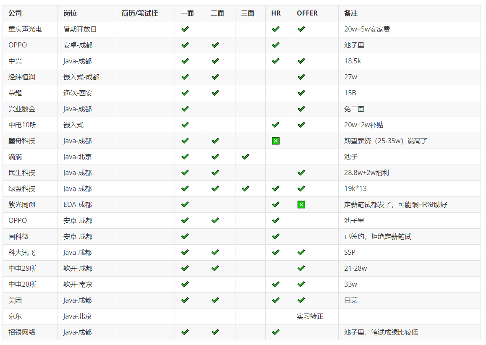

# 秋招拿下科大讯飞 SSP 经验分享

这是一位学弟热乎的面经。这位学弟本 211 硕 985，秋招大大小小拿了十几个 offer，三方签了荣耀 15b，两方签了科大讯飞（薪资等同 15a），京东实习转正。

这份面经非常详细，希望对你有帮助！

下面是正文。

## 个人情况

本 211 硕 985，半科班，一段研究所 C++实习，一段京东 Java 实习。几个专利，几个小比赛。秋招主要面向中小厂拿了十几个 OFFER，终签约科大讯飞(SSP,40W 左右)。

## 时间路线表

下面是我从开始学习直到现在的**时间路线表**。

1. 2020 年十月到 2021 年五月学习 C++,后续转为学习 Java 后端。
2. 2021 年暑期研究所实习 C++。
3. 2021 年七月开始学习力扣，至 2022 年 3 月初，300 余道；截止目前近 500 道。学习力扣先看了 B 站 UP 主爱学习的是饲养员的入门课程，另外就是左程云的课程。其他基本是依靠力扣官网的解答。开了一个季度的力扣会员。
4. 2021 年七月开始学习 Java 基础，集合，多线程，JavaWeb，SSM,SpringBoot。这些我基本是学习的尚硅谷的课程。当然也有一些是黑马程序员（例如 JUC、Java 集合）的。十月，开始了第一个项目：尚融宝。学习尚融宝我大致明白了 SpringBoot 怎么用，SSM 的一些基础知识，会一些 ElementUI 、Vue，NodeJs，EasyExcel 组件。以及对中间件 MySQL，Redis，单点登录有一定的了解。但尚融宝项目较大，其实我做了一半就面临找实习压力中途终止了。
5. 2022 年三月一日，开始了我秋招第一场面试，阿里云一面。我初生牛犊不怕虎，有很多没答上，我依照自己的想法试着猜测底层实现方式，面试官最后给我过了，并且对我进行了一个比较高了评价。然而，阿里云二面，没有这么幸运，由于八股根本没准备过，二十分钟草草结束了。
6. 2022 年三月，我开始学习八股文。我找实习期间的资料主要来自公众号代码界的小白、公众号 JavaGuide、美团技术博客、掘金和 CSDN 文章、UP 主跟着 Mic 学架构，以及牛客面经，[**知识星球**](https://mp.weixin.qq.com/s?__biz=Mzg2OTA0Njk0OA==&mid=2247530558&idx=1&sn=cb2ed58af806ee3d3d174ce5ae09c7e3&scene=21#wechat_redirect) 的 [**《Java 面试指北》**](https://mp.weixin.qq.com/s?__biz=Mzg2OTA0Njk0OA==&mid=2247530643&idx=2&sn=cf4855e15ea7c8a669c7896b8337292b&scene=21#wechat_redirect)。八股文的背诵主要通过面试加深印象，往往被面试官问住的八股你后续记忆是最清楚的。也许你这个时候还没准备好，那么试试面面小公司吧，面试小公司你可以大致了解到 Java 后端面试的重点集中在哪些地方。
7. 2022 年三月十日左右，面了一个西安的小公司，外企风格，一场面试手写了四个题，写出了三个半（最后一个是字典树）。我拿到了第一个 OFFER,但规模确实很小，或许并不是我想要的，我就拒了。不过给我找实习路上增加了信心。
8. 2022 年四月，我开始了第二个项目：牛客论坛。我选择牛客论坛的原因很简单：论坛具有一定的实用性，论坛包含的技术栈 MQ、ES 我还没了解过，以及 Spring 框架使用我不熟练。于是花了一个多月把牛客论坛做完了。同期，深入学习了 Redis 和 Mysql。
9. 2022 年四月，京东一面，面试官上来就是一道回溯题，四个场景，说能写几个场景写几个场景，但写题时间只有半小时。我写了第一个，第二个一直有问题，我同面试官讲“我可能做不完，我讲一下我的思路”。面试官安慰我“我还是希望你把第二个写出来，你可以 debug，多打印一下中间变量”。于是我找到了 arraylist 拷贝的时候我只拷贝了地址，后面改为了构造函数拷贝就对了。总共写了 2 个场景的代码，顺利地，一面过了，二面也过了。五月，HR OC。
10. 2022 年暑期，去京东实习了。在京东学习了很多，编码规范，部门的技术文章，组内系统的设计方案，每周的质量周会，跳点分析，以及实习导师对我严格的要求。实习期间主要负责做了一个并发场景下的组件，自己得到了锻炼。很幸运呆在一个氛围很不错的组，实习转正成功。同期，深入学习了 ES，独自开发过程中踩了 Spring 一些常见的坑。
11. 2022 年 7 月初，开始了我的秋招。我的意向工作地点是成都。秋招我主要是通过官网投递简历，部分意向一般的企业是通过牛客一键投递的，国企大多是用前程无忧投递，意向度较高的企业是通过官网投递保证能进招聘的系统里。秋招的过程中，系统学习了小林 Codeing 的 Http 协议、TCP/IP 协议、操作系统相关知识，一个名为“Java 全栈知识体系”的网站中的基础知识，也学习了一个叫做“老齐谈架构”UP 主的一些视频，受益匪浅。提升了面试过程中场景题的应对能力。写了半个 Redis，跟着 B 站诸葛老师写了一个仅包含 IOC 和 AOP 功能的 Mini-Spring。同期，深入学习了 Kafka,了解了 SpringCloud 中的部分组件。
12. 秋招我给自己定的是循序渐进的目标，初期希望薪资 15w，拿到 15w offer 再找 20w，再 25w，30w。其实我没想到秋招能找个 40w 左右的，主要原因是今年寒气逼人，Java 很卷，成都岗位数量少，大厂难进。后面讯飞打来电话，薪资我很满意，就签约上岸了。

## **实习面试**

### 小厂实习面试

#### **Java 基础**

1. `HashMap` 的底层实现
2. 快排有没有了解，归并和快排的区别，快排要递归吗
3. 抽象类和接口区别
4. Java 线程状态如何变迁
5. 线程怎么进入等待
6. 用 put get lock unlock notiy 设计阻塞队列
7. 什么是协程
8. 什么是观察者模式
9. 讲一下堆插入元素的详细过程以及堆的应用

#### JVM

1. 讲一下 JVM 内存回收机制
2. 讲一下 Stop-The-World

#### 网络与操作系统

1. TCP/IP
2. TCP 与 UDP 对比
3. TCP 哪些机制保证可靠传输
4. HTTP 协议

#### 中间件部分

1. mybatis 分页插件
2. springboot 注解
3. springboot 线程池创建
4. 微服务和分布式谈一下理解
5. 对象存储存什么，OSS 权限管理怎么保证用户隐私
6. 微服务远程调用
7. 消息队列
8. 单点登录
9. 说一下事务
10. 说一下 redis
11. Mybatis 缓存了解吗
12. 了解 JPA 吗
13. 自定义配置文件的读取方式有哪些

### 中大厂实习面试面经

实习主要是通过 boss 直聘投递简历，简历单薄，导致投递反馈率比较低。好在东哥给了个机会，不然找实习大概率要灰溜溜收场了。

#### **阿里云实习二面**

1. Mysql 查询（出生日期，性别）在表（id，性别，年龄，出生日期）中怎么设置索引
2. springboot 怎么实现自动装配？用到 springboot 哪些功能
3. 进程与线程的区别
4. 线程间的通信
5. redis 设置过期时间的命令
6. 你的使用场景 redis 宕机了怎么办
7. 你的数据字典存放有优化方案吗
8. 你的 redis 的使用场景
9. arraylist 扩容机制？具体怎么扩容
10. 如何让 hash 表里的数据 value 排序输出
11. treemap 是对 key 还是对 value 进行排序
12. 讲一下 TCP 的滑动窗口

#### 蚂蚁支付宝实习一面

1. 面向对象的三大特性，讲一下封装
2. mysql 索引怎么选择？索引的优缺点？还有什么缺点
3. mysql 事务的特性？什么是持久性
4. 业务里 redis 的过期策略设置
5. hashmap 的扩容机制？为什么扩容选择 2 倍。conhashmap 是线程安全的吗？怎么保证是线程安全的
6. 线程的创建方式
7. 进程间的通信方式讲一下
8. 讲一下 tcp 和 udp 区别
9. tcp 建立连接后怎么保证可靠传输的
10. 说一下快排，快排是稳定的吗？归并的稳定的吗？哪些排序算法是稳定哪些是不稳定的
11. jvm 垃圾回收机制，怎么找到垃圾、怎么回收垃圾
12. redis 的缓存击穿、穿透、雪崩各是什么情况
13. 乐观锁、悲观锁、讲一下 cas，典型场景
14. 读过开源项目源码吗？当项目领导你会怎么安排前后端人员工作
15. 业务中的对象存储隐私问题怎么解决

#### 字节暑期实习一面

1. 讲一下索引的你的理解
2. 事务的特性
3. 讲一下存储引擎，各有什么区别
4. MyISAM 与 InnoDB 的区别
5. 数据库隔离级别
6. 讲一下三次握手、四次分手具体
7. 如何保证可靠传输
8. 点击一个 url 如何处理
9. http 状态码讲一下
10. 进程和线程的区别
11. 进程间的通信，具体应用场景
12. 写 sql，查出总成绩排名 3-10 名的 id
13. 行升序二维数组的 top k
14. 最长不重复子字符串

#### 京东实习一面

1. 一道回溯题
2. String 是不是基本类型、与 StringBuffer、与 StringBuilder 区别
3. 索引失效的场景、场景题的索引设计
4. oss 数据库与 mysql 数据库不一致怎么解决
5. hashmap 原理、数组和链表的区别
6. redis 使用场景
7. 异常和错误的区别

#### **京东实习二面**

1. 个人爱好
2. 你觉得好的商业模式

## 秋招面试

### 秋招面试概况

### 秋招部分面试题

以下是我秋招过程中出现的部分面试八股，大多是经过回忆简单记录下，若有八股问题不全请海涵。

#### Java 基础

1. HashMap
2. 讲一下 TreeMap、HashMap、HashTable 的区别
3. 排序稳定性
4. 抽象类和接口的区别
5. 继承和重写
6. 敏捷开发模型

#### JVM

1. 垃圾回收算法
2. GCroot 有哪些
3. 垃圾回收器选择原则
4. 运行时数据区包含哪些

#### **并发多线程**

1. 进程和线程的区别
2. 什么是死锁，死锁怎么解决
3. 线程池参数
4. 线程间的同步
5. 并发编程包里有哪些常用 API
6. 讲一下线程的同步

#### 网络与操作系统

1. 网络模型的分层，网络模型为什么要分层
2. 讲 https 是否安全
3. tcp 为什么是三次握手，而不是两次或者四次握手
4. tcp 和 udp 的区别
5. udp 的特点
6. AWK grep 了解吗
7. 是否用过管道
8. 多进程编程
9. 讲一下进程间的通信
10. 并发的锁机制
11. 用户态和内核态的区别
12. 虚拟内存和管道的选用
13. 讲一下 gdb
14. 虚拟内存的作用
15. 多线程会用到虚拟内存吗
16. 虚拟地址
17. 软中断了解吗
18. 零拷贝拷贝几次

#### 数据库

1. 索引是什么,讲下索引类型
2. 数据库的隔离级别
3. mySQL 怎么用游标
4. 慢 sql 优化
5. mySQL 死锁怎么解决？mySQL 不能解决死锁的原因
6. sql 执行计划 range index 等
7. 同一条 sql，不同规模数据会走同一条索引吗
8. mysql 删除一列 SQL 语句

#### SSM

1. 如何解决容器初始化 bean A 前初始化 bean B
2. 讲一下 SpringCloud
3. 微服务的远程调用有哪些可以实现

#### **中间件**

1. redis 的应用场景
2. redis 的淘汰策略
3. redis 的过期策略
4. kafka 丢失消息和重发消息怎么解决
5. Kafka 消息丢失
6. Kafka 能否保证幂等性
7. 了解 rabbitMQ 吗
8. es 为什么快，技术选型为什么不用 mongdb 或者 mysql

#### 场景题

1. 上传多个 zip 文件到 oss，设计一个方案，需要前端展示上传进度
2. 项目怎么分工的，有几个人，如何安排的方案
3. 配置连接的账号密码怎么保证安全性
4. 讲一下提交登录信息需要用到哪些注解
5. 服务器开发，问安全性如何保证，接口安全性

#### 综合问题

1. 你的性格
2. 兴趣爱好
3. 实习的收获
4. 描述最有意义的一件事
5. 最自豪的事儿
6. 讲下代码的最佳实践
7. 操作系统怎么学
8. Java 怎么学的，为什么不学其他语言
9. 说下金庸或者金庸武侠里的人物，说下最近了解的实事
10. 源于创新性的体现，一分钟内说下报纸的用途

#### 手写代码

1. 反转每对括号间的子串
2. 最长不重复字符串
3. 两数之和
4. 复原 IP 地址
5. 找出最长的对称的字符串
6. 二叉搜索树的判定
7. 树的层序遍历

## **最后**

**我所信奉的秋招原则**：永远没有准备好的时候，尽可能早的投递公司；算法题需要多做，大一点的公司（非国企）都会考算法；选择就业方向并充满信心，坚持下去；不要孤军作战，与同学做到互通有无。

**我的秋招面试经验**：对于某些不会的知识点，你可以用你的猜想去表达而不是不说话。面试官考验的不仅仅是你的知识储备，求职者跟面试官的沟通也同等重要。

> 更新: 2022-11-22 10:55:50  
> 原文: <https://www.yuque.com/snailclimb/mf2z3k/mree3x02pbxtgr84>