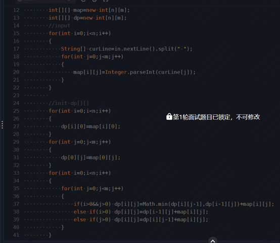
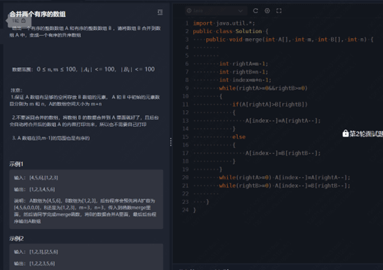
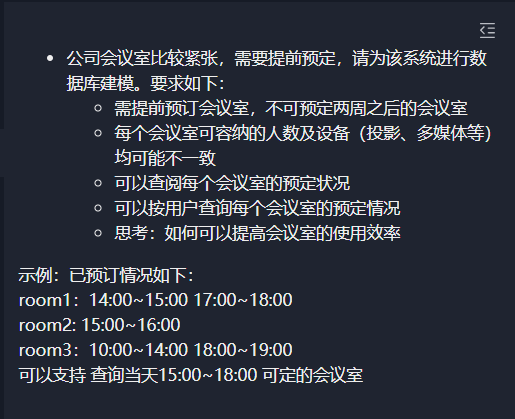
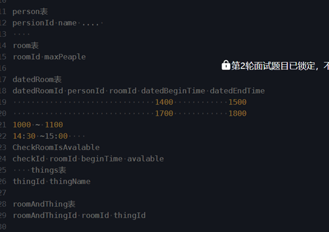

# 美团、华为、字节（已获 offer）春招面经（附参考答案）

一位球友的 2022 春招面经，拿到了美团、字节、华为等公司的 offer。

面经中涵盖的问题，我几乎都找到了对应的参考答案，希望可以帮助到你。

## 美团

### 一面

1. 挖项目，问的太多了，这里就不一一列举了，大部分是某个功能是怎么实现的或者如果要加某个功能应该怎么实现。
2. 进程线程区别。
3. 死锁，死锁条件。
4. 知不知道中断和轮询的区别。
5. 数据库索引，讨论了一下B+树能存多少数据。
6. 数据库存储引擎知道哪些，有什么区别。
7. 数据库锁。
8. 算法题：起始点到终点最短路径。

**部分问题参考答案** ：

1. [Java 并发常见知识点&面试题总结（基础篇）](https://javaguide.cn/java/concurrent/java-concurrent-questions-01.html)
2. [Java 并发常见知识点&面试题总结（进阶篇）](https://javaguide.cn/java/concurrent/java-concurrent-questions-02.html)
3. [选中断还是轮询方式？深究其中的区别](https://cloud.tencent.com/developer/article/1668831)
4. [MySQL 索引知识点总结](https://mp.weixin.qq.com/s?src=11&timestamp=1652069206&ver=3787&signature=cO*vP6Ua*TAi9eO99*EipxUyNAiP6qV5hVT4JNEeK9aoPgMR5xdg8J2VAu687BODFeoSQp8THlNfNG3s4715Jz9zrGWQJJpsFGOjlQe-EOg-wr1iHIADn4fkEE9omLGN&new=1)
5. [MySQL面试题/知识点总结！](https://mp.weixin.qq.com/s?__biz=Mzg2OTA0Njk0OA==&mid=2247506762&idx=2&sn=b545f97b2c45e4f5b41e26d57d33c9b0&chksm=cea19481f9d61d9721fa190a55fda11bd8ae76fbeda2b08a9d4105395b8427e212d9342231e3&token=549578959&lang=zh_CN#rd)
6. [MySQL锁总结](https://zhuanlan.zhihu.com/p/29150809)
7. [《Java 面试指北》 - 技术面试题篇](https://mp.weixin.qq.com/s?__biz=Mzg2OTA0Njk0OA==&mid=2247519384&idx=1&sn=bc7e71af75350b755f04ca4178395b1a&chksm=cea1c353f9d64a458f797696d4144b4d6e58639371a4612b8e4d106d83a66d2289e7b2cd7431&token=660789642&lang=zh_CN&scene=21#wechat_redirect)
8. [LCP 35. 电动车游城市  - LeetCode](https://leetcode.cn/problems/DFPeFJ/)

### 二面

1. 问项目。
2. 什么是序列化反序列化。
3. 负载均衡，知道哪些负载均衡 。
4. 什么时候会OOM，服务OOM怎么办，如何排查。
5. Spring 启动流程。
6. Spring 设计模式。
7. 对于模版模式的理解，应用场景，你在项目中是怎么使用的。
8. HTTP 请求过程 。
9. TCP 和 UDP 区别。
10. Linux知道哪些命令。
11. 设置索引有什么注意的地方。
12. 最近看了哪些书，有什么收获。
13. 算法题：合并有序数组 O(N)时间 O(1)空间。
14. 数据库设计：只能以半小时为单位订会议室。

**部分问题参考答案** ：

1. [招银网络二面：什么是序列化？常见的序列化协议有哪些？](https://mp.weixin.qq.com/s?__biz=Mzg2OTA0Njk0OA==&mid=2247520143&idx=2&sn=b746080a721bb6385246669384ef3487&chksm=cea1c044f9d64952444ed67d7418d70f67795255302b2a4d702153a8d7b43f66d83cfe1bbfec&token=549578959&lang=zh_CN#rd)
2. [《Java 面试指北》 - 技术面试题篇 - 高并发模块](https://mp.weixin.qq.com/s?__biz=Mzg2OTA0Njk0OA==&mid=2247519384&idx=1&sn=bc7e71af75350b755f04ca4178395b1a&chksm=cea1c353f9d64a458f797696d4144b4d6e58639371a4612b8e4d106d83a66d2289e7b2cd7431&token=660789642&lang=zh_CN&scene=21#wechat_redirect)
3. [系统稳定性——OutOfMemoryError 常见原因及解决方法 - 3.2.1 异常诊断](https://github.com/StabilityMan/StabilityGuide)
4. [Spring常见问题总结](https://javaguide.cn/system-design/framework/spring/spring-knowledge-and-questions-summary.html)
5. [设计模式最佳套路4 —— 愉快地使用模板模式](https://mp.weixin.qq.com/s/QBmDiyfST13nQJUcPLLXOg)
6. [一次 HTTP 请求的完整过程](https://mp.weixin.qq.com/s/PLo60qkoxVXBB0MrLxASyQ)
7. [TCP和UDP的区别](https://zhuanlan.zhihu.com/p/24860273)
8. [Linux 基础知识总结](https://javaguide.cn/cs-basics/operating-system/linux-intro.html)
9. [MySQL 索引知识点总结](https://mp.weixin.qq.com/s?src=11&timestamp=1652069206&ver=3787&signature=cO*vP6Ua*TAi9eO99*EipxUyNAiP6qV5hVT4JNEeK9aoPgMR5xdg8J2VAu687BODFeoSQp8THlNfNG3s4715Jz9zrGWQJJpsFGOjlQe-EOg-wr1iHIADn4fkEE9omLGN&new=1)
10. [88. 合并两个有序数组 - LeetCode](https://leetcode.cn/problems/merge-sorted-array/)

## 华为

### 一面

+ 项目、论文。
+ String 能否被继承。
+ Java 内存泄露和排查。
+ Hash 方式和 Hash 冲突解决。
+ 静态代理和动态代理。
+ 线程通信方式。
+ Volitate关键字。
+ Java 高效拷贝数组。
+ 算法题 跳跃游戏 leetcode 55。

**部分问题参考答案** ：

+ [Java 代理模式详解](https://javaguide.cn/java/basis/proxy.html)
+ [你还应该知道的哈希冲突解决策略](https://mp.weixin.qq.com/s/5vxYoeARG1nC7Z0xTYXELA)
+ [操作系统常见面试题总结](https://javaguide.cn/cs-basics/operating-system/operating-system-basic-questions-01.html)
+ [[效率优化专题]2.java数组拷贝的3种方式和效率对比](https://zhuanlan.zhihu.com/p/37346162)
+ [55. 跳跃游戏  - LeetCode](https://leetcode.cn/problems/jump-game/)

### 二面

+ 简单说说项目、论文。
+ 项目是自己学习的还是落地项目。
+ 本科保研绩点高，为啥研究生期间没有刷绩点。
+ 对华为的了解，这个聊了比较久 因为我本身就是华为用户，比较了解，主管也给我介绍和补充。
+ 实习时间。
+ 反问部门、技术栈，是否可以自己选项目。

## 字节

### 一面

1.  问项目，聊怎么实现，从项目里学到什么。 
2.  手写单例模式，和 Spring 的单例有什么区别。 
3.  算法题：给你一个整数数组 `nums` ，数组中的元素 **互不相同** 。返回该数组所有可能的子集（幂集）。 
4.  SQL 题：根据题目要求写出对应的 SQL，由于太久没写，不会做。 
5.  智力题 1-N批次其中有一批次重量不合格 用最少称重次数找到 

1） 刚开始说二分 面试官说不是最优

2） 提示可以从每批次拿不同数量：第N批拿N个 算重量差值就可以确定

**部分问题参考答案** ：

1. [重学 Java 设计模式：实战单例模式](https://mp.weixin.qq.com/s/ZwrJHk1Lo6G1Gpqvel0WeA)
2. [3道SQL面试题，总结常考知识点！](https://mp.weixin.qq.com/s/KOx1P-A01k7DlFf5DJk9TQ)
3. [78. 子集  - LeetCode](https://leetcode.cn/problems/subsets/)

### 二面

1. 问项目。
2. `volitate` 关键字。
3. JVM新生代怎么划分，大对象怎么分配。
4. 新生代有哪些垃圾回收器。
5. ParNew 原理。
6. Innodb 默认隔离级别，RR能防止幻读吗，RR默认使用间隙锁吗。
7. 怎么理解最终一致性，有哪些实现方案。
8. 分布式事务。
9. 算法题：数组里每个数右边第一个比他大的数。

**部分问题参考答案** ：

1. [Java 并发常见知识点&面试题总结（基础篇）](https://javaguide.cn/java/concurrent/java-concurrent-questions-01.html)
2. [Java 并发常见知识点&面试题总结（进阶篇）](https://javaguide.cn/java/concurrent/java-concurrent-questions-02.html)
3. [Java 内存区域详解](https://javaguide.cn/java/jvm/memory-area.html)
4. [JVM 垃圾回收详解](https://javaguide.cn/java/jvm/jvm-garbage-collection.html)
5. [MySQL面试题/知识点总结！](https://mp.weixin.qq.com/s?__biz=Mzg2OTA0Njk0OA==&mid=2247506762&idx=2&sn=b545f97b2c45e4f5b41e26d57d33c9b0&chksm=cea19481f9d61d9721fa190a55fda11bd8ae76fbeda2b08a9d4105395b8427e212d9342231e3&token=549578959&lang=zh_CN#rd)
6. [最终一致性，一致只会迟到，但绝不会缺席](https://mp.weixin.qq.com/s/ElLWu_Pzn5IykqE55Rv1oQ)
7. [《Java 面试指北》 - 技术面试题篇 - 分布式模块](https://mp.weixin.qq.com/s?__biz=Mzg2OTA0Njk0OA==&mid=2247519384&idx=1&sn=bc7e71af75350b755f04ca4178395b1a&chksm=cea1c353f9d64a458f797696d4144b4d6e58639371a4612b8e4d106d83a66d2289e7b2cd7431&token=660789642&lang=zh_CN&scene=21#wechat_redirect)
8. [496. 下一个更大元素 I  - LeetCode](https://leetcode.cn/problems/next-greater-element-i/)

### 三面

1. 问项目。
2. RAFT 脑裂、一致性。
3. 负载均衡。
4. 各种排序算法，分析复杂度和稳定性。
5. 其他想不起来了，八股很少，一直问项目。
6. 算法题：旋转图像(90度旋转矩阵)。

**部分问题参考答案** ：

1. [Raft实战系列，集群成员如何变更？日志怎么压缩？](https://mp.weixin.qq.com/s/4g0jR_shCIpjBprap3BExg)
2. [《Java 面试指北》 - 技术面试题篇 - 高并发模块](https://mp.weixin.qq.com/s?__biz=Mzg2OTA0Njk0OA==&mid=2247519384&idx=1&sn=bc7e71af75350b755f04ca4178395b1a&chksm=cea1c353f9d64a458f797696d4144b4d6e58639371a4612b8e4d106d83a66d2289e7b2cd7431&token=660789642&lang=zh_CN&scene=21#wechat_redirect)
3. [十大经典排序算法最强总结（含 Java、Python 码实现）](http://www.guoyaohua.com/sorting.html)
4. [48. 旋转图像 - LeetCode](https://leetcode.cn/problems/rotate-image/)

> 更新: 2022-05-29 15:25:02  
> 原文: <https://www.yuque.com/snailclimb/mf2z3k/bd7sww>