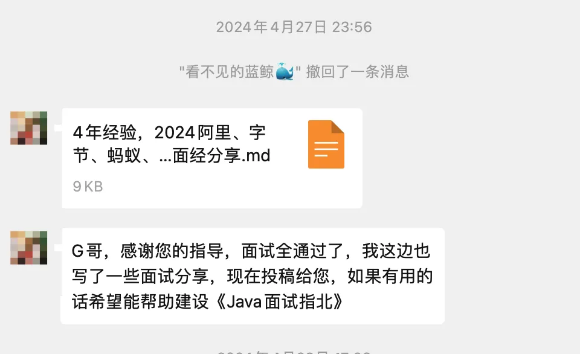
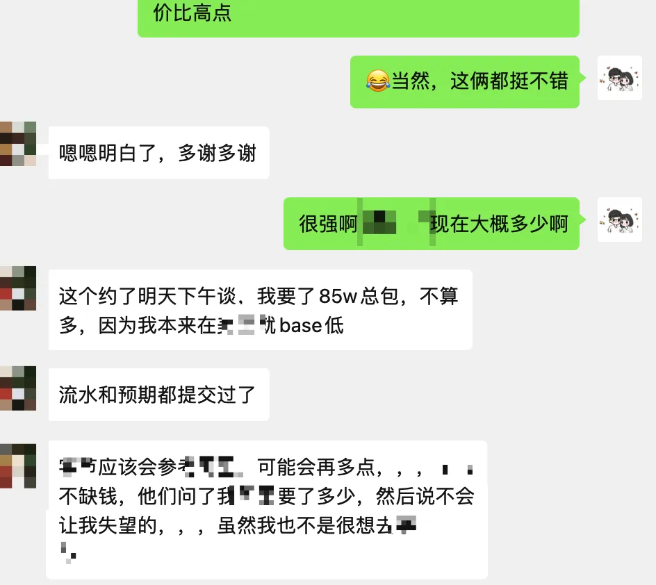

# 大厂四年，2024 阿里、字节、蚂蚁、小红书面试经历分享

这是一位大厂四年程序员在 2024 年的社招面经。这位大佬在当前这个求职环境下，凭借个人极强的硬实力拿到了阿里、字节、蚂蚁、小红书等公司的 offer。大佬最终去了其中的一家，具体哪家不方便透露，总包差不多100个了，确实很刺激！

强烈推荐大家认真看看这篇文章，大佬分享了很多干货！

下面是正文。

## 前言
2024 年从清明节面试到劳动节，陆续面试了几家互联网公司，几乎是马不停蹄的连续在职面试了三个星期，有的时候甚至一天两面，确实是非常累了，好在阿里、字节、蚂蚁、小红书都面试通过了，2024 年互联网环境有一些好转，一些大厂也不再锁 HC 了，希望通过这次分享，能给想要跳槽的同学一些经验。

我的基本情况：20 年本科应届生，毕业后在某大厂一直干了 4 年（准确说还不满 4 年），做后端研发，主要技术栈是 Java 相关的。

## 面试前准备
我大概从 2023 年 10 月后就开始准备了，但是准备的比较慢，基本上靠周六刷刷题，看一下八股文之类的，这种方式很容易前脚看了后脚就忘了，也很难维持刷题的题感，所以清明前后我就集中性给自己做了一些计划。

### 定规划
做事情还是得有目标，拆解成小的任务，才好推动。

我按照自己的实际情况，分了几个大类，按照优先级排序：

+ 简历完善，这块主要包括个人介绍（面试开场白）和简历项目的深挖；
+ 项目准备，这块主要包括项目的重新复盘和 Q&A 的演练；
+ 算法准备，刷 LeetCode 的 Hot200，这块主要包括题型进行分类后，每类题选一个经典案例，做好笔记；
+ 八股文准备，这块主要包括项目涉及到的技术知识准备和扩展的知识准备；
+ 口才练习，这块主要是锻炼表达的流畅性，我是把项目和知识点告诉 ChatGPT 进行对练，注意这个是语音。

这里面简历完善可以看 Guide 哥的指南，非常全，而且我也是经过大佬指导修改后才完成最终版本的，所以下面我会挑一些我觉得我做的比较好的部分分享。

### 项目联动高效完成八股文和算法准备
+ 多准备简历中涉及到的八股文和算法
+ 讲八股文的时候要结合项目场景，加分
+ 讲场景题或解决方案要解决优秀的技术思维，加分

大多数面试官不会直接抛开简历问技术，甚至算法题也是有针对性的，在准备项目的时候，如果项目中核心的链路对某种技术依赖比较多，那么一定要多准备，在字节的面试中，聊到 Redis Geo，后面聊到跳表，结果最后写了一个和二分法的算法题。八股文也会按照项目中的技术栈来问，就比如我项目中使用 MySQL 比较少，所以 MySQL 就问的很少。

大多数八股文在解答的时候，还是建议结合项目中的内容，比如在问到 Kafka 怎么做到高吞吐的时候，我就会在最后去讲我们项目为什么要使用 Kafka，就是对吞吐要求比较高，以及如何利用这一点做好技术设计。

多利用优秀的技术设计思想解决问题，比如 Redis 为什么快大家是知道的，那么假如面试官问你要做一个高 QPS 的接口怎么做，就可以结合 Redis 的设计去设计，这里就不展开讲了，注意我的意思不是让你直接使用 Redis，而是使用 Redis 的思想完成场景设计。再比如说分布式的思维，可以在很多场景下有影子。

### 多总结多思考胜过死记硬背
+ 优秀的技术设计是有通用性的，比如高性能：通信、储存、复杂度，再比如经典的时间换空间，空间换时间
+ 多从背景痛点出发看待问题，比如学了一大堆技术，但是如果你不知道这项技术为什么应运而生，就很难深刻理解
+ 多看一些经典的场景题，学会举一反三很重要

### 最好能懂一点架构设计
+ 架构设计的原则，这样做是否提升了系统复杂度？是否是值得的
+ 架构设计如何保证合理性，避免腐化

架构设计见仁见智，不管是领域驱动设计（DDD）还是其他的，如果能有一些个人的见解那肯定是最好的，也有一些话题和讨论点和面试官讨论，不如你的设计是否能保持 3-5 年的合理性，避免代码腐化。

或者也可以讲一些设计方案比如 CQRS 架构，为什么要用，适合什么场景，带来了什么好处。

### 业务匹配度和技术匹配度
业务匹配度和技术匹配度，从这两个点出发：

+ 业务匹配度：如果你做的业务和目标公司是在同一块领域内，比如你做的是营销，去面试的也是营销，这种情况会要求较高的领域深度，对于某类型问题有独到的看法，并且能列举一些解决方案，此时如果对方有相同的痛点，被录用的可能性就非常大；如果你面试的业务你并不了解，这种情况会要求较高的领域广度，否则面试官可能会觉得你“自我设限”。
    - 在面试小红书时，因为我对他们的业务不是很懂，我在最后询问面试官对我的成长建议时，反馈说“不要自我设限”；
    - 在面试蚂蚁时，我直接说我不自我设限，会看很多领域的内容，他直接问我广告投放、AI 算法这些，虽然我说的不是很好，但是因为我提前准备过，能说上来一些，其实也足够用了。
    - 特别是在老板面的时候，他会考察你的业务 sense，需要具备一些业务前瞻性和较强的思辨能力。
+ 技术匹配度：可以提前了解一下对方业务可能用到的技术能力，针对这些技术方案，找一些你项目中类似的技术方案，比如在我的业务场景中，需要用到 Kafka 对数据流反复处理再发出，期间需要对数据清洗、数据算法处理，这期间又涉及到高 QPS 数据的缓存或持久化，这个场景恰巧和面试公司的一个业务场景很像，面试官非常感兴趣，我们还一起探讨了一些经历和坑。

### 一些方法论
+ STAR：Situation（情境）、Task（任务）、Action（行动）和 Result（结果）四个关键要素，在谈项目的时候，最好分拆成多个子任务，然后清晰的按照 STAR 的逻辑去表述，我在字节的面试中，最后面试官给我反馈的一点是我业务背景讲的太长了，需要更聚焦痛点本身，所以控制节奏也很重要，类似于：有什么问题？我接到了什么任务？我是怎么做的？我拿到了什么结果？
+ SWOT：SWOT 是 Strengths（优势）、Weaknesses（劣势）、Opportunities（机会）和 Threats（威胁），在谈自己公司业务的方向的时候，可能会提到这些，并清晰的称述你如何帮助公司建立优势，如何解决劣势，如何把握机会，如何应对威胁，或者在谈个人职业规划的时候，也可以讲自己当前做的最好的是什么，在哪方面有缺陷（这可能是你跳槽的原因），你觉得跳槽带来什么样的机会，带来什么挑战，你如何应对。

## 面试经验分享
因为大多数面试，在项目部分都占到 50%以上的时间，再加上 10%的 Code 时间，其实八股文问的并不多。

资料推荐：

+ [JavaGuide](https://javaguide.cn/)：Java 学习 + 面试指南。在 Github 累计收获了 145k star，持续更新完善，内容全面，文章质量非常高。
+ [《Java 面试指北》](https://t.zsxq.com/Uv3ByZn)：和 JavaGuide 的内容互补一个专栏，专为 Java 面试打造。

### 八股文
#### 阿里
+ Kafka 如何保证高吞吐的？Kafka 如何保证消息不丢失？
+ 你的设计中有两条链路，他们之间互为旁路，如何保证幂等的？
+ Redis 的节点之间是如何通信的？
+ Redis 为什么快？Redis 在 CAP 方面的理解？
+ Redis Geo 的底层原理是什么？
+ MySQL 隔离级别，你遇到过哪些问题，怎么解决的？
+ 你做过 JVM 调优吗？参数调整怎么保证是最佳的？
+ 分布式事务怎么实现，实际应用场景，遇到过哪些问题吗？
+ 规则引擎怎么实现的，有哪些核心设计模式？

参考答案：

+ Kafka 相关的面试题可以参考星球的[《Kafka常见面试题/知识点总结》](https://t.zsxq.com/Uv3ByZn )
+ [高可用：如何保证接口幂等性？](https://www.yuque.com/snailclimb/mf2z3k/mlnfrc6kk95kmli6)
+ Redis 高可用和高扩展：
    - [Redis 主从复制：主从节点之间如何同步数据？](https://www.yuque.com/snailclimb/mf2z3k/ks9olb19hc9wse5k)
    - [Redis Sentinel：如何实现自动化地故障转移？](https://www.yuque.com/snailclimb/mf2z3k/ft4h1g)
    - [Redis Cluster：缓存的数据量太大怎么办？](https://www.yuque.com/snailclimb/mf2z3k/ikf0l2)
+ [Redis 3 种特殊数据类型详解](https://javaguide.cn/database/redis/redis-data-structures-02.html)、[Redis GEO 实现原理解析](https://cloud.tencent.com/developer/article/1949540)
+ [MySQL常见面试题总结](https://javaguide.cn/database/mysql/mysql-questions-01.html)、[线上常见问题案例和排查工具](https://t.zsxq.com/Vt2l6)（里面分享了一篇事务隔离级别错误导致的生产问题案例）
+ [常见的性能优化方向实践](https://t.zsxq.com/0c1uS7q2Y)（涉及到多线程、JVM、数据库/缓存、数据结构优化这 4 个常见的性能优化方向）
+ [服务治理：分布式事务解决方案有哪些？](https://www.yuque.com/snailclimb/mf2z3k/ng9vmg)
+ [贴吧低代码高性能规则引擎设计](https://mp.weixin.qq.com/s/VicPMwuqF2J8BnZi8RwFrw)

#### 字节
+ 你知道粘包和拆包吗？为什么会发生？怎么解决？（字节真的很爱问计算机网络）
+ 你们是怎么做数据加密的？
+ Kafka 并不支持延迟消息，如果让你设计实现，你如何做？
+ 有一个 1000w QPS 的接口，传进来一个唯一 ID，你需要对 ID 进行一些算法处理，给出结果，如何做到高性能？
+ 你是如何理解分布式的，如果发生网络分区怎么办？
+ `HashMap` 原理，以及不同情况下的复杂度？（怎么还问 `HashMap`，问完我都笑了，面试官也笑了）
+ 乐观锁和悲观锁？
+ 如何做幂等，又一路问到分布式锁解决什么问题？
+ MySQL 隔离级别？MVCC？

参考答案：

+ [面试题：聊聊TCP的粘包、拆包以及解决方案](https://cloud.tencent.com/developer/article/1804413)
+ [常见加密算法总结](https://javaguide.cn/system-design/security/encryption-algorithms.html)
+ [两万字的性能优化指南！39 个策略提升接口性能！](https://juejin.cn/post/7287420810318299190)
+ [23｜延迟消息：怎么在Kafka 上支持延迟消息？ - 极客时间](https://time.geekbang.org/column/article/685187)
+ [CAP & BASE理论详解](https://javaguide.cn/distributed-system/protocol/cap-and-base-theorem.html)
+ [Java集合常见面试题总结(下)](https://javaguide.cn/java/collection/java-collection-questions-02.html#map-重要)
+ [Java并发常见面试题总结（中）](https://javaguide.cn/java/concurrent/java-concurrent-questions-02.html#乐观锁和悲观锁)
+ [高可用：如何保证接口幂等性？](https://www.yuque.com/snailclimb/mf2z3k/mlnfrc6kk95kmli6)、[分布式锁介绍](https://javaguide.cn/distributed-system/distributed-lock.html)
+ [MySQL 常见面试题总结](https://javaguide.cn/database/mysql/mysql-questions-01.html#mysql-事务)

#### 蚂蚁
+ Redis 节点直接通信，Gossip 原理？
+ Redis 哨兵？Redis 优先保证可用性还是一致性？Redis 怎么做持久化？
+ Kafka 如何保证消息有序？
+ ZSet 的底层原理，跳表的原理？
+ 分库分表怎么做的？原理？步骤？关键点？
+ 你了解哪些分片算法？
+ CAS 原理和应用场景？CAS 是原子操作吗？
+ `Volatile` 和 `Synchronized` 的理解？
+ Kafka 从消息发送到最终消费的全过程？零拷贝是什么意思？

参考答案：

+ [Redis为什么用跳表实现有序集合](https://javaguide.cn/database/redis/redis-skiplist.html)
+ Redis 高可用和高扩展：
    - [Redis 主从复制：主从节点之间如何同步数据？](https://www.yuque.com/snailclimb/mf2z3k/ks9olb19hc9wse5k)
    - [Redis Sentinel：如何实现自动化地故障转移？](https://www.yuque.com/snailclimb/mf2z3k/ft4h1g)
    - [Redis Cluster：缓存的数据量太大怎么办？](https://www.yuque.com/snailclimb/mf2z3k/ikf0l2)
+ [读写分离和分库分表详解](https://javaguide.cn/high-performance/read-and-write-separation-and-library-subtable.html)
+ [第十章 乐观锁和悲观锁 - 《深入浅出 Java 多线程》](https://redspider.gitbook.io/concurrent/di-er-pian-yuan-li-pian/10)
+ [Java并发常见面试题总结（中）](https://javaguide.cn/java/concurrent/java-concurrent-questions-02.html#乐观锁和悲观锁)
+ Kafka 相关的面试题可以参考星球的[《Kafka常见面试题/知识点总结》](https://t.zsxq.com/Uv3ByZn )
+ [高性能：零拷贝为什么能提升性能？](https://www.yuque.com/snailclimb/mf2z3k/yc7k8o)

#### 小红书
+ `ConcurrentHashMap` 的原理？为什么要用红黑树？为什么不一开始就使用红黑树？
+ `volatile` 和 `synchonized` 基本原理？`synchonized` 可以保证可见性吗？
+ Redis 集群中节点之间的通信方式？
+ Redis 的数据结构如何设计？跳表的原理是什么？
+ Kafka 是如何持久化的？Kafka 如何保证消息不丢失？
+ Gossip 原理？Raft 原理？
+ ES 分片数量你是如何设计的？
+ 你是如何做幂等的？分布式 ID 的常见算法？

参考答案：

并发、Redis 和 Kafka 相关的面试题这里就不推荐参考答案了，上面已经提到过了。

+ [Raft 算法详解](https://javaguide.cn/distributed-system/protocol/raft-algorithm.html)、[Gossip 协议详解](https://javaguide.cn/distributed-system/protocol/gossip-protocl.html)
+ [Elasticsearch 常见面试题总结](https://www.yuque.com/snailclimb/mf2z3k/simu3iyhd87kgp3e)
+ [高可用：如何保证接口幂等性？](https://www.yuque.com/snailclimb/mf2z3k/mlnfrc6kk95kmli6)
+ [分布式ID介绍&实现方案总结](https://javaguide.cn/distributed-system/distributed-id.html)

### 算法题
总的来说都比较简单，希望大家也遇到这种简单的题吧

+ 字符串 S 给出不包含重复字符的最长子串的长度？
+ 把下面命令改写成代码：cat "app.log" | grep -E "query|insert" |sort | uniq -c
+ 给一个单链表，判断链表是否存在环
+ 最小栈
+ 查找有序二叉树中和 target 最接近的
+ 删除单链表中的重复节点，比如 a->a->b->c->d->d->d 输出 b->c
+ 等计数子串个数

### 其他问题
+ 领域驱动设计相关的细节，以及如何代码落地
+ 沟通协作上遇到哪些问题，不同团队之间目标不同如何推动落地
+ 遇到问题时，如何找老板要资源
+ 如果让你重新经历一次，你觉得哪些事情你可以做的更好

## 总结
项目内容是聊的最多的地方，如何能快速简洁的让面试官听懂并理解你的项目也是非常考验表达的，很多情况全程聊项目，聊了一个半小时，甚至没有时间考察八股文和算法，所以项目部分一定要好好准备，因为这块内容是你唯一可以主导且容易把握节奏的部分，准备的好的话，对方可能会因为你具备很好的解决问题的思路和经验，而直接给你通过面试。

最后，祝大家面试上岸！

> 更新: 2024-09-07 16:41:32  
> 原文: <https://www.yuque.com/snailclimb/mf2z3k/guh0u9hb3pr70rtk>