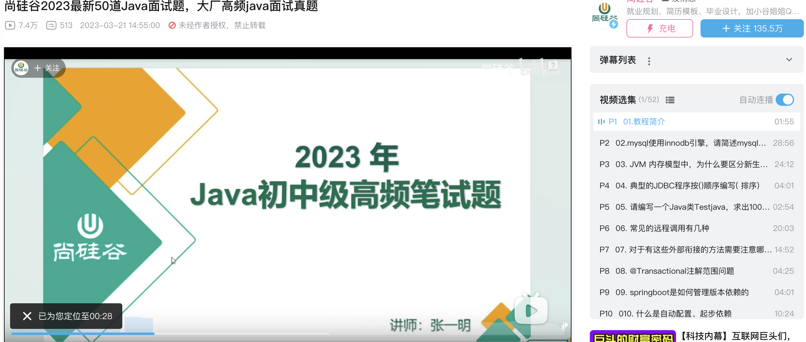
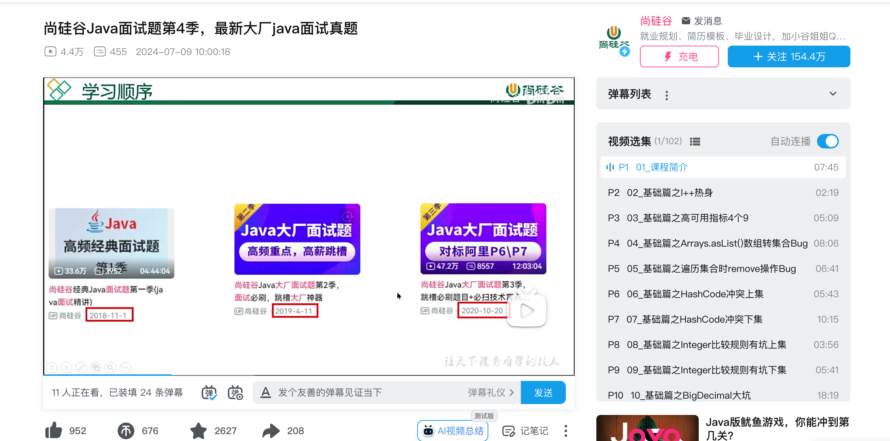
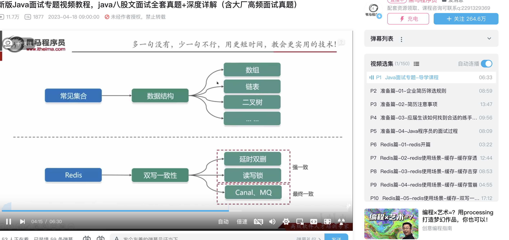
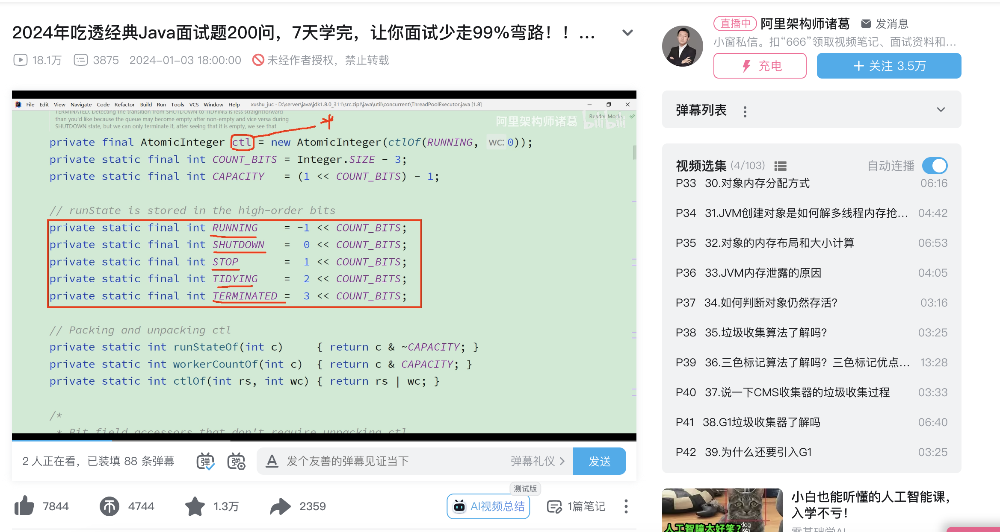
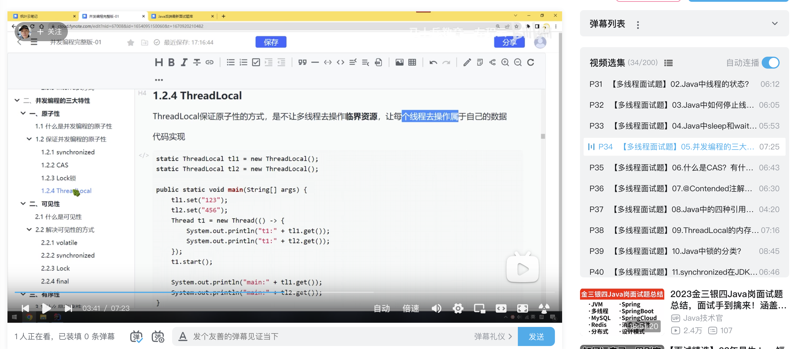

# Java 优质面试视频推荐

下面是一些不错的 Java 面试相关的免费视频，如果你不喜欢只看文字（看文字效率更高）教程的话，可以参考一下。

个人还是比较推荐看我写的文字教程，效率更高，学习效果通常会更好一些！尽量不要完全以视频教程为主，视频教程只能说是偶尔看看或者听听，例如自己学习状态不好的时候看看视频作为过渡、上班路上听听音频加深印象。

## 尚硅谷面试八股文系列

内容涵盖 Java 基础、Java 集合、多线程、JVM、Spring、MySQL、Redis 等知识点，讲解的质量较高。

地址：

+  尚硅谷 2023 最新 50 道 Java 面试题：[https://www.bilibili.com/video/BV1Bb411d7SL/](https://www.bilibili.com/video/BV1Bb411d7SL/) 
+  Java 面试题第一季 ：[https://www.bilibili.com/video/BV1Eb411P7bP](https://www.bilibili.com/video/BV1Eb411P7bP) 
+  Java 面试题第二季 ：[https://www.bilibili.com/video/BV18b411M7xz](https://www.bilibili.com/video/BV18b411M7xz) 
+  Java 面试题第三季：[https://www.bilibili.com/video/BV1Hy4y1B78T](https://www.bilibili.com/video/BV1Hy4y1B78T) 
+ Java 面试题第四季：[https://www.bilibili.com/video/BV13T421k794/](https://www.bilibili.com/video/BV13T421k794/)

## 黑马 Java 面试专题

黑马 Java 面试专题课解决面试过程中的一些常见问题，课程全面覆盖重难点 Java 面试题。包含了多个模块的面试题讲解，如：Redis、MySQL、框架、微服务、消息中间件、数据结构、Java 集合源码分析、多线程、JVM、设计模式、高并发场景、企业实际问题场景等等各个方面逐一讲解。

地址：[https://www.bilibili.com/video/BV1yT411H7YK](https://www.bilibili.com/video/BV1yT411H7YK)

## 图灵学院 Java 高频面试专题

内容涵盖 Java 基础、Java 并发、JVM、 MySQL、 Redis、Kafka 以及常见框架等知识点。拿数据库和缓存来说：数据库以面试常问的 MySQL 为例介绍了索引、锁、事务、主从同步、分库分表、慢查询处理等面试题。缓存以面试常问的 Redis 为例介绍了 Redis 常见数据库结构、缓存过期策略、 缓存穿透、缓存击穿、缓存雪崩、数据库和缓存一致性保证、Redis 高可用等面试题。

地址：[https://www.bilibili.com/video/BV1kt4y1o7QV](https://www.bilibili.com/video/BV1kt4y1o7QV)

## 马士兵教育 Java 高频面试专题

内容涵盖 Java 基础、Java 集合、多线程、JVM、Spring、Mybatis、MySQL、Redis 、Spring Cloud、消息队列、分布式锁等知识点，讲解的质量还行。

地址：

+ 新版 Java 面试题 300 问：[https://www.bilibili.com/video/BV1xwHreuEWq/](https://www.bilibili.com/video/BV1xwHreuEWq/) 。
+ 分布式面试全家桶：[https://www.bilibili.com/video/BV1yv4y1c7Vq/](https://www.bilibili.com/video/BV1yv4y1c7Vq/)

> 更新: 2024-09-09 12:20:12  
> 原文: <https://www.yuque.com/snailclimb/mf2z3k/ybncpn>