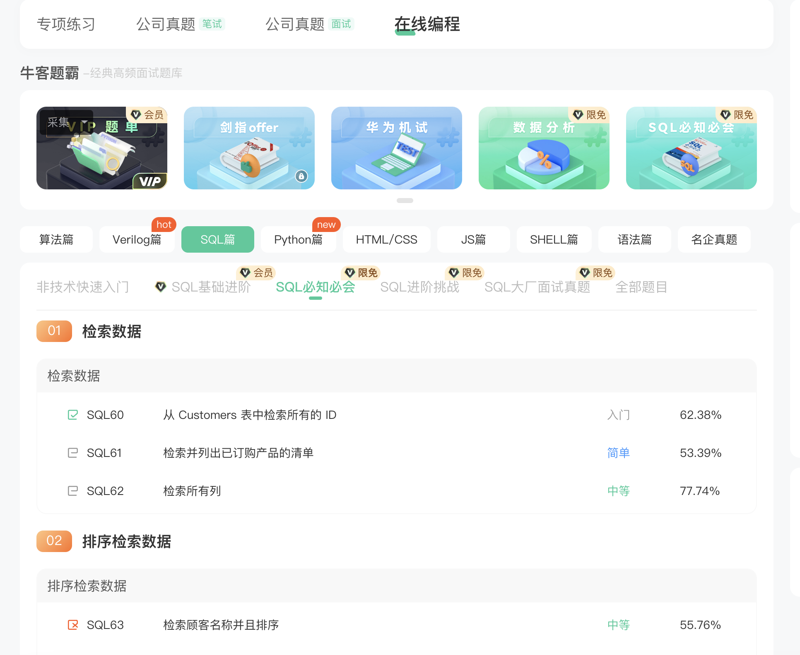
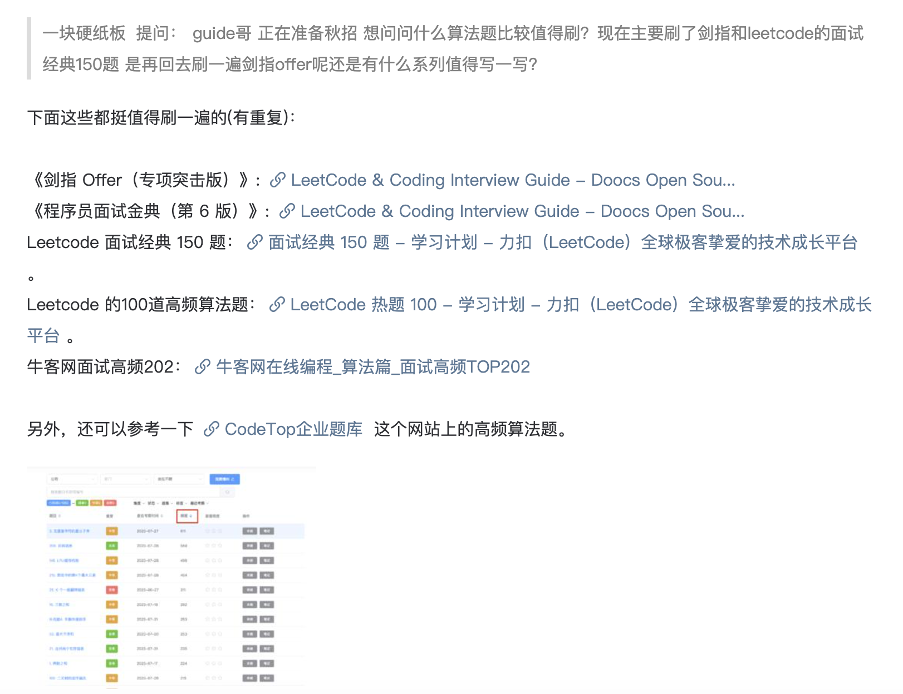
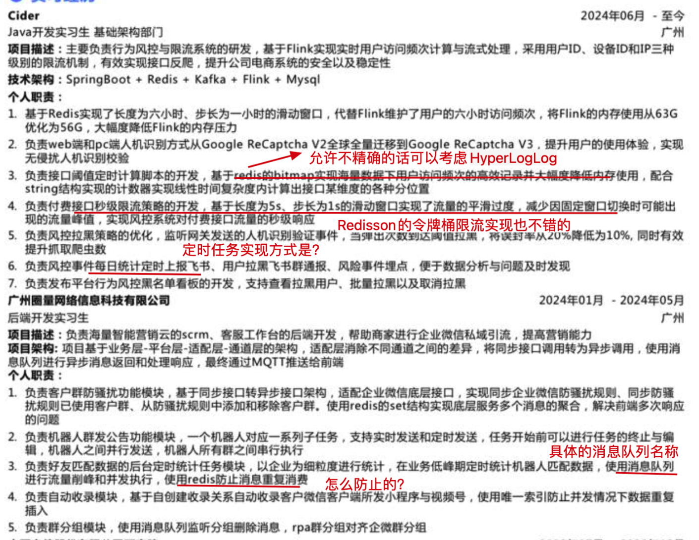
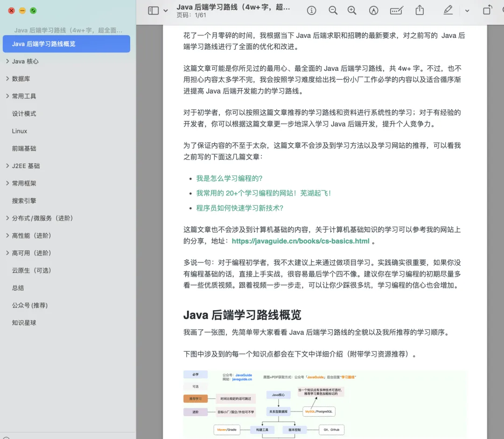
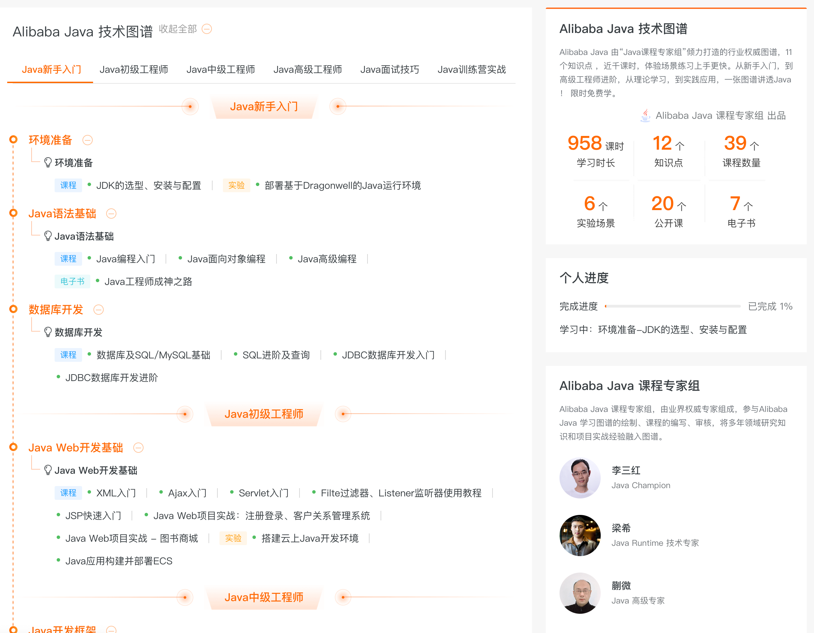
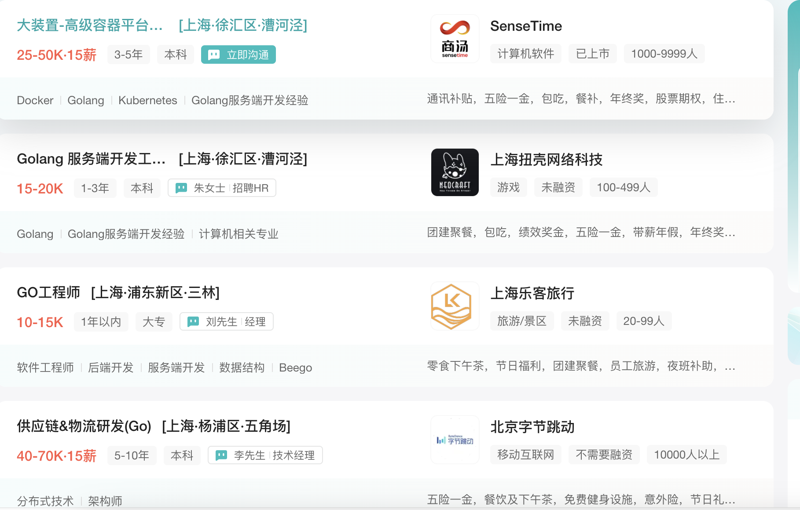

# ⭐Java面试准备常见问题解答（补充）

## 面试准备
学完了某个知识点之后，你可以去看看对应的八股文和知识点总结。八股文和知识点总结的话，建议你多看看《Java 面试指北》：[https://t.zsxq.com/Uv3ByZn](https://t.zsxq.com/Uv3ByZn) 和 JavaGuide：[https://javaguide.cn/](https://javaguide.cn/) 。《Java 面试指北》属于是 JavaGuide 开源版的完善，两者内容互补，无重复内容，完全可以结合一起看。如果说你比较赶时间，想着突击面试的话，那就针对性地只看面试题

同时，也建议你多多在星球打卡，分享自己的学习情况，这样既能督促自己，又有机会获得星球福利。

### ⭐面试官在筛选简历的时候比较看重什么？

对于面试官来说，筛选简历的时候会比较看重下面这些维度：

1. 实习/工作经历：看你是否有不错的实习经历，大厂且与面试岗位相关的实习/工作经历最佳。
2. 获奖经历：如果有含金量比较高（知名度较高的赛事比如ACM、阿里云天池）的获奖经历的话，也是加分点，尤其是对于校招来说，这类求职者属于是很多大厂争抢的对象（但不是说获奖了就能进大厂，还是要面试表现还可以）。对于社招来说，获奖经历作用相对较小，通常会更看重过往的工作经历和项目经验。
3. 项目经验：项目经验对于面试来说非常重要，面试官会重点关注，同时也是有水平的面试提问的重点。
4. 技能匹配度：看你的技能是否满足岗位的需求。在投递简历之前，一定要确认一下自己的技能介绍中是否缺少一些你要投递的对应岗位的技能要求。
5. 学历：相对其他行业来说，程序员求职面试对于学历的包容度还是比较高的，只要你在其他方面有过人之出的话，也是可以弥补一下学历的缺陷的。你要知道，很多行业比如律师、金融，学历就是敲门砖，学历没达到要求，直接面试机会都没有。不过，由于现在面试越来越卷，一些大厂、国企和研究所也开始卡学历了，很多岗位都要求 211/985，甚至必须需要硕士学历。总之，学历很难改变，学校较差的话，就投递那些对学历没有明确要求的公司即可，努力提升自己的其他方面的硬实力。

对于大部分求职者来说，实习/工作经历、项目经验、技能匹配度更重要一些。不过，不排除一些公司会因为学历卡人。

### ⭐校招面试考察的重点是什么？

不同的公司对于校招求职者考察的侧重点不同，这里总结几点比较通用的：

1. 基础知识：比如计算机基础（大厂必备）、Java 基础、集合、并发这些。
2. 项目经历：面试官会顺利你的项目经历问一些技术问题。举个例子：你的项目用到了消息队列，那面试官可能就会问你：为什么使用消息队列？项目中什么模块用到了消息队列？如何保证消息不丢失？如何保证消息的顺序性?（结合你使用的具体的消息队列来准备）......。
3. 代码能力：大厂面试可能会考察手写代码题。一般是 LeetCode 上的简单或者中等难度的题目，如果简单难度的题都做不出来，面试可能就直接被 pass 了。
4. 软技能：比如沟通能力、表达能力、学习能力、团队协作能力。

站在面试官的角度来看，他要招聘的是技术功能扎实、有潜力、可塑性强且认同公司价值观的求职者。

### ⭐社招面试考察的重点是什么？

相对于校招面试来说，社招面试更看重你的过往工作经验和项目经历。如果你有与面试岗位相关的工作经历或者项目经历，那你的优势就比较大了，剩下的全看面试中的表现。面试的时候，面试官会着重考察你的项目经历、解决问题的能力以及业务理解能力。例如，面试官可能会问你有没有实际的线上问题排查经验、是否进行过 JVM 调优、缓存或者消息队列等技术在项目中是如何使用的。

站在面试官的角度来看，他要招聘的是来了就能直接上手工作的人。

另外，论是大厂校招还是社招来说，底层能力同样是面试重点。例如，面试官可能会问你常见框架的底层原理。大厂面试比较喜欢怼着一个问题，往死里挖，直到你顶不住为止，所以一定要注意深度。

### 只看我总结的技术八股文可以不？

如果你的目标是中小厂的话，看我的资料基本已经足够了。根据过往经验，你能掌握 70%，应对绝大部分中小厂的技术面应该都没太大问题了。不过，想要把我的资料吃透还是比较难的，尽全力学习即可。

然而，任何人总结的八股文都不可能把面试中的内容都给涵盖住，尤其是阿里、美团这种挖的比较深入的面试，难度还是比较大的。对于目标是大厂的同学来说，你可以将我的资料作为首选参考资料（毕竟质量很高且一直在持续更新完善），参考其进行查漏补缺，没事就自测一下，多多思考总结。

我的资料总体来说还是很全面的，且大部分重要的知识点介绍的都比较深入，但我不可能保证每个知识点都总结的很深入。因此，你需要针对自己项目经历涉及到的一些知识点要主动去深挖。想要进大厂的话，一定一定一定要往底层原理层面深入，适当情况下还要去看底层源码。如果能在面试的时候和面试官从底层源码角度聊，那面试基本就稳了。

例如，前几年阿里面试特别喜欢问 Dubbo（毕竟是自家产品），很多同学简历上的项目也用到了 Dubbo。这种情况下，你就要把 Dubbo 当做一个重点中的重点。面试之前，提前准备 Dubbo 的常见问题，搞懂 Dubbo 的底层原理，深入研究其核心模块的源码。即使面试官没有问你 Dubbo 底层的一些东西，你也可以旁敲侧击的表示自己曾经深入研究过，并把面试官往这块引。

### 学校不好有机会进入大厂吗？

学校歧视很正常，真的太正常了，如果要抱怨的话，你只能抱怨自己没有进入名校。但是，千万不要动不动说自己学校差，动不动拿自己学校当做自己进不了大厂的借口，学历只是筛选简历的很多标准中的一个而已，如果你够优秀，简历够丰富，你也一样可以和名校同学一起同台竞争。

企业 HR 肯定是更喜欢高学历的人，毕竟 985，211 优秀人才比例肯定比普通学校高很多，HR 团队肯定会优先在这些学校里选。这就好比相亲，你是愿意在很多优秀的人中选一个优秀的，还是愿意在很多普通的人中选一个优秀的呢？

双非本科甚至是二本、三本甚至是专科的同学也有很多进入大厂的，不过比率相比于名校的低很多而已。从大厂招聘的结果上看，高学历人才的数量占据大头，那些成功进入 BAT、美团，京东，网易等大厂的双非本科甚至是二本、三本甚至是专科的同学往往是因为具备丰富的项目经历或者在某个含金量比较高的竞赛比如 ACM 中取得了不错的成绩。**一部分学历不突出但能力出众的面试者能够进入大厂并不是说明学历不重要，而是学历的软肋能够通过其他的优势来弥补。** 所以，如果你的学校不够好而你自己又想去大厂的话，建议你可以从这几点来做：

1. 尽量在面试前最好有一个可以拿的出手的项目；
2. 有实习条件的话，尽早出去实习，实习经历也会是你的简历的一个亮点（有能力在大厂实习最佳！）；
3. 参加一些含金量比较高的比赛，拿不拿得到名次没关系，重在锻炼。

### 面试中小厂需要准备算法吗？

如果是求职目标是中小厂、国企的话，算法相对来说不是那么重要。如果你有留意中小厂、国企面经的话，你会发现面试中提问算法的概率是比较低的，基本不会问。

下面是两篇中小厂的面经，可以看看：

+ [非科班 2022 福州小厂 Java 后端面经](https://mp.weixin.qq.com/s/jpJ_vQE40d4MjPJ-cuYL2Q)
+ [中小厂（五八、中通、安硕、浩鲸...） Java 后端面经](https://mp.weixin.qq.com/s/5NUQWj3z1fH3narJEXO1Eg)

### 面试官的提问太笼统怎么办？

很多时候，面试官的提问会比较笼统或者抽象，比如他可能会直接问你：“`HashMap` 的原理是什么？”。

这个时候，很多同学直接就懵了，心里想：“啊？？？我准备面试的时候没有看到这个问题啊！我该怎么回答呢？”。

对于这种情况，重要的是和要和面试官建立沟通。以`HashMap` 的原理这个提问为例，你可以说：“这个问题涉及到的点有点多啊。要不我们先从 `HashMap` 的底层数据结构聊起吧？ xxx。”，聊完之后，你可以再聊聊 `HashMap` 线程不安全的原因或者你问问面试官接下来想要听你从哪一方面来介绍。这样的话，会让面试官觉得你的沟通能力不错，并且比较专业。

另外，如果你不理解面试官的提问的话，一定也要及时和面试官沟通，避免自己对问题的理解出现偏差。

### 技术八股准备到什么程度可以开始面试？

你可以使用 Java 面试常见问题总结（2024 最新版，地址：[https://t.zsxq.com/0eM78gbAr](https://t.zsxq.com/0eM78gbAr) ）来自测一下，如果能大概回答里面六七成的问题的时候就可以开始面试了。不过，里面的内容可根据自身情况适当省略/跳过，例如 JVM、Netty、分布式理论等等，对照着 Java 后端面试重点 （ [⭐哪些知识点是面试重点？](https://www.yuque.com/snailclimb/mf2z3k/vdkmzzy0a1v37xtv) ）来就好了。

当然，这是我的建议，如果面试正在进行，又不想错过机会，那就先把自己项目经历涉及到的技术八股给搞懂之后就尽快开始面试。剩下的那些常问的技术八股，再慢慢复习准备就好了！

### 面试过程中遇到不会的问题怎么办？

在面试过程中，遇到不会的问题，首先要做的是快速回顾自己过往的知识，看是否能找到突破口。如果实在没有思路的话，可以真诚地向面试要一些提示比如谈谈你对这个问题的理解以及困惑点。一定不要觉得向面试官要提示很可耻，只要沟通没问题，这其实是很正常的。最怕的就是自己不会，还乱回答一通，这样会让面试官觉得你技术态度有问题。

### 有没有推荐的公司？

有很多小伙伴找工作的时候想让我推荐一些公司，emm...,我觉得根本不用我推荐。大家看 Programmer-look-at-China 这个开源项目就好了！非常赞！

这个项目详细的介绍了中国各二线以上城市的互联网环境以及生活成本。有多详细呢？这样说吧，基本把公司各个方面的信息都给介绍到了，甚至连福利情况和面试难度都有提到，简直不要太贴心。

+ Github 地址：[https://github.com/csguide-dabai/Programmer-look-at-China](https://github.com/csguide-dabai/Programmer-look-at-China) 。
+ Gitee 地址：[https://gitee.com/csguide/Programmer-look-at-China](https://gitee.com/csguide/Programmer-look-at-China) 。

### 公司背调需要注意什么？

对于社招的朋友来说，还是要注意一下背调。一般来说，大厂、研究所、央企、国企这些背调会比较严格。如果你入职的是这类企业的话，要格外留意背调，重视一些。 具体可以查看这篇分享：

[公司背调需要注意什么？](https://www.yuque.com/snailclimb/mf2z3k/ndtdz4skyxntgex8)

### 面试太紧张怯场如何克服？

要正确看待面试紧张怯场这件事情，正常情况下，参加面试大家都会稍微有点紧张，尤其是前几次面试。完全不怯场很难，需要让自己更自信，多练习，多参加面试！

下面是一些建议帮助你减轻这个问题：

1. 多面试，多积累经验！可以选择先拿一些小厂练手积累经验，找一些自信，不要上来就面试地狱难度的大厂。
2. 放平心态，就当做是一次聊天，不要太害怕面试官，你俩都一样，以后说不定就是同事关系。也不要觉得面试官就很厉害，实际上，很多面试官的水平其实很一般的。
3. 避免背书式的一问一答，适当停顿思考。这样有利于帮助自己整理思路，也能避免面试官觉得你是在背题。
4. 平时按照计划准备技术面试，优先重点，多自测，多看面经。你可以约着同学朋友一下互相考察一下。另外，牛客有一个[AI模拟面试](https://www.nowcoder.com/interview/ai/index)也可以试试。
5. 准备八股文的过程中，强烈建议你花个几个小时去根据你的简历（主要是项目经历部分）思考一下哪些地方可能被深挖，然后把你自己的思考以面试问题的形式体现出来。面试之后，你还要根据当下的面试情况复盘一波，对之前自己整理的面试问题进行完善补充。这个过程对于个人进一步熟悉自己的简历（尤其是项目经历）部分，非常非常有用。这些问题你也一定要多花一些时间搞懂吃透，能够流畅地表达出来。
6. 平时要多说，不要只是在心里面想，不然真正面试的时候会发现想的和说的不太一样。

## 笔试
### 如何准备 SQL 笔试题？
> 提示：SQL 笔试题在面试中考察不是很多。
>

SQL 刷题网站推荐牛客网或者Leetcode。个人建议牛客网，上面的题目挺全面的，有基础题，也有比较难得进阶题，还有大厂SQL真题。并且，目前是免费刷的（视频讲解需要会员）。牛客网SQL刷题地址：[https://www.nowcoder.com/exam/oj?page=1&tab=SQL%E7%AF%87&topicId=298](https://www.nowcoder.com/exam/oj?page=1&tab=SQL%E7%AF%87&topicId=298) 。Leetcode SQL刷题地址：[https://leetcode.cn/problemset/database/](https://leetcode.cn/problemset/database/) 。

另外，我的网站上总结了五篇SQL面试题，附带答案和讲解，地址: [https://t.zsxq.com/120pkdxby](https://t.zsxq.com/120pkdxby) ，这些题目就来源于牛客网。

### 如何准备算法面试？

算法题一般中大厂才会有，实习也会有，大厂的算法题会很难，尤其是字节这种。对于比较难的算法考察，你即使刷了 200~300 百道题可能也没办法做出来（大概率）。对于难度稍小的算法面试，刷个 200~300 百道题可能能够应对一下。这个时间成本是比较高的，很难短时间内有效果，也就是说很难突击算法面试。

如果想要准备算法面试但时间比较赶的话，建议优先刷这些算法题：[https://t.zsxq.com/182NOhdQ5](https://t.zsxq.com/182NOhdQ5) 。

关于如何高效准备算法面试，推荐看看《Java面试指北》的这篇文章：

[如何高效准备算法面试？](https://www.yuque.com/snailclimb/mf2z3k/guu8a1)

## 实习经历

### 没有实习经历的话找工作是不是特别艰难？

现在的面试比较卷，我非常建议不论是本科生还是研究生都应该在参加校招面试之前，争取一下不错的实习机会，尤其是大厂的实习机会，日常实习或者暑期实习都可以。

如果实在没有实习经历的话，也不要太担心，只要你有拿得出手的项目经验的话，依然有可能拿到不错的 offer。如果你既没有实习经历，又没有拿得出手的项目的话，想要获得一份还不错的 offer 就比较危险了。即使你有不错的学历、获奖经历或者其他亮点也很难弥补，这些都属于锦上添花的东西。

不过，真别太指望实习经历能让你真正学到什么东西，能混个实习经历就不错了。写在简历上的时候，你再简单润色一下这段实习经历就好了（后一个问题会介绍润色方法）。

另外，我的建议是把实习当做跳板，选择一个对后续校招更有帮助的实习 offer。转正率可以放在考虑范围之内，但尽量不要把希望完全寄托于转正，到那个时候可能会有各种原因卡转正，实习期间该准备面试还是得认真准备。并且，如果得知无法转正一定要及时脱身参加校招，避免错过宝贵的校招机会。

### ⭐实习经历在简历上一般怎么写比较出彩呢？

实习经历的描述一定要避免空谈，尽量列举出你在实习期间取得的成就和具体贡献，使用具体的数据和指标来量化你的工作成果。

示例（这里假设项目细节放在实习经历这里介绍，你也可以选择将实习经历参与的项目放到项目经历中）：

1. 参与项目订单模块的开发，负责订单创建、删除、查询等功能。
2. 负责行为风控黑名单看板的开发，支持查看拉黑用户、批量拉黑以及取消拉黑。
3. 基于 Redisson + AOP 封装限流组件，实现对核心接口（如付费、课程搜索）的限流。
4. 负责用户统计模块的开发，使用 CompletableFuture 并行加载后台用户统计模块的数据信息，平均相应时间从 3.5s 降低到 1s。
5. 封装脱敏工具类，配合 Jackson 通过注解方式实现对手机号、电子邮件等信息的脱敏。
6. 优化文件上传模块，基于 MinIO 实现了文件的分片上传、断点续传以及极速秒传功能。
7. 排查并解决扣费模块由于扣费父任务和反作弊子任务使用同一个线程池导致的死锁问题。
8. 在实习期间，共完成了 7 个需求开发和 3 个问题修复，通过了代码评审和测试验收，上线运行稳定无故障。

下面是球友分享的实习经历介绍，整体写的还是非常不错的：

📌关于实习经历这块再多提一点：很多同学实习期间可能接触不到什么实际的开发任务，大部分时间可能都是在熟悉和维护项目。对于这种情况，你可以适当润色这段实习经历，找一些简单的功能研究透，包装成自己参与做的，大部分同学都是这么做的。不用担心面试的时候会露馅，只要不挑选那种明显不会交给实习生做的任务，你自己也能讲明白就行了。不过，还是更建议你在实习期间尽量尝试主动去承担一些开发任务，这样整个实习经历对个人提升也会更大一些。

### 如何最大化地利用实习经历给自己加分？
1. **梳理和熟悉项目的基本情况**：抽时间了解项目的关键业务流程和主要提供的功能。这不仅有助于你理解项目的全貌，也能让你更好地参与到实际工作中。
2. **搭建完整的开发环境**：将项目的开发环境完整地搭建起来，并确保关键的业务流程能够跑通。这是你后续开发和调试的基础。
3. **主动承担开发任务**：在实习期间尽量主动去承担一些开发任务，并将这些开发任务写在简历上。如果没有被分配到合适的开发任务，你也可以选择一些适合且能写在简历上的功能点去研究和学习。不用担心面试时会露馅，只要你不挑选那些明显不会交给实习生做的任务，并且能讲明白就行了。
4. **多做调试和实践**：多多进行调试（debug），通过实践提升自己的技术水平。实际操作中遇到的问题和解决方案，都是你未来面试时可以展示的亮点。
5. **优化和改进简历**：尝试将实习期间的工作内容写到简历上，并不断优化改进。如果缺少项目经历，可以将实习经历中的项目作为项目经历，简要概括自己主要做了哪些工作。
6. **准备面试问题**：思考面试官可能会提出哪些问题，并提前准备好答案。面试时，有意识地将面试官引导到自己比较擅长的领域上。

做好上面几点可以最大化地利用实习经历，将其成为自己找工作时候的一个小亮点。

## Java 学习

### 有没有比较好的培训机构？

非广告，单纯谈谈自己的了解。

市面上的培训机构，做的比较大的就尚硅谷、黑马、图灵、动力节点、马士兵（有球友提醒说有累，比较坑）、开课吧（已暴雷且课程质量极差）、奈学（已暴雷，很多学员头数割韭菜）。

前面 5 个网评总体来说还可以，目前来看还没有暴雷的倾向，尤其是尚硅谷，老牌稳定且有实力的培训机构了。

如果自制力还可以的话，可以自学一下，尚硅谷、黑马、马士兵、图灵、动力节点对外都有很多免费的课程，比较全面了。一定不要被一些公众号、抖音上的技术博主忽悠了，可以看看我之前的分享的案例： [https://t.zsxq.com/05YJEEIyb](https://t.zsxq.com/05YJEEIyb) 。

如果比较喜欢线上课程的话，可以考虑慕课网的 Java 工程师体系课，价格要比培训班便宜不少，并且，质量我看着还可以。课程地址：[https://class.imooc.com/sale/java2021](https://class.imooc.com/sale/java2021) 。

如果自制力不行的话，自学或者线程课程都无法满足你，你再去考虑线下的培训机构，看看自己以及自己的家庭是否有能力承担高昂的续费。

### Java 学习路线是怎么样的？

1、想要知道学什么，最简单的办法就是先去求职网站找对应工作年限的 Java 后端的招聘要求，对照着工作要求总结一份需要学习的技能清单，结合我写的这篇学习路线来针对性学习：Java 后端最新学习路线即可（ [https://t.zsxq.com/15y1s9mA5](https://t.zsxq.com/15y1s9mA5) ）。

这可能是你所见过的最用心、最全面的 Java 后端学习路线，共 4w+ 字。不过，也不用担心内容太多学不完，我会按照学习难度给出找一份小厂工作必学的内容以及适合循序渐进提高 Java 后端开发能力的学习路线。

在学习的过程中，一定要把我的 JavaGuide 作为一个首选参考资料，我的 JavaGuide 的目录规划就是一份有条理的学习路线，里面的知识点总结就是你在学习完一个知识点之后最好的复习资料。

JavaGuide 地址：[https://javaguide.cn/home.html](https://javaguide.cn/home.html)

2、如果你编程刚刚入门的话，我比较建议你跟着尚硅谷全套自学视频来学习，地址: [https://t.zsxq.com/jWval](https://t.zsxq.com/jWval) 。这个学习路线不一定是最好的，但一定是比较靠谱的。但是！你不是要把这一整套视频都完整看完，这样效率太低且费时！！！你应该怎么做呢？根据上一步的学习路线来选择你应该学习的技能，那些过时的或者对于你工作和面试没太大作用的技能就先不要学了。

另外，阿里云社区的 Alibaba Java 技术图谱 也是一份不错的学习资料，地址：[https://developer.aliyun.com/graph/java](https://developer.aliyun.com/graph/java) 。

根据官方介绍：“Alibaba Java 技术图谱涵盖 11 个知识点 ，近千课时，体验场景练习上手更快。从新手入门，到高级工程师进阶，从理论学习，到实践应用，一张图谱讲透 Java ！ 限时免费学” 。

3、要学到什么程度，最简单的办法就是去针对性地看面经，多多自测。另外，你的目标是否是大厂，对于你对某些知识点的掌握情况也有影响，就比如说你的目标只是小公司的话，那你的主要精力就应该放在 Java 基础知识、数据库以及各种框架的运用上。

### 学习路线的知识点太多学不完怎么办？

如果觉得 Java 学习路线涉及到的东西太多，又没时间学完的话，我建议你先以 Java 基础、集合、并发、MySQL、Redis 这些知识点为主，大厂以及中小厂的面试问的比较多的就是这些知识点（不信的话，你可以去多找一些面经看看），非常非常重要。

另外，考虑到你要做项目，Spring Boot 框架也建议你多抽一些时间学习。面试的时候，Spring 、Spring Boot 相关的问题也是重点。ORM 框架的话，就学 MyBaits 就好了（实际项目中可使用 MyBaits 的增强版 [MyBatis-Plus](https://baomidou.com/) ），这个纯粹是出于做项目需要，面试中其实问的并不多哈。

## 求职方向
### Java 后端还是大数据？

大数据是一个相对“窄”一点的赛道，岗位的需求没有 Java 后端多，因为很多中小公司根本并不需要大数据开发。不过，这并不代表大数据岗位的求职难度更大，因为应聘大数据开发的人也比 Java 少得多，竞争相对应的也要更小。从找工作的角度看，大数据方向可能还要更容易一些，毕竟绝大部分人都选择卷 Java 后端。从你被调剂到大数据开发也可以说明这一点，证明大数据开发不太好招聘到合适的人。

至于职业发展前景，这其实更多取决于个人，而不是具体的赛道。不要过于关注哪个赛道前景更好，因为前景好的赛道往往意味着更多的人竞争，行业会更加拥挤，除非这个赛道的门槛特别高，例如芯片研发、AI 人工智能科学家这种。最重要的是选择一个你相对更擅长和更喜欢的方向，然后在这个方向上持续深入和沉淀。

另外，从薪资水平来看，大数据开发的薪资总体上比 Java 开发要稍微高一些。这是因为大数据领域需要的技能较为复杂，技术门槛较高。不过，整体差别其实并不大，如果因为薪资选择大数据岗位那大可不必。

大数据学习资源和项目推荐请看：[https://t.zsxq.com/15PNmRA6Z](https://t.zsxq.com/15PNmRA6Z) 。

### Java 转 Go 合适吗？

Go 前景还是挺好的，语言本身设计的很优秀，又有 Google 背景，社区活跃，很多大厂和顶级开源项目采用。

Java 转 Go 难度其实不大，但对比校招生来说，如果你之前没有接触过 Go，没做过 Go 的项目的话，那时间成本还是非常高的，不太推荐。

如果找到的工作需要转 Go 其实是没问题的，难度不大。而且，现在大厂和中厂 Go 岗位其实也不算少了。按这个趋势来看，以后跳槽也不成问题的。

Go 学习资源和项目推荐请看：[https://t.zsxq.com/131L8u2lL](https://t.zsxq.com/131L8u2lL) 。

### 测开方向怎么样？要学习哪些东西？

测试开发工程师这个方向也不错，这算是测试工程师相对高级一点发展路线，门槛也更高一些。不过，主要是大厂招聘测开。

这两年也挺多转测开的，可以预见测开岗位以后也会很卷。如果想要在测开方向竞争过其他人的话，还是要针对性的学习一下，而不是像很多投递测开的同学直接用自己投递后端的简历那样。另外，测开不存在没有技术含量的，需要掌握的技术也不少，例如 Docker、Jenkins、Python、CI/CD、Linux、自动化测试技术等等，最好还要具备一点开发能力，这些都是保障质量必不可少的。

不过，如果你想要后续转开发的话，还是会有点难度的，毕竟项目不匹配。

下面是测开方向必须学习的一些知识点：

1. 计算机基础：计网+操作系统+数据结构+算法，这部分更多是面试需要，实际工作中用不到。直接看我网站上对应的总结就够用了：[https://javaguide.cn/cs-basics/network/other-network-questions.html](https://javaguide.cn/cs-basics/network/other-network-questions.html) 。
2. 编程语言：推荐学习 Python 和 Java。
3. 数据库：MySQL（会简单使用即可，测开面试 MySQL 八股不会很难，直接看这篇就好：[https://javaguide.cn/database/mysql/mysql-questions-01.html](https://javaguide.cn/database/mysql/mysql-questions-01.html) ）。
4. Linux：掌握常见的命令使用即可，可以阅读这篇文章：[https://javaguide.cn/cs-basics/operating-system/linux-intro.html](https://javaguide.cn/cs-basics/operating-system/linux-intro.html) 。
5. 开发工具：Git、Docker（推荐阅读：[https://javaguide.cn/tools/git/git-intro.html](https://javaguide.cn/tools/git/git-intro.html) ）。
6. 测开领域的工具/框架：
    - UI自动化测试工具：Selenium、Appium、Cypress。
    - 接口自动化测试工具:Postman、TestNG & JUnit (Java)、pytest & unittest (Python)
    - 性能测试工具:JMeter、LoadRunner、Gatling

下面这两篇测开方向的经验分享，推荐都看看：

1. [我理解的测试开发与实践总结——新人篇 - 阿里云开发者](https://mp.weixin.qq.com/s/jRDPaCXzA3V9p9uf__Ar3A)
2. [如何曲线斩获大厂校招 SP Offer（原作者选择了测开作为突破口）](https://zhuanlan.zhihu.com/p/479687038)

 

> 更新: 2024-12-31 16:57:46  
> 原文: <https://www.yuque.com/snailclimb/mf2z3k/yf7r73e7z98gyu71>