# ⭐程序员简历到底该怎么写？

## 前言

一份好的简历可以在整个申请面试以及面试过程中起到非常重要的作用。

**为什么说简历很重要呢？** 我们可以从下面几点来说：

**1、简历就像是我们的一个门面一样，它直接决定了我们是否能够获得面试机会。**

+ 假如你是网申，你的简历必然会经过 HR 的筛选，一张简历 HR 可能也就花费 10 秒钟左右看一下，然后决定你能否进入面试。
+ 假如你是内推，如果你的简历没有什么优势的话，就算是内推你的人再用心，也无能为力。

另外，就算你通过了第一轮的筛选获得面试机会，后面的面试中，面试官也会根据你的简历来判断你究竟是否值得他花费很多时间去面试。

**2、简历上的内容很大程度上决定了面试官提问的侧重点。**

+ 一般情况下你的简历上注明你会的东西才会被问到（Java 基础、集合、并发、MySQL、Redis 、Spring、Spring Boot 这些算是每个人必问的），比如写了你熟练使用 Redis,那面试官就很大概率会问你 Redis 的一些问题，再比如你写了你在项目中使用了消息队列，那面试官大概率问很多消息队列相关的问题。
+ 技能熟练度在很大程度上也决定了面试官提问的深度。

在不夸大自己能力的情况下，写出一份好的简历也是一项很棒的能力。一般情况下，技术能力和学习能力比较厉害的，写出来的简历也比较棒！

## 简历模板

简历的样式真的非常非常重要！！！如果你的简历样式丑到没朋友的话，面试官真的没有看下去的欲望。一天处理上百份的简历的痛苦，你不懂！

我这里的话，推荐大家使用 Markdown 语法写简历，然后再将 Markdown 格式转换为 PDF 格式后进行简历投递。如果你对 Markdown 语法不太了解的话，可以花半个小时简单看一下 Markdown 语法说明: [http://www.markdown.cn/](http://www.markdown.cn/)。

下面是我收集的一些还不错的简历模板：

+ 适合中文的简历模板收集（推荐，开源免费）：[https://github.com/dyweb/awesome-resume-for-chinese](https://github.com/dyweb/awesome-resume-for-chinese)
+ 木及简历（推荐，部分免费） ： [https://www.mujicv.com/](https://www.mujicv.com/)
+ 简单简历（推荐，部分免费）：[https://easycv.cn/](https://easycv.cn/)
+ 极简简历（免费）： [https://www.polebrief.com/index](https://www.polebrief.com/index)
+ Markdown 简历排版工具（开源免费）：[https://resume.mdnice.com/](https://resume.mdnice.com/)
+ 站长简历（收费，支持AI生成）：[https://jianli.chinaz.com/](https://jianli.chinaz.com/)
+ typora+markdown+css 自定义简历模板 ：[https://github.com/Snailclimb/typora-markdown-resume](https://github.com/Snailclimb/typora-markdown-resume)
+ 超级简历（部分收费） ： [https://www.wondercv.com/](https://www.wondercv.com/)

另外，飞书文档里面的简历模板还挺美观的。

上面这些简历模板大多是只有 1 页内容，很难展现足够的信息量。如果你不是顶级大牛（比如 ACM 大赛获奖）的话，我建议还是尽可能多写一点可以突出你自己能力的内容（校招生 2 页之内，社招生 3 页之内，记得精炼语言，不要过多废话）。

再总结几点 **简历排版的注意事项**：

+ 尽量简洁，不要太花里胡哨。
+ 一些技术名词不要弄错了大小写比如 MySQL 不要写成 mysql，Java 不要写成 java。
+ 中文和数字英文之间加上空格的话看起来会舒服一点。

另外，知识星球里还有真实的简历模板可供参考，地址：[https://t.zsxq.com/12ypxGNzU](https://t.zsxq.com/12ypxGNzU) 。

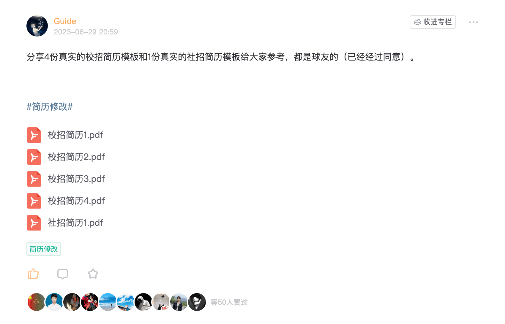

## 简历内容

### 个人信息

+ 最基本的 ：姓名（身份证上的那个）、年龄、电话、籍贯、联系方式、邮箱地址
+ 潜在加分项 ： Github 地址、博客地址（如果技术博客和 Github 上没有什么内容的话，就不要写了）

示例：

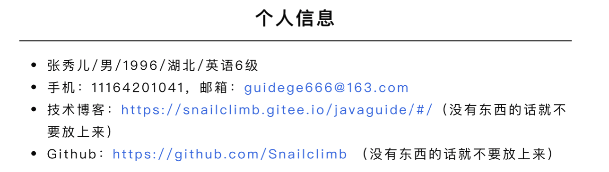

**简历要不要放照片呢？** 很多人写简历的时候都有这个问题。

其实放不放都行，影响不大，完全不用在意这个问题。除非，你投递的岗位明确要求要放照片。 不过，如果要放的话，不要放生活照，还是应该放正规一些的照片比如证件照。

### 求职意向

你想要应聘什么岗位，希望在什么城市。另外，你也可以将求职意向放到个人信息这块写。

示例：

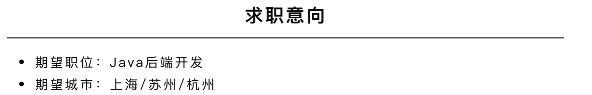

### 教育经历

教育经历也不可或缺。通过教育经历的介绍，你要确保能让面试官就可以知道你的学历、专业、毕业学校以及毕业的日期。

示例：

> 北京理工大学 硕士，软件工程 2019.09 - 2022.01  
湖南大学 学士，应用化学 2015.09 ~ 2019.06
>

### 专业技能

先问一下你自己会什么，然后看看你意向的公司需要什么。一般 HR 可能并不太懂技术，所以他在筛选简历的时候可能就盯着你专业技能的关键词来看。对于公司有要求而你不会的技能，你可以花几天时间学习一下，然后在简历上可以写上自己了解这个技能。

下面是一份最新的 Java 后端开发技能清单，你可以根据自身情况以及岗位招聘要求做动态调整，核心思想就是尽可能满足岗位招聘的所有技能要求。

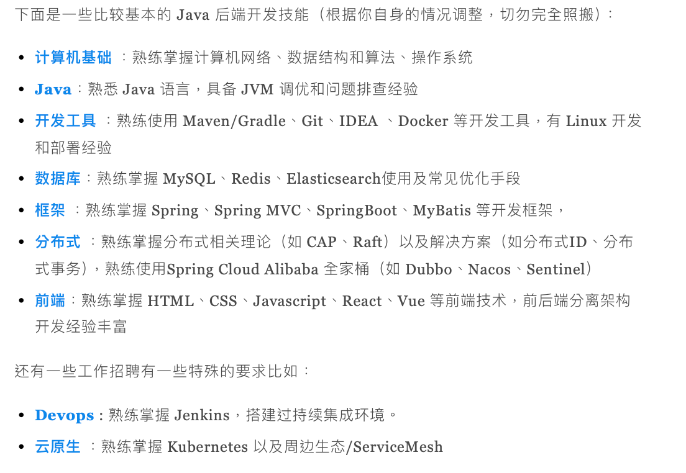

我这里再单独放一个我看过的某位同学的技能介绍，我们来找找问题。

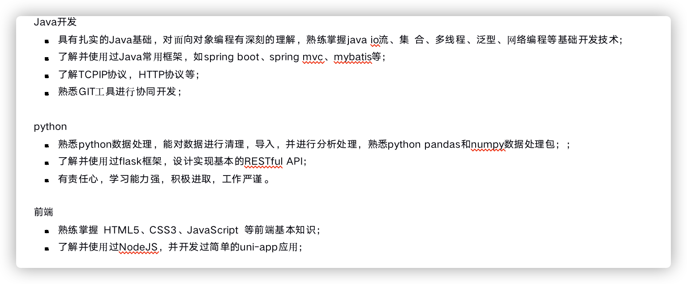

上图中的技能介绍存在的问题：

+ 技术名词最好规范大小写比较好，比如 java->Java ，spring boot -> Spring Boot 。这个虽然有些面试官不会介意，但是很多面试官都会在意这个细节的。
+ 技能介绍太杂，没有亮点。不需要全才，某个领域做得好就行了！
+ 对 Java 后台开发的部分技能比如 Spring Boot 的熟悉度仅仅为了解，无法满足企业的要求。

另外，也不要写的过于复杂了，会让关键技能信息被掩盖。

例如，像下面这种介绍技能方式同样是不太可取，竟然把 Java 集合的 `ArrayList`和 `HashMap` 、数据库的 ACID 特性等等细节部分都写上去了。

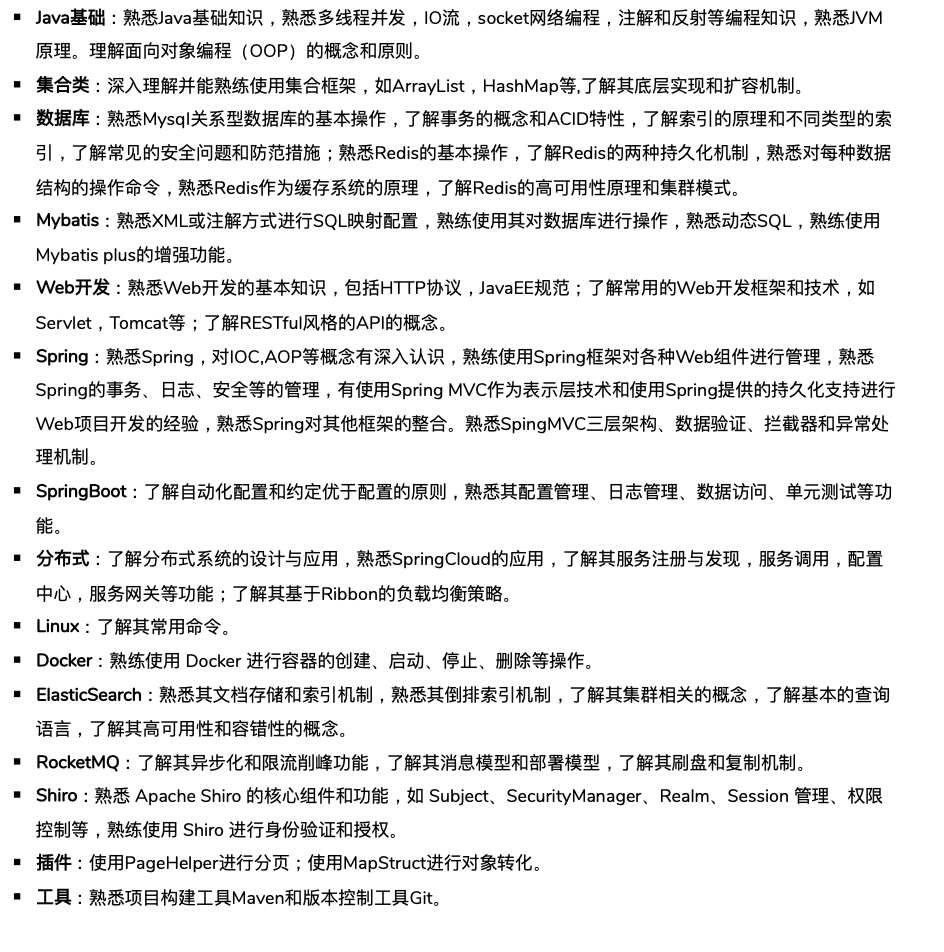

你可以适当看看简历的招聘要求，看看他们对技能这块的要求具体是如何写的，这是不错的参考，有助于我们提高技能命中率。

**如何确定自己学到的新技术已经到了可以写到简历上的程度呢？**

+ 初级：能够清楚地解释为什么要使用这项技术，掌握该技术的基本概念和常用功能。
+ 中级：能够使用该技术解决项目中实际遇到的问题，对该技术的工作原理有一定的了解。
+ 高级：对该技术的底层原理有深入了解，能够应对该技术相关的绝大部分常见问题。

一般来说，达到初级就可以写在简历上了。对于面试常问的技术，要尽可能地达到高级。

### 实习经历/工作经历（重要）

工作经历针对社招，实际经历针对校招。

工作经历建议采用时间倒序的方式来介绍。实习经历和工作经历都需要简单突出介绍自己在职期间主要做了什么。

示例：

> **XXX 公司 （201X 年 X 月 ~ 201X 年 X 月 ）**
>
>  
>
> + **职位**：Java 后端开发工程师
> + **工作内容**：主要负责 XXX
>

### 项目经历（重要）

项目经历是简历上非常重要的一部分内容。看了这么多份简历，真正能把项目经历很好的展示给面试官的非常少。绝大部分求职者的项目经历介绍都存在过于啰嗦、过于简单、没突出亮点等问题。

另外，项目在精不在多，多而杂对面试起到反面作用。而且，本身简历篇幅也无法让你去详细介绍太多项目。对于校招来说，2 个项目就足够了，尽量不要超过 3 个。对于社招来说，尽量不要超过 4 个。前 2 个项目最重要，放质量最高的，需要详细进行介绍。

有几类项目不建议写:

1. Demo 类项目/课程设计项目
2. 自己不熟悉的项目
3. 和现有项目重复度太高的项目

项目经历介绍模板如下：

> 项目名称（字号要大一些）
>
> 
>
> 2017-05~2018-06 淘宝 Java 后端开发工程师
>
> 
>
> + **项目描述**：简单描述项目是做什么的，尽量压缩在三行之内。
> + **技术栈** ：用了什么技术（如 Spring Boot + MySQL + Redis + Mybatis-plus + Spring Security + Oauth2）
> + **工作内容/个人职责**：分条描述，看着会清晰一些。一定要尽量结合具体的业务场景去写，不要只是单纯介绍技术是干什么的。介绍要具体（技术+场景+效果），避免模糊描述，也要注意精简语言（避免堆砌技术词，省略不必要的描述），一条工作描述尽量不要超过两行，对于大的功能模块可适当分多个子条。另外，还应该要避免过于书面化的介绍。
> + **个人收获（可选）**：这个项目对你来说最大的收获是什么。通常是可以不用写个人收获的，因为你在个人职责介绍中写的东西已经表明了自己的主要收获。
> + **项目成果（可选）**：简单描述这个项目取得了什么成绩，一定要量化，例如用户量提升了多少。这里的项目成果，我个人觉得更多的是从项目整体出发去体现。
>

其中，个人收获和项目成果都是可选的，如果选择写的话，也不要花费太多篇幅，记住你的重点是介绍工作内容/个人职责。

****

**1、项目经历应该突出自己做了什么，简单概括项目基本情况。**

项目介绍尽量压缩在三行之内，不需要介绍太多，但也不要随便几个字就介绍完了。

**2、技术架构直接写技术名词就行，不要再介绍技术是干嘛的了，没意义，属于无效介绍。**

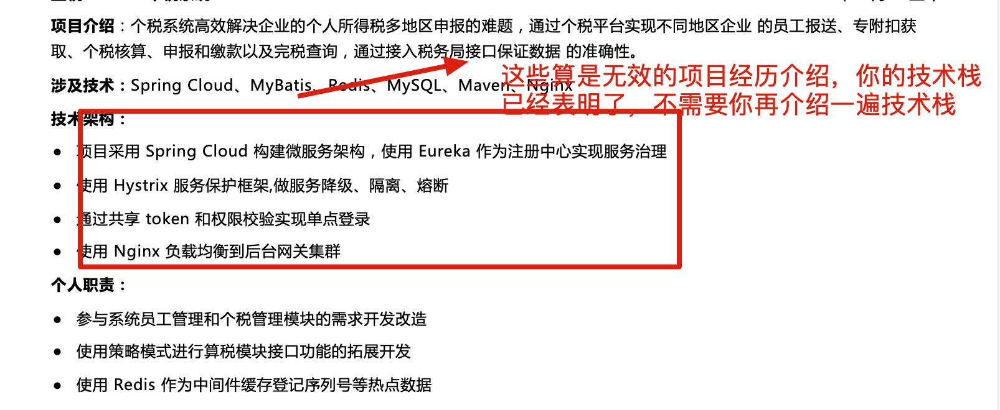

**3、尽量避免全是性能优化或者问题排查相关的****个人职责****介绍，也要避免纯业务性介绍过多。**

尽量多结合具体的业务场景来挖掘亮点/有代表性的工作内容描述（8 条左右个人职责介绍差不多了，做好筛选）。你可以从你项目涉及到的技术上来挖掘，想想这些技术能为项目带来哪些改进或者说实现了什么功能。或者说，你可以思考一下项目哪里可以再优化改进一下，比如更合适的技术实现、适合引入的新功能。

即使不是你做的功能模块或者解决的问题，你只要搞懂吃透了就能拿来自己用，适当润色即可！

像性能优化和问题排查方向上的亮点面试之前比较容易准备，但也不要都是性能优化相关的，这种也算是一个极端。

另外，技术优化取得的成果尽量要量化一下：

+ 使用 xxx 技术解决了 xxx 问题，系统 QPS 从 xxx 提高到了 xxx。
+ 使用 xxx 技术了优化了 xxx 接口，系统 QPS 从 xxx 提高到了 xxx。
+ 使用 xxx 技术解决了 xxx 问题，查询速度优化了 xxx，系统 QPS 达到 10w+。
+ 使用 xxx 技术优化了 xxx 模块，响应时间从 2s 降低到 0.2s。
+ ……

个人职责介绍示例（这里只是举例，不要照搬，结合自己项目经历自己去写，不然面试的时候容易被问倒） ：

+ 基于 Spring Cloud Gateway + Spring Security OAuth2 + JWT 实现微服务统一认证授权和鉴权，使用 RBAC 权限模型实现动态权限控制。
+ 参与项目订单模块的开发，负责订单创建、删除、查询等功能，基于 Spring 状态机实现订单状态流转。
+ 商品和订单搜索场景引入 Elasticsearch，并且实现了相关商品推荐以及搜索提示功能。
+ 整合 Canal + RabbitMQ 将 MySQL 增量数据（如商品、订单数据）同步到 Elasticsearch。
+ 利用 RabbitMQ 官方提供的延迟队列插件实现延时任务场景比如订单超时自动取消、优惠券过期提醒、退款处理。
+ 消息推送系统引入 RabbitMQ 实现异步处理、削峰填谷和服务解耦，最高推送速度 10w/s，单日最大消息量 2000 万。
+ 使用 MAT 工具分析 dump 文件解决了广告服务新版本上线后导致大量的服务超时告警的问题。
+ 排查并解决扣费模块由于扣费父任务和反作弊子任务使用同一个线程池导致的死锁问题。
+ 基于 EasyExcel 实现广告投放数据的导入导出，通过 MyBatis 批处理插入数据，基于任务表实现异步。
+ 负责用户统计模块的开发，使用 CompletableFuture 并行加载后台用户统计模块的数据信息，平均相应时间从 3.5s 降低到 1s。
+ 基于 Sentinel 对核心场景(如用户登入注册、收货地址查询等)进行限流、降级，保护系统，提升用户体验。
+ 热门数据（如首页、热门博客）使用 Redis+Caffeine 两级缓存，解决了缓存击穿和穿透问题，查询速度毫秒级，QPS 30w+。
+ 使用 CompletableFuture 优化购物车查询模块，对获取用户信息、商品详情、优惠券信息等异步 RPC 调用进行编排，响应时间从 2s 降低为 0.2s。
+ 搭建 EasyMock 服务，用于模拟第三方平台接口，方便了在网络隔离情况下的接口对接工作。
+ 基于 SkyWalking + Elasticsearch 搭建分布式链路追踪系统实现全链路监控。

**4、如果你觉得你的项目技术比较落后的话，可以自己私下进行改进。重要的是让项目比较有亮点，通过什么方式就无所谓了。**

项目经历这部分对于简历来说非常重要，《Java 面试指北》的面试准备篇有好几篇关于优化项目经历的文章，建议你仔细阅读一下，应该会对你有帮助。

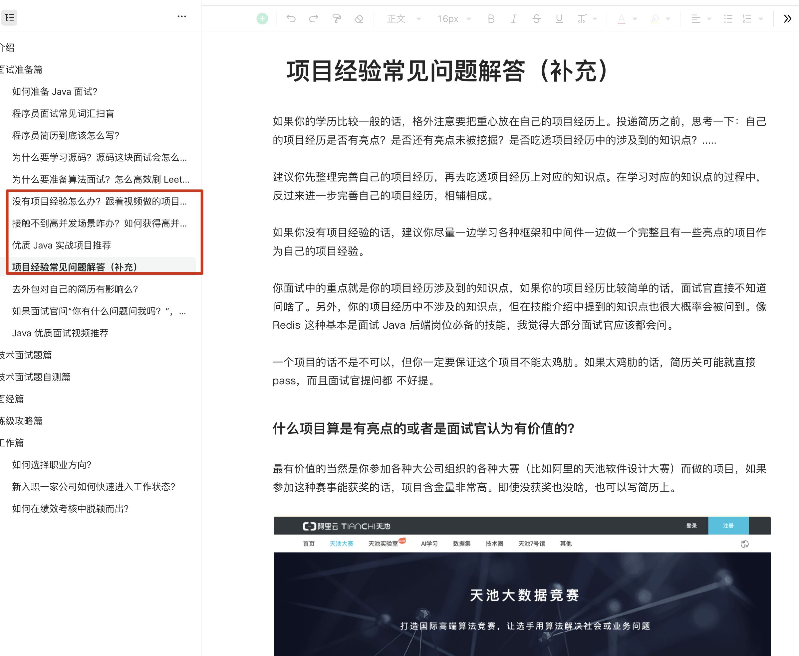

**5、避免个人职责介绍都是围绕一个技术点来写，非常不可取。**

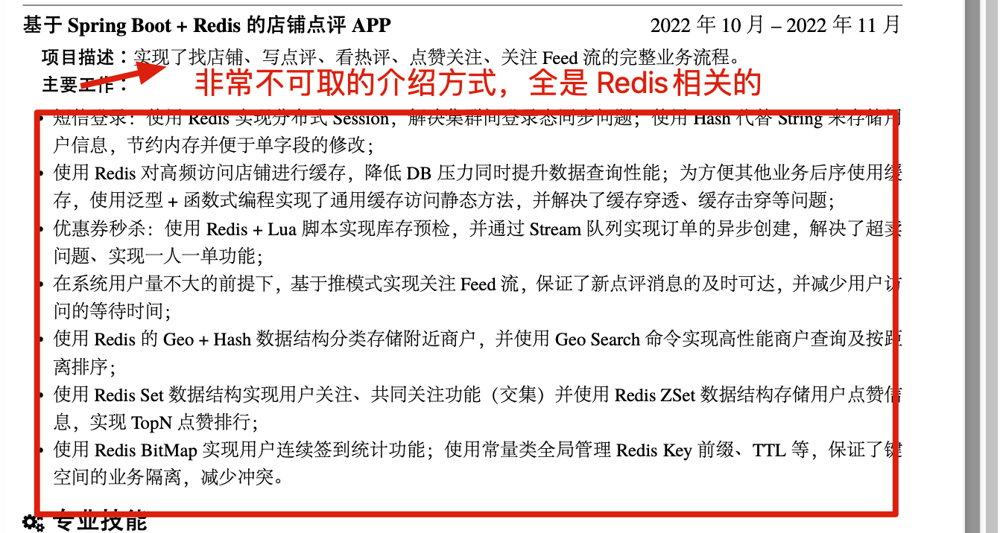

**6、避免模糊性描述，介绍要具体（技术+场景+效果），也要注意精简语言（避免堆砌技术词，省略不必要的描述）。**

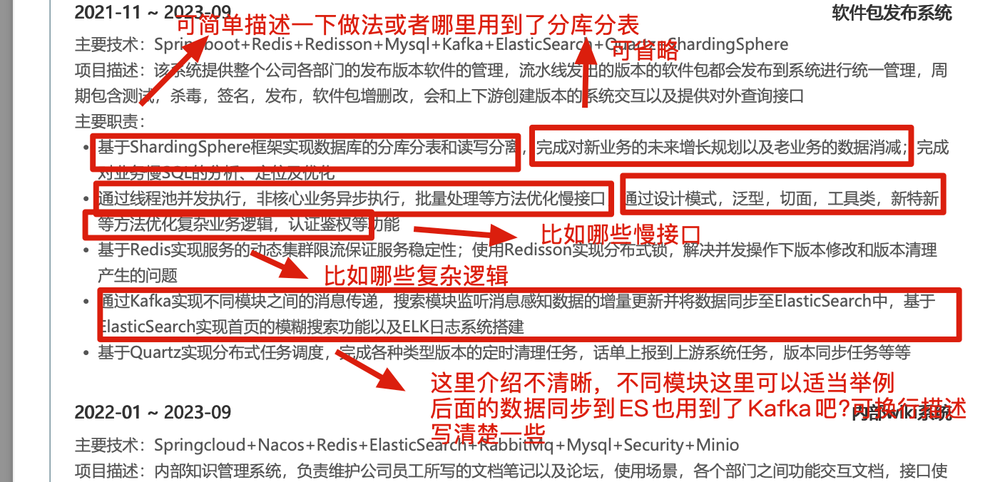

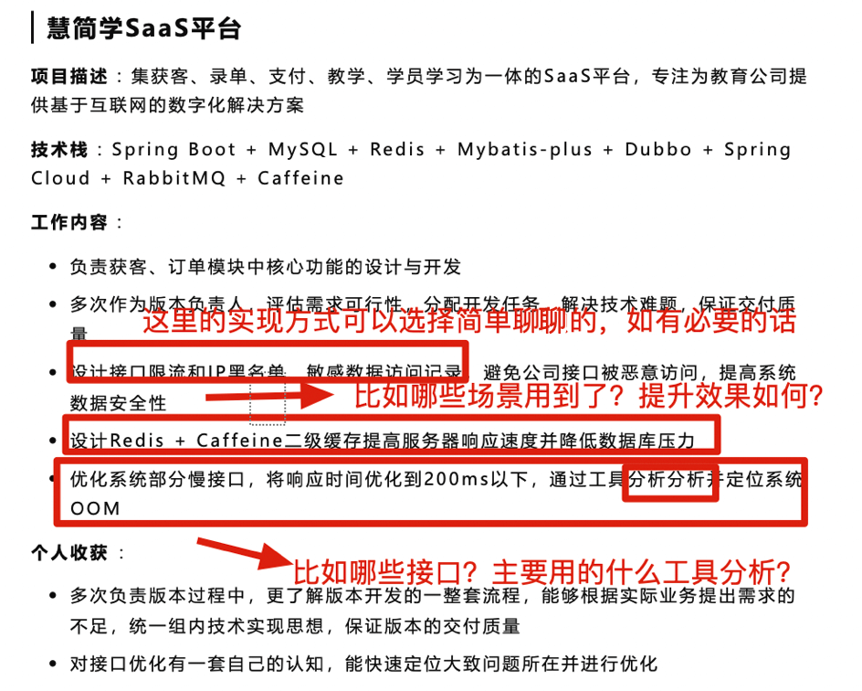

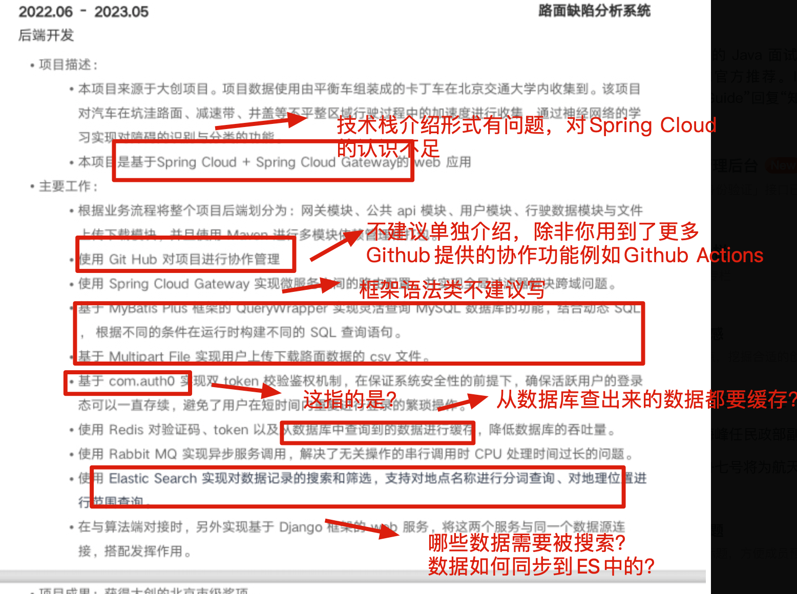

**7、分条介绍，一条介绍清楚一个功能点/模块就好，单条不要超过三行。**

****

### 荣誉奖项（可选）

如果你有含金量比较高的竞赛（比如 ACM、阿里的天池大赛）的获奖经历的话，荣誉奖项这块内容一定要写一下！并且，你还可以将荣誉奖项这块内容适当往前放，放在一个更加显眼的位置。

### 校园经历（可选）

校园经历除非是有对找工作有帮助的经历才写，像什么社团活动这类就不要写了。

### 开源项目（可选）

如果有觉得比较有价值的个人或者自己参与过开源项目的话，可以放在这里。

### 个人评价

**个人评价就是对自己的解读，一定要用简洁的语言突出自己的特点和优势，避免废话！** 像勤奋、吃苦这些比较虚的东西就不要扯了，面试官看着这种个人评价就烦。

我们可以从下面几个角度来写个人评价：

+ 文档编写能力、学习能力、沟通能力、团队协作能力
+ 对待工作的态度以及个人的责任心
+ 能承受的工作压力以及对待困难的态度
+ 对技术的追求、对代码质量的追求
+ 分布式、高并发系统开发或维护经验

列举 3 个实际的例子：

+ 学习能力较强，大三参加国家软件设计大赛的时候快速上手 Python 写了一个可配置化的爬虫系统。
+ 具有团队协作精神，大三参加国家软件设计大赛的时候协调项目组内 5 名开发同学，并对编码遇到困难的同学提供帮助，最终顺利在 1 个月的时间完成项目的核心功能。
+ 项目经验丰富，在校期间主导过多个企业级项目的开发。

## STAR 法则和 FAB 法则

### STAR 法则（Situation Task Action Result）

相信大家一定听说过 STAR 法则。对于面试，你可以将这个法则用在自己的简历以及和面试官沟通交流的过程中。

STAR 法则由下面 4 个单词组成（STAR 法则的名字就是由它们的首字母组成）：

+ **Situation：** 情景。 事情是在什么情况下发生的？
+ **Task:：** 任务。你的任务是什么？
+ **Action：** 行动。你做了什么？
+ **Result：** 结果。最终的结果怎样？

### FAB 法则（Feature Advantage Benefit）

除了 STAR 法则，你还需要了解在销售行业经常用到的一个叫做 FAB 的法则。

FAB 法则由下面 3 个单词组成（FAB 法则的名字就是由它们的首字母组成）：

+ **Feature：** 你的特征/优势是什么？
+ **Advantage：** 比别人好在哪些地方；
+ **Benefit：** 如果雇佣你，招聘方会得到什么好处。

简单来说，**FAB 法则主要是让你的面试官知道你的优势和你能为公司带来的价值。**

## 注意事项和建议

### 避免页数过多

精简表述，突出亮点。校招简历建议不要超过 2 页，社招简历建议不要超过 3 页。如果内容过多的话，不需要非把内容压缩到一页，保持排版干净整洁就可以了。

看了几千份简历，有少部分同学的简历页数都接近 10 页了，让我头皮发麻。

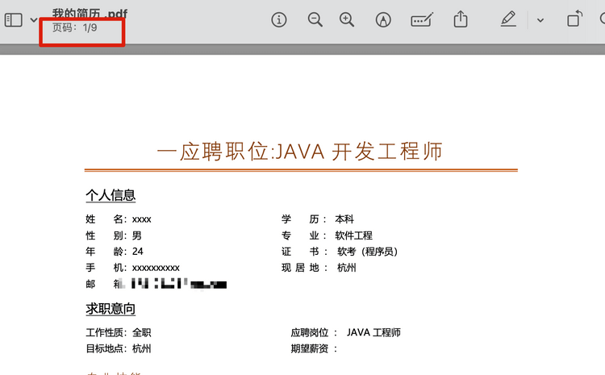

### 避免语义模糊

尽量避免主观表述，少一点语义模糊的形容词。表述要简洁明了，简历结构要清晰。

举例：

+ 不好的表述：我在团队中扮演了很重要的角色。
+ 好的表述：我作为后端技术负责人，领导团队完成后端项目的设计与开发。

### 注意简历样式

简历样式同样很重要，一定要注意！不必追求花里胡哨，但要尽量保证结构清晰且易于阅读。

### 投递格式一定要用  PDF

一定要使用 PDF 格式投递，不要使用 Word 或者其他格式投递。这是最基本的！

### 简单清晰

HR 每天可能要看上百份简历，只会快速浏览重点内容。一定要保证简历简单清晰，突出重点。

### 精准匹配

简历在投递绝大部分公司时都是通用的，但也不要投递每一家公司都一成不变，可以适当根据不同的企业和岗位进行调整和优化，以更满足企业的要求。

### 其他

+ 不会的东西就不要写在简历上了。注意简历真实性，适当润色没有问题。
+ 准备面试的过程中应该将你写在简历上的东西作为重点，尤其是项目经历上和技能介绍上的。
+ 面试和工作是两回事，聪明的人会把面试官往自己擅长的领域领，其他人则被面试官牵着鼻子走。虽说面试和工作是两回事，但是你要想要获得自己满意的 offer ，你自身的实力必须要强。

## 视频推荐

最后，再推荐一个指导写简历的视频。这是一位球友向我推荐的，我看了之后感觉确实还不错。

视频地址：[https://www.bilibili.com/video/BV11g4y1L7H6](https://www.bilibili.com/video/BV11g4y1L7H6) 。

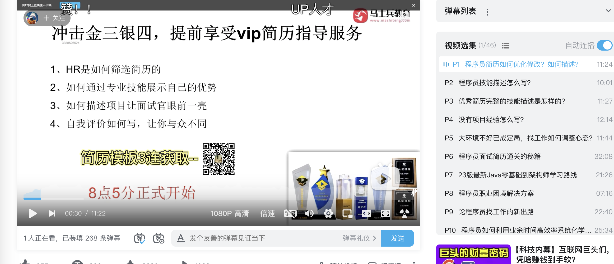

> 更新: 2025-01-09 14:55:16  
> 原文: <https://www.yuque.com/snailclimb/mf2z3k/lkrrsp>