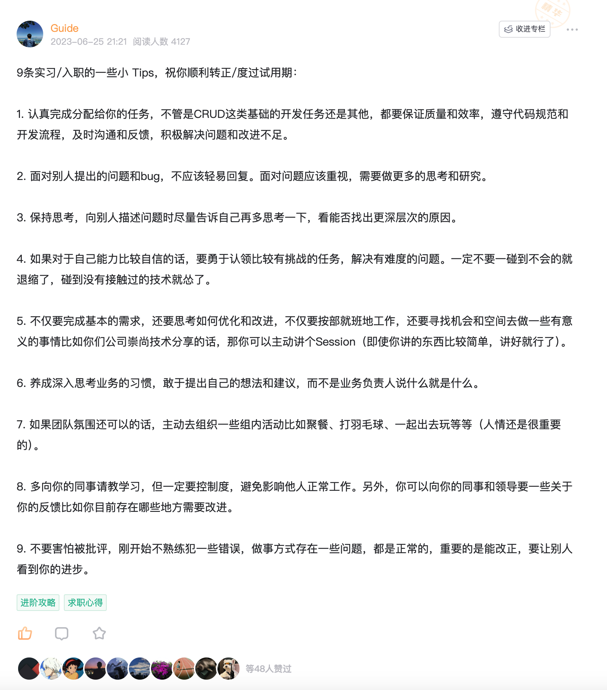

# ⭐程序员面试常见词汇扫盲（面试必知）

## ⭐春招和秋招

春招的时候一般会同时进行 **准应届生暑期实习生招聘** 和 **应届生校园招聘** （准应届生指的是来年毕业的在校大学生）。

不过， 这个时候应届生校园招聘的岗位相对已经比较少了，基本是对秋招的补招，秋招的时候才是应届生校园招聘的关键时期。

春招期间，集中进行的实习生招聘一般是暑期实习生招聘。

秋招一般 7 月份就开始了，大概一直持续到 9 月底。春招一般 3 月份就开始了，大概一直持续到 4 月底。很多公司（尤其大厂）到了 9 月中旬(秋招)/3 月中旬（春招），很可能就会没有 HC 了。

## ⭐暑期实习和日常实习

暑期实习通常是在春招的时候开始大规模招聘，面试难度大于日常的实习招聘，性价比也比日常实习要高。

暑期实习的招聘对象是准应届生（来年毕业的在校大学生），这一部分实习生其本质是校招后备军。通常都会有转正名额提供给暑期实习生，通过转正考核可以拿到正式校招 offer。如果你拿到想要顺利转正的话，一定要在实习期间好好表现，竞争还是蛮大的。建议抽空看看我分享的[⭐9 条实习/入职的一些小 Tips](https://t.zsxq.com/0fiNuw6WC)。

暑期实习一般会在 2 月中旬就开始了，刚开始的时候主要是一些大厂的暑期实习招聘。一般来说，暑期实习会在 6-7 月也就是暑期那会入职。需要注意的是，暑期实习的时间可能与大厂的提前批招聘相冲突。因此，如果你希望通过提前批招聘获得更理想的 offer，合理安排好时间至关重要，要懂得取舍。

日常实习通常全年都会进行，一般为部门的散招，不会给转正名额。日常实习生的招聘对象通常是大一、大二、研一、研二的同学。一般来说，拿到日常实习 offer 后，立刻就会入职。

相对暑期实习来说，日常实习的流程一般更快，难度稍低一点，一个日常实习岗位挂了往往还可以投递其他日常实习岗位。暑期实习和日常实习投递一般也是不冲突的，很多都是暑期实习挂了之后继续走日常实习。

暑期实习和日常实习的面试一般不会影响后续秋招和春招，但表现太差就不一定了，还是要重视一下。尽量把项目经历涉及到的技术八股认真准备一下之后，再考虑参加实习面试。

## ⭐提前批

**提前批一般什么时候开始？**

提前批招聘通常在每年的7月份左右开始启动，此时很多公司已经会发布提前批的招聘信息（建议关注目标公司的招聘公众号或招聘网站）。

**为什么很多公司有提前批？**

很明显啊！提前批就是各个公司提前抢夺一波优秀毕业生。

除此之外，提前批还可以分散一部分招聘高峰期的压力，提前锁定提一些录用名单。另外，提前批录用的学生可以更早安排入职培训和实习，缩短正式入职后的适应期。

**提前批的含金量如何？**

含金量很高，没必要担心这个提前批的含金量如何，觉得自己能力足够的话，一定要把握这次机会！提前批还是会有很多 sp 甚至 ssp offer 的！

**为什么推荐提前批呢？**

通常来说，提前批的结果并不影响你的秋招，也就是说你可以多一次机会。这样的话，即使你失败了，也没关系，好好分析一下自己的短板，努力准备秋招就完事了！并且许多公司的提前批是直接面试，免笔试的。

不过，这并不代表一点影响没有，毕竟你提前批的面试情况也是会被记录下来的。如果面试表现太差的话，那对你后续秋招影响还是比较大的。而且，在投递提前批的时候需要注意一下，是否有注明提前批和秋招只能投递一次（有部分公司会有这个限制，例如米哈游明确说明是二选一）。

建议投提前批的时候，不要一次把你最想去的公司全投了。比如你最想去腾讯、百度、阿里。那么你提前批可以投百度，再投两个小一些的公司，然后根据几次的面试反馈继续提升自己，再陆续去投自己最想去的公司。上面也说了，虽然很多公司都说面试挂了不影响正式批再战，但是你面试的时候会有评价记录的，这个面试记录 hr 是可以看到的，以后的面试官面试也会看到。如果面试官给你的评价记录比较中性还好，但如果面试官给你一个很差的面试评价。那么正式批的时候 hr 筛简历就不会通过你了。我的一位好朋友去年面试快手提前批没过，不知道那位面试官给他写的是什么评价，简历再投别的部门就通不过了。但是面字节虽然第一次面试没通过，后续还是被很多部门捞。

如果提前批有那种部门组织的预面试，就是不会被录入公司系统的面试，这种机会你要果断投简历。这种面试机会很难得，公司不会有你的面试记录，面试没过也不会影响你后续投别的部门，还获得了一次难得的面试机会。一定不要因为觉得自己没准备好而放弃这种面试，大厂的每一次面试都是特别好的学习机会。其实许多人最初几次面试都是不能通过的，经历过几次失败，然后总结面试中的问题，你就离大厂 offer 越来越近了。

## 内推

每年的秋招开始以后大家可能会看到大量的内推宣传。但是不同形式的内推差别其实是很大的。如果只是从网上随便找一个内推码，内推人都不认识就把简历投了，这种内推是没用的。有用的内推是，内推者可以直接把你的简历交到筛选简历的部门 HR 手里，这样 HR 能快速看到你的简历，并且给你安排面试。

## HC（Headcount）

俗称人头，稍微专业点讲就是这家公司打算招的人数。公司会录用很多实习生，也有“广撒 offer”的说法，把人留住，但实际最后只会录用其中的一部分，不会录取所有。最后真正录取的实习生，即可转正。而不被录取的一部分，可能是不在 HC 之内，由于工作能力、工作需要等等。 以往都是先定了 HC 再发 offer，但最近新闻上也有很多企业是先发了 offer，但后来再以 HC 已招够为由来拒收实习生的。所以同学们在找实习，申请校招的时候要格外注意这一点。

## 面试

### 面试记录

大家进行互联网公司组织的面试，都会留下自己的面试记录。面试记录上会有面试官的面试评语。这个面试记录，是以后面试你的面试官还有 HR 都能看到的。

### 预面试

部门收到你的简历后，先不录入公司系统，由 HR 筛选。如果通过简历筛选。部门直接发起预面试，面试通过后，录入系统直接走下面的流程。面试不过，不影响你投这个公司的其它部门，因为公司没有你的面试记录。找预面试的途径是找自己在这个公司的师兄师姐，或者在牛客网上找部门直招的帖子。预面试在部分公司是不合规的。

### 常规面试

现在互联网大厂的常规面试大多都采用这种形式，前半小时自我介绍、问项目、背面试八股文，后半小时一道代码题。

### 主管面

主管面指的是部门的技术主管对你进行面试，走到这一关可以证明大家的技术已经问题不大了。主管面基本上都会采用半问技术，半聊理想的形式对你进行面试。有时候也会问你在校的一些活动经历，甚至会问你毕业论文在做什么。主管面除了考察技术外，一个重要的考察点是考察你是否和团队契合。

### HR 面

HR 面指的就是人力资源对你进行面试。HR 通常第一个问题就是你是哪人，这个问题其实是想看你是不是来公司面试解闷子的。如果你面的是一家北京的公司，而且你是河北人、河南人、山西人等北京周边的城市，你说了你是哪人以后你就不用多说了。但是如果你家是西北那边的，上学又是在东北那嘎达上的，又恰巧你面的是一个广州深圳的公司，你最好说清楚你为啥想去那边工作。

另外，HR 会问一些在校经历，通过交流来判断你的性格是否符合团队。对了，还有一个 HR 常问问题，你拿到了哪些 offer？这个问题你就要甩出一些比较硬的 offer 了，因为优质人才谁都想抢。但是你甩出的 offer 要和现在面试的公司是在一个量级上的。不要你面试的是一个小公司，你跟人家说你已经拿到了字节的工牌，你觉得人家相信不相信给了你 offer 你会来？

## 技术面试

### 八股文

各种面试题题目，主要是一些概念性的知识，比如 `jvm` 的运行时数据区的构成、 `mysql` 的索引之类的，这些问题的回答一般有固定套路。现在的面试主要就是八股文+算法。我在之后的文章也在总结面试八股文的重点，预计一周内能发出来。面试八股文背的熟是面试成功的必要不充分条件。现在背八股文也是一个潮流，但是我其实不太喜欢这个潮流。大家在平时学习时还是要打好基础，我把平时看到的比较好的计算机基础资料收集在我的公众号里，大家关注 CS 指南 ，回复计算机基础就能领取。

### 手撕算法

手撕算法简单来说就是完成面试官给你布置的算法题（有些公司提供思路即可）。国内现在的校招面试开始越来越重视算法了，尤其是像字节跳动、腾讯这类大公司。绝大部分公司的校招笔试是有算法题的，如果 AC 率比较低的话，基本就挂掉了。

## 录用

### 录用意向书

录用意向书也就是 offer 。录用意向书一般就是写着经过你面试的出色表现，公司确认录用，有的会直接标明你的薪资，有的要等 hr 和你具体谈薪等等。收到 offer 后公司对你的聘用基本上就是十拿九稳了。

### ⭐三方协议

一些比较官方的三方协议介绍我就不搬运了，我来一个比较通俗的介绍。三方协议全称为《全国普通高等学校毕业生就业协议书》，签约的三方分别是毕业生个人，你所在学校，以及和你签约的公司。三方协议对签约的个人和公司都有比较强的约束效力。你和一家公司签订三方协议后，你就不能同时再和别的公司签订三方协议了。通常情况下，你毕业后的报到证制作以及档案派遣问题是和你的三方协议挂钩的，这也是所有公司 HR 都着急和你签三方的原因，签了三方你就不能随便违约了。三方协议一般会在你毕业前一年的 10 月左右发放。

三方协议不等于劳动合同，但具有法律效力，违约需付违约金。

**三方协议与劳动合同的区别**：

+ **阶段不同**：三方在校签订，劳动合同入职后签订。
+ **内容不同**：三方是就业意向，劳动合同更具体明确权利义务。
+ **效力不同**：三方有一定法律效力，劳动合同约束力更强，分别适用不同法律。

**三方协议的内容**：

1. 报到期限: 规定毕业生到单位报到的时间。
2. 工作期限: 即第一次签订劳动合同的期限。
3. 试用期限: 试用期的长度。
4. 劳动报酬: 包括试用期和转正后的工资、福利、奖金等。
5. 户口: 是否解决户口问题。
6. 社会保险与公积金: 缴纳基数和比例。
7. 违约约定: 违约责任和赔偿条款。

**签订三方协议之后还是应届生吗？**

****

签订三方协议不等于失去应届生身份。只要未签劳动合同、未缴纳社保公积金、档案仍在学校或人才市场，就仍是应届生。但！国内的校招面试一般只认当届的毕业生。

**万一我们有其他更好的选择或者不想去已经签约三方的公司，应该如何违约三方？**

违约三方这个事比较麻烦。按照规定，学生会有一次的违约机会，但是无论企业还是学校都是不希望你违约三方的。你违约了三方，企业得重新组织面试招人，学校也担心企业明年不来学校招人。

所以你如果要违约，企业一般会在两个方面卡你。一是在签约三方时就定好违约金，如果违约需要对企业进行赔偿。二是会延迟给你办理解约证明，很多公司要等到下一年的四月左右才会给你开具解约证明。

而学校呢，必须要等到公司给你开出解约证明，才会给你开出新的三方。

如果你下定决心要违约三方，那么你要去和原签约公司协商。如果确定必须要等很久以后才能开出解约证明，那么你就要去和现签约公司协商，如果现签约公司准备等你的话，一般会要求和你签一个两方协议，甚至要求你把你本科毕业证书等压在现签约公司。当然我劝你在下决心毁约三方时提前想好这些困难，并和现签约公司确认好可以等你。别弄得原签约公司拖着不给你办解约，现签约公司又不等你，这样你两头不是人了。

注意事项：

1. 一定要留意违约金！可协商降低违约金，通常不超过 5000 元。
2. 签完三方并非高枕无忧，正式转正前仍需谨慎。
3. 注意底薪和考核方式，避免工资陷阱。
4. 注意试用期时长，避免被过长试用期套路。一般来说，试用期不会超过 6 个月，3 个月居多。
5. 实习期不属于劳动关系，不受劳动法保护。

### 两方协议

如果 HR 打算和你签约时你的学校没发放三方 offer，那么许多 HR 会想和你签一个两方协议。这个两方就是你和公司。协议内容大概就是如果谁违约谁要赔偿违约金多少钱。这种两方协议并没什么法律约束效力，你可以同时和很多家公司签订两方协议。违约了公司也不能去要求你做什么，就是公司可能会把你拉黑。另外对于一些和学校关系好的公司或者研究所你们要小心，他们可能会拿着你的两方协议去找学校就业办预先锁定你的三方。

### 报到证

报到证是由学校制作的一张红色的纸，上面文字的大意就是这个人我已经培养好了，可以交给某某公司了。如果你的档案是发回原籍的话，这张纸用处不是特别大。但是如果你准备在你签约的公司所在地落户时，这个报到证是必须的。

### 社保记录

大家都知道，目前公司的招聘都是对应届毕业生有倾斜的，国家规定毕业两年内未就业的就是应届毕业生。那么怎么判断你是否这两年内未就业呢？判断标准就是查你是否有缴纳社保记录。一旦你名下有社保记录，你就不是应届生了。（有个同学大四时没找到合适的工作，去了一个小公司干了几个月，这几个月没让公司缴纳社保，后来以应届生身份考编了）。

## ⭐offer 待遇构成

大多数上市的互联网大厂的 offer 总包构成包括： 基础工资 + 股票（比如 3w\*2 年，也就是每年 3 万，发两年） + 签字费（一次性奖金） + 其他福利待遇（比如房补、餐补、加班费）。

一些中小公司只有：基础工资+其他福利待遇。

另外，除了公司发给你的之外，一些地方针对应届生还有人才补贴，学历越高，拿到的越多。

基础工资属于是每个月直接打到你卡里的钱，需要重点关注，一般用 x*y 来描述，其中 x 是你的工资基数(比如 15k)，y 是发放月数（通常在 12~18，超过 12 的部分会以年终奖的形式发放）。举例说明：一位同学的基础工资是 15k * 16 ，这代表他的月工资是 15k，年终奖是 4 个月的月工资，也就是 60k。

基础工资越高，扣税越多，但对应的住房公积金也越多（具体还要看缴纳比例）。

一般情况下，股票的发放是按年，每年给你发多少。签字费是一次性发给你那种，属于一次性奖金。

> 更新: 2024-10-24 17:28:35  
> 原文: <https://www.yuque.com/snailclimb/mf2z3k/amskpl>